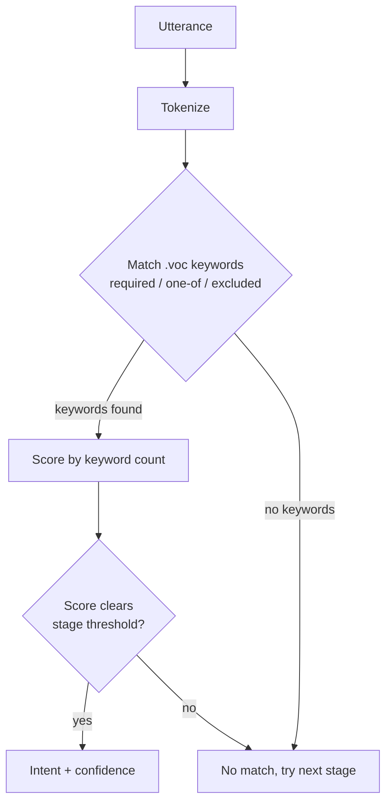

# Adapt Pipeline Plugin

!!! info "Maturity — Stable ⬤⬤⬤⬤◯"
    Stable, actively-maintained code, but its *use* is scenario-limited. See the Recommendation on this page before choosing it for a broad deployment. Maturity rates [repository health](maturity.md), [not fitness for your use case](maturity.md).

!!! abstract "In a nutshell"
    Adapt is one of the tools that helps the assistant figure out what you want when you speak to it. It works like a checklist: a skill says "if you hear these keywords together, this is the command for me." When you say "switch on the lamp", Adapt spots the keywords "switch on" and "lamp" and routes your request to the right skill. There is no guessing or learning involved. It simply matches the words it was told to look for. See the [Glossary](glossary.md) for terms, or [Padatious](padatious-pipeline.md) for a sister tool that learns from example sentences instead.

Shipped in the default pipeline.

The rest of this page is for people deploying or customizing OVOS. If you only wanted to know what this stage does, you are done.

??? info "📐 Formal specification"
    Adapt is a **pipeline plugin** under **[OVOS-PIPELINE-1 — Utterance Lifecycle & Pipeline](https://github.com/OpenVoiceOS/architecture/blob/dev/pipeline-1.md)**. It is a **keyword-intent** engine in the sense of **[OVOS-INTENT-3 — Intent Definition §4](https://github.com/OpenVoiceOS/architecture/blob/dev/intent-3.md)**: it matches by *which vocabularies occur* (required / optional / one-of / excluded), with each occurring vocabulary doubling as a slot. The `.voc` vocabularies are written in the **[OVOS-INTENT-1 — Sentence Template Grammar](https://github.com/OpenVoiceOS/architecture/blob/dev/intent-1.md)** (`(a|b)` / `[optional]` expansion). See the [spec index](architecture-specs.md).

The **Adapt Pipeline Plugin** brings rule-based, keyword-driven intent parsing to the **OVOS intent pipeline** using the Adapt parser. A skill registers keywords (vocabulary) and a rule describing which keywords must appear. Adapt scores an utterance by how many of those keywords it finds. There is no training step and no neural network. Matching is deterministic.

In OVOS-PIPELINE-1 terms, Adapt is a pipeline plugin that exposes `match(utterances, lang, message) → Match | None`. The orchestrator runs it in `session.pipeline` order and takes the first match. Its `conf_high/medium/low` thresholds are Adapt's own accept gate per stage, not a score the orchestrator ranks against other plugins (INTENT-3 §1.1 leaves scoring engine-specific). The `required`/`one-of`/`excluded` keyword roles are INTENT-3 §4.2 constraint roles. `.rx` regex entities are an OVOS implementation extension. INTENT-3 §4.4 deliberately leaves them out of the spec, because free-form text is better modeled as a template-intent slot.

**When it runs:** Adapt's high-confidence stage runs just after Padatious's. So an exact example match wins over a keyword rule, but a strong keyword match still beats most fallbacks. Its medium and low stages run later in the pipeline.

**Minimal example.** A skill registers vocabulary and a rule:

```python
self.register_vocabulary("Light", "lamp")        # locale/.../Light.voc
self.register_vocabulary("On", "switch on")      # locale/.../On.voc

@intent_handler(IntentBuilder("LightOnIntent")
                .require("On").require("Light"))
def handle_light_on(self, message):
    ...
```

"switch on the lamp" then matches with high confidence because both required keywords are present.



*Diagram: the utterance is tokenized, checked against each skill's registered .voc keyword rule, scored by how many required keywords matched, then accepted as an intent only if the score clears the current stage's threshold.*

Adapt is good for **explicit, deterministic command-and-control**. But it scales poorly across many skills, and it is hard to localize. **It is not recommended for broad deployments.**

Prefer it for **personal skills** where you control the full vocabulary.

---

## Pipeline Stages

The plugin ships an OPM entry point, `ovos-adapt-pipeline-plugin`, mapped to the `AdaptPipeline` class. That class is a `ConfidenceMatcherPipeline`. OVOS exposes three matcher stages from it, selected in your pipeline config by these IDs. The short `adapt_*` aliases still work but are deprecated.

| Pipeline ID    | Legacy alias   | Matcher        | Recommended Use        |
| -------------- | -------------- | -------------- | ---------------------- |
| `ovos-adapt-pipeline-plugin-high`   | `adapt_high`   | `match_high`   | Personal skills only   |
| `ovos-adapt-pipeline-plugin-medium` | `adapt_medium` | `match_medium` | Use with caution       |
| `ovos-adapt-pipeline-plugin-low`    | `adapt_low`    | `match_low`    | Not recommended        |

Each stage scores the utterance with Adapt. It accepts the utterance if the score clears that stage's threshold.

---

## Limitations

Adapt requires **hand-crafted rules** for every intent:

* ❌ **Poor scalability**: hard to manage with many skills


* ❌ **Difficult to localize**: rules rely on exact words and phrases


* ❌ **Prone to conflicts**: multiple skills defining overlapping rules can cause collisions or missed matches

As your skill library grows or if you operate in a multilingual setup, these problems increase.

**Recommendation:**

> 🟢 Use Adapt **only** in personal projects or controlled environments where you can fully define and test every possible phrase.

[Palavreado](palavreado.md) is a drop-in replacement that addresses these limits.

---

## Configuration

Adapt confidence thresholds can be set in `mycroft.conf`:

```json
{
  "intents": {
    "ovos-adapt-pipeline-plugin": {
      "conf_high": 0.65,
      "conf_med": 0.45,
      "conf_low": 0.25
    }
  }
}
```

> The config section is keyed by the pipeline's plugin id (`intents.<pipeline-id>`), here
> `ovos-adapt-pipeline-plugin`. The domain/hierarchical variants read
> `intents.ovos_adapt_domain_pipeline` / `intents.ovos_adapt_hierarchical_pipeline`.

* These thresholds gate which matcher stage accepts a result. The values shown are the source defaults.


* The plugin is included by default in OVOS.

---

## When to Use Adapt in OVOS

Use this plugin **only when**:

* You are building **a personal or private skill**.


* You need **strict, predictable matching** (e.g., command-and-control).


* You are working in **a single language** and **control all skill interactions**.

Avoid using Adapt for public-facing or general-purpose assistant skills. Modern alternatives like **[Padatious](padatious-pipeline.md)**, **LLM-based parsers**, or **neural fallback models** are more scalable and adaptable.

---

## Advanced

**Entry points.** The plugin registers three `opm.pipeline` entry points, each a different matching strategy over the same Adapt engine:

```toml
[project.entry-points."opm.pipeline"]
"ovos-adapt-pipeline-plugin"              = "ovos_adapt.opm:AdaptPipeline"
"ovos-adapt-domain-pipeline-plugin"       = "ovos_adapt.opm:DomainAdaptPipeline"
"ovos-adapt-hierarchical-pipeline-plugin" = "ovos_adapt.opm:HierarchicalAdaptPipeline"
```

`AdaptPipeline` is the flat parser most deployments use. `DomainAdaptPipeline` and `HierarchicalAdaptPipeline` partition intents per skill or domain to cut down on cross-skill keyword collisions. They read extra config under `intents.ovos_adapt_domain_pipeline` and `intents.ovos_adapt_hierarchical_pipeline`. All three subclass `ConfidenceMatcherPipeline` and expose `match_high`/`match_medium`/`match_low`.

**Vocabulary files.** Skills supply keyword lists as `.voc` files (one phrase per line, with `(a|b)` alternatives and `[optional]` words expanded at registration). They supply regular-expression entities as `.rx` files using Python named groups, for example `(?P<Location>.+)`. Registration flows over the bus via `register_vocab` and `register_intent`.

**Gotcha: collisions are silent.** Two skills that require overlapping vocabulary can shadow each other. The higher-scoring match wins with no warning. Make each skill's required keywords as specific as possible. Prefer the domain/hierarchical entry points when running many skills together.

---

*Source code: [OpenVoiceOS/ovos-adapt-pipeline-plugin](https://github.com/OpenVoiceOS/ovos-adapt-pipeline-plugin).*

---
**Read next:** [Palavreado](palavreado.md)
**Related:** [Padacioso](padacioso.md) · [Adapt Intents](intents-adapt.md) · [Model2Vec Pipeline](m2v-pipeline.md) · [Debugging Intent Matching](debugging-intent-matching.md)
