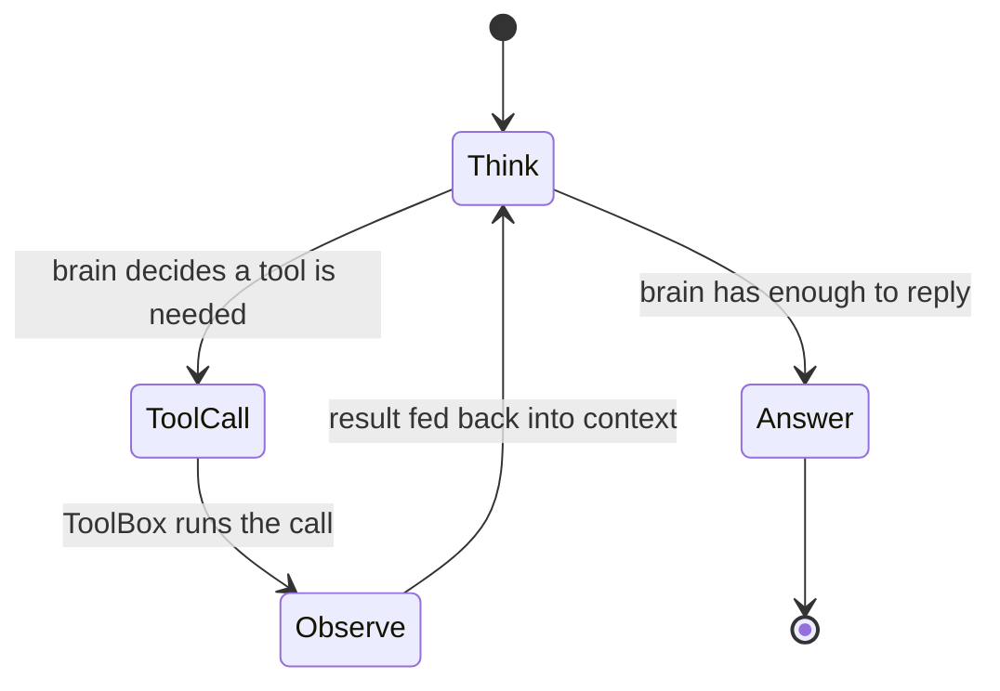

# Agentic Loop Architectures

!!! abstract "In a nutshell"
    Normally an AI answers in one shot. An "agentic loop" lets it work more like a person solving a problem: think a little, take an action (such as looking something up), see the result, then think again, repeating until it has a good answer. This page describes several ready-made styles of that step-by-step reasoning, each suited to different kinds of tasks. The "tools" it can reach for are described in [Tool Plugins](tool-plugins.md). See the [Glossary](glossary.md) for unfamiliar terms.

??? info "📐 Formal specification"
    These loops run *inside* a **persona**, and a persona is a formal pipeline
    role:
    **[OVOS-PERSONA-1 — Persona Pipeline Plugin](https://github.com/OpenVoiceOS/architecture/blob/dev/persona.md)**
    defines a persona as a **complete conversational agent**, summonable as a
    first-class pipeline stage. When the active persona (selected by
    `session.persona_id`) is reached, it claims the utterance and generates the
    response, exactly the slot the agentic brains on this page fill. For the
    full set see the **[spec index](architecture-specs.md)**.

[ovos-agentic-loop](https://github.com/OpenVoiceOS/ovos-agentic-loop) implements eight agentic reasoning patterns as standard OPM `ChatEngine` plugins. Each pattern wires a configurable inner LLM brain with one or more `ToolBox` plugins to produce multi-step reasoning over OVOS personas.

The default pattern, `ovos-react-loop`, alternates thinking and acting until it has an answer
or hits `max_iterations`:



*Diagram:* The loop starts at Think and ends at Answer, branching to a ToolCall and Observe cycle whenever the brain decides a tool is needed before it has enough to reply.

!!! tip "Which loop should I pick?"
    - Just need the model to use a tool and answer? Start with **`ovos-react-loop`**. It's the
      general-purpose default, and every other loop is a variation for a specific need.
    - Your model's API supports native `tool_calls` (most modern hosted LLMs)? Use
      **`ovos-native-toolcall-loop`** instead. It does the same job with less prompt overhead,
      and it falls back to the ReAct text loop automatically if the model doesn't support it.
    - Multi-step task where doing the steps in the wrong order matters (e.g. booking a trip)?
      Use **`ovos-plan-execute-loop`** to plan up front, then execute.
    - The model's first attempt is often wrong and could improve on a second pass? Use
      **`ovos-reflexion-loop`** (self-critique + retry) or **`ovos-critic-loop`** (verify factual
      claims specifically).
    - The question is really several smaller questions bundled together ("who directed the movie
      that won best picture the year X was born?")? Use **`ovos-self-ask-loop`**.
    - Pure reasoning with no tools involved (math, logic puzzles)? Use
      **`ovos-chain-of-thought-loop`**.
    - Open-ended exploration where several candidate solution paths are worth comparing before
      committing? Use **`ovos-tree-of-thoughts-loop`**. It is the most expensive option, so
      reserve it for problems where a single reasoning path is unreliable.

---

## Installation

```bash
pip install ovos-agentic-loop

# Optional: web search support
pip install 'ovos-agentic-loop[web]'
```

---

## Loop Architectures

Each is registered under `opm.agents.chat` via a thin `factory.py` subclass
(`<Name>EnginePlugin`) of the implementation class listed below:

| Entry point | Implementation class | Best for |
|---|---|---|
| `ovos-react-loop` | `ReActLoopEngine` | General tool-using Q&A |
| `ovos-native-toolcall-loop` | `NativeToolCallEngine` | Tool-using Q&A with brains that expose native `tool_calls` (falls back to the ReAct text loop otherwise) |
| `ovos-plan-execute-loop` | `PlanAndExecuteEngine` | Multi-step tasks requiring an upfront plan |
| `ovos-reflexion-loop` | `ReflexionEngine` | Tasks requiring self-critique and retry |
| `ovos-self-ask-loop` | `SelfAskEngine` | Compositional questions needing sub-questions |
| `ovos-chain-of-thought-loop` | `ChainOfThoughtEngine` | Reasoning without tools (math, logic) |
| `ovos-critic-loop` | `CRITICEngine` | Factual tasks requiring claim verification |
| `ovos-tree-of-thoughts-loop` | `TreeOfThoughtsEngine` | Exploration-heavy problems (beam search) |

---

## Configuration

Loop engines share a config envelope, but the step budget is per loop: `max_iterations` is
read by the ReAct and Reflexion loops only. Each of the others has its own budget key, listed
with that loop below.

```json
{
  "name": "MyAgent",
  "handlers": ["ovos-react-loop"],
  "ovos-react-loop": {
    "brain": "ovos-chat-openai-plugin",
    "ovos-chat-openai-plugin": {
      "api_url": "http://localhost:11434/v1"
    },
    "toolboxes": ["ovos-math-tools", "ovos-web-search-tools", "ovos-clock-tools"],
    "max_iterations": 10
  }
}
```

`api_url` is the `/v1` base of the endpoint; the plugin appends `/chat/completions` itself, so do not include that suffix.

| Key | Description |
|-----|-------------|
| `brain` | OPM entry point of the inner `ChatEngine` |
| `toolboxes` | List of OPM `ToolBox` entry points to load |
| `max_iterations` | Maximum reasoning steps before forced conclusion. **ReAct and Reflexion only** — the other loops ignore it and read their own budget key |

The `brain`'s own plugin config (here `ovos-chat-openai-plugin`) is nested *inside* the loop's own block (`ovos-react-loop`), not at the persona root: the loop engine loads it with `config.get(brain_id, {})` read from its own config, so the brain is a sub-plugin resolved in the loop's namespace rather than the persona's.

### Per-loop limits

Beyond the shared `max_iterations`, several loops read their own budget keys from
the engine config (each defaults if unset):

| Loop | Key | Default | Meaning |
|---|---|---|---|
| `ovos-reflexion-loop` | `max_reflections` | `3` | Reflection episodes before returning the last answer |
| `ovos-plan-execute-loop` | `max_step_iterations` | `5` | Tool-call cycles per plan step |
| `ovos-plan-execute-loop` | `max_steps` | `10` | Plan steps executed |
| `ovos-critic-loop` | `max_critique_rounds` | `2` | Critique → verify → revise rounds |
| `ovos-self-ask-loop` | `max_follow_ups` | `8` | Sub-questions before forcing a final answer |
| `ovos-tree-of-thoughts-loop` | `n_branches` | `3` | Candidate thoughts generated per step |
| `ovos-tree-of-thoughts-loop` | `beam_width` | `2` | Branches kept after evaluation |
| `ovos-tree-of-thoughts-loop` | `max_depth` | `4` | Reasoning depth before forcing an answer |

---

## Built-in Toolboxes

| Entry point | Class | Tools |
|---|---|---|
| `ovos-math-tools` | `MathToolBox` | `evaluate_expression`, `unit_convert`, `statistics_summary`, `solve_equation` |
| `ovos-filesystem-tools` | `FileSystemToolBox` | `read_file`, `write_file`, `list_directory`, `search_in_files`, `find_files` |
| `ovos-shell-tools` | `ShellToolBox` | `run_command` (disabled by default; requires `allow_shell: true`) |
| `ovos-web-search-tools` | `WebSearchToolBox` | `web_search` (requires `ovos-agentic-loop[web]`) |
| `ovos-clock-tools` | `ClockToolBox` | `get_current_datetime` |
| `ovos-skill-md-toolbox` | `SkillMDToolBox` | One tool per installed `SKILL.md` |

---

## SKILL.md Integration

Any package shipping a `SKILL.md` file is automatically discovered and exposed as an agent tool. The `name` frontmatter field becomes the tool name. The body becomes the system prompt for a sub-LLM call:

```markdown
---
name: my-skill
description: Does something useful.
---
You are a helpful assistant specialised in...
```

---

## AGENTS.md Context Management

`AgentsMDContextManager` assembles system prompts from `AGENTS.md` files at runtime:

```python
from ovos_agentic_loop.context.agents_md import AgentsMDContextManager

ctx = AgentsMDContextManager({
    "agents_md_sources": ["auto"],          # auto-discover from installed packages
    "include_sections": ["Rules", "Style"], # filter to specific headings
})
messages = ctx.build_conversation_context(utterance, session_id="s1")
```

It also registers as an OPM plugin, entry point `ovos-agents-md-context-plugin` under the `opm.agents.memory` group, so it can be wired declaratively from persona JSON, the same way loops and toolboxes are.

---

## Security Notes

- `ShellToolBox`: `allow_shell` defaults to `false`. Only enable with fully-trusted LLMs. Commands are passed directly to `/bin/sh`.
- `FileSystemToolBox`: set `root_path` to restrict file access to a subtree.
- `MathToolBox`: uses `ast.parse` with an allowlist. `eval()` is never called.

### Toolbox security keys

These keys go in the per-toolbox config block:

| Toolbox | Key | Default | Effect |
|---|---|---|---|
| `FileSystemToolBox` | `root_path` | `"."` | Sandbox root; every path is resolved relative to it and must stay inside |
| `FileSystemToolBox` | `allow_write` | `true` | When `false`, `write_file` is disabled (read-only agent) |
| `ShellToolBox` | `allow_shell` | `false` | Must be `true` for `run_command` to execute at all |
| `ShellToolBox` | `allowed_commands` | `[]` | When non-empty, only these first-words are permitted |
| `ShellToolBox` | `max_timeout` | `120` | Upper bound (seconds) the per-call `timeout` is capped to |

---

## External Tool Servers

Use [ovos-tool-adapters](agent-interop.md) to wire any MCP or UTCP server into the loop as a `ToolBox`.

---

---
**Read next:** [Agent Tool Plugins](tool-plugins.md)
**Related:** [Agent Engine Types](agent-plugins.md) · [Building Agent Plugins](building-agent-plugins.md) · [Interoperability (MCP/UTCP/A2A)](agent-interop.md) · [Personas & PersonaService](personas.md)
