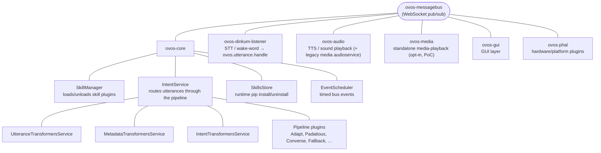

# Architecture Overview

!!! abstract "In a nutshell"
    OpenVoiceOS is a voice assistant built from many small, independent parts rather than one big program. Think of it like a team where each member has one job: listening for the wake word, turning speech into text, figuring out what you asked, or answering. They all talk to each other over a shared channel.

    Because the parts are separate, you can run only the ones you need, replace any one with a different version, or even spread them across several devices. See the [Glossary](glossary.md) for unfamiliar terms and the [Bus Service](bus-service.md) for the shared channel they use to talk.

??? info "📐 Formal specification"
    OVOS isn't only an implementation. The contracts between these parts are
    written down as **formal, implementation-agnostic specifications**. This
    page is the friendly tour; for the precise wire formats see the
    **[Formal Specifications](architecture-specs.md)** index, which links every
    spec in the [OpenVoiceOS/architecture](https://github.com/OpenVoiceOS/architecture)
    repository.

OpenVoiceOS (OVOS) is best understood as a **voice operating system**, not a
single voice-assistant program. A voice assistant is a *product* that answers
questions. A voice OS is a *platform*: it defines the boundary between what you
say and what runs, arbitrates which application handles each utterance, and
carries conversation state across turns. The orchestrator's
`match(utterances, lang, message) → Match` contract is, in effect, the
system-call ABI that lets third-party skills and plugins build against a
stable interface without knowing about each other. See the
[Formal Specifications](architecture-specs.md).

## High-Level Flow

The diagram above illustrates how a user utterance moves through the system:

1. **Microphone Input**: Captured by a microphone plugin.
2. **[Wake Word](wake-word-plugins.md) Detection**: The `ovos-dinkum-listener` (or similar) monitors the stream for the wake word.
3. **[Speech-to-Text](stt-plugins.md) ([STT](stt-plugins.md))**: Once the wake word is detected, the subsequent audio is sent to an STT engine.
4. **messagebus**: The transcribed text is published to the bus as `ovos.utterance.handle`, the utterance entry point ([OVOS-PIPELINE-1 §9.1](https://github.com/OpenVoiceOS/architecture/blob/dev/pipeline-1.md); legacy name `recognizer_loop:utterance`).
5. **[Intent Service](intent-service.md)**: the **orchestrator** (`ovos-core`) picks up the utterance and runs it through the **[pipeline](pipelines-overview.md)** of matcher plugins. The first plugin to claim it wins ([OVOS-PIPELINE-1](https://github.com/OpenVoiceOS/architecture/blob/dev/pipeline-1.md)).
6. **[Skill](skill-design-guidelines.md) Execution**: If a match is found, the corresponding skill is triggered.
7. **Response**: The handler emits an `ovos.utterance.speak` message, the natural-language response ([OVOS-PIPELINE-1 §9.6](https://github.com/OpenVoiceOS/architecture/blob/dev/pipeline-1.md)).
8. **[Text-to-Speech](tts-plugins.md) ([TTS](tts-plugins.md))**: `ovos-audio` converts the response text to audio and plays it.

---

## Component Map

Of the six [transformer chains](transformer-plugins.md), only utterance, metadata, and intent
run inside `IntentService` above. The other three run elsewhere in the pipeline: audio
transformers run in `ovos-dinkum-listener` before STT, and dialog and TTS transformers run in
`ovos-audio` (or `ovos-media`, where installed) when a response is rendered.

In words: `ovos-messagebus` is the hub. `ovos-core` connects to it and contains the
`SkillManager` and `IntentService`. `ovos-dinkum-listener`, `ovos-audio`, `ovos-media`,
`ovos-gui`, and `ovos-PHAL` are siblings that each connect to the bus independently, alongside
`ovos-core`.

`ovos-messagebus` sits at the top because every other box connects to it as a client. It is the
one shared channel, not a hierarchy.

`ovos-core` bundles the services most people mean by "the
brain": `SkillManager` loading skill code, `IntentService` running the utterance through its
sub-services and the pipeline plugins, and a couple of smaller helpers alongside them.

The remaining five boxes, the listener, audio, media, GUI, and PHAL services, are separate
processes. They could in principle run on separate machines, each responsible for one stage of
the [utterance lifecycle](life-of-an-utterance.md).

## Key Services

### messagebus
The backbone of OVOS. All components communicate via this WebSocket-based bus. It ensures loose coupling and enables remote control and multi-device setups.

### ovos-core
The "brain" of the system. It manages the lifecycle of skills and coordinates intent matching through a multi-stage pipeline. In the formal model it is the **orchestrator**: the role that runs the [pipeline](pipelines-overview.md) of matcher plugins, dispatches the winning match to a handler on `<skill_id>:<intent_name>`, and emits the handler-lifecycle events ([OVOS-PIPELINE-1](https://github.com/OpenVoiceOS/architecture/blob/dev/pipeline-1.md)).

### Speech Service
Handles audio capture, wake word detection, and STT. It is responsible for turning "sound" into "data".

### Audio Service
The output layer. It manages TTS generation and audio playback, ensuring that only one thing is speaking at a time and handling audio focus.

### GUI Service
Provides a visual interface for skills. It uses a specialized protocol to push [QML](qt5-gui.md)-based or HTML-based views to a screen.

⚠️ The current ("legacy") [GUI Service](gui-service.md) is **deprecated**. There is no generally usable OVOS GUI, and a replacement is in progress. On Mark 2, the [`ovos-installer`](ovos-installer.md) keeps the legacy GUI running in the meantime.

### PHAL (Platform & Hardware Abstraction Layer)
Handles hardware-specific tasks like volume control, battery monitoring, and connectivity management.

---

## Modularity and Plugins

One of OVOS's greatest strengths is its plugin-based architecture. Almost every major function is a plugin, and the manual keeps a maintained catalog for each category:

- **Microphone Plugins**: see the [Microphone Plugins catalog](mic-plugins.md).
- **STT Plugins**: see the [STT Plugins catalog](stt-plugins.md).
- **TTS Plugins**: see the [TTS Plugins catalog](tts-plugins.md).
- **Wake Word Plugins**: see the [Wake Word Plugins catalog](wake-word-plugins.md).
- **Intent Plugins**: [Adapt](adapt-pipeline.md), [Padatious](padatious-pipeline.md), [Common Query](cq-pipeline.md), and the rest of the [pipeline overview](pipelines-overview.md).

This allows OVOS to run on everything from a high-end server to a Raspberry Pi Zero.

## Further reading

- [Good Old-Fashioned AI: The Secret Ingredient in a Modern Voice Assistant](https://blog.openvoiceos.org/posts/2025-11-25-gofai): OVOS blog

---

*Source code: [OpenVoiceOS/ovos-core](https://github.com/OpenVoiceOS/ovos-core).*
