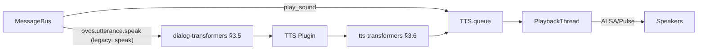

# Audio Service

!!! info "Maturity: Stable ⬤⬤⬤⬤◯"
    Established and production-ready, actively maintained. Rated by [repository health](maturity.md), not version.

!!! abstract "In a nutshell"
    `ovos-audio` is the part of OVOS that actually makes sound come out of the speakers. When a skill wants to say something, this service turns that text into speech (using a [TTS](tts-plugins.md) plugin) and plays it, while making sure only one thing talks at a time and turning down background music so you can hear the reply. Think of it as the assistant's mouth and its audio mixer rolled into one. See [TTS Plugins](tts-plugins.md) or the [Glossary](glossary.md) for related terms.

??? info "📐 Formal specification"
    The audio **output** service (dialog-transformer chain, TTS synthesis, tts-transformer chain, playback queue, plus remote-client rendering) is specified by **[OVOS-AUDIO-1: Audio Output Service](https://github.com/OpenVoiceOS/architecture/blob/dev/audio-out.md)**. The dialog and tts transformer chains it hosts are specified by **[OVOS-TRANSFORM-1: Transformer Plugins](https://github.com/OpenVoiceOS/architecture/blob/dev/transformer.md)** (§3.5 dialog, §3.6 tts). See also the [spec index](architecture-specs.md). Spec topic names are canonical below, with the legacy name noted once. The *media* audioservice, subsystem 2 below, is a separate, deprecated concern and is not covered by OVOS-AUDIO-1.

`ovos-audio` is the component responsible for [TTS](tts-plugins.md) synthesis and audio playback. It ensures that only one thing is speaking at a time and manages audio focus between different media sources.

**In plain terms:** when a skill says "tell the user X", that `speak` message lands here.
`ovos-audio` turns the text into sound with a TTS plugin and plays it. It ducks any background
music while it talks.

!!! info "Two independent subsystems: don't conflate them"
    `ovos-audio` hosts **two separate things** that are easy to mix up:

    1. **The TTS / sound playback queue** (described on this page): a single playback queue
       (`TTS.queue`, drained by one `PlaybackThread`) that plays **spoken responses *and* sound
       effects** (beeps, notification sounds). This is the core job of `ovos-audio`. It is
       **always on** and has **nothing to do** with the media audioservice or `ovos-media`.
    2. **The legacy media audioservice**: an *optional* subsystem (`AudioService`, gated by
       `enable_old_audioservice`, on by default) that plays music, news, and streams through
       [audioservice backends](media-plugins.md#ovos-ocp-audio-plugin) such as
       [OCP](ocp-audio-plugin.md). This is the **deprecated** part, being superseded by the
       standalone [`ovos-media`](ovos-media.md) daemon. A second top-level key,
       `disable_ocp` (default `false`, slated to flip to `true`), gates whether the OCP
       audioservice backend loads within this subsystem. Both keys are set at the **top
       level** of `mycroft.conf`, not under the `Audio` section.

    Switching media playback to `ovos-media` (`enable_old_audioservice: false`) turns off
    subsystem 2 only. TTS and sound playback (subsystem 1) keep working exactly as before.

!!! warning "Upcoming breaking change"
    The legacy media audioservice subsystem (subsystem 2 above, including the
    [OCP audioservice backend](ocp-audio-plugin.md)) is planned for removal from
    `ovos-audio` entirely. Media playback will then live wholly in [`ovos-media`](ovos-media.md).
    The TTS / sound playback queue (subsystem 1) is unaffected.

---

??? abstract "Technical Reference"

    - `PlaybackService.init_messagebus()` in [`ovos_audio/service.py`](https://github.com/OpenVoiceOS/ovos-audio/blob/dev/ovos_audio/service.py) registers the `ovos.utterance.speak` (legacy `speak`) handler and the rest of the bus events. It is called from `__init__`. `PlaybackService.run()` marks the service alive/ready and reports legacy-audio-backend status.


    - `PlaybackThread.run()` in [`ovos_audio/playback.py`](https://github.com/OpenVoiceOS/ovos-audio/blob/dev/ovos_audio/playback.py) holds the logic for playing back the synthesized audio chunks.


    - `AudioService.play()` in [`ovos_audio/audio.py`](https://github.com/OpenVoiceOS/ovos-audio/blob/dev/ovos_audio/audio.py) routes media playback to the correct backend by URI scheme (MPV, VLC, etc.).
    
    ---
    

## Overview

The audio service receives `ovos.utterance.speak` messages (legacy: `speak`) from the
[messagebus](bus-service.md). This is the natural-language response exit point of the utterance
lifecycle (OVOS-PIPELINE-1 §9.6). The service runs the text through the **dialog-transformer
chain**, sends it to a [TTS](tts-plugins.md) engine, runs the resulting audio through the
**tts-transformer chain**, and plays it through its playback queue (OVOS-AUDIO-1 §3).

The same queue also plays sound effects (`ovos.audio.queue` / `ovos.audio.play_sound`, legacy:
`mycroft.audio.queue` / `mycroft.audio.play_sound`). Separately, and only when
`enable_old_audioservice` is on, it also hosts the legacy media audioservice for music, news, and
streams. See the **Two independent subsystems** note at the top of this page.

### Key Responsibilities

- **[TTS](tts-plugins.md) Synthesis**: Converts text to speech using various plugins.


- **Speech & Sound Playback**: A single queue (`TTS.queue`, one `PlaybackThread`) plays spoken responses and sound effects in order.


- **Audio Focus**: Prioritizes speech over music or other background sounds (ducking).


- **Viseme Generation**: Provides lip-sync data for [GUI](qt5-gui.md) animations.


- **Legacy media playback** *(optional, `enable_old_audioservice`)*: routes music/stream URIs to an audioservice backend. This is the deprecated path, replaced by [ovos-media](ovos-media.md).

## Architecture

### Subsystem 1 — TTS / sound playback (always on, OVOS-AUDIO-1 §3)



### Subsystem 2 — legacy media audioservice (only if `enable_old_audioservice`)


## Configuration

Settings for the audio service are located in the `tts` and `Audio` sections of `mycroft.conf`,
plus two **top-level** toggles (`enable_old_audioservice`, `disable_ocp`) that gate the
deprecated media path. See the **Two independent subsystems** note above.

```json
{
  "enable_old_audioservice": true,
  "disable_ocp": false,
  "tts": {
    "module": "ovos-tts-plugin-server",
    "ovos-tts-plugin-server": {
      "host": "https://pipertts.ziggyai.online"
    }
  },
  "Audio": {
    "default-backend": "mpv",
    "backends": {
      "mpv": {
        "type": "ovos_mpv",
        "active": true
      }
    }
  }
}

```

---

## Related Pages

- [Bus Events Reference](bus-events.md#tts-audio-playback): TTS/audio message types alongside the rest of the utterance lifecycle, including `recognizer_loop:utterance_start` emitted here when playback begins
- [TTS Plugins](tts-plugins.md): the plugins this service loads
- [Bus Service](bus-service.md): the messagebus itself
