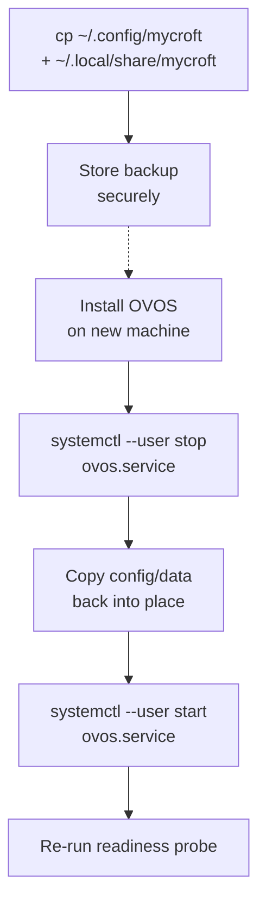

# Backup and Restore

!!! abstract "In a nutshell"
    Two kinds of state matter on an OVOS device: installed packages and everything under a
    user's config/data directories. This page covers backing up and restoring the config/data
    directories. See [Staged Upgrades and Rollback](staged-upgrades.md#staged-upgrades-and-rollback)
    for the package side.

## Backup and restore



*Diagram:* The flow starts at backing up the config and data directories and ends at re-running the readiness probe, and the stored backup branches off to a new machine before the service is stopped, restored, and restarted.

Two kinds of state matter on an OVOS device: the packages that are installed, and everything
under a user's config/data directories. The staged-upgrade recipe covers packages, see
[Staged Upgrades and Rollback](staged-upgrades.md). This section covers the directories.

| What | Path | Source |
|---|---|---|
| User config (`mycroft.conf`), may hold plaintext secrets | `~/.config/mycroft/mycroft.conf` | [Locations](locations-ref.md#path-constants) |
| System config (fleet-wide layer, if you use one) | `/etc/mycroft/mycroft.conf` | [Locations](locations-ref.md#path-constants), [one config for many devices](production-operations.md#one-config-for-many-devices-the-system-config-layer) |
| Per-skill settings | `~/.config/mycroft/skills/<skill_id>/settings.json` | [Skill Settings: Storage Location](skill-settings.md#storage-location) |
| Per-skill persistent files | `~/.local/share/mycroft/filesystem/skills/<skill_id>/` | [Filesystem Access: Storage Path](skill-filesystem.md#storage-path) |

`~/.config/mycroft` and `~/.local/share/mycroft` are the effective defaults under the standard
XDG layout. Both move together if `OVOS_CONFIG_BASE_FOLDER` renames the `mycroft` subdirectory
system-wide (see [Locations](locations-ref.md#environment-variable-influence)).

### Backup recipe

A copy is enough. Nothing here needs a database dump or a running service to stop first,
though restarting the service afterward picks up any config changes made in the meantime:

```bash
BACKUP_DIR=~/ovos-backup-$(date +%F)
mkdir -p "$BACKUP_DIR"
cp -a ~/.config/mycroft "$BACKUP_DIR/config"
cp -a ~/.local/share/mycroft "$BACKUP_DIR/data"
```

`mycroft.conf` can contain plaintext API keys and tokens (see
[Privacy & Security: mycroft.conf can contain plaintext secrets](privacy-security.md#mycroftconf-can-contain-plaintext-secrets)).
Store the backup with the same care you'd give the original file, and never commit it to a
public repository.

### Restore onto a fresh install

1. [Install OVOS](ovos-installer.md) normally on the new machine, and confirm the stock
   assistant works before restoring anything, so a restore problem is not confused with an
   install problem.
2. Stop the services: `systemctl --user stop ovos.service`.
3. Copy the backed-up directories back into place, overwriting the freshly-installed defaults:

   ```bash
   cp -a "$BACKUP_DIR/config/." ~/.config/mycroft/
   cp -a "$BACKUP_DIR/data/." ~/.local/share/mycroft/
   ```

4. Restart: `systemctl --user start ovos.service`, then re-run the
   [readiness probe](production-operations.md#knowing-when-the-assistant-is-actually-ready)
   before relying on the device.

Skills themselves are not part of this backup. They are Python packages, reinstalled the same
way they were installed originally (see [Skill Installer](skill-installer.md) or your own
provisioning step). Only their settings and persisted files travel with the config/data
backup above.

---
**Read next:** [Staged Upgrades and Rollback](staged-upgrades.md)
**Related:** [Production Operations](production-operations.md) · [Privacy & Security](privacy-security.md) · [Rolling Back an OVOS Upgrade](release-rollback.md)
