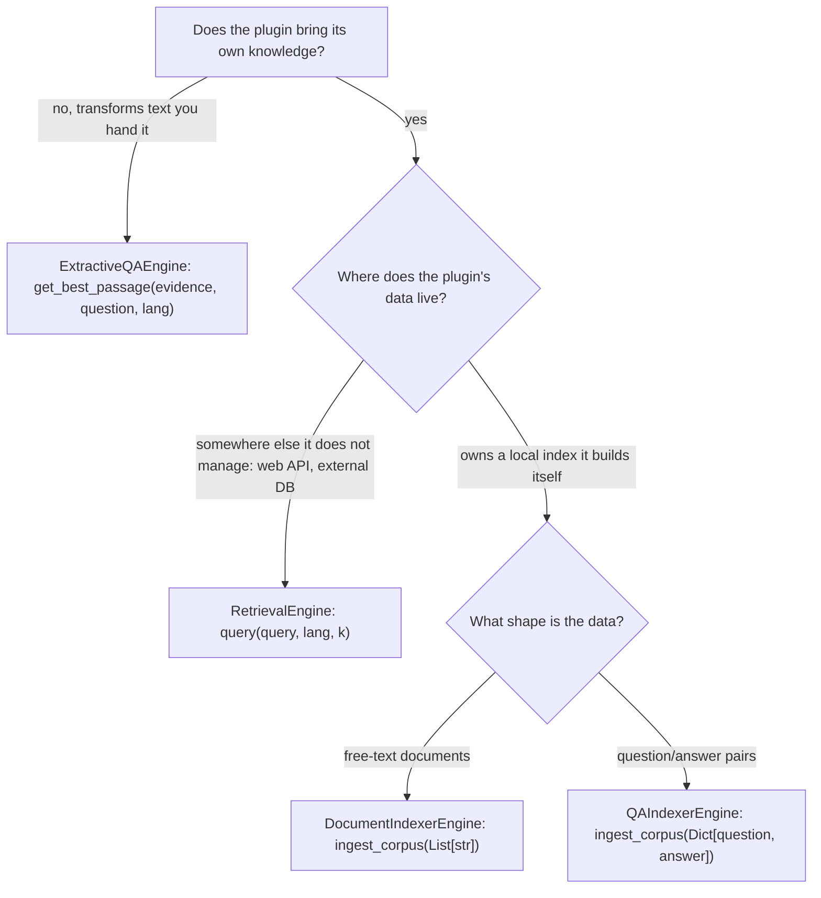

# Building Agent Plugins

!!! abstract "In a nutshell"
    This page teaches you how to write your own agent engine plugin: which base class to
    subclass, what each method contract expects, how to register the entry point, and how
    to test the result. If you only want to *use* existing plugins, read
    [Agent Engine Types](agent-plugins.md) and [Agents & Personas](personas.md) instead.

Every agent engine is a normal Python class that subclasses one abstract base from
`ovos_plugin_manager.templates.agents` (or `ovos_plugin_manager.templates.agent_tools` for
toolboxes) and registers under one `opm.agents.*` entry-point group. OVOS discovers it
through the entry point. There is no registration API to call and no framework to inherit
beyond the one base class.

!!! note "Version requirement"
    The `opm.agents.*` groups need **`ovos-plugin-manager >= 2.3.0a1`** (cap below
    `<3.0.0`). The legacy `QuestionSolver` family (`opm.solver.*`) is deprecated. See the
    migration map in [Deprecated Solver Types](agent-plugins.md#deprecated-solver-types).

---

## Which base class do I need?

Start from the question your plugin answers, not from the technology it wraps:

| Your plugin... | Base class | Group |
|---|---|---|
| holds a conversation and generates replies | `ChatEngine` | `opm.agents.chat` |
| also accepts images, audio, or files | `MultimodalChatEngine` | `opm.agents.chat.multimodal` |
| describes an image/audio/file as text for a text-only engine | `MultimodalAdapter` | `opm.agents.multimodal_adapter` |
| looks up knowledge somewhere else (an API, a database) | `RetrievalEngine` | `opm.agents.retrieval` |
| indexes documents you give it, then searches them | `DocumentIndexerEngine` | `opm.agents.retrieval.documents` |
| indexes question/answer pairs, then matches new questions | `QAIndexerEngine` | `opm.agents.retrieval.qa` |
| pulls the exact answering sentence out of a text you already have | `ExtractiveQAEngine` | `opm.agents.extractive_qa` |
| scores candidate answers against a query | `ReRankerEngine` | `opm.agents.reranker` |
| maps what the user said to one of the options a skill offered | `OptionMatcherEngine` | `opm.agents.option_matcher` |
| decides if a reply means yes, no, or neither | `YesNoEngine` | `opm.agents.yesno` |
| decides if a statement follows from another statement | `NaturalLanguageInferenceEngine` | `opm.agents.nli` |
| replaces pronouns with the entities they refer to | `CoreferenceEngine` | `opm.agents.coref` |
| stores and rebuilds conversation history between turns | `AgentContextManager` | `opm.agents.memory` |
| condenses one long text into a short one | `SummarizerEngine` | `opm.agents.summarizer` |
| condenses a chat transcript into a short text | `ChatSummarizerEngine` | `opm.agents.summarizer.chat` |
| exposes callable functions (tools) to chat engines | `ToolBox` | `opm.agents.toolbox` |

Two rules of thumb when the table is not enough:

- **Does the plugin generate text, or does it select text?** Generators are chat engines
  or summarizers. Selectors are rerankers, matchers, classifiers, or extractive QA.
- **Does the plugin bring its own knowledge, or does it work on text you hand it?**
  Engines that bring knowledge belong in the retrieval family. Engines that only
  transform their input (extract, rank, classify, summarize) do not.

### The retrieval family, disambiguated

Developers most often reach for the wrong class here, so this deserves its own section.
The family has one parent and two children, plus a neighbor that looks similar but is not
retrieval at all.

*Diagram:* The decision starts by asking whether the plugin brings its own knowledge, and ends at one of three engine choices, branching on whether the data lives externally, is free-text documents, or is question/answer pairs.

**`RetrievalEngine`** is the parent contract: one method,
`query(query, lang, k) -> List[Tuple[str, float]]`, which returns up to `k`
`(content, score)` pairs. Subclass it directly when the knowledge lives somewhere the
plugin does **not** manage: a web API (Wikipedia, Wolfram Alpha, DuckDuckGo), a company
wiki, a database another service maintains. Your plugin translates a query into a lookup
and normalizes the results. There is no ingestion step because there is nothing to ingest.

**`DocumentIndexerEngine`** adds `ingest_corpus(corpus: List[str])`. Subclass it when the
plugin **owns a local index over free-text documents**: the caller feeds it texts, the
plugin embeds or indexes them (BM25, a vector store, whatever you choose), and `query`
searches that index. This is the base class for the retrieval half of a RAG pipeline.

**`QAIndexerEngine`** adds `ingest_corpus(corpus: Dict[str, str])`, where keys are
questions and values are answers. Subclass it for FAQ-style data: `query` matches the
user's question against the *indexed questions* and returns the paired *answers*. Use it
instead of `DocumentIndexerEngine` when your data is already question-shaped. Matching
question-to-question is much more accurate than matching a question against raw prose.

**`ExtractiveQAEngine` is not retrieval.** It never searches anything. Its single method,
`get_best_passage(evidence, question, lang)`, receives the evidence text as an argument
and returns the span inside it that answers the question.

It is the *last* step of a pipeline whose earlier steps (often a `RetrievalEngine`) already
found the evidence. [ovos-wikipedia-plugin](https://github.com/OpenVoiceOS/ovos-wikipedia-plugin)
shows the combination: retrieval fetches a Wikipedia summary, then an extractive QA engine
pulls out the one sentence worth speaking aloud.

A worked example. You want your assistant to answer questions from a folder of markdown
notes:

1. `DocumentIndexerEngine`: ingest the notes, retrieve the top 3 relevant chunks.
2. `ExtractiveQAEngine` (optional): reduce the best chunk to the answering sentence.
3. `ReRankerEngine` (optional): if several chunks disagree, score them against the
   question and keep the winner.

Each stage is a separate, swappable plugin. Resist the urge to build one plugin that does
all three: personas compose engines by config, and a monolith cannot be recombined.

### ReRanker vs OptionMatcher

Both take a string plus a list of strings. They solve different problems:

- `ReRankerEngine.rerank(query, options)` asks "**which candidate best answers this
  query?**". This is semantic relevance. It scores every option and returns the full sorted
  list. Use it to pick between parallel answers (the Common Query pipeline does exactly
  this).
- `OptionMatcherEngine.match_option(utterance, options)` asks "**which of the options I
  offered did the user just pick?**". This is reference resolution, not relevance. The utterance
  may be an ordinal ("the second one"), a synonym, or a paraphrase, and `None` is a valid
  result when the user said something unrelated. `OVOSSkill.ask_selection` uses this
  engine.

If your model scores semantic similarity, it is a reranker. If your logic understands
"the last one", it is an option matcher.

### Chat engines and their satellites

`ChatEngine` is the right base whenever the output is a free-form assistant reply. The
one abstract method is `continue_chat(messages, session_id, lang, units, tools)`, which
takes the full message list (`AgentMessage` objects with `role` and `content`) and returns
one `AgentMessage` with `role=MessageRole.ASSISTANT`. Three points trip people up:

- **The engine is stateless.** History arrives in `messages` on every call. Do not store
  conversation state inside the engine. That is what `AgentContextManager` plugins are
  for. `session_id` exists so engines that front stateful backends can route, not so you
  can build a history cache.
- **Filter unsupported roles.** The message list can contain `SYSTEM`, `DEVELOPER`,
  `USER`, `ASSISTANT`, and `TOOL` roles. If your backend only understands some of them,
  drop or merge the rest inside the plugin.
- **Streaming is opt-in.** Override `stream_tokens` (partial text, not TTS-safe) and
  `stream_sentences` (complete sentences, safe to feed TTS) if the backend can stream.
  The defaults fake it by splitting the full `continue_chat` response, which works but
  gives no latency benefit.

Set the class attribute `supports_tools = True` only if the engine really consumes the
`tools` argument and can return `tool_calls` on its response message. Call
`ToolBox.normalize_tools(tools)` on the argument to get a flat list of OpenAI-spec tool
dicts, whatever mix of `ToolBox` objects and raw dicts the caller passed.

`MultimodalChatEngine` is the same contract over `MultimodalAgentMessage`, which adds
base64-encoded `image_content`, `audio_content`, and `file_content` lists. It is a
separate class on purpose: a persona can check `isinstance` and know whether media
survives or gets dropped. If your backend is text-only but you still want media in, do
not fake multimodality. Pair a plain `ChatEngine` with a `MultimodalAdapter`, whose
single method `convert(MultimodalAgentMessage) -> AgentMessage` renders the media as text
(image captioning, audio transcription, file summarization).

`AgentContextManager` is the memory contract: `get_history(session_id)`,
`update_history(new_messages, session_id)`, and
`build_conversation_context(utterance, session_id)`. The last one is where the
interesting work happens: it returns the message list the chat engine will actually see,
so it is the hook for history trimming, summarization of old turns, long-term memory
lookups, and RAG injection. Two contract rules: the first returned message *may* be a
system message (start from `self.system_prompt`), and the last returned message *must* be
a user message with the current utterance.

### Classifiers: YesNo, NLI, Coreference

`YesNoEngine.yes_or_no(question, response, lang)` returns `True`, `False`, or `None`
(neutral/invalid). It gets the *question* as well as the response because polarity
depends on it: "not at all" confirms "are you sure you want to cancel?" differently than
"do you want more?".

`NaturalLanguageInferenceEngine.predict_entailment(premise, hypothesis, lang)` returns a
bool: does the premise support the hypothesis? Use it as a guardrail, for example to
check that a generated answer is actually supported by the retrieved evidence before
speaking it.

`CoreferenceEngine` is unusual: the base class already implements the memory (a TTL-pruned
`pronoun -> entity` store, `set_context`, `reset_context`, and the public `resolve`
entry point). You implement only two methods: `contains_corefs(text, lang)`, a cheap
check that gates the expensive call, and `solve_corefs(text, lang)`, the actual
resolution ("It was running" → "The dog was running"). Do not reimplement the state
handling.

### Summarizers

`SummarizerEngine.summarize(document, lang)` condenses one plain text.
`ChatSummarizerEngine.summarize(messages, lang)` condenses a `List[AgentMessage]`. It
knows who said what, so it can produce "the user asked for X and the assistant suggested
Y". Memory plugins use chat summarizers to compress old history. Document summarizers
serve skills that read long content aloud. Pick by input type, not by output style.

### ToolBox

`ToolBox` (in `ovos_plugin_manager.templates.agent_tools`) is the only base class that is
not an engine: it *provides* functions for chat engines to call. You implement one
method, `discover_tools() -> List[AgentTool]`, where each `AgentTool` bundles a name, a
description, a Pydantic `ToolArguments` schema, a Pydantic `ToolOutput` schema, and the
callable itself. The base class handles everything else: input/output validation
(`call_tool`), messagebus discovery and remote calls, and export to the OpenAI tool spec
(`openai_tools`). See [Agent Tool Plugins](tool-plugins.md) for the full walkthrough and
[Interoperability](agent-interop.md) for how toolboxes map to MCP.

---

## Rules that apply to every engine

- **Constructor**: `__init__(self, config: Optional[dict] = None)`. Store nothing but
  config at construction time. Load heavy models lazily on first use if startup cost
  matters.
- **Language**: every public method takes an optional BCP-47 `lang`. When it is `None`,
  fall back to `self.lang`, which reads `config["lang"]` and then the active OVOS
  session. **Engines do not auto-translate.** The old solver family translated inputs
  behind your back. Agent engines must either support the language or fail honestly.
- **No bus access**: engines are plain classes with no messagebus connection (only
  `ToolBox` binds to the bus, and only when asked). Keep them importable and testable
  without a running OVOS stack.
- **Return contracts are exact**: a `RetrievalEngine` returns `(content, score)` tuples,
  not bare strings. A `ChatEngine` returns an `AgentMessage`, not a string. An
  `OptionMatcherEngine` returns `None` for no-match rather than guessing. Downstream
  consumers (personas, pipelines, skills) rely on these shapes.

---

## Walkthroughs and migration

Two front-to-back worked examples (a `DocumentIndexerEngine` and a `ChatEngine`), the
guide for migrating an existing `QuestionSolver`-family plugin to this API, and the
pre-publish checklist all live on
[Agent Plugin Walkthroughs and Migration](agent-plugin-walkthroughs.md).

---
**Read next:** [Agent Plugin Walkthroughs and Migration](agent-plugin-walkthroughs.md)
**Related:** [Agent Engine Types](agent-plugins.md) · [Agent Tool Plugins](tool-plugins.md) · [Personas & PersonaService](personas.md)
