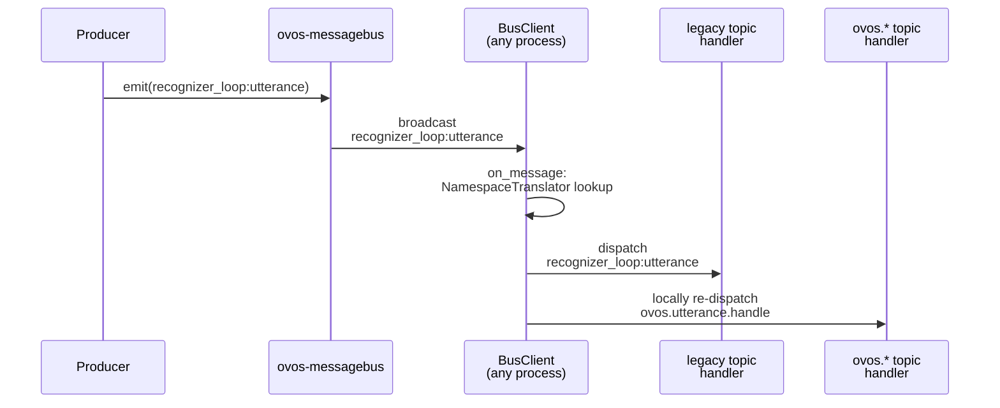

# Bus namespace migration

!!! abstract "In a nutshell"
    The [Formal Specifications](architecture-specs.md) renamed many legacy bus topics into the
    `ovos.*` namespace. `ovos-bus-client` bridges old and new names automatically, so producers
    and consumers can each switch at their own pace. The bridge is a pending removal. See the
    warning below.

## Namespace migration

The [Formal Specifications](architecture-specs.md) rename many bus topics into
the `ovos.*` namespace, for example `recognizer_loop:utterance` →
`ovos.utterance.handle` and `complete_intent_failure` → `ovos.intent.unmatched`
(the full list is the [legacy ↔ spec table](bus-events.md#legacy-spec-migration)).
A few families, such as the `mycroft.skill.handler.*` / `ovos.intent.handler.*`
trio, are deliberately **not** bridged. See that page's "Not bridged" note.
Renaming a topic across an
ecosystem of independently-released repos cannot happen in one coordinated step.
So **`ovos-bus-client` migrates automatically and incrementally**. The legacy
and the new names interoperate transparently while the ecosystem moves over.

The canonical legacy to spec topic map lives in the `NamespaceTranslator` from
[`ovos-spec-tools`](spec-tooling.md), and each `MessageBusClient` applies it on the
**receive** side, not by putting a second copy on the wire:

*Diagram: a producer emits the legacy recognizer_loop:utterance topic, the bus broadcasts it unchanged, and each receiving MessageBusClient uses the NamespaceTranslator to dispatch it to both the legacy handler and, re-dispatched locally, the spec ovos.utterance.handle handler.*

- A single logical `emit()` sends exactly **one** message over the websocket: the topic the
  caller actually chose.
- When that message arrives back over the websocket (to every connected client, including the
  sender), each client's `on_message` handler locally re-dispatches it under its counterpart
  topic(s) too, using the translator to reshape the payload where the shape changed. This is a
  listener-delivery convenience *inside each process*, not a second bus message. The broadcast
  server never sees or re-broadcasts a counterpart frame.
- **listen**: subscribing to *either* name (`bus.on(...)`) also delivers the counterpart, with
  **de-duplication** so a handler that would match both fires exactly once.

The result: a producer and a consumer can each switch from a legacy topic to its `ovos.*`
spec name **in any order, with no coordination**, without every component switching at once.

### Turning the bridges off

Each direction is independently controllable (default `true`), via environment
variable or bus configuration:

| Direction | Env var | Config key | Effect |
|---|---|---|---|
| modernize | `OVOS_BUS_MODERNIZE` | `modernize` | a received **legacy** topic is also locally re-dispatched under its `ovos.*` counterpart |
| emit_legacy | `OVOS_BUS_EMIT_LEGACY` | `emit_legacy` | a received **`ovos.*`** topic is also locally re-dispatched under its legacy counterpart |

Because the bridging happens per-process on receive, turning a direction off only stops that
process from locally delivering the counterpart to its own handlers. A deployment whose
components all speak `ovos.*` can set `emit_legacy=false` once no local handler still needs
the legacy delivery, and disable `modernize` once no legacy producers remain.

!!! warning "`modernize` is load-bearing, not cosmetic, on a canonical-only skill container"
    A skill container that only registers `ovos.*` handlers is not automatically safe from an
    older producer still emitting legacy topics. The wire frame it receives may be legacy-only.
    That skill hears it at all *because* its own `MessageBusClient` (any `ovos-bus-client`
    since 2.6.3a1, where the bridge became receive-side in commit 0f0a241, PR #258; before
    that the counterpart was a second wire message)
    re-dispatches the legacy arrival under its `ovos.*` counterpart on receive, per `modernize`
    being on. Disabling `modernize` on such a container does not just drop a redundant delivery.
    It silently stops that container from ever hearing a legacy producer again. Never disable
    `modernize` on a skill container while any producer in the fleet may still be on legacy
    topics. Treat the default `true` as the safe choice everywhere except a deployment that has
    fully verified every producer speaks `ovos.*`.

### Intent dispatch topics: the `.intent` suffix is gone

A related, separately-bridged rename: per-intent dispatch topics are now the canonical
`<skill_id>:<intent_name>` with **no `.intent` suffix**. Old `ovos-workshop` releases built
the topic from the Padatious resource *filename*, so the extension leaked onto the wire. A
skill with `food.order.intent` listened on `<skill_id>:food.order.intent`. Current workshop
registers `<skill_id>:food.order` (OVOS-MSG-1 §2.1.1).

`ovos-bus-client` 2.8 bridges the skew with two stateless rules: every canonical intent topic
emitted also goes out as its `.intent`-suffixed twin (marked as a twin, so nothing double-fires),
and every *unmarked* suffixed topic received is locally re-dispatched under its canonical
spelling. Config-gated, on by default. Test rigs get the same behavior from `FakeBus` as of the
`ovos-utils` alpha released 2026-08-14.

Two practical rules for authors:

- New code and tests should **compute** the canonical topic with
  `ovos_spec_tools.intent_topics.canonical_intent_topic(...)`, rather than hard-coding either
  spelling. Literal `.intent` listeners are deprecated but not broken.
- The spelling goes canonical when **either** side modernizes: the skill registers canonical
  (workshop ≥ 9.3.11a2) **or** the matcher canonicalizes (padatious ≥ 2.0.1a1 strips the suffix at
  registration. Adapt is unaffected: its intent names come from `IntentBuilder`, never from
  filenames, so there was no suffix to strip). Pinning one side back does **not** restore the
  old spelling.

!!! warning "The bridge is scheduled for removal"
    [ovos-bus-client#272](https://github.com/OpenVoiceOS/ovos-bus-client/pull/272) is an
    open kill-switch pull request that deletes the bridge entirely: after it merges,
    clients speak `ovos.*` spec topics and nothing else, and setting the `modernize` /
    `emit_legacy` flags raises `RuntimeError`. Its stated merge condition is a fleet
    already upgraded to spec topics. Migrate remote consumers to the spec names ahead of
    it. See [Upcoming Changes](upcoming-changes.md).

!!! note "Bridged is not the same as conformant"
    [`ovos-test-harness`](spec-tooling.md) asserts spec behavior on the
    canonical `ovos.*` topics. A component becomes *spec-conformant* once it
    speaks `ovos.*` directly. The bridge keeps it **interoperable** in the
    meantime, but it does not make it conformant.

---
**Read next:** [messagebus Service](bus-service.md)
**Related:** [Bus Events Reference](bus-events.md) · [Bus-Client Dual-Emit Bridge (migration checklist)](migration-bus-dual-emit.md) · [Spec Tooling](spec-tooling.md) · [Upcoming Changes](upcoming-changes.md)
