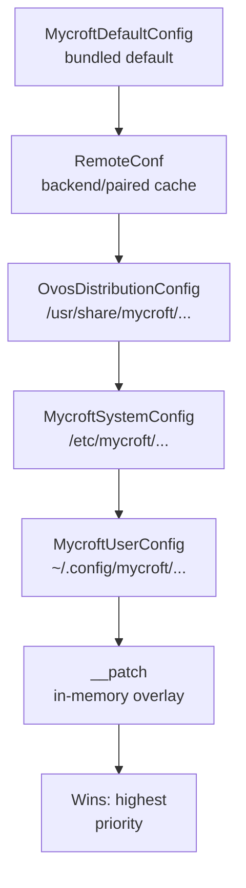

# Configuration Management

!!! abstract "In a nutshell"
    This page covers how you change OVOS's settings, such as your language, voice, and
    microphone. OVOS ships with a complete set of defaults you never touch. You write a
    small personal file listing only the things you want different. OVOS stacks your file
    on top of the defaults, so the rest stays as-is, like adding a sticky note over a
    printed form.

    The `ovos-config` command-line tool helps you view and edit those settings. For the
    full list of settings, see the [Configuration Reference](config-reference.md). For
    term definitions, see the [Glossary](glossary.md).

`ovos-config` is the configuration layer for the entire OVOS ecosystem. It provides a layered, merged `Configuration` singleton that all OVOS components read from, plus XDG-aware path helpers, a CLI tool, and meta-config support for custom distributions.

For a detailed list of every available configuration option, see the **[Configuration Reference](config-reference.md)**.

---

## Where config lives (start here)

OVOS ships a complete default config bundled inside the `ovos-config` package
(`mycroft.conf`). You never edit that file. Instead, you create a small file at
**`~/.config/mycroft/mycroft.conf`** containing only the keys you want to change.
Everything you don't mention keeps its default.

At read time OVOS stacks several files on top of each other and merges them. The
file closest to *you* wins:

```text
bundled default  →  remote cache  →  /usr/share/...  →  /etc/mycroft/...  →  ~/.config/mycroft/mycroft.conf  →  runtime patch
     lowest priority  ───────────────────────────────────────────────────►  highest priority
```

The **remote cache** is an optional layer holding settings pushed from a paired backend
(the legacy Mycroft-Home / `home.mycroft.ai` model). It sits low in the stack, so anything you
set by hand always wins. You can turn it off entirely with the `disable_remote_config`
system constraint.

It is not the file you edit. See the [Config Layer Stack](#config-layer-stack) below.

To switch to a German voice, you only need:

```json
{
  "lang": "de-DE"
}
```

dropped into `~/.config/mycroft/mycroft.conf`. Dicts are deep-merged, so this leaves
every other setting untouched. This alone is enough: STT, TTS, and every other
language-aware plugin follow the global `lang` automatically.

A per-plugin `lang` setting only overrides that default for one plugin (for example, to
keep a second voice speaking another language). `ovos-config autoconfigure` (below) is a
convenience that also swaps in the recommended plugins and voices for a language. It is
not required just to switch languages. See [Language Support](lang-support.md) for
the full picture.

---

## Config Layer Stack

Layers are merged in this order. Later layers override earlier ones:

```text
MycroftDefaultConfig   (bundled mycroft.conf — read-only to OVOS itself; admins edit the file)
RemoteConf             (backend / paired-server cache — optional; disabled by disable_remote_config)
OvosDistributionConfig (/usr/share/mycroft/mycroft.conf — read-only to OVOS itself; admins edit the file)
MycroftSystemConfig    (/etc/mycroft/mycroft.conf — read-only to OVOS itself; admins edit the file)
MycroftUserConfig      (~/.config/mycroft/mycroft.conf — XDG user config)
__patch                (in-memory overlay applied last)

```



*Diagram:* The merge order starts at the bundled default config and ends at the in-memory patch, which wins as the highest priority over remote, distribution, system, and user layers.

The XDG user layer is actually a list of configs, one per XDG config dir.

!!! warning "`/etc/xdg` wins over `~/.config`, not the other way round"
    `get_xdg_config_locations()` returns `[~/.config/mycroft/mycroft.conf,
    /etc/xdg/mycroft/mycroft.conf]`, and the layers merge left to right, so the **last** one
    wins. A key set in `/etc/xdg/mycroft/mycroft.conf` overrides the same key in the user's
    own file.

    That inverts the XDG base-directory spec, where `XDG_CONFIG_HOME` has the highest
    precedence. Verify what your device does before relying on either order:

    ```bash
    python3 -c "from ovos_config.locations import get_xdg_config_locations as f; print(f())"
    ```

    The last path printed is the one that wins. All layers are `LocalConf` dict subclasses backed by a file. Only the user
config (`~/.config/mycroft/mycroft.conf`) should be edited by users. The **`RemoteConf`**
layer is the optional backend or paired-server settings cache (the legacy Mycroft-Home /
`home.mycroft.ai` model). It is merged low in the stack and can be turned off with the
`disable_remote_config` system constraint.

> The merge order in `load_all_configs()` is: default → remote → distribution → system →
> xdg user configs → in-memory patch. The remote layer is skipped when `disable_remote_config`
> is set, and the user/XDG layers when `disable_user_config` is set.

---

## Usage

```python
from ovos_config import Configuration

config = Configuration()
lang = config["lang"]                         # read a value
tts_module = config["tts"]["module"]          # nested access

# Persist a change to the user config file on disk (merges into ~/.config/mycroft/mycroft.conf)
from ovos_config.config import update_mycroft_config
update_mycroft_config({"lang": "de-DE"})

# Pass a bus to also emit configuration.patch after writing, so other processes pick it up
update_mycroft_config({"lang": "de-DE"}, bus=bus)

```

Because `Configuration` is a singleton, all instances share the same merged view. The framework calls `Configuration.load_all_configs()` automatically on first access.

---

## File Locations

Config files stack from a bundled default up through distribution, system, and XDG user
layers, all under the `OVOS_CONFIG_BASE_FOLDER` environment variable (default: `"mycroft"`).
See [Locations](locations-ref.md) for the full path-constant table and file-format details.

!!! warning "Secrets and permissions"
    Anything you add here, such as an LLM API key, a Home Assistant token, or a custom
    server credential, is stored as **plaintext**, with no encryption or
    secrets manager. Restrict the file's permissions (`chmod 600`) on shared
    machines, and don't commit it to a public dotfiles repository. See
    [Privacy & Security](privacy-security.md#mycroftconf-can-contain-plaintext-secrets)
    for the full guidance.

---

## Usage Guide

**1. Create or edit your user config:**

```bash
mkdir -p ~/.config/mycroft
nano ~/.config/mycroft/mycroft.conf

```

Add only the keys you want to override. Everything else falls back to defaults.

**2. Override via environment variables (optional):**

```bash
export OVOS_CONFIG_BASE_FOLDER="myfolder"
export OVOS_CONFIG_FILENAME="myconfig.yaml"

```

**3. Use the CLI:**

```bash
ovos-config show                        # full merged config
ovos-config get -k lang                 # find all keys containing "lang"
ovos-config get -k /tts/module          # get exact value at tts.module
ovos-config set -k /tts/module -v ovos-tts-plugin-phoonnx
# if the key is a secret (llm.key, tokens), afterward: chmod 600 ~/.config/mycroft/mycroft.conf

```

See the **Secrets and permissions** warning above. `ovos-config set` does not restrict the file's permissions itself.

**Restart and verify**

`ovos-config set` writes the change to disk. It does not restart the running services. They
keep using the old value until you restart them:

```bash
# raspOVOS
ovos-restart

# any other systemd-managed install
systemctl --user restart ovos.service
```

Then confirm the new value took effect. For an STT or TTS server change, check the
voice/audio logs, or watch live traffic with [`ovos-busmon`](bus-service.md), to see which
server actually receives the request. See [STT server](stt-server.md#companion-plugin) and
[TTS server](tts-server-deployment.md#companion-plugin) for the plugin-side config keys.

---

## Protected Keys and System Restrictions

The system config (`/etc/mycroft/mycroft.conf`) can enforce constraints:

| Key in system config | Effect |
|---|---|
| `protected_keys` | Dict of `{"user": [...], "remote": [...]}`: keys stripped from the user / remote layer before merging |
| `disable_user_config` | If `true`, every layer except `default` and `system` is ignored — see the warning below |
| `disable_remote_config` | If `true`, the remote / backend config layer is ignored |

!!! danger "`disable_user_config` drops more than the user layer"
    The merge filter treats every layer whose path is neither the bundled default nor the
    system config as a user layer. That includes the **distribution** layer
    (`/usr/share/mycroft/mycroft.conf`), the **remote** layer, and the in-memory **patch**
    that `configuration.patch` bus messages write to.

    So an OEM that ships a distribution config and then locks the device with
    `disable_user_config` erases its own settings and silences every runtime config update.
    The device falls back to stock defaults, with no error and no log line. Verified: with
    `lang` set to `pt-PT` in the distribution layer, turning the flag on returns `en-US`.

    To lock a device, put the values in `/etc/mycroft/mycroft.conf` (the system layer), which
    the filter keeps.

These constraints are read from the `system` section of the distribution config, then the
system config, then the **bundled default** — which does ship a `system` block, so on a stock
install the constraints in force come from the default layer. A `system` section in a user
config is ignored. Nested keys use `:` as the separator (for example, `"listener:sample_rate"`).

Example: stop users from rebinding the messagebus host (must live in the `system` section of `/etc/mycroft/mycroft.conf`):

```json
{
  "system": {
    "protected_keys": {
      "user": ["gui_websocket:host", "websocket:host"]
    }
  }
}

```

> Admin [PHAL](phal.md) is a special service that runs as root. It can **only** access `/etc/mycroft/mycroft.conf`.

---

## Internals: Patch Mechanism, Config Models, Env Overrides

The in-memory patch overlay, the `LocalConf`/`ReadOnlyConfig` class hierarchy backing
each layer, the bus events that keep processes in sync, environment-variable overrides,
and XDG path helpers are covered on the
**[Configuration Internals](config-internals.md)** page. Most users never need this.

---

## CLI Reference

**Entry point:** `ovos-config` | **Module:** `ovos_config.__main__`

### `show`

```bash
ovos-config show                        # full merged config
ovos-config show -u --section tts       # user config, tts section only
ovos-config show -s -l                  # list sections of system config
ovos-config show -u --section base      # user config, top-level scalar keys

```

Merge priority displayed: `user > system > remote > default`

### `get`

```bash
ovos-config get -k lang                 # find all keys containing "lang"
ovos-config get -k /tts/module          # get exact value at tts.module (strict path)

```

### `set`

```bash
ovos-config set -k /tts/module -v ovos-tts-plugin-phoonnx
ovos-config set -k blacklisted_skills -v my-bad-skill   # append to list
ovos-config set -k gui                  # interactive: choose key and enter value

```

Values are type-cast to match the existing value's type. List targets append rather than replace.

### `autoconfigure`

Automatically configure language, [STT](stt-plugins.md), and [TTS](tts-plugins.md) from a language code:

```bash
ovos-config autoconfigure -l en-us --offline --female
ovos-config autoconfigure -l de-de --online --male

```

| Option | Description |
|---|---|
| `-l, --lang LANG` | BCP-47 language code (required) |
| `-hy, --hybrid` | Offline TTS + online STT (default when neither `--online` nor `--offline` is given) |
| `-on, --online` | Online STT and TTS |
| `-off, --offline` | Offline STT and TTS |
| `-p, --platform` | Optimize the config for a device: `rpi3`, `rpi4`, `rpi5`, `linux`, `mac`, or `termux` |
| `-g, --gpu` | Configure plugins for GPU (only valid together with `--offline`) |
| `-m, --male` / `-f, --female` | Default voice gender (if neither is given, TTS configuration is skipped) |

`--male`/`--female` is enforced as a mutually exclusive pair — passing both is a usage error. Passing both `--online` and `--offline` is **not** an error: it silently selects the hybrid profile, so a provisioning script that passes both gets online STT while believing the command failed.
`--gpu` cannot be combined with `--online`/`--hybrid` or a Raspberry Pi platform.

### `telemetry`

```bash
ovos-config telemetry --enable    # opt in to intent telemetry upload
ovos-config telemetry --disable   # opt out

```

---

## Tips

- Edit `~/.config/mycroft/mycroft.conf` (user layer). Never edit system or default files. If
  the device also has `/etc/xdg/mycroft/mycroft.conf`, check that it does not set the same key
  — it wins over yours.


- JSON files support C-style `//` comments.


- `get_config_locations()` is a rough guide, not the load list: it includes the legacy
  `~/.mycroft/mycroft.conf`, which is never loaded, omits `/etc/xdg/mycroft/mycroft.conf`,
  which is, ignores the path environment variables, and lists the remote layer in a different
  position than the merge uses. For what is really in play, print
  `get_xdg_config_locations()` and the layer paths on `Configuration`.


- Use `disable_user_config` with caution. It silently skips the distribution and remote
  layers and runtime patches too, not only the user layer.


- For the package layout, entry points, and other internals, see
  [Configuration Internals](config-internals.md).

---

## Related Pages

- [Bus Service](bus-service.md) — `websocket` config section


- [Bus Client](core-libraries.md#ovos-bus-client) — `websocket` and `session` config sections


- [ovos-core](core.md) — `skills`, `intents`, `utterance_transformers` config sections


- [Configuration Internals](config-internals.md) — patch mechanism, config models, env overrides, package layout

---

*Source code: [OpenVoiceOS/ovos-config](https://github.com/OpenVoiceOS/ovos-config).*

---
**Read next:** [Configuration Reference](config-reference.md) · [Configuration Internals](config-internals.md)
**Related:** [Bus Service](bus-service.md) · [ovos-core Overview](core.md) · [Composable Deployments](composable-deployments.md)
