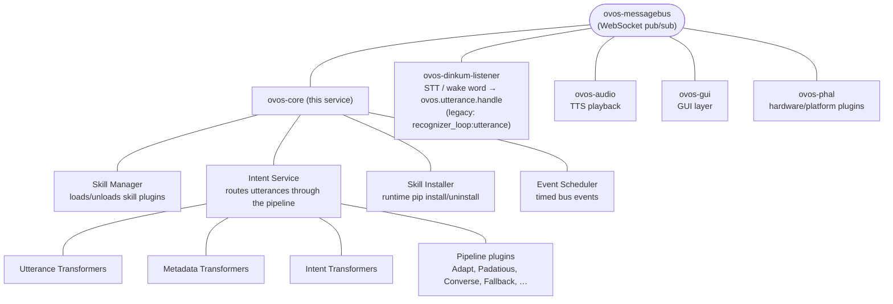

# ovos-core

!!! success "Maturity: Mature ⬤⬤⬤⬤⬤"
    Long-lived and actively maintained. Depend on it freely. Rated by [repository health](maturity.md), not version.

!!! abstract "In a nutshell"
    `ovos-core` is the "brain" of your assistant. It does not listen through the microphone or talk through the speaker. Those are separate helpers. It is the part in the middle that loads your skills, takes the words you said, decides which skill should answer, and hands back the reply.

    Think of it as the dispatcher in a control room, routing each request to the right place without doing the talking or listening itself. Everything it does travels over the [messagebus](bus-service.md). See also the [Glossary](glossary.md).

??? info "📐 Formal specification"
    `ovos-core` is the reference **orchestrator**, the logical role that runs the pipeline, routes matches to handlers, and emits the handler-lifecycle events. That role is specified by **[OVOS-PIPELINE-1: Utterance Lifecycle & Pipeline](https://github.com/OpenVoiceOS/architecture/blob/dev/pipeline-1.md)**. The transformer chains it hosts are specified by **[OVOS-TRANSFORM-1: Transformer Plugins](https://github.com/OpenVoiceOS/architecture/blob/dev/transformer.md)**, and the intent/entity registration it ingests by **[OVOS-INTENT-4: Intent & Entity Registration](https://github.com/OpenVoiceOS/architecture/blob/dev/intent-4.md)**. See also the [spec index](architecture-specs.md). The specs are implementation-agnostic, so any conformant orchestrator can replace `ovos-core` and run the same skills.

`ovos-core` is the central intelligence of OpenVoiceOS. It acts as the orchestrator, managing the lifecycle of skills, coordinating the intent pipeline, and ensuring smooth communication between all parts of the system.

**In plain terms:** `ovos-core` is the "brain" service. It does not capture audio or speak. Those are separate services. Its job is to load your skills, take the transcribed text off the bus, decide which skill handles it, and hand off the reply. Everything it does flows over the [messagebus](bus-service.md).

## Role in the System

Every user utterance, whether captured from a microphone or received via a remote client, flows through `ovos-core`. It handles:

- **Discovering and loading skill plugins.**

- **Routing utterances** through various NLP and intent-matching stages.

- **Managing sessions** and their associated states.

- **Coordinating system-wide events** via the [messagebus](bus-service.md).

## Architecture

The diagram below shows the key components within `ovos-core` and how they interact with other services:

*Diagram: the messagebus connects ovos-core, with its Skill Manager, Intent Service (transformers and pipeline plugins), Skill Installer, and Event Scheduler, to the sibling services ovos-dinkum-listener, ovos-audio, ovos-gui, and ovos-phal.*

## Key Components

For more detail on each subsystem:

- **[Skill Manager](skill-manager.md)**: finds, loads, and manages skill lifecycles, including connectivity gating (skills only load once requirements like internet access are met).
- **[Intent Service](intent-service.md)**: the utterance handling flow, language disambiguation, and the query API.
- **Intent Pipeline**: the ordered sequence of **pipeline plugins** that decide what the user wants. Each exposes a single `match(utterances, lang, session) → Match | None` contract, and they run **first-match-wins**, with no cross-plugin confidence scoring (OVOS-PIPELINE-1 §4, §6.2). See [Adapt](adapt-pipeline.md), [Padatious](padatious-pipeline.md), and [Common Query](cq-pipeline.md).
- **Transformer Plugins**: modify utterances, metadata, or intent matches as they move through the pipeline.
- **[Skill Installer](skill-installer.md)**: installs and manages skills and Python packages dynamically at runtime.

---

## Entry Points

If you are running OVOS manually, you can use these commands:

| Command | Module |
|---|---|
| `ovos-core` | `ovos_core.__main__:main` |
| `ovos-intent-service` | `ovos_core.intent_services.service:launch_standalone` |
| `ovos-skill-installer` | `ovos_core.skill_installer:launch_standalone` |

## Subsystem Enable Flags

You can customize which parts of `ovos-core` start, but only from the **CLI**. These are
constructor arguments to `main()`/`SkillManager`, not `mycroft.conf` keys, so there is no
configuration-file equivalent:

| Flag | Subsystem |
|---|---|
| `enable_intent_service` | `IntentService` |
| `enable_installer` | `SkillsStore` |
| `enable_event_scheduler` | `EventScheduler` |
| `enable_skill_api` | `SkillApi.connect_bus` |
| `enable_file_watcher` | Skill settings file watcher |

CLI equivalents are the `--disable-*` forms: `--disable-intent-service`, `--disable-installer`, `--disable-file-watcher`, and so on.

---

*Source code: [OpenVoiceOS/ovos-core](https://github.com/OpenVoiceOS/ovos-core).*

---
**Read next:** [Skill Manager](skill-manager.md) · [Intent Service](intent-service.md)
**Related:** [MessageBus Service](bus-service.md) · [Skill Installer](skill-installer.md) · [Formal Specifications](architecture-specs.md)
