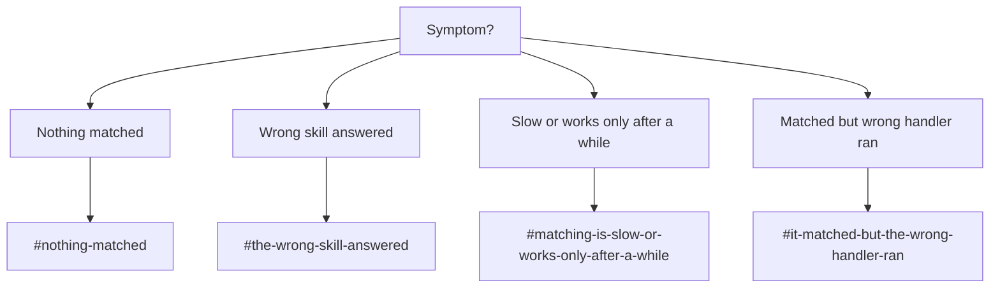

# Debugging Intent Matching

!!! abstract "In a nutshell"
    Intent matching problems fall into four buckets: nothing matched at all, the wrong skill
    answered, matching is slow or seems to "wake up" after a while, or a match happened but the
    wrong handler ran. This page is a symptom-indexed index into checks and gotchas that live
    scattered across the pipeline pages, plus the bus events to watch for each one. Start with
    [Troubleshooting & Debugging](troubleshooting.md) if you have not yet confirmed the mic, wake
    word, and STT stages are healthy. This page assumes the utterance already reached the intent
    pipeline.

*Diagram: from the symptom question, four branches lead to the matching sections on this page: nothing matched, wrong skill answered, slow or works only after a while, and matched but wrong handler ran.*

---

## Nothing matched

The utterance reached `IntentService`, every pipeline stage passed on it, and the assistant said
nothing (or spoke the fallback-unknown dialog if one is installed).

- Reproduce it deterministically without speaking, using `ovos-say-to "the phrase"`, then grep
  `skills.log` for the utterance. Every matcher that passed logs a miss line
  (`no match from <bound method ...>`), naming the matcher's Python function. See
  [Troubleshooting: Stage 4](troubleshooting.md#stage-4-which-pipeline-stage-matched-or-didnt).
- Check `intents.pipeline` in your config. A stage that is not listed is never tried, even if it
  is installed. Confirm the intent you expect is actually in an enabled matcher's confidence
  range. See [Pipelines Overview](pipelines-overview.md#customizing-the-pipeline) and
  [Building Your Pipeline](building-your-pipeline.md).
- If the missing intent is a Padatious `.intent` file, remember training is asynchronous.
  On a cold start, or right after installing a skill, Padatious matches will silently fail until
  training completes. Set `instant_train` if you need deterministic behavior while testing. See
  [Padatious Pipeline: gotcha](padatious-pipeline.md#advanced).
- If you expect Adapt to catch it, confirm both the vocabulary and the rule are registered by
  checking `skills.log` for `register_vocab` / `register_intent` traffic, since Adapt has no
  training step and should match immediately once registered. See
  [Adapt Pipeline](adapt-pipeline.md).

**Bus events to watch** (with `ovos-busmon` or by grepping the logs): `ovos.utterance.handle`
(legacy `recognizer_loop:utterance`, confirms the utterance entered the pipeline at all),
`ovos.intent.matched` (absent means nothing claimed it), and the terminal
`ovos.intent.unmatched` (legacy `complete_intent_failure`), the definitive "no pipeline stage
claimed the utterance" marker. Every request also ends with exactly one `ovos.utterance.handled`
regardless of outcome. Its absence means the intent service itself crashed or hung, which is a
different problem than a genuine miss. See [Bus Events Reference](bus-events.md#intent-matching-context)
and [Troubleshooting: Stage 4](troubleshooting.md#stage-4-which-pipeline-stage-matched-or-didnt).

---

## The wrong skill answered

The pipeline claimed the utterance, and something spoke, but it was not the skill you expected.

- **Adapt collisions are silent.** Two skills that require overlapping vocabulary can shadow
  each other. The higher-scoring match wins with no warning logged. Make each skill's required
  keywords as specific as possible, or prefer the domain/hierarchical Adapt entry points
  (`ovos-adapt-domain-pipeline-plugin`, `ovos-adapt-hierarchical-pipeline-plugin`) when running
  many skills together. See [Adapt Pipeline: gotcha](adapt-pipeline.md#advanced).
- **Check ordering, not just thresholds.** First-match-wins means an earlier stage's loose match
  can beat a later stage's precise one. If a semantic matcher like Model2Vec or Hierarchical KNN
  sits ahead of Padatious/Adapt's high tiers, it can claim an utterance a more precise parser
  would have nailed. The usual fix is to place the semantic matcher's high tier after the
  deterministic engines' high tiers, or interleave by confidence. See
  [Model2Vec Pipeline: gotcha](m2v-pipeline.md#gotcha-ordering-against-the-deterministic-engines)
  and [Building Your Pipeline: ordering rules of thumb](building-your-pipeline.md#ordering-rules-of-thumb).
- **Inspect which stage actually claimed it.** `skills.log` logs the winning matcher by name
  (for example `adapt_high match (en-us): IntentMatch(...)`), and `ovos-busmon` shows the same
  information in the `ovos.intent.matched` payload. Reproduce with `ovos-say-to` first so the
  utterance is fixed while you inspect. See
  [Troubleshooting: Stage 4](troubleshooting.md#stage-4-which-pipeline-stage-matched-or-didnt).

**Bus events to watch**: `ovos.intent.matched` (its payload names the skill and intent that
claimed the utterance, so filter on this first) and `<skill_id>:<intent_name>` (the actual
dispatch topic that invoked the handler, confirming which skill really ran). See
[Bus Events Reference](bus-events.md#intent-matching-context).

---

## Matching is slow or works only after a while

The assistant eventually responds, or responds correctly only after the system has been running
a while, but the first attempt (or every attempt) feels sluggish.

- **Padatious trains asynchronously.** Right after boot or after installing/updating a skill,
  Padatious retrains its model in the background. Matches silently fail (not slowly, but not at
  all) until training finishes, which can look like "it started working after a minute." Set
  `instant_train: true` if you need synchronous, deterministic training instead. See
  [Padatious Pipeline: gotcha](padatious-pipeline.md#advanced).
- **Converse and stop both wait up to 0.5s** for each active skill to answer a ping before
  moving on, so a slow-to-respond skill process adds latency to every turn while it is active.
  See [Converse Pipeline](converse-pipeline.md#how-it-works) and
  [Stop Pipeline](stop-pipeline.md#how-it-works).
- **Common Query can add several seconds.** It waits `min_response_wait` (1s) before evaluating
  answers and caps total gathering at `max_response_wait` (4s by default, 6s in the bundled
  config), extending by `extension_time` per skill that reports it is still searching. A
  reranker plugin, if configured, adds further latency, noticeably so on constrained hardware.
  See [Common Query Pipeline: Configuration](cq-pipeline.md#configuration) and
  [Performance](cq-pipeline.md#performance).
- **Hierarchical KNN has its own classifier timeout**, `timeout` (default 1 second), the time it
  waits for the classifier before giving up on a match. See
  [Hierarchical KNN Pipeline: Configuration](knn-pipeline.md#configuration).

**Bus events to watch**: time the gap between `ovos.utterance.handle` and `ovos.intent.matched`
(or the terminal `ovos.utterance.handled`) in `ovos-busmon`'s timeline view to see which stage
is eating the time. For Common Query specifically, watch `question:query` and
`question:query.response` to see how long skills take to reply. See
[Bus Events Reference](bus-events.md) and
[Watching the Bus: ovos-busmon](troubleshooting-bus.md).

---

## It matched but the wrong handler ran

`ovos.intent.matched` fired, the correct skill and intent even look right in the log, but the
behavior that ran was not what the intent should do.

- **Confirm the dispatch topic actually reached the skill.** The winning match dispatches on
  `<skill_id>:<intent_name>`. If the skill process never received it, check the skill actually
  loaded and that its registered `skill_id` matches the one in the match payload; a mismatch
  here means "no traceback, no speak, handler simply never runs." See
  [Troubleshooting: Stage 5](troubleshooting.md#stage-5-did-the-skill-handler-raise).
  If a handler did run but raised, the traceback lands right after the `final intent match` log
  line, in which case the fix is in the skill's own handler code, not the pipeline.
- **Reserved intent names cannot be reused by skills.** `converse`, `response`, `stop`,
  `common_query`, and `fallback` are reserved `intent_name` values leased to the converse, stop,
  common-query, and fallback stages. A skill that accidentally registers an intent under one of
  these names will collide with the reserved stage's own dispatch. See
  [Pipelines Overview: spec vocabulary](pipelines-overview.md#what-is-an-intent-pipeline).
- **For Adapt, revisit the silent-collision gotcha above.** A match with the right-looking skill
  ID but the wrong intent inside that skill is often two overlapping `IntentBuilder` rules in
  the same skill, or another skill's vocabulary bleeding into this one's rule. See
  [Adapt Pipeline: gotcha](adapt-pipeline.md#advanced).

**Bus events to watch**: `<skill_id>:<intent_name>` (confirms exactly which handler was
dispatched), and the handler-lifecycle trio `ovos.intent.handler.start` →
`ovos.intent.handler.complete` / `ovos.intent.handler.error` to see whether the handler ran to
completion or raised. Filter `ovos-busmon` by the specific skill's ID to isolate its traffic.
See [Bus Events Reference](bus-events.md#intent-matching-context) and
[Troubleshooting: Stage 5](troubleshooting.md#stage-5-did-the-skill-handler-raise).

---

---
**Read next:** [Adapt Pipeline](adapt-pipeline.md) · [Padatious Pipeline](padatious-pipeline.md)
**Related:** [Troubleshooting & Debugging](troubleshooting.md) · [Building Your Pipeline](building-your-pipeline.md) · [Pipelines Overview](pipelines-overview.md) · [Bus Events Reference](bus-events.md)
