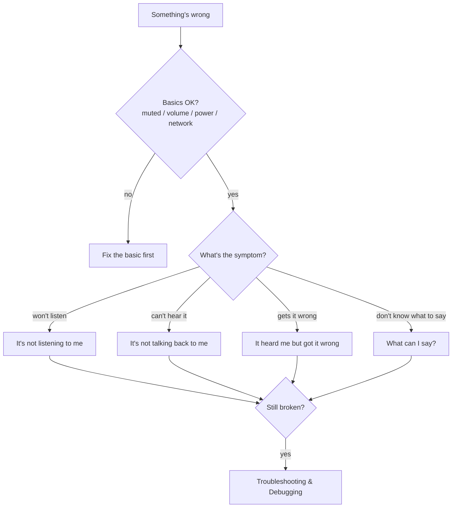

# It's Not Working - Quick Fixes

!!! abstract "In a nutshell"
    Something is wrong and you just want your assistant talking again. No terminal, no
    programming. This page lists the most common everyday problems ("it won't
    listen", "I can't hear it", "it doesn't understand me") and plain fixes for each. Use
    voice, or a couple of taps in a settings screen. If your problem isn't here, go to
    [What can I say?](skill-examples.md) to check the exact words to use, or to
    [Troubleshooting & Debugging](troubleshooting.md) for the deeper, log-reading version of this
    page.

---

## First, check the basics

Before anything else, check these four things. They cause most "it's just not working"
moments and take seconds to check. No terminal, no config file needed.

- **Is it muted?** Look for a mute light or icon, or ask *"are you muted?"* If it can't hear you
  to answer, check the physical mute switch or button, if your device has one.
- **Is the volume up?** Ask *"what's the volume?"* A spoken answer means the speaker path
  works.
- **Is it powered on?** A dead device won't react to anything. Check the power light and cable
  before you assume a software problem.
- **Is it connected to the network?** Most skills (weather, radio, trivia) need internet access.
  Check your router or the device's Wi-Fi indicator or settings screen if answers about the outside
  world fail while purely local things (time, volume) still work.

If all four check out and something's still wrong, the sections below cover the specific
symptom.

*Diagram:* The flow starts at "something's wrong" and ends at Troubleshooting & Debugging if still broken, branching on the basics check and then on which symptom applies.

## "It's not listening to me"

- **Say the wake word clearly, with a short pause after it.** OVOS listens for a wake word (by
  default *"Hey Mycroft"*) before it pays attention to anything else. Say the wake word, wait
  about one second, then say your request, for example "Hey Mycroft... what's the weather", instead of running the two
  together.
- **Check you're not muted.** If a light or on-screen icon shows the microphone is muted, say
  *"unmute microphone"* or use the physical mute switch or button, if your device has one.
- **Move closer, or reduce background noise.** Wake-word detection is a local audio match. A TV,
  music, or a fan next to the microphone can make it too loud for the wake word to be heard.
- **If it never hears you at all, check the microphone itself works.** See
  [Prove the microphone and speaker work](troubleshooting.md#prove-the-microphone-and-speaker-work).
  These are copy-paste terminal commands, not settings screens, but you don't need to understand
  them. Just run each one and see if you get sound back.
- **The wake word keeps missing or keeps false-triggering.** This is a sensitivity setting, not a
  hardware fault. See [Wake-word Plugins](wake-word-plugins.md#wake-word-configuration) for how to
  adjust `sensitivity` and `trigger_level` in `mycroft.conf`, and pick a less noise-prone wake word
  if needed. Unlike the fixes above, this one needs opening a text config file, not just talking
  to the assistant. See [Make It Yours](personalize.md) for the general edit-and-restart
  routine, or [Accessibility](accessibility.md#installing-without-fighting-a-screen-reader) if
  editing that file interactively (for example with a screen reader) is itself the obstacle.

## "It's not talking back to me" / "It's muted"

- **Ask it to check itself.** Say *"what's the volume?"* If you get a spoken answer, audio
  output works and the problem is elsewhere (see the next section).
- **Say *"unmute"* or *"unmute volume"*.** OVOS keeps mic-mute and speaker-mute separate. Muting
  the microphone does not silence the speaker, and the reverse is also true.
- **Say *"volume up"* or *"set volume to 80".*** These are handled by the built-in
  [Volume skill](skill-examples.md#volume) (`ovos-skill-volume`), which understands phrasing like
  "volume up", "quieter", "mute", "unmute", "toggle mute", "set volume to 50", and "what's the
  current volume".
- **Check the physical connections** if voice control makes no difference at all. Check the speaker cable
  is fully seated, the powered speaker is turned on and its own volume dial is not at zero, and (on a Raspberry
  Pi or similar box) the audio output is routed to the jack, HDMI, or USB device you expect. See
  [Hardware Integrators](hardware-integrators.md) if you're building your own box and need to pick
  an audio path.

## "It heard me but got it wrong"

- **Speak in short, plain sentences.** Long, run-on requests are harder for both wake word and
  speech-to-text to parse than "what time is it" or "set a timer for ten minutes".
- **Check you're using words it actually understands.** Every OVOS skill only reacts to specific
  phrasings ("intents"). [What can I say?](skill-examples.md) lists real, working example phrases
  for every skill that ships with OVOS, grouped by what they do (jokes, timers, weather, and more).
- **If it keeps mishearing the same words** (names, local places), that is a
  speech-to-text accuracy limit, not something you can fix from voice alone. See
  [STT Plugins](stt-plugins.md) if you want to try a different recognizer.

## "I don't know what to say to it"

You don't need to memorize a command syntax. [What can I say?](skill-examples.md) is a
browsable list of every skill that ships with (or can be added to) OVOS. Each skill has real usage
examples from its own vocabulary, for example "tell me a joke", "what's the weather in
Lisbon", "set a timer for five minutes".

## Still broken?

If none of the above fixes it, the problem needs more digging. You still don't need to
be a programmer to follow along. [Troubleshooting & Debugging](troubleshooting.md) walks through
the same journey (wake word to speech-to-text to understanding to skill to speaking) stage by
stage. It shows which log file or on-screen tool proves where things went wrong.

---

**Read next:** [Troubleshooting & Debugging](troubleshooting.md)
**Related:** [What can I say?](skill-examples.md) · [RaspOVOS Troubleshooting](raspovos-troubleshooting.md) · [Make it yours](personalize.md) · [Accessibility](accessibility.md)
