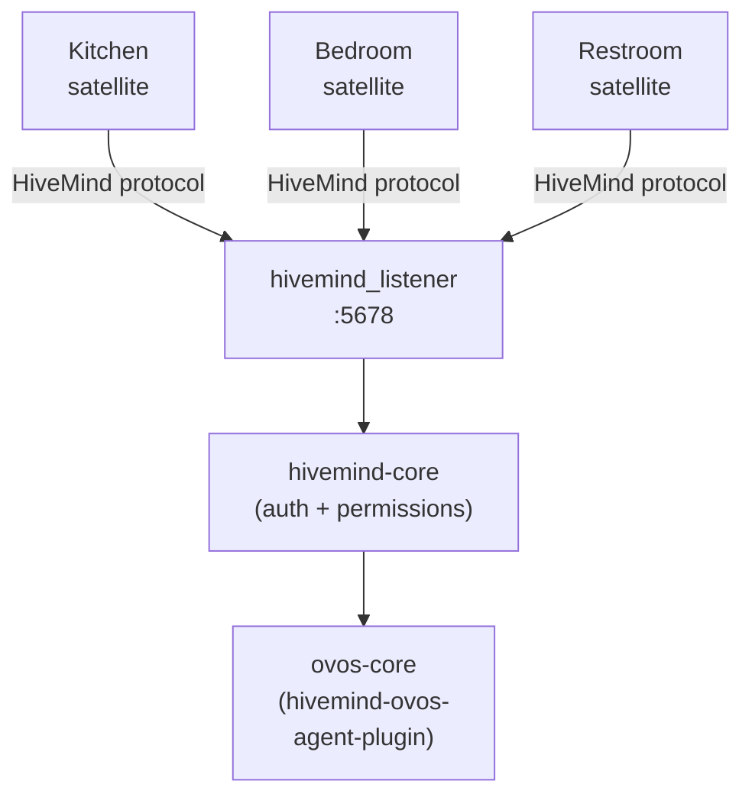

# Remote Agents with HiveMind

!!! abstract "In a nutshell"
    OpenVoiceOS runs **local-first**. Sometimes you want one capable machine to do the
    thinking while several small devices ("satellites") listen and speak. Or you want to
    reach your assistant securely from off-device. **HiveMind** is the companion project
    that makes this possible. It exposes an OVOS install, or a single persona, over an
    authenticated, encrypted protocol that satellites and clients connect to.

!!! info "A separate project, under its own org"
    HiveMind is maintained in the **[JarbasHiveMind](https://github.com/JarbasHiveMind)**
    GitHub organization (not `OpenVoiceOS`), with its own
    [community docs](https://jarbashivemind.github.io/HiveMind-community-docs/). The OVOS
    [Maturity Scale](maturity.md), which rates OVOS-org repository health, does not apply to
    it. This page covers only how HiveMind relates to OVOS.

    HiveMind has its own documentation site. This manual covers only the OVOS-side
    integration. See the [community docs](https://jarbashivemind.github.io/HiveMind-community-docs/)
    for HiveMind itself.

    HiveMind is the **voice-satellite transport**: how a mic/speaker device or remote client
    reaches an OVOS brain. MCP and A2A (see [Agent Interop](agent-interop.md)) are different:
    LLM/agent tool protocols that let AI systems call each other's tools.

    If you are writing a remote or native (non-Python) client that connects over HiveMind,
    this manual is **not** the place to look for the wire details. HiveMind defines its own
    protocol: the connect URL, the access-key auth handshake, the message envelope, and the
    reconnect/backoff behavior a client must implement. That protocol is documented in the
    [HiveMind community docs](https://jarbashivemind.github.io/HiveMind-community-docs/).

---

## The pieces

| Piece | Role |
|---|---|
| **`hivemind-core`** | The server. Listens for connections, authenticates clients, enforces permissions, and routes messages to an **agent**. |
| **Agent** | What actually answers: a full [ovos-core](core.md) install (`hivemind-ovos-agent-plugin`), a single [persona](personas.md) (`hivemind-persona-agent-plugin`), or a remote media renderer (`hivemind-player-agent-plugin`). |
| **Satellites / clients** | The devices and apps that connect to `hivemind-core` (mic satellites, CLI clients, your own code). |

`hivemind-core` is **pluggable** via the **HiveMind Plugin Manager (HPM)** across four axes.
You can swap implementations without touching the rest:

- **Agent protocol**: what brain answers (OVOS / persona / others).
- **Network protocol**: how clients connect (WebSocket is the reference implementation).
- **Database**: where client credentials live (JSON / SQLite / Redis).
- **Binary data handler**: how binary payloads (e.g. audio) move over the mesh.



*Diagram:* The flow starts at the kitchen, bedroom, and restroom satellites and ends at ovos-core, and all three satellites branch into the shared hivemind_listener before converging through hivemind-core.


---

## Quickstart: expose an OVOS install

```bash
pip install hivemind-core
```

**1. Provision a client.** Every satellite or client needs an access key issued by the server:

```bash
hivemind-core add-client       # prints an access key + password for one client
```

This writes the client to the server's credentials database (under
`xdg_data_home()/hivemind-core`), separate from the server config at
`~/.config/hivemind-core/server.json`. To rename a client later, run
`hivemind-core rename-client <node_id> --name <new_name>`. `<node_id>` accepts either the
numeric id or the access key, and `--name` is required.

**2. Start the server:**

```bash
hivemind-core listen           # start listening for HiveMind connections
```

By default this listens on `0.0.0.0:5678` (websocket) and `0.0.0.0:5679` (HTTP), on all
interfaces. Firewall those ports if the machine faces an untrusted network. Connections
still require the per-client access key and password.

By default it serves the local `ovos-core` via `hivemind-ovos-agent-plugin` (configured under
`agent_protocol` in `server.json`).

**3. Give a client its identity, then connect.** On the *client* device, save the access key
issued in step 1. This step makes everything else work:

```bash
pip install hivemind-bus-client   # repo name is hivemind-websocket-client
hivemind-client set-identity --key <access_key> --password <password> --host <server>
```

Bare `hivemind-client set-identity` with no flags raises a `ValueError`. It needs at least
one of `--key`, `--password` or `--siteid` (`--host` alone does not satisfy the check, even
though the error message mentions it). Use the access key and password printed by
`add-client` in step 1.

After `set-identity`, clients (and the [solver](#using-hivemind-as-a-solver) below) can connect
without being handed connection details each time.

**4. Verify the satellite actually connected.** Run this on the client after `set-identity`:

```bash
hivemind-client test-identity
```

On success it prints:

```text
== Identity successfully connected to HiveMind!
```

If it hangs or errors, check that the server is running (`hivemind-core listen`) and reachable
on the configured host and port. Also check that the access key matches one printed by
`hivemind-core add-client`.

---

## Choosing the agent: full OVOS, a single persona, or a media renderer

The agent is selected by the `agent_protocol.module` key in `~/.config/hivemind-core/server.json`.

### Full OVOS: `hivemind-ovos-agent-plugin`

The default. Bridges HiveMind to a running [ovos-core](core.md) over its messagebus. Remote
clients get the whole assistant: skills, pipelines, OCP, and more.

### A single persona: `hivemind-persona-agent-plugin`

Exposes just one [persona](personas.md), with no `ovos-core` and no messagebus, so the attack
surface stays minimal. It answers straight from the configured persona.

Pointing the persona at an OpenAI-compatible endpoint, as in the example below, is a working
LLM-fallback deployment: the remote node just forwards chat to that endpoint. Pin
`ovos-persona>=0.9.0a17`. Versions before that mixed up the `lang` and `system_unit` arguments
in `Persona.chat`/`Persona.stream`, which could break a retrieval-backed persona or 500 the
`/v1/chat/completions` endpoint.

```json
{
  "agent_protocol": {
    "module": "hivemind-persona-agent-plugin",
    "hivemind-persona-agent-plugin": {
      "persona": {
        "name": "Llama",
        "solvers": ["ovos-chat-openai-plugin"],
        "ovos-chat-openai-plugin": {
          "api_url": "https://llama.smartgic.io/v1",
          "key": "sk-xxxx",
          "system_prompt": "You are helpful, creative, clever, and very friendly."
        }
      }
    }
  }
}
```

The `persona` value may be an inline config dict, as above, or a path to an
[ovos-persona](https://github.com/OpenVoiceOS/ovos-persona) JSON file (`~` is expanded). The
`"module"` value must equal the plugin's entry-point name. That same string is reused as the
key holding its config.

### A remote media renderer: `hivemind-player-agent-plugin`

Ships in the [`hivemind-media-player`](https://github.com/JarbasHiveMind/hivemind-media-player)
repo, as the `hivemind-player-agent-plugin` entry point under the `hivemind.agent.protocol`
group. Set `agent_protocol.module` to it and the node runs `ovos-audio` and OCP as a remote
media renderer. Any OCP-speaking client can send it play/pause/seek commands over HiveMind. It
answers no natural-language queries; a `natural_language_query` yields only the end-of-query
sentinel.

---

## Satellites & clients

For a step-by-step build of a server-plus-satellites deployment, see [Satellites](satellites.md).

A server is only useful once something connects to it. On the client side:

- **[`hivemind-websocket-client`](https://github.com/JarbasHiveMind/hivemind-websocket-client)**: the client library and the `hivemind-client` CLI (`set-identity`, send utterances, and more). It installs as `hivemind-bus-client`. The repository and the distribution have different names.
- **[`hivemind-mic-satellite`](https://github.com/JarbasHiveMind/hivemind-mic-satellite)**: the thinnest device. Only microphone and VAD run locally. Wake word, STT and TTS all run server-side. Run it with the `hivemind-mic-sat` command, and note the server must have `hivemind-audio-binary-protocol` installed (see below).
- **[`hivemind-audio-binary-protocol`](https://github.com/JarbasHiveMind/hivemind-audio-binary-protocol)**: the server-side audio entry point that performs wake word/STT/TTS for audio satellites, with binary audio moving over the mesh. Plain `hivemind-core` does no audio processing without it. (Formerly named `hivemind-listener`. The old PyPI package name still exists.)

This split is the real "voice satellite" story: cheap devices listen and speak, and the server thinks.

---

## Permissions & access control

HiveMind is **deny-by-default**: a client may only do what it has been explicitly granted.
`hivemind-core` enforces this at the message-type level with a `PolicyChain` of pluggable
`PolicyPlugin`s, including `MessageTypeACLPolicy`, that checks every inbound message. Its
admin CLI manages this, including:

- `add-client` / `list-clients` / `delete-client`: manage who may connect.
- `allow-msg` / `blacklist-msg`: allow or block specific bus message types per client.
- `make-admin` / `revoke-admin`, `allow-escalate` / `allow-propagate`: elevate or restrict a client.
- `blacklist-skill` / `allow-skill`, `blacklist-intent` / `allow-intent`: stop or re-allow a
  client from reaching specific skills or intents. These verbs only write `skill_blacklist` and
  `intent_blacklist` client metadata. Enforcing them against skill or intent IDs requires the
  `OVOSAgentPolicy` plugin (from `hivemind-ovos-agent-plugin`) to be present in the server's
  policy chain. The CLI verbs alone block nothing without it.

This is what makes HiveMind safe to expose to satellites or other users, unlike the plain
[persona-server](persona-server.md), which is HTTP with no auth.

!!! tip "Web admin UI"
    [`hivemind-admin-panel`](https://github.com/JarbasHiveMind/hivemind-admin-panel) is a web UI
    for managing clients, permissions, plugins and personas instead of the CLI.

---

## Using HiveMind as a solver

Your local assistant can ask a remote HiveMind agent when it's stuck. Install the
**[`ovos-solver-hivemind-plugin`](https://github.com/JarbasHiveMind/ovos-solver-hivemind-plugin)**
(class `HiveMindSolver`, import `ovos_hivemind_solver`) and add it to a persona. It is a normal
[solver](agent-plugins.md), so it slots into a mixture-of-solvers chain. This helps when
delegating hard questions or surviving local outages.

```json
{
  "name": "HiveMind Agent",
  "solvers": ["ovos-solver-hivemind-plugin"],
  "ovos-solver-hivemind-plugin": {"autoconnect": true}
}
```

Or from your own code (the node identity must already be set with `hivemind-client set-identity`):

```python
from ovos_hivemind_solver import HiveMindSolver

bot = HiveMindSolver()          # reads the identity provisioned via `hivemind-client set-identity`
bot.connect()
print(bot.spoken_answer("what is the speed of light?"))
```

### As an intent-pipeline stage

There is also a pipeline-plugin form,
**[`ovos-hivemind-pipeline-plugin`](https://github.com/JarbasHiveMind/ovos-hivemind-pipeline-plugin)**
(entry point `opm.pipeline`, class `HiveMindPipeline`). Instead of living inside a persona, it
slots directly into the [intent pipeline](pipelines-overview.md). The idea: when in doubt, ask
a smarter OVOS install. Add it to `intents.pipeline` and configure it under `mycroft.conf`:

```json
{
  "intents": {
    "pipeline": ["...", "ovos-hivemind-pipeline-plugin", "..."],
    "ovos-hivemind-pipeline-plugin": {
      "name": "Hive Mind",
      "confirmation": true,
      "slave_mode": false
    }
  }
}
```

Use the **solver** form to delegate inside a persona's reasoning. Use the **pipeline** form to
delegate at the intent-matching stage, for example as a late, catch-all matcher.

---

## Deployment patterns

HiveMind and the [persona-server](persona-server.md) cover different trust boundaries:

| Use case | Tools | Secure? | Notes |
|---|---|---|---|
| Local interface + persona | `ovos-persona-server` + `persona.json` | ❌ | OpenAI-compatible HTTP, no auth, quick setups only |
| Local interface + OpenVoiceOS | `ovos-persona-server` + the `ovos-messagebus` handler | ❌ | Exposes the OVOS bus to the persona server; HTTP, no auth |
| Local interface + remote HiveMind agent | `ovos-persona-server` + `ovos-solver-hivemind-plugin` | ❌ | HTTP front, but the agent itself is remote |
| Secure remote OpenVoiceOS agent | `hivemind-core` + `hivemind-ovos-agent-plugin` + `ovos-core` | ✅ | Auth, encryption, granular permissions |
| Secure remote persona agent | `hivemind-core` + `hivemind-persona-agent-plugin` + `persona.json` | ✅ | Same, persona-only (minimal surface) |

The HTTP rows are useful for wiring a persona into local tools, such as Home Assistant's Ollama
integration or OpenWebUI, on a trusted network. The HiveMind rows are what you expose to
satellites or untrusted networks.

> ⚠️ The plain [`persona-server`](persona-server.md) is **HTTP only, not encrypted or
> authenticated**. Keep it on a trusted local network. Use HiveMind for anything remote.

---

## Further reading

- [HiveMind community docs](https://jarbashivemind.github.io/HiveMind-community-docs/)
- [A real use case with OVOS and Hivemind](https://blog.openvoiceos.org/posts/2025-07-25-A-real-use-case-with-OVOS-and-Hivemind) (OVOS blog)
- [OVOS & HiveMind in the Manufacturing Industry](https://blog.openvoiceos.org/posts/2026-01-14-OVOS-hivemind-industry) (OVOS blog)

---
**Read next:** [Home Assistant](home-assistant.md)
**Related:** [Privacy & Security](privacy-security.md) · [Persona Server](persona-server.md) · [Agent Interop](agent-interop.md) · [Production Operations](production-operations.md)
