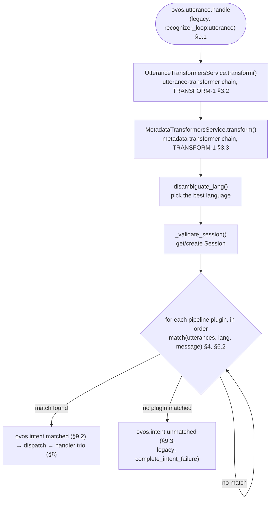

# Intent Service

!!! success "Maturity: Mature ⬤⬤⬤⬤⬤"
    Long-lived, well-tested, and actively maintained. You can depend on it. Rated by [repository health](maturity.md), not version. See also [Intent Design](intents.md) for how a skill defines the keyword and template intents this service matches.

!!! abstract "In a nutshell"
    The Intent Service is the part of OpenVoiceOS that figures out what you actually meant.
    Once the [Speech Service](speech-service.md) has turned your words into text, this
    service reads that text and decides which skill should handle it, much like a
    receptionist hearing your request and directing you to the right desk. It tries a series
    of matchers in order and stops at the first one confident enough to respond. New to the
    terms? See the [Glossary](glossary.md).

**Module:** `ovos_core.intent_services.service.IntentService`: [`ovos_core/intent_services/service.py`](https://github.com/OpenVoiceOS/ovos-core/blob/dev/ovos_core/intent_services/service.py)

??? info "📐 Formal specification"
    The utterance lifecycle, the `match(utterances, lang, message) → Match` contract (the third
    argument is the utterance `Message`, from which a plugin reads the session via
    `message.context["session"]`), **first-match-wins** ordering, and the
    dispatch/handler-lifecycle events are specified by
    **[OVOS-PIPELINE-1: Utterance Lifecycle & Pipeline](https://github.com/OpenVoiceOS/architecture/blob/dev/pipeline-1.md)**.
    What an intent *is* (keyword vs template) and the match-result shape come from
    **[OVOS-INTENT-3: Intent Definition](https://github.com/OpenVoiceOS/architecture/blob/dev/intent-3.md)**.
    How skills declare intents and entities on the bus comes from
    **[OVOS-INTENT-4: Intent & Entity Registration](https://github.com/OpenVoiceOS/architecture/blob/dev/intent-4.md)**.
    See also the [spec index](architecture-specs.md). `IntentService` is the reference
    **orchestrator** of this lifecycle. The spec topic names below are canonical.

`IntentService` is the component of `ovos-core` responsible for routing user utterances through the configured **Intent Pipeline** until a match is found.

**In plain terms:** this is the part that takes the words you said and figures out *which*
skill should answer. It runs each matcher in your pipeline in order, such as stop, converse,
padatious, and adapt, and stops at the first one confident enough to handle the request.

---

??? abstract "Technical Reference"

    - `IntentService.handle_utterance()`: [`ovos_core/intent_services/service.py`](https://github.com/OpenVoiceOS/ovos-core/blob/dev/ovos_core/intent_services/service.py). Main entry point for processing utterances.


    - `IntentService._emit_utterance_handled()`: [`ovos_core/intent_services/service.py`](https://github.com/OpenVoiceOS/ovos-core/blob/dev/ovos_core/intent_services/service.py). Terminal callback that emits the handled/complete message once a matcher's handler chain finishes.


    - `OVOSPipelineFactory.load_plugin()`: [`ovos_plugin_manager/pipeline.py`](https://github.com/OpenVoiceOS/ovos-plugin-manager/blob/dev/ovos_plugin_manager/pipeline.py). Factory that builds matcher pipeline plugins from config (`get_installed_pipeline_ids()` lists them).
    

## Utterance Handling Flow

When an `ovos.utterance.handle` message (legacy: `recognizer_loop:utterance`) arrives on the bus, it triggers the lifecycle entry point of [OVOS-PIPELINE-1 §9.1](https://github.com/OpenVoiceOS/architecture/blob/dev/pipeline-1.md):



*Diagram: an incoming ovos.utterance.handle message flows through utterance and metadata transformers, language and session resolution, and the ordered pipeline-plugin match loop, ending in either a dispatched ovos.intent.matched or, if no plugin matches, ovos.intent.unmatched.*

Reading top to bottom: an incoming utterance is first reshaped by the utterance- and
metadata-transformer chains. Then the best language and a `Session` are resolved once, up
front. Every pipeline plugin after that point sees the same already-prepared utterance,
language, and session. The plugins themselves are then tried strictly in configured order.
The first one to return a match wins and short-circuits the rest. If none of them do, the
lifecycle ends in `ovos.intent.unmatched` instead of a dispatch.

Every lifecycle terminates with exactly one `ovos.utterance.handled` (§9.5), the universal end-marker, whether or not anything matched.

## Language Disambiguation

The language for an utterance is chosen based on a priority list from message context keys:

1. `stt_lang`: language used by [STT](stt-plugins.md) to transcribe.


2. `request_lang`: volunteered by the source (e.g. wake word).


3. `detected_lang`: detected by a transformer plugin.


4. Config default / `message.data["lang"]`.

The chosen language is validated against `valid_langs` from config using `closest_lang()` (from `ovos_spec_tools`), which tolerates near-matches such as `en` vs `en-us`.

!!! note "This ordering is the orchestrator's own consolidation"
    OVOS-SESSION-1 §3.2 treats these language signals as *informative* and deliberately does
    **not** mandate a fixed precedence. It warns that `request_lang` is a hint a consumer "MUST
    NOT treat as a guarantee" (§3.2.5), and for intent matching, suggests preferring `stt_lang` /
    `detected_lang` then `lang`. The fixed list above is how `ovos-core`'s intent service
    consolidates them in practice. Another orchestrator may weigh them differently.

## Multilingual Matching

When `intents.multilingual_matching` is enabled, the language fallback is **per pipeline
plugin**, not a second whole-pipeline pass. For each plugin in priority order, the
orchestrator first tries it in the primary language. If that plugin declines, it retries the
*same* plugin in every other configured language, and only then advances to the next plugin.
A consequence is that a lower-priority plugin's alternate-language match can win over a
higher-priority plugin that was never reached. When the config is off, every plugin is tried
in the primary language only.

## Session Management

Each utterance is associated with a `Session`.

- The per-session `intent_context` (`session.intent_context`) decays on a `timeout` (config
  `timeout`, default 2 minutes). This is what "expires," not the session itself. The
  `"default"` session is persisted in-process by the orchestrator, not destroyed. See
  [Session Aware Skills](session.md).


- **Non-default sessions** (e.g., from [HiveMind](hivemind-agents.md) clients) are updated but not reset.


- Session state (active skills, pipeline, blacklists) is serialized into every reply message under `context.session`.

## Intent Match Emission

When a pipeline plugin returns a match:

1. `IntentTransformersService.transform(match)`: the **intent-transformer chain** post-processes the match (OVOS-TRANSFORM-1 §3.4).


2. Build the dispatch message (`message.reply(match.match_type, …)`) with `match.match_type` as the message type.


3. Activate the skill in the session (`sess.activate_skill(skill_id)`) and emit `{skill_id}.activate` for the skill's callback.


4. Emit `ovos.intent.matched` (§9.2), a notification that a plugin claimed the utterance.


5. Wrap the dispatch in the **handler-lifecycle trio**. The orchestrator emits `ovos.intent.handler.start`, then exactly one of `ovos.intent.handler.complete` / `ovos.intent.handler.error` (§8). The skill's intent handler runs between them.

    !!! note "The trio is orchestrator-owned"
        The handler, whether skill or plugin-bundled, emits nothing that the trio itself
        tracks. Third-party handler code carries no obligation here (PIPELINE-1 §8). It is
        free to emit its own messages (e.g. a skill calling `self.speak()` emits
        `ovos.utterance.speak`). Those are simply not part of the trio's bookkeeping. The
        wrapper around the invocation emits `start` before the call and exactly one of
        `complete` (normal return) or `error` (exception) after it, each `forward`-derived
        from the dispatch message so `context` and `session` are preserved. The payload is
        `{skill_id, intent_name}`, plus `exception` on the `error` leg. A handler bounded by a
        deployment-defined timeout that overruns produces an `error` leg carrying a timeout
        `exception`. The dispatch is never re-emitted.

## Threading and Failure Model

Skills run **in the same process** as `ovos-core`. The `SkillManager` thread loads and
supervises them, not a separate process per skill. Each skill talks to the bus either through
`ovos-core`'s single shared connection (`websocket.shared_connection: true`, the default), or,
if set to `false`, through its own private connection. See
[messagebus Configuration](bus-service.md#configuration).

Each skill's handlers (intents, converse, events) run synchronously inside `create_wrapper()`,
on whichever thread delivers the message to that skill's bus subscription. There is no
per-handler thread pool. This means that when `websocket.shared_connection` is `false` and two
skills each own a private bus connection, they can handle messages concurrently. A single slow
handler blocks only its own skill's subsequent messages, not other skills'.

The **default** is
`websocket.shared_connection: true`, in which case every skill shares `ovos-core`'s single bus
connection, so a slow handler on that connection can delay message delivery to other skills as
well. See [messagebus Configuration](bus-service.md#configuration).

`create_wrapper()` runs the
handler inside a `try`/`except`/`finally`. An uncaught exception is caught, logged, and
reported via the handler's `.error` message, and unless `speak_errors=False`, spoken back to
the user as a generic "I ran into an error" style dialog. It never crashes `ovos-core` or the
offending skill's process. A handler can also raise `AbortEvent` to end the current handler run
early and skip the `.error` path, treating it as a normal (early) completion instead of a
failure.

## Intent Query API

External tools can query the pipeline without triggering a skill action:

```text
intent.service.intent.get  {utterance: "...", lang: "..."}
  → intent.service.intent.reply  {intent: {...} | null, utterance: "..."}

```

## Bus Events Handled

| Event | Handler |
|---|---|
| `ovos.utterance.handle` (legacy: `recognizer_loop:utterance`) | `handle_utterance` |
| `add_context` | `handle_add_context` |
| `remove_context` | `handle_remove_context` |
| `clear_context` | `handle_clear_context` |
| `intent.service.intent.get` | `handle_get_intent` |
| `intent.service.skills.deactivate` | `_handle_deactivate` |
| `intent.service.pipelines.reload` | `handle_reload_pipelines` |

The `*_context` events (`add_context` / `remove_context` / `clear_context`) mutate the per-session
intent context (`session.intent_context`) specified by
[OVOS-CONTEXT-1](https://github.com/OpenVoiceOS/architecture/blob/dev/intent-context.md) — see
[Session Aware Skills](session.md).

!!! note "INTENT-4 registration topics"
    Skills broadcast their intent and entity registrations on the canonical
    [OVOS-INTENT-4](https://github.com/OpenVoiceOS/architecture/blob/dev/intent-4.md) topics:
    `ovos.intent.register.keyword`, `ovos.intent.register.template`, `ovos.intent.deregister`,
    `ovos.intent.enable` / `.disable`. They exist alongside the legacy `register_intent` /
    `register_vocab` events, so pipeline plugins can consume the spec topics while skills on
    the legacy events keep working. Registrations are broadcast, not addressed. Every
    interested plugin indexes them in parallel, and the orchestrator keeps a passive manifest
    it serves through `ovos.intent.list` and `ovos.intent.describe`.

!!! note "Reserved `intent_name` values"
    [OVOS-PIPELINE-1 §7.3](https://github.com/OpenVoiceOS/architecture/blob/dev/pipeline-1.md)
    keeps a registry of `intent_name` values leased to a pipeline-plugin role: `converse`,
    `response`, `stop`, `fallback` and `common_query`. A skill or pipeline **must not** register
    a reserved name under INTENT-4. A skill subscribes to the reserved dispatch topic by
    framework convention instead. The spec reserves these names, but `ovos-core`'s intent
    manifest does not currently reject a reserved-name registration. It only warns on
    registrations missing required fields, so this is a contract skills must honor, not one the
    orchestrator enforces today.
    A reservation is a namespace lease, not a dispatch change. Reserved-name dispatches fire
    context stamping, routing and the handler trio like any other, except that the
    `session.active_handlers` push is suppressed, since a reserved name continues or terminates
    an already-active skill's participation rather than starting a fresh one. See
    [Converse](converse.md) for how reserved names interact with converse/context handling.

---
**Read next:** [Skill Installer](skill-installer.md) · [Concepts Overview](concepts-overview.md)
**Related:** [Pipelines Overview](pipelines-overview.md) · [Intent Design](intents.md) · [Formal Specifications](architecture-specs.md) · [Speech Service](speech-service.md)
