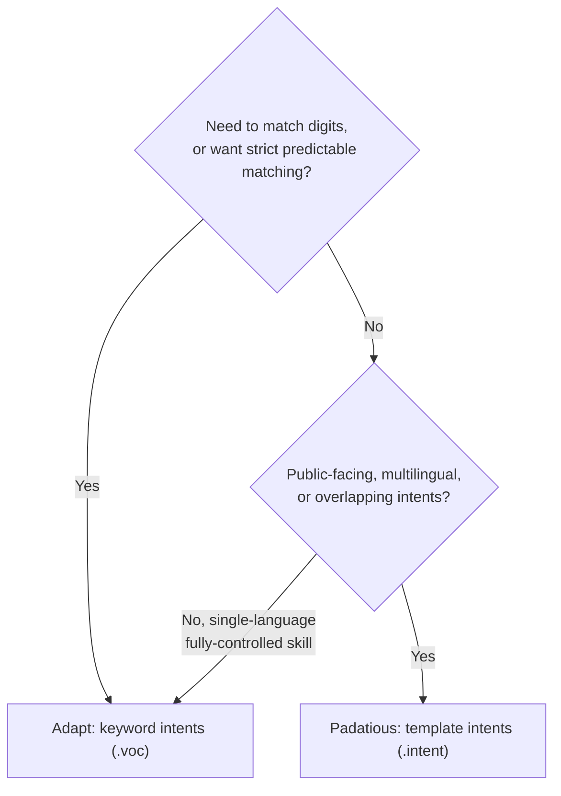

# Intent Design

!!! abstract "In a nutshell"
    People ask for the same thing in many different ways: "what's the weather?", "weather in
    Melbourne", or just "weather" all mean roughly the same thing. An *intent* is what the
    user is actually trying to do. The part of OVOS that figures it out is a *pipeline
    plugin* (older docs call this an "intent parser" or "intent engine"; see the
    [Glossary](glossary.md)). This page explains what an intent is and helps you choose
    between the two engines OVOS ships by default. See [Intent Service](intent-service.md)
    for how OVOS routes an utterance through the pipeline plugins described here. New terms
    are explained in the [Glossary](glossary.md).

??? info "📐 Formal specification"
    Intents are specified across the **intent stack** of the formal [architecture specs](architecture-specs.md):

    - **[OVOS-INTENT-3: Intent Definition](https://github.com/OpenVoiceOS/architecture/blob/dev/intent-3.md)**: what an intent *is*. A skill-private binding from a natural-language command to **one handler**, defined by one or both of two methods, **keyword** and/or **template**. An intent may carry one registration of each, giving two training-data representations of the same handler, but each individual registration still uses exactly one method. It is identified by the qualified name `skill_id:intent_name`, and produces a uniform match result (label + slot map).
    - **[OVOS-INTENT-1: Sentence Template Grammar](https://github.com/OpenVoiceOS/architecture/blob/dev/intent-1.md)**: the `(a|b)` / `[optional]` / `{slot}` / `<vocab>` grammar that template intents and vocabularies are written in.
    - **[OVOS-INTENT-4: Intent & Entity Registration](https://github.com/OpenVoiceOS/architecture/blob/dev/intent-4.md)**: the broadcast, fire-and-forget bus messages (`ovos.intent.register.keyword` / `.template`) a skill emits to declare its intents.

    The on-disk file formats (`.intent`, `.voc`, `.entity`) are **[OVOS-INTENT-2: Locale Resource Formats](https://github.com/OpenVoiceOS/architecture/blob/dev/intent-2.md)**. See [Resource Files](resource-files.md). Where an engine-specific syntax diverges from the portable grammar, it is flagged inline on that engine's page, and the spec is canonical.

A user can accomplish the same task by expressing their intent in multiple ways. The matching
pipeline plugin's role is to extract key data elements from the user's speech that specify
their intent in more detail. Other services, such as skills, can then use this data to help
the user accomplish their intended task.

_Example_: Julie wants to know about today's weather in her current location, which is Melbourne, Australia.

> "hey mycroft, what's today's weather like?"
>
> "hey mycroft, what's the weather like in Melbourne?"
>
> "hey mycroft, weather"

Even though these are three different expressions, for most of us they probably have roughly
the same meaning. In each case we would assume the user expects OVOS to respond with today's
weather for their current location. The matching pipeline plugin's role is to determine what
this intent is, and to extract data elements like the weather type, the location, and the date.

## Choosing an engine

*Diagram:* The decision starts by asking whether the skill needs digit matching or strict predictable matching, and ends by choosing Adapt for keyword intents or Padatious for template intents, branching further on whether the skill is public-facing and multilingual.

OVOS provides two kinds of intent, matched by two default pipeline plugins. The
[OVOS-INTENT-3](https://github.com/OpenVoiceOS/architecture/blob/dev/intent-3.md)
specification calls them **template intents** and **keyword intents**. Each individual
registration uses exactly one method, but a single intent name may carry **one registration of
each method**, giving the same handler two independent training-data representations.
Registering a new keyword (or template) registration replaces only the prior registration
under that same method, leaving the other method's registration for that intent untouched.

| | [Adapt](intents-adapt.md) (keyword intents) | [Padatious](intents-padatious.md) (template intents) |
|---|---|---|
| Matches on | required and optional keywords, from `.voc` files | whole example phrases, from `.intent` files |
| Strength | strict, predictable matching. Handles digits well. |  Easy to create. Easy entity extraction. |
| Weakness | a badly designed keyword set can produce false matches | weak paraphrase handling. Digits become `#` internally. |
| Best for | personal or private skills, command-and-control, single-language skills you fully control | public-facing or general-purpose skills, kiosk or assistant environments, multilingual skills |
| Avoid for | public-facing or general-purpose assistant skills | complex conversational skills, overlapping intents, or matching numbers |

> NOTE: Padatious does not handle numbers well. Internally it sees all digits as "#". If you need to match digits, use Adapt (keyword intents) instead.

See the pipeline plugin pages for the full picture of how each engine matches at runtime,
including confidence thresholds and entry points:

- **[Adapt Pipeline](adapt-pipeline.md)**: a keyword based parser (keyword intents). See
  [Adapt Intents](intents-adapt.md) for how to write `.voc`/`.rx` files and build keyword
  intents in a skill.
- **[Padatious Pipeline](padatious-pipeline.md)**: a lightweight neural network trained on
  whole phrases (template intents). See [Padatious Intents](intents-padatious.md) for how to
  write `.intent`/`.entity` files and build example-based intents in a skill.

We will now look at each in more detail, including how to use them in a
[Skill](skill-design-guidelines.md).

---
**Read next:** [Adapt Intents (Keyword Intents)](intents-adapt.md) · [Padatious Intents (Example-Based Intents)](intents-padatious.md)
**Related:** [Skill Structure](skill-structure.md) · [Intent Layers](layers.md) · [Permissions & Activation Control](permissions.md) · [OVOS Intent Pipeline](pipelines-overview.md)
