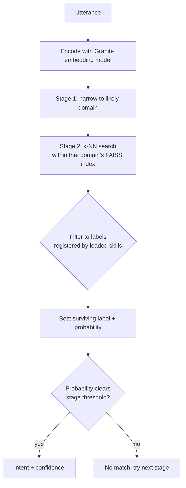

# Hierarchical KNN Intent Pipeline

!!! note "Maturity: Beta ⬤⬤⬤◯◯"
    In real use but still settling. Watch releases for the occasional breaking change. Rated by [repository health](maturity.md), not version.

!!! abstract "In a nutshell"
    This is a *semantic* [intent](glossary.md) matcher: instead of matching keywords or example
    phrases literally, it understands what an utterance **means** by comparing it (via
    [embeddings](glossary.md)) to the intents your skills registered, and picks the closest one.
    It's the heavyweight option you reach for when the simpler, deterministic matchers
    ([Adapt](adapt-pipeline.md), [Padatious](padatious-pipeline.md)) can't confidently decide.

Not in the default pipeline. Add its stage IDs to `intents.pipeline` explicitly to use it.

The rest of this page is for people deploying or customizing OVOS. If you only wanted to know what this stage does, you are done.

??? info "📐 Formal specification"
    Hierarchical KNN is a **pipeline plugin** under **[OVOS-PIPELINE-1: Utterance Lifecycle & Pipeline](https://github.com/OpenVoiceOS/architecture/blob/dev/pipeline-1.md)**. It fills the **template-intent** engine role of **[OVOS-INTENT-3 §5-§6](https://github.com/OpenVoiceOS/architecture/blob/dev/intent-3.md)** over the **[OVOS-INTENT-1 grammar](https://github.com/OpenVoiceOS/architecture/blob/dev/intent-1.md)**. Its embedding/k-NN matching is one of the engine-specific strategies INTENT-3 §8 leaves open. See the [spec index](architecture-specs.md).

[`ovos-hierarchical-knn-pipeline`](https://github.com/OpenVoiceOS/ovos-hierarchical-knn-pipeline)
is an intent-matching [pipeline plugin](pipelines-overview.md) (entry point `opm.pipeline`,
class `HierarchicalKNNIntentPipeline`) powered by a **two-stage hierarchical k-NN classifier**
backed by **IBM Granite** embeddings and a **[FAISS](https://github.com/facebookresearch/faiss)**
index.

## How it works



*Diagram: the utterance is embedded, narrowed to a likely domain, searched against that domain's k-NN index for the closest labeled example, filtered to intents the loaded skills actually registered, and accepted only if the winning label's probability clears the current stage's threshold.*

- **Two-stage search**: it first narrows to the likely **domain**, then to the **intent** within
  it, using Wu-Lin pairwise probability estimation. This keeps search fast as the intent set
  grows.
- It classifies utterances into the intent labels **already registered** by loaded skills
  (Adapt, Padatious, and plugin-specific labels), and **ignores** labels from skills that
  aren't loaded. Adapt and Padatious intents are synced into the index dynamically at runtime.
- Search is automatically scoped to the **domains of loaded skills** (domain pre-filtering).

It works well as a **high-recall semantic stage** for cases where the deterministic engines
fail to produce a high-confidence match. It is conceptually similar to
[Model2Vec](m2v-pipeline.md), but uses a pre-built FAISS index and a hierarchical classifier.

---

## Worked example

Suppose a device ships this pipeline config:

```json
{
  "intents": {
    "ovos_hierarchical_knn_pipeline": {
      "hf_repo_id": "fdemelo/ovos-hierarchical-knn-granite-97m-multilingual-r2",
      "conf_high": 0.7,
      "conf_medium": 0.5,
      "conf_low": 0.15
    },
    "pipeline": [
      "ovos-padatious-pipeline-plugin-high",
      "ovos-adapt-pipeline-plugin-high",
      "ovos-hierarchical-knn-pipeline-high",
      "ovos-hierarchical-knn-pipeline-medium",
      "ovos-fallback-pipeline-plugin-low"
    ]
  }
}
```

A weather skill is loaded and has registered the Padatious intent label
`weather.openvoiceos:weather.intent`. The user says "how's the sky looking today".

Neither Padatious nor Adapt match this phrasing directly (it is not one of the
weather skill's example sentences and shares no required keyword). The pipeline
reaches `ovos-hierarchical-knn-pipeline-high`:

1. `_match()` (`ovos_hierarchical_knn_pipeline/__init__.py`) encodes the utterance
   and calls `self.model.predict_proba([utterance])`, the two-stage domain-then-intent
   search in `HierarchicalPairKNNClassifier`.
2. The raw prediction is filtered against `self.intents`, the set of labels the
   pipeline has synced from the Adapt and Padatious manifests over the bus
   (`intent.service.adapt.manifest`, `intent.service.padatious.manifest`,
   `register_intent`, `padatious:register_intent`). The `weather.openvoiceos:...`
   label is registered, so it survives the filter. A label belonging to a skill
   that is not installed would be dropped even if the classifier scored it highest.
3. If the surviving top label's probability is at least `conf_high` (`0.7`), `match_high`
   returns an `IntentHandlerMatch` for it. If it only clears `0.5`, `match_high`
   returns `None` and the orchestrator tries `ovos-hierarchical-knn-pipeline-medium`
   next, where the same label now clears `conf_medium`.

If the user instead says "stop" with no weather skill active, the same `_match()`
call also considers the special label `stop:stop` (source: module-level
`_SPECIAL_LABELS = {"ocp:play", "common_query:common_query", "stop:stop"}` in
`__init__.py`), but only when `ovos-stop-pipeline-plugin` is itself present in
`session.pipeline` — `_allowed_special_labels()` maps each special label to the
downstream pipeline it needs (`_SPECIAL_LABEL_PIPELINES`) and checks the session's
own pipeline list before allowing it into the match. The two other special labels
get the same treatment: `ocp:play` needs `ovos-ocp-pipeline-plugin` in
`session.pipeline`, and `common_query:common_query` needs
`ovos-common-query-pipeline-plugin`. If the session or its pipeline list can't be
determined at all (no message, or the lookup fails), the plugin falls back to
allowing all three special labels, so it keeps working in headless or test
contexts.

---

## When to use it, and when not to

Use the Hierarchical KNN pipeline as a **semantic safety net** behind Adapt and
Padatious, on hardware that can spare roughly 560 MB and an AVX2 CPU. It helps
most when your skills see a lot of paraphrasing you did not anticipate and you
already accept the cost of a heavier matcher.

Do not reach for it first. It is not in the default pipeline, and for good reasons:

* It downloads and holds a ~94 MB embedding model plus a FAISS index in memory,
  a real cost on a Raspberry Pi or similar constrained device.
* It only covers 11 languages. Outside those, it will not match anything useful.
* It needs an AVX2-capable CPU for the quantised encoder, which rules out some
  low-power boards.
* It generalizes, so like [Model2Vec](m2v-pipeline.md) it can claim an utterance
  a more precise deterministic engine would have nailed if placed after it in
  the pipeline. Keep Padatious and Adapt's high-confidence stages ahead of it.

If your hardware cannot afford the footprint, [Model2Vec](m2v-pipeline.md) is a
lighter semantic alternative. If you need literal or fuzzy matching without any
embedding model at all, see [Padacioso](padacioso.md) or [Nebulento](nebulento.md).

## Requirements & footprint

- **Languages**: en, pt, es, fr, it, de, nl, ca, gl, da, eu (11).
- **Model**: IBM Granite Embedding 97M Multilingual R2 (quantised ONNX, ~94 MB).
- **Index**: FAISS IVF+PQ — fast and memory-efficient for edge devices.
- The quantised encoder (`model_quint8_avx2.onnx`) requires an **AVX2-capable CPU**. Total
  footprint is ~560 MB (index + encoder).

```bash
pip install ovos-hierarchical-knn-pipeline
```

## Configuration

Settings live under `intents.ovos_hierarchical_knn_pipeline` in `mycroft.conf`:

```json
{
  "intents": {
    "ovos_hierarchical_knn_pipeline": {
      "hf_repo_id": "fdemelo/ovos-hierarchical-knn-granite-97m-multilingual-r2",
      "conf_high": 0.7,
      "conf_medium": 0.5,
      "conf_low": 0.15,
      "ignore_intents": []
    }
  }
}
```

| Key | Default | Meaning |
|-----|---------|---------|
| `index_dir` | *(unset)* | Load a pre-built FAISS index from a local directory instead of downloading one. Takes priority over `hf_repo_id` when set. |
| `hf_repo_id` | `fdemelo/ovos-hierarchical-knn-granite-97m-multilingual-r2` | Hugging Face repo to download the classifier/index from when `index_dir` isn't set. |
| `hf_cache_dir` | *(unset)* | Local cache directory for the downloaded Hugging Face files. |
| `ignore_intents` | `[]` | Intent labels to exclude from matching even if registered. |
| `conf_high` | `0.7` | Minimum confidence for a `match_high` result. |
| `conf_medium` | `0.5` | Minimum confidence for a `match_medium` result. |
| `conf_low` | `0.15` | Minimum confidence for a `match_low` result. |
| `renormalize` | `false` | Re-scale surviving probabilities to sum to 1 before threshold checks. Off by default: the classifier already renormalizes internally, so turning this on re-scales a second time over only the registered intents and loses information about how confident the classifier was overall. |
| `timeout` | `1` | Seconds to wait for the classifier before giving up on a match. |

See [Pipelines Overview](pipelines-overview.md) for how to place it in your pipeline and how
matchers are ordered. For lighter alternatives see [Padacioso](padacioso.md) (literal),
[Nebulento](nebulento.md) (fuzzy), or [Palavreado](palavreado.md) (keyword).

---
**Read next:** [OCP Pipeline](ocp-pipeline.md)
**Related:** [Model2Vec Pipeline](m2v-pipeline.md) · [Padatious Pipeline](padatious-pipeline.md) · [Adapt Pipeline](adapt-pipeline.md)
