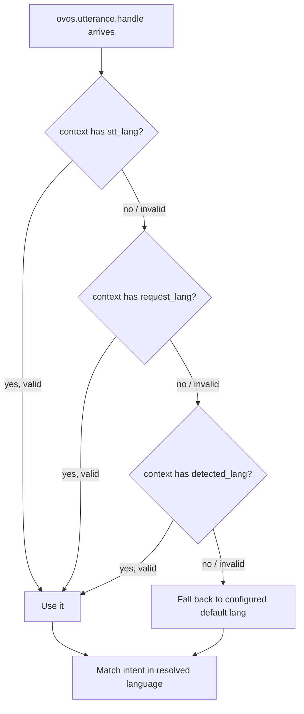

# Language Selection and Disambiguation

!!! success "Maturity: Mature ⬤⬤⬤⬤⬤"
    Long-lived, well-tested, and actively maintained. This is `ovos-core` internals. You can depend on it. Rated by [repository health](maturity.md), not version.

!!! tip "Just want to change your language?"
    See [Language Support](lang-support.md) instead. This page covers internals: how
    `ovos-core` picks a language for a given utterance internally, not how to configure one.

!!! abstract "In a nutshell"
    Every utterance carries a language tag (on the message `context`), and `ovos-core`
    resolves it from the most trustworthy source available, falling back to your configured
    default, before it tries to match an intent. If you only ever use one language, the
    default `lang` in `mycroft.conf` is all that matters, and you can skip the details below.

OpenVoiceOS is designed to be multi-language from the ground up. This page explains the technical logic used by `ovos-core` to determine which language should be used for a given user utterance.

To switch your assistant's language, set `lang` in `mycroft.conf` to the new default. To
understand a second language as well, without replacing the primary one, list it under
`secondary_langs`. See [Make It Yours](personalize.md#change-your-language) for the config
snippet. Everything below explains how `ovos-core` picks a language per utterance once
those keys are set.

The raw material for that decision is the session's six language signals — `lang`,
`secondary_langs`, `output_lang`, `stt_lang`, `request_lang` and `detected_lang` — plus the
per-payload `data.lang`. Each is defined in
[Session Aware Skills — Language signals](session.md#language-signals).

---

## The Disambiguation Logic

When an `ovos.utterance.handle` message (legacy: `recognizer_loop:utterance`) arrives on the
[messagebus](bus-service.md), `ovos-core` (specifically the `IntentService`) runs a
disambiguation routine to decide which language to use for intent matching.



*Diagram:* The flow starts when the utterance message arrives and ends at matching the intent in the resolved language, branching through stt_lang, request_lang, and detected_lang before falling back to the configured default.

*"Valid"* means the candidate passes against `valid_langs` via `closest_lang` (see below).
The service inspects the message's `context` dict and picks the **first** of these keys that
is present *and* resolves to a valid language:

| Priority | Context Key | Source |
|---|---|---|
| **1** | `stt_lang` | Set by the STT engine that transcribed the speech. |
| **2** | `request_lang` | Volunteered by the source (e.g., a per-wake-word `stt_lang` override — see [Wake Word Plugins](wake-word-plugins.md) — or a remote client). |
| **3** | `detected_lang` | Set by a [Transformer](transformer-plugins.md) plugin (e.g., a language classifier). |

The message language itself is resolved by `get_message_lang()`, which checks `message.data["lang"]` first and then `message.context["lang"]`. If neither is present, it falls back to the system `lang` from `mycroft.conf`.

### Validation against `valid_langs`

Each candidate above is validated against the enabled-language list before it is accepted. That list is taken from `message.context["valid_langs"]` if the source provided one, otherwise from `get_valid_languages()` (i.e. `lang` + `secondary_langs` in `mycroft.conf`). OVOS uses the `closest_lang` helper (from `ovos_spec_tools`) to find the closest match:

*   If a candidate matches an enabled language within a "distance" of `10` (standard regional difference, e.g. `en-au` ↔ `en-us`), that enabled language is used.
*   If a candidate does not match, it is **skipped** (a warning is logged) and the next priority key is tried.

---

## Language Helper Utilities

Developers should use the language helpers from **`ovos_spec_tools`** — `standardize_lang()`
(normalize a tag, e.g. `"en-us"` → `"en-US"`) and `closest_lang()` (pick the closest enabled
language). These are what `ovos-core` itself uses.

!!! note
    The older `ovos_utils.lang` helpers below (`standardize_lang_tag`, `get_language_dir`) are
    **deprecated** in favor of the `ovos_spec_tools` helpers above. They are documented here
    because existing skills still reference them.

### `standardize_lang_tag(lang_code, macro=True)`
Normalizes a language tag to a canonical form (e.g., `"en-us"` -> `"en-US"`). It is used internally to ensure comparisons are reliable. With `macro=True` it can also collapse a tag to its macro-language.

### `get_language_dir(base_path, lang="en-US")`
An important helper for [Skills](skill-design-guidelines.md). It scans a directory (like `locale/`) and returns the best matching subdirectory for the requested language, tolerating regional variations.

---

## Configuration Helpers

The `ovos-config` library (`ovos_config.locale`) provides helpers to retrieve language settings from `mycroft.conf`.

### `get_default_lang(config=None)`
Returns the primary language tag for the system (the `lang` key).

### `get_primary_lang_code(config=None)`
Returns just the two-letter primary code (e.g. `en`) rather than the full BCP-47 tag.

### `get_valid_languages()`
Returns the list of all enabled language tags (`lang` plus `secondary_langs`). This is what the Intent Service validates candidate languages against.

---

## Multilingual Intent Matching

If `multilingual_matching` is enabled under the `"intents"` section of `mycroft.conf`, the intent pipeline will retry matching the utterance against **all** configured languages when the primary disambiguated language fails to produce a match.

```json
{
  "intents": {
    "multilingual_matching": true
  }
}
```

This allows switching between languages without manual reconfiguration, at the cost of extra matching work per failed utterance.

---

*Source code: [OpenVoiceOS/ovos-core](https://github.com/OpenVoiceOS/ovos-core).*

---
**Read next:** [Customizing Language Resources](lang-customization.md)
**Related:** [Language Support Overview](lang-support.md) (incl. [switching an install's language](lang-support.md#auto-configuration)) · [Sessions (multi-user state)](session.md) · [Intent Service](intent-service.md)
