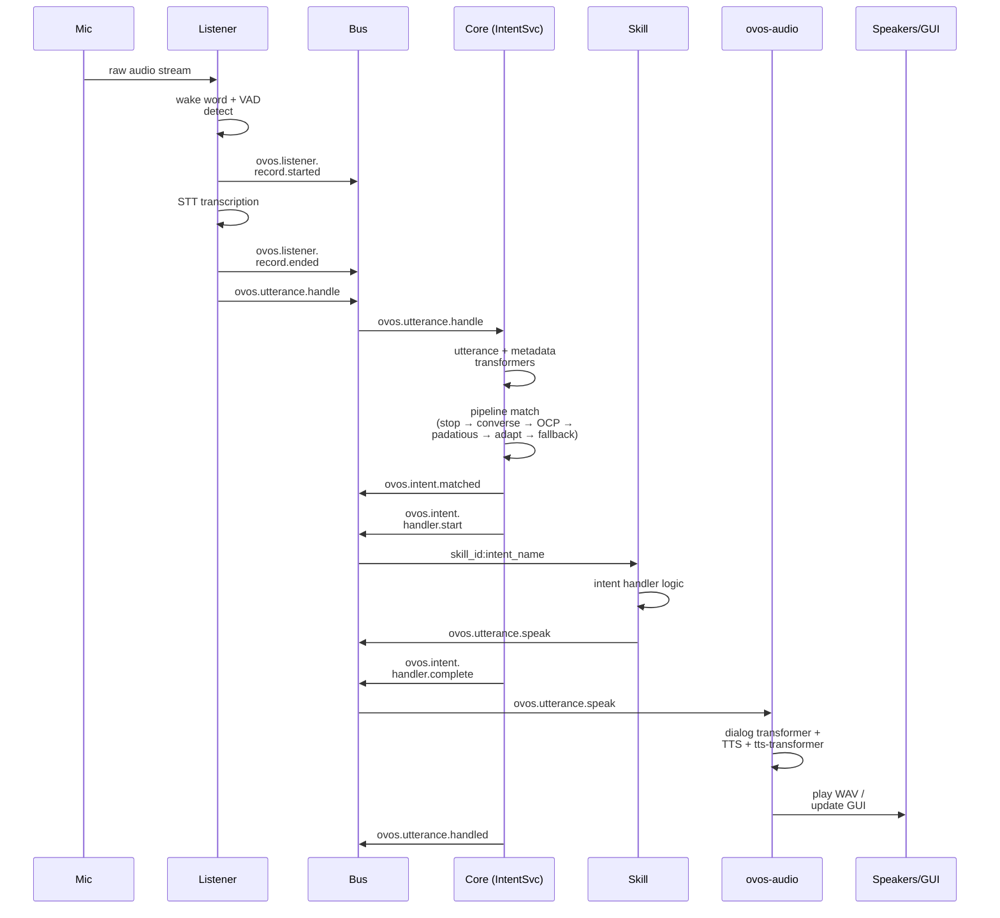

# The Life of an Utterance

!!! abstract "In a nutshell"
    This page follows a single spoken utterance on its whole journey through OpenVoiceOS, from
    the instant sound reaches the microphone to the moment you hear a reply. Along the way the
    system notices the wake word, records what you say, turns it into text, works out what you
    meant, does the task, and speaks back. It's a guided tour of the assembly line that handles
    everything you say to it. New to the terms here? Start with the [Glossary](glossary.md), or
    see the [Architecture Overview](architecture-overview.md) for the bigger picture.

??? info "📐 Formal specification"
    This whole journey is specified end-to-end. Audio capture, STT, and utterance dispatch come
    from **[OVOS-AUDIO-IN-1 — Audio Input Service](https://github.com/OpenVoiceOS/architecture/blob/dev/audio-in.md)**.
    The utterance lifecycle, matching, and dispatch come from
    **[OVOS-PIPELINE-1 — Utterance Lifecycle & Pipeline](https://github.com/OpenVoiceOS/architecture/blob/dev/pipeline-1.md)**.
    The enrichment and rewrite points along the way come from
    **[OVOS-TRANSFORM-1 — Transformer Plugins](https://github.com/OpenVoiceOS/architecture/blob/dev/transformer.md)**.
    Dialog, TTS, and playback come from
    **[OVOS-AUDIO-1 — Audio Output Service](https://github.com/OpenVoiceOS/architecture/blob/dev/audio-out.md)**.
    See also the [spec index](architecture-specs.md). Spec topic names are canonical below. The
    legacy name is noted once where current code still emits it.

This guide gives a technical, step-by-step walkthrough of how an utterance is processed by
OpenVoiceOS, from the moment sound hits the microphone to the final spoken response.

The sequence diagram below traces the same eight stages across the services and bus events involved:

*Diagram: a sequence from the microphone capturing raw audio through wake-word detection, STT, and the pipeline match (stop, converse, OCP, padatious, adapt, fallback) in ovos-core, to a skill's intent handler, TTS playback in ovos-audio, and the final ovos.utterance.handled event.*

---

## 1. Capture and [Wake Word](wake-word-plugins.md) Detection
**Service:** `ovos-dinkum-listener` (or similar)
**Input:** Raw audio from the microphone plugin.

The listener service is always active, monitoring a stream of audio.

-   **[VAD](vad-plugins.md) Plugin**: Continuously checks if someone is speaking.

-   **Wake Word Plugin**: Monitors the audio stream for the configured wake word (e.g., "Hey Mycroft").

-   **Trigger**: Once the wake word is detected, the listener begins recording the subsequent audio as a potential utterance.

---

## 2. [Speech-to-Text](stt-plugins.md) ([STT](stt-plugins.md))
**Service:** `ovos-dinkum-listener`
**Output:** `ovos.utterance.handle` (legacy: `recognizer_loop:utterance`) ([messagebus](bus-service.md))

Once the user stops speaking (detected by the VAD plugin), the recorded audio buffer is sent to the **STT Plugin**. Capture is bracketed by the listening-lifecycle signals `ovos.listener.record.started` / `ovos.listener.record.ended` (OVOS-AUDIO-IN-1 §6; legacy: `recognizer_loop:record_begin` / `record_end`).

-   The STT engine (e.g., Whisper, Google, Vosk) transcribes the audio into text. Before STT, the raw audio first passes through the **audio-transformer chain** (OVOS-TRANSFORM-1 §3.1).

-   The listener emits an `ovos.utterance.handle` message. This is the lifecycle entry point of [OVOS-PIPELINE-1 §9.1](https://github.com/OpenVoiceOS/architecture/blob/dev/pipeline-1.md), and it contains the transcription candidates in `data.utterances`.

---

## 3. Utterance and Metadata Transformation
**Service:** `ovos-core` ([Intent Service](intent-service.md)) — the **orchestrator**
**Bus Event:** `ovos.utterance.handle` (legacy: `recognizer_loop:utterance`)

The `IntentService` within `ovos-core` picks up the transcription. Before matching it to an intent, it passes it through two of the six [Transformer](transformer-plugins.md) chains ([OVOS-TRANSFORM-1](https://github.com/OpenVoiceOS/architecture/blob/dev/transformer.md)):

-   **Utterance Transformers** (§3.2): These can normalize the text (e.g., "42" -> "forty-two"), fix common STT errors, or expand abbreviations.

-   **Metadata Transformers** (§3.3): These can enrich the message context with information like the user's emotion or the current environmental noise level.

The entry message may carry no authoritative `lang`. This happens when the producer did not know the content language for certain, a common case for STT output. In that case, the orchestrator resolves the utterance's language **once**, from session evidence (user preference, lang-detect signals), and passes that resolved tag to every pipeline plugin's `match` call for this utterance. Pipeline plugins may refine the tag they receive (a multilingual matcher may detect a different content language), but they must not re-derive it independently from session evidence. A single resolution point keeps the whole match round matching in the same language, instead of leaving the outcome to an accident of pipeline ordering.

---

## 4. Intent Pipeline Matching
**Service:** `ovos-core` (Intent Service)
**Process:** Ordered evaluation of matchers.

The (potentially modified) utterance is now evaluated against the **Intent Pipeline**. The orchestrator calls each pipeline plugin's `match(utterances, lang, message)` in order and takes the **first** that returns a `Match`. This is **first-match-wins**, with no cross-plugin confidence scoring (OVOS-PIPELINE-1 §6.2). The sequence diagram above collapses this to one step (`stop → converse → OCP → padatious → adapt → fallback`). That shorthand names each matcher once. The pipeline is **configurable**, and the list below is the full expansion of the actual default order. See [Pipelines Overview](pipelines-overview.md) for the authoritative list and how to customize it. A single matcher (e.g. Adapt, Padatious) is often registered several times at decreasing internal-confidence tiers (high → medium → low). This is why those names appear interleaved through the list:

1.  **[Stop](stop-pipeline.md)**: "stop" / "cancel" is checked first so the assistant can always be interrupted.

2.  **[Converse](converse-pipeline.md)**: Active skills are given a chance to intercept the utterance (e.g., for multi-turn questions).

3.  **[Common Play](ocp-pipeline.md) ([OCP](ocp-pipeline.md))**: If the utterance sounds like a media request (e.g., "Play some jazz"), it's routed to OCP.

4.  **[Padatious](padatious-pipeline.md)**: Example-based matching for natural-language phrasings.

5.  **[Adapt](adapt-pipeline.md)**: Keyword/rule matching for direct commands.

6.  **[Fallback](fallback-pipeline.md)**: As a last resort, fallback skills (like LLM-based solvers) attempt to handle the utterance.

(Other matchers such as [Model2Vec](m2v-pipeline.md) and, if installed, [Common Query](cq-pipeline.md) for general-knowledge questions, slot into this order too — see [Pipelines](pipelines-overview.md) for the full default and how to customize it.)

Each `match` call is invoked directly inside a `try/except`. If a matcher **raises**, the orchestrator logs it and moves on to the next matcher as a no-match. A matcher that merely *hangs* (never returns, never raises) is a different story: keep matchers fast.

!!! warning "Operational limits"
    | Limit | Detail |
    |---|---|
    | Default pipeline order | See [Pipelines Overview](pipelines-overview.md) for the full default and how to customize it |
    | Per-match timeout | **None.** A hung matcher blocks the pipeline until it returns |
    | Handler timeout | 5 minutes by default (`intents.handler_timeout`). Bounds the *skill handler* invoked after a match, not the match calls themselves |
    | `websocket.shared_connection: true` (default) | `ovos-core` runs on a single shared bus connection, and that same thread services the bus. A hung matcher stalls the whole service |
    | Self-blocking `match()` calls | A matcher that does its own bus round-trip inside `match()` (e.g. a stop plugin gathering `stop.pong` replies) waits on the same thread that would deliver the replies. Such gather windows (e.g. the stop pipeline's ~0.5 s pong wait) are best-effort and typically time out rather than complete a live, serviced round trip. Only `websocket.shared_connection: false` gives skills their own connections and threads, and even then the orchestrator and pipeline plugins stay on the one shared bus |

---

## 5. [Skill](skill-design-guidelines.md) Execution
**Service:** A specific Skill (running in `ovos-core`)
**Bus Event:** `ovos.intent.matched`, `{skill_id}.activate`, and the specific intent dispatch message.

Once a match is found, the orchestrator post-processes it through the **intent-transformer chain** (OVOS-TRANSFORM-1 §3.4), emits `ovos.intent.matched` (§9.2), then dispatches to the winning skill on `<skill_id>:<intent_name>`. The orchestrator wraps that invocation in the **handler-lifecycle trio** `ovos.intent.handler.start` → `…complete` / `…error` (§8). `start` goes out immediately before the call, and exactly one terminal leg goes out immediately after it returns or raises. The handler is opaque to the trio. It may emit its own messages (e.g. `ovos.utterance.speak` when a skill calls `self.speak()`), but nothing it emits is part of the trio's bookkeeping. See [Intent Service](intent-service.md) for the exact mechanism.

A handful of intent names are **reserved**. A `Match` bearing one of them is a continuation or termination of an already-active skill's participation, not a fresh activation. So the dispatch does not push the skill onto `session.active_handlers` again. That suppression is keyed on **which pipeline plugin produced the match**. `ovos-core` checks whether the producing `pipeline_id` is one of the reserved-name pipeline roles (the converse / stop / fallback / common-query plugins) via `_produces_reserved_name(pipeline_id)`, and skips the `session.active_handlers` push for those, per OVOS-PIPELINE-1 §7.3.

-   The skill's **intent handler** is triggered.

-   The skill performs its logic (e.g., querying an API, controlling a device).

-   If the skill needs to respond, it calls `self.speak()` or `self.speak_dialog()`.

---

## 6. [Text-to-Speech](tts-plugins.md) ([TTS](tts-plugins.md))
**Service:** `ovos-audio`
**Bus Event:** `ovos.utterance.speak` (legacy: `speak`)

The skill emits an `ovos.utterance.speak` message containing the response text. This is the natural-language response exit point of the lifecycle (OVOS-PIPELINE-1 §9.6).

-   The `ovos-audio` service receives the message and runs the text through the **dialog-transformer chain** (OVOS-TRANSFORM-1 §3.5) before synthesis.

-   It sends the (transformed) text to the **TTS Plugin** (e.g., Piper, Mimic, Coqui) to generate a WAV file, then runs the audio through the **tts-transformer chain** (OVOS-TRANSFORM-1 §3.6). This dialog → TTS → tts-transformer → playback path is specified by [OVOS-AUDIO-1](https://github.com/OpenVoiceOS/architecture/blob/dev/audio-out.md).

-   It also requests **Visemes** (for lip-sync) from a **G2P Plugin**.

---

## 7. Audio Playback and GUI Updates
**Service:** `ovos-audio` and `ovos-gui`
**Output:** Sound from speakers and visuals on screen.

-   **Playback**: `ovos-audio` plays the generated WAV file through the configured audio output (e.g., ALSA, PulseAudio).

-   **GUI**: If the skill provided a UI (via `self.gui.show_page()`), the `ovos-gui` service renders the [QML](qt5-gui.md)/HTML view on the screen, often synchronized with the spoken response. ⚠️ The current ("legacy") [GUI](gui-service.md) is **deprecated**. There is no generally usable OVOS GUI (a replacement is in progress). The spoken response still works regardless.

---

## 8. [Session](session.md) Wrap-up
**Service:** `ovos-core` (Session Manager)

The lifecycle closes with exactly one `ovos.utterance.handled` event (OVOS-PIPELINE-1 §9.5). This is the universal end-marker that fires whether an intent matched, a fallback answered, or nothing claimed the utterance. Any `intent_context` entry may carry an optional per-entry `turns_remaining` field, a declared turn-budget stored alongside the time-based `timeout` (see [Session](session.md#intent-context)). Most entries instead decay purely on `timeout`. If the skill requested a follow-up question (e.g., `expect_response=True` / `listen=True`), the reply is spoken and the listener is reactivated **directly into recording**. The wake word is bypassed, so the cycle resumes at **Step 2** (recording → STT), not the wake-word gate of Step 1, with the current **Session** context preserved.

---

## Further reading

- [Pipelines Overview](pipelines-overview.md): the full default pipeline order and how to customize it.
- [Formal Specifications](architecture-specs.md): the OVOS-PIPELINE-1, OVOS-TRANSFORM-1, and companion specs cited throughout this page.
- [Voice-first](https://blog.openvoiceos.org/posts/2026-01-25-voice-first) — why the assistant's design centers this same utterance journey.

---
**Read next:** [MessageBus Service](bus-service.md) · [Security & Trust Model](security-model.md)
**Related:** [Speech Service](speech-service.md) · [Intent Service](intent-service.md) · [Audio Service](audio-service.md) · [Pipelines Overview](pipelines-overview.md)
