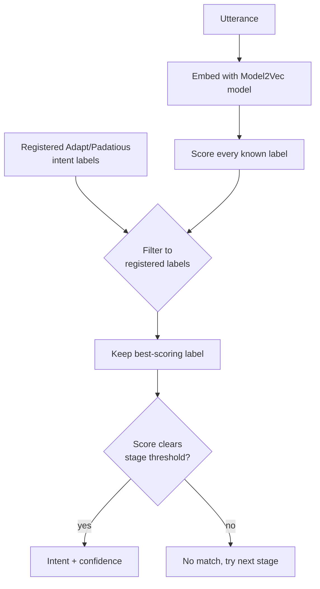

# Model2Vec Intent Pipeline

!!! note "Maturity — Beta ⬤⬤⬤◯◯"
    In real use but still settling — watch releases for the occasional breaking change. Rated by [repository health](maturity.md), not version.

!!! abstract "In a nutshell"
    This is another tool that figures out which skill should handle what you said. Instead of matching exact keywords or memorized examples, it compares the *meaning* of your words to the commands it knows. This means it can still understand you when you phrase things differently than expected. Think of it as recognizing that "turn the music down" and "lower the volume" are asking for the same thing. It is meant to work alongside the keyword-based [Adapt](adapt-pipeline.md) and example-based [Padatious](padatious-pipeline.md) tools, not replace them. See the [Glossary](glossary.md) for unfamiliar terms.

Shipped in the default pipeline.

The rest of this page is for people deploying or customizing OVOS. If you only wanted to know what this stage does, you are done.

??? info "📐 Formal specification"
    Model2Vec is a **pipeline plugin** under **[OVOS-PIPELINE-1 — Utterance Lifecycle & Pipeline](https://github.com/OpenVoiceOS/architecture/blob/dev/pipeline-1.md)**. It serves the same **template-intent** role as Padatious in **[OVOS-INTENT-3 — Intent Definition §5](https://github.com/OpenVoiceOS/architecture/blob/dev/intent-3.md)**: a classifier paired with a slot extractor (INTENT-3 §6.2). Only the matching strategy (static embeddings) differs, and INTENT-3 §8 leaves that strategy unconstrained. Skill resources are written in the **[OVOS-INTENT-1 grammar](https://github.com/OpenVoiceOS/architecture/blob/dev/intent-1.md)**. See the [spec index](architecture-specs.md).

The **Model2Vec Intent Pipeline** matches utterances to skill intents using
[Model2Vec](https://github.com/MinishLab/model2vec) static embeddings instead of
deterministic parsers. Where Adapt looks for keywords and Padatious learns from
example sentences, this pipeline embeds the utterance as a vector and picks the
closest known intent. That makes it more forgiving of paraphrases and word order,
and it works across languages when a multilingual model is used.

It is meant to **augment** Adapt and Padatious, not replace them. Put a Model2Vec
matcher in your pipeline alongside the others and let confidence ordering decide.

---

## Quick start

Install the plugin:

```bash
pip install ovos-m2v-pipeline
```

Add a matcher to your pipeline in `mycroft.conf`:

```json
{
  "intents": {
    "ovos-m2v-pipeline": {
      "model": "Jarbas/ovos-model2vec-intents-LaBSE"
    },
    "pipeline": [
      "ovos-converse-pipeline-plugin",
      "ovos-padatious-pipeline-plugin-high",
      "ovos-adapt-pipeline-plugin-high",
      "ovos-m2v-pipeline-high",
      "ovos-fallback-pipeline-plugin-low"
    ]
  }
}
```

That is enough to get going. The model is downloaded from Hugging Face on first
run. The sections below cover how matching works and how to tune it.

---

## How it works

The plugin (`Model2VecIntentPipeline`) is a `ConfidenceMatcherPipeline`, so it
exposes three confidence tiers, `match_high`, `match_medium`, and `match_low`, that
become the pipeline matcher IDs `ovos-m2v-pipeline-high` / `-medium` / `-low`.

For an utterance it:

1. Embeds the text with the configured Model2Vec model.
2. Scores every label the model knows about.
3. Keeps only labels that belong to **currently registered** Adapt/Padatious
   intents (the pipeline tracks them over the bus via
   `intent.service.adapt.manifest` / `intent.service.padatious.manifest` and the
   `register_intent` / `padatious:register_intent` / `detach_intent` /
   `detach_skill` events). Three special labels, `ocp:play`,
   `common_query:common_query`, and `stop:stop`, are also allowed, but only when the
   corresponding downstream pipeline (`ovos-ocp-pipeline-plugin`,
   `ovos-common-query-pipeline-plugin`, `ovos-stop-pipeline-plugin`) is present in
   the session's pipeline list.
4. Returns the highest-scoring label as an `IntentHandlerMatch` if its score
   clears the tier threshold (`conf_high` / `conf_medium` / `conf_low`).

Because matching is restricted to intents that are actually loaded, the model can
ship knowledge of many skills without firing for skills you do not have installed.

A label registered with `requires_context` or `excludes_context` is gated the same way
whether it came from a padatious registration or an INTENT-4 template: the pipeline checks
the declared context before accepting the label as a match, not just the confidence score.

!!! note "Model2Vec classifies; it does not extract `{slot}` values from the utterance"
    A `.intent` sample can declare `{slot}` placeholders, but Model2Vec never parses them out
    of the spoken utterance the way Padatious and Padacioso do. It only fills a label's
    declared `{slot}` placeholders from `session.intent_context` (OVOS-CONTEXT-1 §7). A skill
    whose `.intent` files rely on `{slot}` extraction from the utterance itself still needs
    Padatious or Padacioso in the pipeline ahead of Model2Vec to populate those values.
    Model2Vec alone matches the intent but leaves any unfilled placeholder as a literal
    `{slot}` string.



*Diagram: the utterance is embedded, scored against every label the model knows, filtered down to labels that are actually registered by loaded skills, and the best surviving label is accepted only if it clears the current stage's threshold.*

---

## Two operating modes

The pipeline has a `mode` config key:

* **`classifier`** (default): loads a `StaticModelPipeline` (embedding model plus
  a trained linear classifier head). Scores are softmax probabilities. This is the
  mode used by the published `Jarbas/ovos-model2vec-intents-*` models.
* **`prototype`**: loads a bare `StaticModel` (embeddings only, no trained head)
  and builds a prototype store from the example utterances skills provide when
  they register Padatious intents. Scores are cosine similarities. Adapt intents
  (which have no example sentences) are tracked by name but not matched in this
  mode. An unchanged registration is loaded from an on-disk cache instead of
  re-encoded on every boot; the cache clears itself when a skill or intent
  detaches (see `prototype_cache` below).

A second entry point, `ovos-m2v-prototype-pipeline`
(`Model2VecPrototypePipeline`), is the prototype mode exposed as a standalone
plugin so it can run alongside the classifier one. It reads its config from
`intents.ovos-m2v-prototype-pipeline`.

---

## Configuration

```json
{
  "intents": {
    "ovos-m2v-pipeline": {
      "model": "Jarbas/ovos-model2vec-intents-LaBSE",
      "mode": "classifier",
      "conf_high": 0.7,
      "conf_medium": 0.5,
      "conf_low": 0.15,
      "ignore_intents": []
    }
  }
}
```

| Key | Default | Description |
|-----|---------|-------------|
| `model` | `OpenVoiceOS/ovos-m2v-intents-multilingual` (`DEFAULT_MULTILINGUAL`, used when no `models` entry matches the language) | Local path or Hugging Face repo of the Model2Vec model; an explicit value always wins over any per-language default. See `models` below for a per-language override map. |
| `models` | *(unset)* | `{locale_or_lang: repo_id}` map, matched first against the full locale (`"pt-BR"`), then against the primary subtag (`"pt"`); case-insensitive. Falls back to a built-in per-language default table, then to `model`/`DEFAULT_MULTILINGUAL` if no entry matches. |
| `mode` | `classifier` | `classifier` (trained head, softmax) or `prototype` (runtime prototypes, cosine). |
| `conf_high` | `0.7` | Threshold for `match_high`. |
| `conf_medium` | `0.5` | Threshold for `match_medium`. |
| `conf_low` | `0.15` | Threshold for `match_low`. |
| `ignore_intents` | `[]` | Intent labels to never match. |
| `renormalize` | `false` | Classifier mode: renormalize probabilities over the surviving (registered) labels. |
| `timeout` | `1` | Seconds to wait for the Adapt/Padatious manifest sync at startup. |

Prototype mode adds six more keys controlling how prototype embeddings are
selected per label and cached on disk:

| Key | Default | Description |
|-----|---------|-------------|
| `prototype_k` | unlimited | Cap on stored prototype embeddings per label (subsample/cluster via `prototype_strategy`). |
| `prototype_strategy` | `max_over_all` | How utterance embeddings are reduced to per-label prototypes. |
| `prototype_top_k` | `3` | Number of best prototype matches aggregated per label. |
| `prototype_tau` | `0.1` | Softmax temperature for prototype score aggregation. |
| `prototype_cache` | `true` | Cache encoded prototypes on disk per skill, keyed on the registration's example utterances, instead of re-encoding on every boot. |
| `prototype_cache_dir` | `{XDG_DATA_HOME}/mycroft/m2v_prototypes/` | Where the per-skill cache files live. |

> The model is **pretrained**. It does not learn new skills at runtime. The
> registered-intent filter just decides which of the model's known labels are
> eligible. In prototype mode the store is rebuilt at runtime, but only from the
> example utterances Padatious skills provide.

---

## Models

Two families are published on Hugging Face:

* **Multilingual**: distilled from LaBSE, larger, supports many languages and
  partially translated skills (as long as their **dialogs** are localized).
* **Language-specific**: roughly 10x smaller and nearly as accurate for a single
  language, well suited to constrained hardware (e.g. Raspberry Pi).

Browse them here:
[OVOS Model2Vec Models on Hugging Face](https://huggingface.co/collections/Jarbas/ovos-model2vec-intents-681c478aecb9979e659b17f8)

The models are trained on aggregated intent examples: LLM-augmented OVOS
utterances, music-query templates, and per-language skill intents.

---

## Training your own model

!!! warning "Training is currently on hold"
    Upstream `.intent`-scheme refactors (renamed/merged intents across the
    default skills) mean a classifier's frozen label head goes stale the day
    those land. Build the dataset and read the manifest freely; run `train.py`
    only once the refactors are merged and `sources.yaml`'s pins are
    regenerated against them.

The published `Jarbas/ovos-model2vec-intents-*` models are built from a
`train/` toolchain shipped inside the `ovos-m2v-pipeline` source repository
(it is not part of the installed pip package):

```
train/
├── sources.yaml        # every source, pinned to an immutable revision
├── build_dataset.py    # resolve, normalise, dedup, split, write the manifest
├── train.py            # fit a classifier on the built corpus
├── distill.py          # distill a Sentence Transformer into a Model2Vec base
└── predict.py           # inference smoke test
```

1. **Build the dataset**: `python train/build_dataset.py --workspace <repos> --out train/dataset`
   resolves every pinned source in `sources.yaml`, deduplicates rows, and
   writes `train.parquet`/`test.parquet` (plus JSONL twins), `labels.json`,
   and `manifest.json`. Labels are `<skill_id>:<intent_name>`, exactly as the
   pipeline registers them at runtime. A pinned revision that has moved fails
   the build rather than quietly changing the corpus.
2. **Train**: `python train/train.py --dataset train/dataset --base-model <model>`
   fits a classifier on the built corpus.
3. **Optional distillation**: `distill.py` turns a Sentence Transformer that
   has no Model2Vec distillate yet into a usable base model.
4. **Smoke-test**: `predict.py` runs inference against a saved model before
   publishing it.

Point the plugin's `model` config key at your own Hugging Face repo or a local
path to the saved pipeline directory once you are happy with it. See the
`ovos-m2v-pipeline` repository's own `docs/training.md` and `docs/labels.md`
for the full dataset schema, label scheme, and script options.

A separate, exploratory notebook trio covers the same ground interactively —
benchmarking, monolingual, and multilingual classifier training — in
[`m2v/`](https://github.com/TigreGotico/ml-notebooks) under `TigreGotico/ml-notebooks`.
It is not the canonical `train/` toolchain above; use it for experimentation, not
for producing the published `Jarbas/ovos-model2vec-intents-*` models.

---

## Gotcha: ordering against the deterministic engines

Model2Vec generalizes well. This also means it can claim an utterance a more
precise parser would have nailed. The usual setup is to place
`ovos-m2v-pipeline-high` after the high tiers of Padatious/Adapt (or interleaved by
confidence) so exact matches win first and Model2Vec catches the paraphrases the
others miss. Tune `conf_high`/`conf_medium`/`conf_low` to control how aggressive it
is.

Do not copy Padatious's confidence thresholds over verbatim. The two engines score
completely differently, and the two Model2Vec modes also score differently from each
other. `classifier` mode's scores are softmax probabilities out of a trained head.
`prototype` mode's scores are raw cosine similarities against stored example embeddings.
Retune `conf_high`, `conf_medium`, and `conf_low` for whichever mode you run.

---
**Read next:** [Padacioso](padacioso.md)
**Related:** [Padatious Pipeline](padatious-pipeline.md) · [Adapt Pipeline](adapt-pipeline.md) · [Transformers Overview](transformer-plugins.md)
