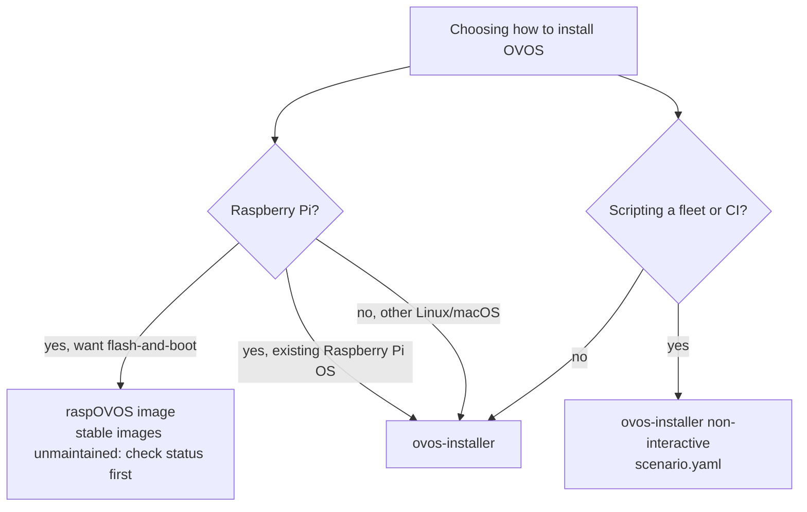

# How to Install Open Voice OS with the `ovos-installer`

This is the quick-start guide for installing Open Voice OS (OVOS) using the official `ovos-installer`. This guide covers **Raspberry Pi** and **desktop/server** Linux environments. The steps are mostly the same on a headless Raspberry Pi and on a laptop. Only the way you connect to the device differs.

!!! abstract "In a nutshell"
    This is the guided way to get OVOS onto your machine. You run a single command. Then a
    menu-driven wizard walks you through a few choices (your language, where to install,
    which features you want) and does the rest for you.

    It works the same on a Raspberry Pi or a Linux laptop, and it is the recommended way to
    install. It needs no programming. To script a fleet instead, see the
    [non-interactive scenario install](#non-interactive-scenario-install), which skips the
    wizard entirely. See the [Glossary](glossary.md) for unfamiliar terms.



*Diagram:* The decision starts at choosing how to install OVOS and ends at the ovos-installer, raspOVOS image, or non-interactive scenario install, branching on whether the target is a Raspberry Pi or a fleet/CI scripting scenario.

!!! note "Before you start"
    **What a default install sends over the network.** A default OVOS install talks to public,
    community-run servers for speech-to-text and text-to-speech unless you change it. The
    installer also asks you to opt into two separate telemetry reports along the way. See
    [Privacy & Security](privacy-security.md) for exactly what that means, and the
    [telemetry section](ovos-installer-scenarios.md#anonymous-telemetry) for what each prompt does and covers. If
    you're unsure about either prompt, declining is always safe. Nothing else about the install
    depends on them.

    **Looking for a no-terminal option?** The **[raspOVOS](install-raspovos.md)** image is the
    flash-and-boot alternative: no terminal, no SSH. Its **stable** images date from mid-2025
    and are not receiving updates (the newer DEV builds on its
    [releases page](https://github.com/OpenVoiceOS/raspOVOS/releases) are untested
    work-in-progress toward a refreshed image), so check status before choosing it. This
    installer is the supported route meanwhile, and the recommended path on the Pi and
    everywhere else.

    **This runs over SSH in a terminal, not an app.** There's no phone app or setup wizard with a
    graphical pairing flow. You type commands into a terminal, usually over SSH into a headless
    device. If you've never used SSH before, budget some extra time to get comfortable with it,
    or consider the [raspOVOS](install-raspovos.md) image (see its status note above) which boots
    into a working assistant with no SSH step.

    **Exotic hardware.** Some hardware (like ReSpeaker microphones or certain audio HATs) may
    require extra configuration. The installer aims for wide compatibility, but specialized
    setups might need some manual intervention.

---

## Step-by-step Installation

### 1. Connect to Your Device *(if remote)*

If you're installing on a headless device (like a Raspberry Pi), you first need its IP address
or hostname. Try `raspberrypi.local` (the default mDNS hostname on a fresh Raspberry Pi OS
install), or look up the device's IP in your router's connected-devices list if that doesn't
resolve. Then connect via SSH:

```bash
ssh -l your-username <your-device-ip-or-raspberrypi.local>

```

---

### 2. Update Package Metadata

Make sure your package manager is up to date:

```bash
sudo apt update

```

---

### 3. Install Prerequisites

Install `git` and `curl`. These are required to run the installer:

```bash
sudo apt install -y git curl

```

---

### 4. Run the OVOS Installer

Now you're ready to start the installation process:

This is the official `ovos-installer` script, straight from the project's `main` branch. You
can read it yourself first at
[raw.githubusercontent.com/OpenVoiceOS/ovos-installer/main/installer.sh](https://raw.githubusercontent.com/OpenVoiceOS/ovos-installer/main/installer.sh)
before running it. Two ways to run it are shown below. **Do one or the other, not both.
They install the same thing.**

To read the script before it runs, download it first and execute the copy you reviewed:

```bash
curl -fsSL https://raw.githubusercontent.com/OpenVoiceOS/ovos-installer/main/installer.sh -o installer.sh
less installer.sh
sudo sh installer.sh
```

!!! warning "Piping straight to root, without reading it first"
    The one-liner below runs as **root** and executes whatever the `main` branch of
    `ovos-installer` currently holds. It is not pinned to a release, and you never see the
    script before it runs with root privileges. Prefer the download-then-inspect version above
    unless you're already comfortable with that trade-off.

    ```bash
    sudo sh -c "$(curl -fsSL https://raw.githubusercontent.com/OpenVoiceOS/ovos-installer/main/installer.sh)"
    ```


---

## What Happens Next?

Once you run the script, the installer will:

- Perform system checks


- Install dependencies (Python, Ansible, etc.)


- Launch a **text-based user interface (TUI)** to guide you through the setup

This can take anywhere from **5 to 20 minutes**, depending on your hardware, internet speed, and storage performance. Now let's walk through the installer screens!

---

## The Installer Wizard

The wizard walks you through language, installation method, release channel, profile,
feature selection, Raspberry Pi tuning, a summary, and two telemetry prompts, before it
starts installing. For a screen-by-screen walkthrough of each of those prompts, with
screenshots, see [The `ovos-installer` Wizard, Screen by Screen](ovos-installer-scenarios.md).

!!! tip "Scripting this instead?"
    Everything the wizard asks can be answered up front in a
    [scenario file](#non-interactive-scenario-install), so the installer runs
    with no prompts at all. Useful for fleets or CI.

---

## Installation Complete!

OVOS is now installed and ready to use. Try saying things like:

- "What's the weather?"


- "Tell me a joke."


- "Set a timer for 5 minutes."


!!! tip "Say the wake word first"
    OVOS only starts listening after it hears its wake word (`hey mycroft` by
    default). Say **"Hey Mycroft"** and wait for the listening sound/prompt
    before speaking your request. A bare "What's the weather?" with no wake
    word first won't be heard. See [Wake-word plugins](wake-word-plugins.md)
    if you want to change it.

---

## Post-install tuning

The installer picks sensible defaults, but the best speech plugins vary by language and hardware. After the initial install, review the selected plugins and run `ovos-config autoconfigure --help` to see the language-aware reconfiguration options. Note that the default STT/TTS plugins talk to public community-run servers rather than running locally. See [Privacy & Security](privacy-security.md#network-surface-of-a-default-install) for exactly what that means and how to switch to an offline or self-hosted plugin.

The recording below shows this post-install tuning step in action: the operator runs
`ovos-config autoconfigure` in a terminal, the tool prints the recommended STT/TTS plugins
for the configured language, and the operator confirms to write them into `mycroft.conf`.

[](https://asciinema.org/a/710295)


---

## Non-interactive (scenario) install

For scripting or fleet deployment, the installer can run without the TUI by reading a
scenario file from `~/.config/ovos-installer/scenario.yaml`. Example (Docker
containers on a Raspberry Pi with default skills):

```yaml
---
uninstall: false
method: containers       # or "virtualenv"
channel: testing         # or "alpha"
profile: ovos
features:
  skills: true
  extra_skills: false
raspberry_pi_tuning: true
share_telemetry: false        # one-time install report, see Privacy & Security
share_usage_telemetry: false  # ongoing intent-matching reports, kept separate on purpose
```

Key options:

| Key | Meaning |
| --- | --- |
| `uninstall` | `true` to uninstall instead of install |
| `method` | `containers` (Docker) or `virtualenv` (Python virtual environment) |
| `channel` | Release channel: `testing` or `alpha` |
| `profile` | Installation profile (e.g. `ovos`) |
| `features.*` | Per-feature toggles (e.g. `skills`, `extra_skills`, `llm`) |
| `raspberry_pi_tuning` | Enable Raspberry Pi performance tuning (includes an overclock prompt) |
| `share_telemetry` | One-time install report, sent once when the install finishes ([details](ovos-installer-scenarios.md#anonymous-telemetry)) |
| `share_usage_telemetry` | Configures the *installed, running* assistant to keep reporting intent-matching data afterwards. Not a one-time report ([details](ovos-installer-scenarios.md#anonymous-telemetry)) |

All of `uninstall`, `method`, `channel`, `profile`, `features`, `raspberry_pi_tuning`,
`share_telemetry`, and `share_usage_telemetry` are **required**. The installer
refuses an incomplete scenario file.

Ready-made example scenarios live in the
[`scenarios/`](https://github.com/OpenVoiceOS/ovos-installer/tree/main/scenarios)
directory of the repository.

> 💡 **LLM and Home Assistant features.** Setting `features.llm: true` enables the OVOS
> Persona LLM fallback and requires the `llm.api_url`, `llm.key`, `llm.model`, and
> `llm.persona` keys (an OpenAI-compatible endpoint). Three optional tuning keys,
> `llm.max_tokens`, `llm.temperature`, and `llm.top_p`, are also accepted. A Home Assistant
> feature also exists, but has no `homeassistant.*` scenario keys: set
> `features.homeassistant: true` AND export the environment variables
> `HOMEASSISTANT_URL` and `HOMEASSISTANT_API_KEY` before running the installer,
> or the integration is enabled with empty settings. **macOS** is supported with `launchd` service management, but only with the
> `virtualenv` method and the `alpha` channel.

> 💡 **Satellite profile.** Deploying `profile: satellite` non-interactively requires a
> `hivemind:` block giving the connection details to the OVOS core it pairs with:
> `hivemind.host`, `hivemind.port`, `hivemind.key`, and `hivemind.password`:
>
> ```yaml
> profile: satellite
> hivemind:
>   host: 192.168.100.50
>   port: 5678
>   key: 95b774f1e85c2ea8e8a80ac2c5d09c6b
>   password: 255203b3c8a7e59de1d60441a55d4f48
> features:
>   skills: false
>   extra_skills: false
> ```

---

## Troubleshooting

> Something went wrong?

If the installer fails, it generates a log file and offers to upload it to [paste.uoi.io](https://paste.uoi.io) (it asks before uploading). Share that link on **[OVOS Chat on Matrix](https://matrix.to/#/!XFpdtmgyCoPDxOMPpH:matrix.org?via=matrix.org)** so the community can help you.

OVOS is a community-driven project, maintained by volunteers. Feedback, bug reports, and patience are welcome.

!!! tip "Check the install without reading logs"
    Run `systemctl --user status ovos.service` to see whether each unit came up cleanly; it
    cascades to the individual OVOS services (`PartOf=ovos.service`). Check that before digging
    through logs.

    A healthy unit reads:

    ```text
    ● ovos.service - OVOS
         Loaded: loaded (/home/ovos/.config/systemd/user/ovos.service; enabled; preset: enabled)
         Active: active (running) since ...
    ```

    `Active: failed`, `activating (auto-restart)`, or a `Loaded: ... disabled` line each mean
    something is wrong. `active (running)` is the only pass. See
    [Production Operations](production-operations.md#knowing-when-the-assistant-is-actually-ready)
    for the readiness pattern and the full unit list.

---

**Read next:** [Make it yours](personalize.md) · [RaspOVOS image](install-raspovos.md)
**Related:** [Manual & Advanced Install](release-channels.md) · [It's not behaving](everyday-help.md) · [Troubleshooting & Debugging](troubleshooting.md) · [Boring installs, now on macOS](https://blog.openvoiceos.org/posts/2026-03-05-ovos-installer-macos-intel-apple-silicon)
