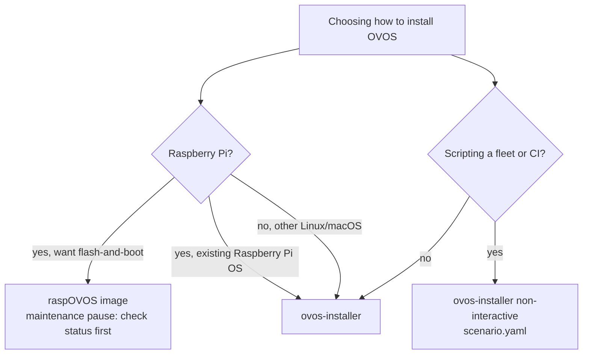

# How to Install Open Voice OS with the `ovos-installer`

If you have a spare Raspberry Pi and want the zero-terminal experience, use
**[raspOVOS](install-raspovos.md)** image exists as a flash-and-boot alternative, but it is in a maintenance pause, so the installer is the recommended path on the Pi too. Keep reading here if you're on
non-Pi hardware or installing onto an existing Raspberry Pi OS setup.

!!! abstract "In a nutshell"
    This is the guided way to get OVOS onto your machine. You run a single command. Then a
    menu-driven wizard walks you through a few choices (your language, where to install,
    which features you want) and does the rest for you.

    It works the same on a Raspberry Pi or a Linux laptop, and it is the recommended way to
    install. It needs no programming. To script a fleet instead, see the
    [non-interactive scenario install](#non-interactive-scenario-install), which skips the
    wizard entirely. See the [Glossary](glossary.md) for unfamiliar terms.



*Diagram:* The decision starts at choosing how to install OVOS and ends at the ovos-installer, raspOVOS image, or non-interactive scenario install, branching on whether the target is a Raspberry Pi or a fleet/CI scripting scenario.

!!! note "Read this before you start: what a default install sends over the network"
    A default OVOS install talks to public, community-run servers for speech-to-text and
    text-to-speech unless you change it. The installer also asks you to opt into two separate
    telemetry reports along the way. See [Privacy & Security](privacy-security.md) for exactly
    what that means, and the [telemetry section below](#anonymous-telemetry) for what each
    prompt does and covers. If you're unsure about either prompt, declining is always safe.
    Nothing else about the install depends on them.

!!! tip "Looking for a no-terminal option?"
    The **[raspOVOS](install-raspovos.md)** image is the flash-and-boot alternative:
    no terminal, no SSH. Its images are in a maintenance pause, so check its status
    before choosing it. This installer is the recommended path on the Pi and everywhere
    else.

!!! note "This runs over SSH in a terminal, not an app"
    There's no phone app or setup wizard with a graphical pairing flow. You type commands into
    a terminal, usually over SSH into a headless device. If you've never used SSH before, budget
    some extra time to get comfortable with it, or consider the
    [raspOVOS](install-raspovos.md) image (see its status note) which boots into a working
    assistant with no SSH step.

This is the quick-start guide for installing Open Voice OS (OVOS) using the official `ovos-installer`. This guide covers **Raspberry Pi** and **desktop/server** Linux environments. The steps are mostly the same on a headless Raspberry Pi and on a laptop. Only the way you connect to the device differs.

> ⚠️ Note: Some "exotic" hardware (like ReSpeaker microphones or certain audio HATs) may require extra configuration. The installer aims for wide compatibility, but specialized setups might need some manual intervention.

> 💡 On a Raspberry Pi, run the `ovos-installer` against an existing Raspberry Pi OS
> install (this guide, the recommended route). The **[raspOVOS](install-raspovos.md)**
> boot-and-go image is an alternative once its maintenance pause ends. On any other
> Linux hardware, use the `ovos-installer`.

---

## Step-by-step Installation

### ✅ 1. Connect to Your Device *(if remote)*

If you're installing on a headless device (like a Raspberry Pi), you first need its IP address
or hostname. Try `raspberrypi.local` (the default mDNS hostname on a fresh Raspberry Pi OS
install), or look up the device's IP in your router's connected-devices list if that doesn't
resolve. Then connect via SSH:

```bash
ssh -l your-username <your-device-ip-or-raspberrypi.local>

```

---

### 🔄 2. Update Package Metadata

Make sure your package manager is up to date:

```bash
sudo apt update

```

---

### 📦 3. Install Prerequisites

Install `git` and `curl`. These are required to run the installer:

```bash
sudo apt install -y git curl

```

---

### 📥 4. Run the OVOS Installer

Now you're ready to start the installation process:

This is the official `ovos-installer` script, straight from the project's `main` branch. You
can read it yourself first at
[raw.githubusercontent.com/OpenVoiceOS/ovos-installer/main/installer.sh](https://raw.githubusercontent.com/OpenVoiceOS/ovos-installer/main/installer.sh)
before running it. Two ways to run it are shown below. **Do one or the other, not both.
They install the same thing.**

To read the script before it runs, download it first and execute the copy you reviewed:

```bash
curl -fsSL https://raw.githubusercontent.com/OpenVoiceOS/ovos-installer/main/installer.sh -o installer.sh
less installer.sh
sudo sh installer.sh
```

!!! warning "Piping straight to root, without reading it first"
    The one-liner below runs as **root** and executes whatever the `main` branch of
    `ovos-installer` currently holds. It is not pinned to a release, and you never see the
    script before it runs with root privileges. Prefer the download-then-inspect version above
    unless you're already comfortable with that trade-off.

    ```bash
    sudo sh -c "$(curl -fsSL https://raw.githubusercontent.com/OpenVoiceOS/ovos-installer/main/installer.sh)"
    ```


---

## What Happens Next?

Once you run the script, the installer will:

- Perform system checks


- Install dependencies (Python, Ansible, etc.)


- Launch a **text-based user interface (TUI)** to guide you through the setup

This can take anywhere from **5 to 20 minutes**, depending on your hardware, internet speed, and storage performance. Now let's walk through the installer screens!

---

## The Installer Wizard

!!! tip "Scripting this instead?"
    Everything below can be answered up front in a
    [scenario file](#non-interactive-scenario-install), so the installer runs
    with no prompts at all. Useful for fleets or CI.

Navigation:

- navigation is done via arrow keys


- pressing space selects options in the lists


    - eg. when selecting `virtualenv` or `containers`


- pressing tab will switch between the options and the `<next>`/`<back>` buttons


- pressing enter will execute the highligted `<next>`/`<back>` option

---

### 🌍 Language Selection

The first screen lets you select your preferred language for the installer's own text, not
the assistant's spoken language. See [Language Support](lang-support.md) for how the
assistant's language is actually chosen.

Setting the global `lang` key is enough on its own. STT, TTS, and plugins follow it
automatically. `ovos-config autoconfigure` can also swap in the recommended plugins and
voices for that language.

Follow the on-screen instructions. Use arrow keys and space to pick.


---

### 🧠 Environment Summary

An informational screen. No action needed. It reports what the installer auto-detected about the machine, including:

`OS`
:   distribution name and version (e.g. Debian, Ubuntu, macOS)

`Kernel`
:   kernel version string

`Raspberry Pi model`
:   detected board, or `N/A` on non-Pi hardware

`Python`
:   detected Python interpreter version

`CPU capability`
:   whether the CPU supports AVX2/SIMD (affects which speech plugins are offered)

`Sound server`
:   PulseAudio or PipeWire, if detected

`Display server`
:   X11, Wayland, or `EGLFS` (used on Mark II/DevKit), if any

If the board looks like a Mycroft Mark II or DevKit (Raspberry Pi 4 plus the
matching audio/I²C hardware), a confirmation prompt asks you to verify that.
Some generic HATs expose the same signal without being real Mark II hardware.


---

### 🧰 Choose Installation Method

A radio-button list with up to two options:

`virtualenv`
:   Python virtual environment. Recommended for most users. Supported everywhere, including macOS.

`containers`
:   Docker (or Podman) containers. Installed automatically if Docker is missing. **Not offered** on macOS, on 32-bit CPUs, on Raspberry Pi 3, or on Mark II/DevKit hardware. Those are locked to `virtualenv`.

If you're re-running the installer on an existing install, only the method
already in use is offered (you can't switch method in place).


---

### 🌱 Choose Channel

`testing`
:   Recommended for most users. The stable release channel.

`alpha`
:   Bleeding-edge/pre-release packages. **Required** (and the only option offered) on macOS and on Mark II/DevKit hardware.


---

### 🧪 Choose Profile

A radio-button list of installation profiles:

`ovos`
:   The classic, all-in-one experience. Voice pipeline, skills, and (optionally) GUI all run locally. It is the default and the profile the rest of this page assumes.

`satellite`
:   A microphone/speaker endpoint that talks to a separate OVOS core over the network. See [composable deployments](composable-deployments.md). It skips the feature-selection screen (no local skills/GUI/LLM/Home Assistant to configure), but adds four HiveMind connection prompts: host, port, access key, and password.

`listener`
:   Runs only the listening/wake-word side of OVOS.

`server`
:   A headless core with no local audio hardware assumptions, meant to serve satellites. It also skips GUI/LLM/Home Assistant options.


---

### 🛠️ Feature Selection

A checklist (only shown for the `ovos`/`listener`/`server` profiles, not `satellite`):

`skills`
:   Install the default OVOS skills. **On** by default.

`extra-skills`
:   Install additional community skills beyond the default set. Off by default.

`gui`
:   Enable the OVOS GUI. Only offered on Mark II/DevKit hardware running Debian Trixie (or newer). On those devices it defaults **on**. Not offered on the `server`/`satellite` profiles.

`homeassistant`
:   Enable Home Assistant integration. Prompts for a URL and access token. Only offered for the `ovos`/`listener` profiles with the `virtualenv` or `containers` method.

`llm`
:   Enable an LLM-backed fallback answer via the OVOS Persona pipeline. Prompts for an OpenAI-compatible API URL, key, model, and persona name. Same availability rule as `homeassistant`.


> ⚠️ Note: Some features (like the GUI) may be unavailable on lower-end hardware like the Raspberry Pi 3B+.

---

### 🍓 Raspberry Pi Tuning *(if applicable)*

On Raspberry Pi boards only, a yes/no prompt offers system performance tweaks
(including an overclock option on supported boards). It's highly recommended
to enable this on a Pi.


---

### 🧾 Summary

Before the installation begins, you'll see a summary of every option you
selected on the previous screens (method, channel, profile, features, tuning).
This is your last chance to cancel the process.


---

### 📊 Anonymous Telemetry

!!! tip "If you're unsure, decline both"
    Declining both prompts changes nothing about how OVOS works. It only stops these two
    reports from being sent. There is no functional downside to declining.

There are actually **two separate opt-in prompts** here, and they are easy to
mix up. See [Privacy & Security](privacy-security.md#install-time-telemetry-vs-ongoing-usage-telemetry)
for the full explanation. In short, the first ("Telemetry") is a one-time
install report. The second ("Usage Metrics") configures the *installed
assistant* to keep reporting intent-matching data afterwards. It is not
purely a "during setup only" choice.


#### Install-time telemetry (`share_telemetry`)

This report is generated and sent **once**, right after installation
completes. Nothing else about this specific report is collected afterwards.
Below is the field list. Every one of these is always included in the report
whenever you opt in. None of them is something you type in yourself _(see the
[Ansible task](https://github.com/OpenVoiceOS/ovos-installer/blob/main/ansible/roles/ovos_telemetry/tasks/main.yml) that builds it)_.

| Data                   | Description                                              |
| ---------------------- | -------------------------------------------------------- |
| `architecture`         | CPU architecture where OVOS was installed                |
| `channel`              | `testing` or `alpha` channel of OVOS                     |
| `container`            | OVOS installed into containers                           |
| `country`              | Country the machine appeared to be in, derived from a public-IP geolocation lookup (`ip-api.com`) performed by the installer. Not something you type in |
| `cpu_capable`          | Is the CPU supports AVX2 or SIMD instructions             |
| `display_server`       | Is X or Wayland are used as display server                |
| `extra_skills_feature` | Extra OVOS's skills enabled during the installation        |
| `gui_feature`          | GUI enabled during the installation                        |
| `hardware`             | Is the device a Mark 1, Mark II or DevKit                  |
| `homeassistant_feature`| Home Assistant feature enabled during the installation     |
| `installed_at`         | Date when OVOS has been installed                          |
| `llm_feature`          | LLM feature enabled during the installation                 |
| `os_kernel`            | Kernel version of the host where OVOS is running           |
| `os_name`              | OS name of the host where OVOS is running                  |
| `os_type`              | OS type of the host where OVOS is running                  |
| `os_version`           | OS version of the host where OVOS is running                |
| `profile`              | Which profile has been used during the OVOS installation    |
| `python_version`       | What Python version was running on the host                 |
| `raspberry_pi`         | Does OVOS has been installed on Raspberry Pi                |
| `skills_feature`       | Default OVOS's skills enabled during the installation        |
| `sound_server`         | What PulseAudio or PipeWire used                             |
| `tuning_enabled`       | Whether the Raspberry Pi tuning feature was used              |
| `venv`                 | OVOS installed into a Python virtual environment              |

#### Ongoing usage telemetry (`share_usage_telemetry`)

Accepting this prompt adds an `open_data.intent_urls` entry pointing at a
community metrics endpoint to your installed `mycroft.conf`. That makes the
**running assistant** report anonymous intent-matching data on an ongoing
basis. It reports every time it processes a voice command, not just during setup.

If you want data collection to stop once installation is over, decline this
prompt (declining the first, install-time prompt is not enough on its own).
The choice always remains yours, whether made here in the installer or later
by hand editing the `open_data` key in `mycroft.conf`.

---

### 🧙‍♂️ Sit Back and Relax

The installation begins. This can take some time. Take a short break while it runs.

Here is a demo of how the process should go if everything works as intended.
The recording shows a full run of the wizard on a fresh machine, from launching
`installer.sh` through the summary screen to the final "installation complete"
message.

[](https://asciinema.org/a/710286)

---

## Installation Complete!

OVOS is now installed and ready to use. Try saying things like:

- "What's the weather?"


- "Tell me a joke."


- "Set a timer for 5 minutes."


!!! tip "Say the wake word first"
    OVOS only starts listening after it hears its wake word (`hey mycroft` by
    default). Say **"Hey Mycroft"** and wait for the listening sound/prompt
    before speaking your request. A bare "What's the weather?" with no wake
    word first won't be heard. See [Wake Word plugins](wake-word-plugins.md)
    if you want to change it.

---

## Post-install tuning

The installer picks sensible defaults, but the best speech plugins vary by language and hardware. After the initial install, review the selected plugins and run `ovos-config autoconfigure --help` to see the language-aware reconfiguration options. Note that the default STT/TTS plugins talk to public community-run servers rather than running locally. See [Privacy & Security](privacy-security.md#network-surface-of-a-default-install) for exactly what that means and how to switch to an offline or self-hosted plugin.

The recording below shows this post-install tuning step in action.

[](https://asciinema.org/a/710295)


---

## Non-interactive (scenario) install

For scripting or fleet deployment, the installer can run without the TUI by reading a
scenario file from `~/.config/ovos-installer/scenario.yaml`. Example (Docker
containers on a Raspberry Pi with default skills):

```yaml
---
uninstall: false
method: containers       # or "virtualenv"
channel: testing         # or "alpha"
profile: ovos
features:
  skills: true
  extra_skills: false
raspberry_pi_tuning: true
share_telemetry: false        # one-time install report, see Privacy & Security
share_usage_telemetry: false  # ongoing intent-matching reports, kept separate on purpose
```

Key options:

| Key | Meaning |
| --- | --- |
| `uninstall` | `true` to uninstall instead of install |
| `method` | `containers` (Docker) or `virtualenv` (Python virtual environment) |
| `channel` | Release channel: `testing` or `alpha` |
| `profile` | Installation profile (e.g. `ovos`) |
| `features.*` | Per-feature toggles (e.g. `skills`, `extra_skills`, `llm`) |
| `raspberry_pi_tuning` | Enable Raspberry Pi performance tuning (includes an overclock prompt) |
| `share_telemetry` | One-time install report, sent once when the install finishes ([details](#anonymous-telemetry)) |
| `share_usage_telemetry` | Configures the *installed, running* assistant to keep reporting intent-matching data afterwards. Not a one-time report ([details](#anonymous-telemetry)) |

All of `uninstall`, `method`, `channel`, `profile`, `features`, `raspberry_pi_tuning`,
`share_telemetry`, and `share_usage_telemetry` are **required**. The installer
refuses an incomplete scenario file.

Ready-made example scenarios live in the
[`scenarios/`](https://github.com/OpenVoiceOS/ovos-installer/tree/main/scenarios)
directory of the repository.

> 💡 **LLM and Home Assistant features.** Setting `features.llm: true` enables the OVOS
> Persona LLM fallback and requires the `llm.api_url`, `llm.key`, `llm.model`, and
> `llm.persona` keys (an OpenAI-compatible endpoint). Three optional tuning keys,
> `llm.max_tokens`, `llm.temperature`, and `llm.top_p`, are also accepted. A Home Assistant feature is also
> available. **macOS** is supported with `launchd` service management, but only with the
> `virtualenv` method and the `alpha` channel.

> 💡 **Satellite profile.** Deploying `profile: satellite` non-interactively requires a
> `hivemind:` block giving the connection details to the OVOS core it pairs with:
> `hivemind.host`, `hivemind.port`, `hivemind.key`, and `hivemind.password`:
>
> ```yaml
> profile: satellite
> hivemind:
>   host: 192.168.100.50
>   port: 5678
>   key: 95b774f1e85c2ea8e8a80ac2c5d09c6b
>   password: 255203b3c8a7e59de1d60441a55d4f48
> features:
>   skills: false
>   extra_skills: false
> ```

---

## Troubleshooting

> Something went wrong?

If the installer fails, it generates a log file and uploads it to [dpaste.com](https://dpaste.com). Share that link on **[OVOS Chat on Matrix](https://matrix.to/#/!XFpdtmgyCoPDxOMPpH:matrix.org?via=matrix.org)** so the community can help you.

OVOS is a community-driven project, maintained by volunteers. Feedback, bug reports, and patience are welcome.

!!! tip "Check the install without reading logs"
    Run `systemctl --user status ovos.service` to see whether each unit came up cleanly; it
    cascades to the individual OVOS services (`PartOf=ovos.service`). Check that before digging
    through logs. See
    [Production Operations](production-operations.md#knowing-when-the-assistant-is-actually-ready)
    for the readiness pattern and the full unit list.

## Further reading

- [Boring installs, now on macOS (Intel + Apple Silicon)](https://blog.openvoiceos.org/posts/2026-03-05-ovos-installer-macos-intel-apple-silicon), OVOS blog
