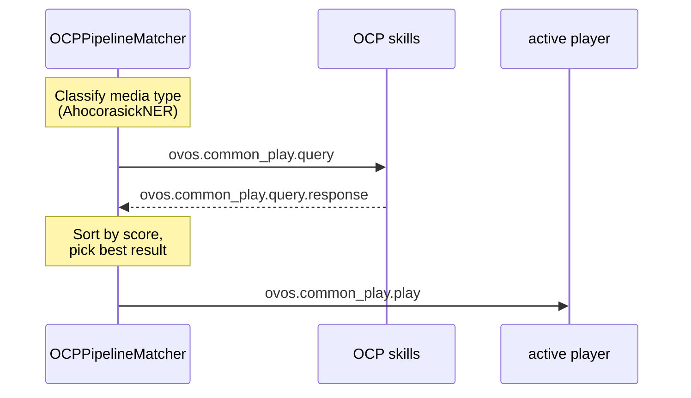

# ovos-media OCP Pipeline Plugin

!!! abstract "In a nutshell"
    The OCP pipeline plugin is the search/match layer of the media stack: it classifies a media
    request, asks OCP skills for matches, and hands the winner to whichever playback layer is
    running. It never plays audio itself. See [ovos-media](ovos-media.md) for the daemon that does.

## OCP Pipeline Plugin

**Package:** import name `ocp_pipeline` (PyPI distribution `ovos-ocp-pipeline-plugin`)
**Entry point group:** `opm.pipeline`
**Class:** `OCPPipelineMatcher` (entry point `ovos-ocp-pipeline-plugin`). The legacy bridge is `MycroftCPSLegacyPipeline` (`ovos-ocp-pipeline-plugin-legacy`)

The OCP pipeline plugin is the NLP brain of the media stack. It integrates with `ovos-core`'s
intent pipeline, handles all media query classification, and dispatches search to OCP skills.
It does NOT handle playback.

### What It Does



*Diagram: the pipeline classifies the media type, queries OCP skills, picks the best-scoring result, and hands it to the active player.*

1. **Classification**: determines the media type (music, podcast, radio, video, audiobook, news, etc.)
   using a trained `AhocorasickNER` classifier and vocabulary files from `ocp_pipeline/locale/`.

2. **Search dispatch**: emits `ovos.common_play.query` on the bus. All registered OCP skills
   respond with `ovos.common_play.query.response`, providing `MediaEntry`/`Playlist` objects scored 0–100.

3. **Result selection**: collects responses up to a timeout, sorts by score, picks the best result.


4. **Playback routing**: emits `ovos.common_play.play` with the selected result to the active player.

### Per-[Session](session.md) Player State

The pipeline plugin tracks one `OCPPlayerProxy` per session. This matters for [HiveMind](hivemind-agents.md), where each
satellite has its own player:

```python
@dataclass
class OCPPlayerProxy:
    session_id: str
    available_extractors: List[str]
    ocp_available: bool
    player_state: PlayerState = PlayerState.STOPPED
    media_state: MediaState = MediaState.UNKNOWN
    media_type: MediaType = MediaType.GENERIC
    skill_id: Optional[str] = None

```

### Pipeline Configuration

The OCP matcher contributes several confidence-ranked pipeline stages: `ovos-ocp-pipeline-plugin-high`, `-medium`, `-low`, plus `ovos-ocp-pipeline-plugin-legacy` for old-style CommonPlay skills. Place them at the appropriate confidence tier in your pipeline:

```json
{
  "intents": {
    "pipeline": [
      "...",
      "ovos-ocp-pipeline-plugin-high",
      "ovos-ocp-pipeline-plugin-medium",
      "ovos-ocp-pipeline-plugin-low",
      "..."
    ]
  }
}

```

### OCP Skills

OCP skills inherit `OVOSCommonPlaybackSkill` and register by emitting `ovos.common_play.announce`:

```python
from ovos_workshop.skills.common_play import (OVOSCommonPlaybackSkill, MediaType,
                                               ocp_search, ocp_featured_media,
                                               MediaEntry, Playlist)

class MyMusicSkill(OVOSCommonPlaybackSkill):
    @ocp_search()
    def search_my_service(self, phrase, media_type):
        # Return MediaEntry or Playlist objects scored 0-100
        if media_type == MediaType.MUSIC:
            yield MediaEntry(
                title="My Song",
                uri="https://example.com/song.mp3",
                match_confidence=85,
                media_type=MediaType.MUSIC,
            )

    @ocp_featured_media()
    def featured_media(self):
        # Optional: return a playlist for the OCP browse UI
        return Playlist(title="My Playlist", media=[...])

```

Skills must NOT handle playback. They must NOT have intents for play/pause/stop/next.

### Bus Messages

#### Inbound (to pipeline from skills / player)

| Message | Description |
|---|---|
| `ovos.common_play.query.response` | OCP skill returning search results |
| `ovos.common_play.announce` | OCP skill announcing presence |
| `ovos.common_play.status.response` | Player and media state, in `player_state` / `media_state` |
| `ovos.common_play.track.state` | Track state update |

#### Outbound (from pipeline to skills / player)

| Message | Description |
|---|---|
| `ovos.common_play.query` | Dispatch search to all OCP skills |
| `ovos.common_play.play` | Tell player to play selected result |
| `ovos.common_play.pause` | Pause |
| `ovos.common_play.resume` | Resume |
| `ovos.common_play.stop` | Stop |
| `ovos.common_play.next` | Next track |
| `ovos.common_play.previous` | Previous track |

---
**Read next:** [ovos-media](ovos-media.md)
**Related:** [OCP Pipeline](ocp-pipeline.md) · [OCP Skills](ocp-skills.md) · [ovos-media MPRIS Integration](ovos-media-mpris.md)
