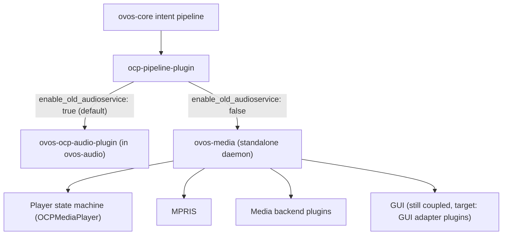

# ovos-media

!!! warning "Maturity — Proof-of-concept ⬤◯◯◯◯"
    The `ovos-media` daemon is **unfinished**. It is the **upcoming** media-playback service for OVOS, still being refactored, and **not enabled by default**. Today, stock installs play media through the **legacy audio backend**, the [`ovos-ocp-audio-plugin`](media-plugins.md#ovos-ocp-audio-plugin) ("old audio service") inside [`ovos-audio`](audio-service.md), which is **deprecated but still shipped**. Switching to `ovos-media` is opt-in and some parts are still coupled (Qt5 GUI, player-as-skill). Treat this page as the *target architecture*, for exploration only. Rated by [repository health](maturity.md), not version.

    OVOS has **two media-playback backends** sharing the same [OCP](ocp-pipeline.md) search framework (pipeline + skills + extractors):

    | | Legacy (current default) | ovos-media (upcoming) |
    |---|---|---|
    | **Package** | `ovos-ocp-audio-plugin` in [`ovos-audio`](audio-service.md) | `ovos-media` (standalone daemon) |
    | **Status** | deprecated, still shipped & on by default | opt-in refactor, not default |
    | **Playback** | one bundled audio backend | per-request audio/video/web [media plugins](media-plugins.md) (`opm.media.*`) |
    | **Extras** | none | MPRIS, per-session state, multiple players |
    | **Config** | `enable_old_audioservice: true` (default) | `enable_old_audioservice: false` + run `ovos-media` |

    The OCP **pipeline** and **stream extractors** are unaffected by which backend you use. Only the *playback* layer differs. (OCP **skills** are a separate, longer-term change.)

!!! abstract "In a nutshell"
    `ovos-media` is the planned future replacement for how OVOS plays music, podcasts and videos. Today, stock installs still use the older audio backend. `ovos-media` is an opt-in, work-in-progress rewrite meant to handle audio, video and web playback more cleanly and to support several players at once. If you are not deliberately trying it out, you are not using it yet. This page describes where things are heading. See the [OCP Pipeline](ocp-pipeline.md) for how playback requests are recognized, or the [Glossary](glossary.md) for terms.

`ovos-media` is the standalone audio/video daemon for OpenVoiceOS. It is the **upcoming
replacement** for the legacy audio service, and it provides a more capable and modular media player
built on the OpenVoiceOS [Common Play](ocp-pipeline.md) ([OCP](ocp-pipeline.md)) framework.

**In plain terms:** the old audio service could only play one kind of stream through a thin wrapper. `ovos-media` is a proper media daemon. It has separate audio/video/web players you pick per request. It supports MPRIS, so your phone's media controls work, and it keeps per-session state so multiple devices can each play their own thing.

??? info "📐 Formal specification"
    Media playback is specified by two architecture documents:
    **[OVOS-OCP-1 — OVOS Common Playback](https://github.com/OpenVoiceOS/architecture/blob/dev/ocp-1.md)**
    defines the per-session **virtual media player**, the single logical
    player every "play / pause / next / louder / stop" command targets, plus
    the MPRIS bridge to and from the host OS. Meanwhile,
    **[OVOS-AUDIO-1 — Audio Output Service](https://github.com/OpenVoiceOS/architecture/blob/dev/audio-out.md)**
    defines the **output service** that actually renders queued audio. OCP-1
    fixes the *observable control surface*. How a URI becomes bytes on a
    speaker is a backend concern. `ovos-media` is the implementation moving
    toward that contract. For the full set see the
    **[spec index](architecture-specs.md)**.

To use `ovos-media` you need to disable the old audio service and enable the OCP pipeline in `ovos-core`:

```json
{
  "enable_old_audioservice": false
}

```

```json
{
  "intents": {
    "pipeline": [
      "ovos-converse-pipeline-plugin",
      "ovos-ocp-pipeline-plugin-high",
      "...",
      "ovos-common-query-pipeline-plugin",
      "ovos-ocp-pipeline-plugin-medium",
      "...",
      "ovos-ocp-pipeline-plugin-low",
      "ovos-fallback-pipeline-plugin-low"
    ]
  }
}

```

---

## Architecture

OCP (OVOS Common Play) splits into a **search/match layer** and a **playback layer**. The search
layer, made up of the [`ocp-pipeline`](ocp-pipeline.md), OCP skills (media catalogs), and stream extractors,
is shared regardless of which playback layer you run. The playback layer has two implementations
that currently run in parallel: the legacy ["old audio service"](media-plugins.md#ovos-ocp-audio-plugin)
(`ovos-ocp-audio-plugin` inside [`ovos-audio`](audio-service.md)) and the standalone `ovos-media`
daemon described here, which is the target:



*Diagram: the intent pipeline routes to either the legacy `ovos-ocp-audio-plugin` or the standalone `ovos-media` daemon, which drives the player state machine, MPRIS, backend plugins, and the GUI.*

---

## OCP Pipeline Plugin

The OCP pipeline plugin (`OCPPipelineMatcher`, import name `ocp_pipeline`) is the search/match
layer: it classifies a media request, dispatches search to OCP skills over the bus, picks the
best-scoring result, and routes it to the active player. It does NOT handle playback. Full
detail (classification, per-session player state, pipeline configuration, OCP skills, bus
messages) has moved to its own page: **[ovos-media OCP Pipeline Plugin](ovos-media-pipeline.md)**.

---

## ovos-media Player

**Entry point:** `ovos-media` (runs `ovos_media.__main__:main`)

Key modules:

- `ovos_media/player.py`: `OCPMediaPlayer`, the player state machine (playlist, track history, playback/media/loop state). `OCPMediaCatalog` (an `OVOSCommonPlaybackSkill` subclass, instantiated as `self.media`) manages only the liked-songs store and search-results playlist


- `ovos_media/media_backends/`: `AudioService`, `VideoService`, `WebService`. Each manages typed backend plugins


- `ovos_media/player.py`: uses a `GUIInterface` from `ovos-gui-api-client` (`self.gui.show_media_player(...)`) to push player state via the template API (the old `ovos_media/gui.py` / `OCPGUIInterface` is gone)


- `ovos_media/mpris.py`: MPRIS integration

### Available Media Backend Plugins

Media backends are typed: audio players register on the `opm.media.audio` entry-point group,
video players on `opm.media.video`, and web players on `opm.media.web`. They are configured under
`media.audio_players` / `media.video_players` / `media.web_players` (see the config example below).

The table below lists the **pip package** to install. Each package registers one entry point per
type it supports, named `ovos-media-<type>-plugin-<name>` (e.g. the `ovos-media-plugin-vlc`
package registers `ovos-media-audio-plugin-vlc` and `ovos-media-video-plugin-vlc`). You configure
the player by its entry-point name.

| Package | Types | Description |
|---|---|---|
| [`ovos-media-plugin-vlc`](https://github.com/OpenVoiceOS/ovos-media-plugin-vlc) | audio, video | VLC instance |
| [`ovos-media-plugin-mplayer`](https://github.com/OpenVoiceOS/ovos-media-plugin-mplayer) | audio, video | mplayer |
| [`ovos-media-plugin-cli`](https://github.com/OpenVoiceOS/ovos-media-plugin-cli) | audio | Generic CLI-command player, minimal/default audio fallback |
| [`ovos-media-plugin-spotify`](https://github.com/OpenVoiceOS/ovos-media-plugin-spotify) | audio | Spotify Connect |
| [`ovos-media-plugin-chromecast`](https://github.com/OpenVoiceOS/ovos-media-plugin-chromecast) | audio, video | Cast to a Chromecast device |
| [`ovos-media-plugin-qt5`](https://github.com/OpenVoiceOS/ovos-media-plugin-qt5) | audio, video, web | Hand off to the [GUI](gui-service.md) player. **Legacy**, depends on the deprecated [ovos-shell](ovos-shell.md) (see [GUI status](gui-status.md)) |
| `ovos-media-plugin-mass` | audio | **Not yet published** (no public repo or PyPI package). Hands playback off to a [Music Assistant](https://music-assistant.io/) server. Does not implement `next()`/`previous()` through the legacy `AudioBackend` interface — only through the Music Assistant queue API (see Known Coupling Issues below) |
| `ovos-media-plugin-mpris` | audio, video | **Not yet published** (no public repo or PyPI package). Drives an external MPRIS player (e.g. an already-running desktop media app) instead of playing the stream itself |

### Stream Extractor Plugins

OCP supports stream extractor plugins (`opm.ocp.extractor` entry-point group. The older
`ovos.ocp.extractor` group is a deprecated alias) that transform non-playable URIs into playable
streams before handing them to the media backend:

- `ovos-ocp-youtube-plugin`: extracts audio stream from YouTube URLs


- `ovos-ocp-m3u-plugin`: parses M3U playlists


- `ovos-ocp-rss-plugin`: parses podcast RSS feeds

---

## Media Intents

These are the utterances the [OCP pipeline plugin](ovos-media-pipeline.md#pipeline-configuration)
described above actually matches, at whichever confidence tier (`-high` / `-medium` / `-low`)
it's configured for. Before the regular intent stage, OCP handles these utterances (taking into
account current player state):

- `"play {query}"`: always available


- `"previous"`: requires media loaded


- `"next"`: requires media loaded


- `"pause"`: requires media loaded


- `"play"` / `"resume"`: requires media loaded


- `"stop"`: requires media loaded


- `"I like that song"`: **not matchable today** — `like_song.intent` and
  `play_favorites.intent` are commented out of the pipeline's intent list, so their files are
  never loaded, on either stack. The `ocp:like_song` / `ocp:play_favorites` handlers exist and
  the bus messages work; only the voice route is disabled.

### Now-Playing Intents

`OCPMediaCatalog` (the built-in `ovos-media` skill described under [ovos-media
Player](#ovos-media-player)) registers five regular padatious intents (en-us) about the
currently playing track: `WhatSong`, `WhatArtist`, `WhatAlbum`, `ShuffleOn`, and `ShuffleOff`.

`WhatSong` and `WhatArtist` answer from the player's global status
(`ovos.common_play.status`), the same read-only state every session gets back from a status
query — so these two intents answer on **any** session, not just the local device. `WhatAlbum`
always reports it has no album information: `MediaEntry` (the player's now-playing model) has
no album field to report, an upstream data-model limitation rather than a missing lookup.

`ShuffleOn` and `ShuffleOff` are different: they act on the player (`shuffle.set` /
`shuffle.unset`), so they follow the same session gating as any other playback-affecting
command — only the local/"default" session may trigger them, unless the owning `ovos-media`
was configured with `media.validate_source: false` (see [HiveMind: multi-session
gating](#hivemind-multi-session-gating)). On a non-default session the intent handler itself
declines before emitting anything, and speaks a dialog saying the device cannot be controlled
from here, rather than reporting success for a shuffle change that never happened.

---

## MPRIS Integration

`ovos-media` can register itself on D-Bus as an MPRIS player, so tools like `playerctl` and
desktop media widgets can control it, and can optionally reflect and take over other MPRIS
players already running on the machine. This only applies when running `ovos-media`, not the
default `ovos-audio` old-audioservice backend. The full setup, dbus verification steps, and
the Role A / Role B reflection-and-takeover behavior have moved to their own page:
**[ovos-media MPRIS Integration](ovos-media-mpris.md)**.

---

## Configuration

```jsonc
{
  "media": {
    "enable_mpris": false,       // expose OVOS playback on the MPRIS D-Bus interface
    "mpris_poll_interval": 1,    // seconds between MPRIS state polls (when enable_mpris)
    "ignored_players": [],       // MPRIS player names OVOS should not track/adopt
    "dbus_type": "session",      // "session" (per-user, default) or "system" D-Bus

    // message sources trusted to bypass per-session validation
    "native_sources": ["debug_cli", "audio"],
    // when true, the daemon only acts on the local ("default") session.
    // set false for HiveMind/multi-session setups that drive playback remotely
    "validate_source": true,

    "preferred_audio_services": ["vlc", "mplayer", "cli"],
    "preferred_video_services": ["vlc", "mplayer"],
    "preferred_web_services": [],

    // force playback through the audio players even for video/web media, e.g. on headless setups
    "playback_mode": "FORCE_AUDIO",

    "audio_players": {
      "vlc": { "module": "ovos-media-audio-plugin-vlc", "aliases": ["VLC"], "active": true },
      "cli": { "module": "ovos-media-audio-plugin-cli", "aliases": ["Command Line"], "active": true }
    },
    "video_players": {
      "vlc": { "module": "ovos-media-video-plugin-vlc", "aliases": ["VLC"], "active": true }
    },
    "web_players": {
      "mpv": { "module": "ovos-media-web-plugin-mpv", "aliases": ["mpv"], "active": true }
    }
  }
}
```

`dbus_type` picks which D-Bus the MPRIS integration registers and scans on: the per-user
**session** bus (default) or the system-wide **system** bus. `playback_mode` forces media that
would normally need a video or web player through the audio players instead (`PlaybackMode`
values such as `FORCE_AUDIO`) — useful on a headless/speaker-only device that has no screen to
show video on. `web_players` configures `opm.media.web` backends the same way `audio_players`
and `video_players` do, keyed by local name with a `module` entry-point name.

> The `gui` / `browser` module names shown in earlier drafts are not real
> backends. The bundled players are `vlc`, `mplayer`, `cli`, `spotify`,
> `chromecast`, and the legacy `qt5` GUI hand-off (see the
> [backend table](#available-media-backend-plugins)).

Each entry's key is a local name. `module` is the plugin's **entry-point name**
(e.g. `ovos-media-audio-plugin-vlc`), which can differ from its pip package name
(`ovos-media-plugin-vlc`). `preferred_*_services` are ordered fallback lists. The
audio list is also the generic fallback when a type-specific list is empty.

To hand playback to the legacy GUI player, add the `qt5` entry points
(`ovos-media-audio-plugin-qt5`, `…-video-plugin-qt5`, `…-web-plugin-qt5`). That
backend is legacy and needs the deprecated [ovos-shell](ovos-shell.md).

Other `media.*` keys read by the player (all optional): `autoplay` (default
`true`, play the next queued track automatically), `merge_search` (fold new
search results into the active playlist vs. replacing it), and
`force_audioservice` (route audio through the audio backend even when a GUI is
available).

### First playback

`ovos-media` listens for `ovos.common_play.play` and expects a `media` dict plus an optional
`playlist` list:

```json
{
  "media": {
    "uri": "https://example.com/song.mp3",
    "title": "Some Jazz",
    "media_type": 2,
    "playback": 2
  },
  "playlist": [{"uri": "https://example.com/song.mp3", "title": "Some Jazz",
                "media_type": 2, "playback": 2}]
}
```

`media` is required — `handle_play_request` logs a warning and ignores the message without it.
If `playlist` is omitted, `ovos-media` builds a single-track playlist containing only `media`.
Either way, playing then **replaces** the player's current playlist outright: an
`ovos.common_play.play` message always overwrites whatever was set by an earlier
`ovos.common_play.playlist.set` message, whether or not it includes a `playlist` key, and
next/previous navigation after a bare `play` (no `playlist` key) only ever has the one track to
work with. To play a track as part of a larger playlist, include the full track list under
`playlist` in the same `ovos.common_play.play` message.

Query-style bus messages follow a `.response` suffix convention: the reply to `<msg_type>` is
emitted as `<msg_type>.response`. For example, `ovos.common_play.status` is answered on
`ovos.common_play.status.response`, and `ovos.common_play.track_info` on
`ovos.common_play.track_info.response`.

### Service-level bus messages

Beyond the per-player `ovos.audio.service.*` / `ovos.video.service.*` API, these bus messages
are handled inside the `ovos-media` process. The canonical reference for the full
`ovos.common_play.*` namespace is [Bus Events Reference: OCP / media playback](bus-events.md#ocp-media-playback);
this section covers only the service-level subset with `ovos-media`-specific behavior notes.

Four are on the `MediaService` daemon itself. `ovos.common_play.ping` is the one to use for a
liveness probe — the rest are on the player, so they answer only once a player exists:

| Bus message | Purpose |
|---|---|
| `ovos.common_play.home` | Open the OCP home/menu |
| `ovos.common_play.ping` | Liveness probe. Lets callers detect a running `ovos-media` |
| `ovos.common_play.search.start` / `ovos.common_play.search.end` | Bracket an in-progress OCP search |
| `opm.audio.query` | OPM plugin-discovery compatibility with the legacy `PlaybackService` handler |

The rest are registered by `OCPMediaPlayer`:

| Bus message | Purpose |
|---|---|
| `ovos.common_play.seek` | Seek within the current track |
| `ovos.common_play.playlist.set` / `.queue` / `.clear` | Replace, append to, or empty the playlist |
| `ovos.common_play.shuffle.toggle` / `.set` / `.unset` | Toggle or explicitly set/unset shuffle mode |
| `ovos.common_play.repeat.toggle` / `.set` / `.unset` | Toggle or explicitly set/unset repeat mode |
| `ovos.common_play.duck` / `.unduck` | Duck/restore volume for a competing sound (e.g. TTS) |
| `ovos.common_play.cork` / `.uncork` | Pause/resume playback for a competing sound, without ducking |
| `ovos.common_play.like` / `.unlike` | Mark or unmark the current track as a liked song |
| `ovos.common_play.status` | Report full current player status |
| `ovos.common_play.SEI.get` | Report the stream extractor identifiers `ovos-media` supports |

These live alongside the legacy ducking/cork aliases kept for backward compatibility. The full
~30-entry `OCPMediaPlayer` handler list, including exact legacy alias names, is in
`ovos_media/player.py`.

---

## Stop & Error Semantics

A few guarantees hold for `OCPMediaPlayer` regardless of which backend is active:

- **Stop never advances the queue.** Whether it comes from the bus API, a legacy stop topic, or
  an MPRIS `Stop` command — including while a bad-stream retry is still pending — an explicit
  stop always ends on `PlayerState.STOPPED` with the queue position unchanged. Advancing to the
  next track only ever happens through the normal end-of-track / `next` paths.
- **Unplayable tracks are skipped, not fatal.** A track a backend cannot load emits
  `MediaState.INVALID_MEDIA` and the player schedules a delayed retry that moves on to the next
  track in the queue, rather than failing the whole playback request outright.
- **A queue that is entirely broken stops instead of looping forever.** If every track in the
  current queue has already failed to load since the last successful one, `ovos-media` stops
  playback (`PlayerState.STOPPED`) instead of retrying indefinitely — this applies both to
  `LoopState.REPEAT_TRACK` on a single failed track and to `LoopState.REPEAT` restarting a
  wholly-failed queue.
- **End of queue emits `PlayerState.STOPPED`.** Reaching the end of the queue with repeat off
  updates the player state (and notifies the GUI/MPRIS/bus) rather than leaving it at `PLAYING`
  with nothing left to play.
- **Duplicate URIs in a playlist advance by position, not first match.** A playlist like
  `[a, b, a]` tracks the currently-playing entry by object identity, falling back to playlist
  position and then to URI lookup only if identity is unavailable — so playback moves through
  the queue in order instead of ping-ponging back to the first track sharing a URI.

---

## Upcoming: MediaProvider plugins replace OCP skills

!!! info "What changes, and when"
    Media catalogs are moving **out of skills and into plugins**. A new **MediaProvider** plugin
    type (`opm.media.provider` / `PluginTypes.MEDIA_PROVIDER`) that the OCP pipeline loads
    **in-process** and calls `search()` on directly, in place of today's
    [OCP skills](ocp-skills.md). This first ships in **`ovos-plugin-manager 2.8.0a1`**
    (Phase 1 of the `ovos-media` migration). OCP skills remain the way to provide media for now.
    Tracked in [ovos-workshop#423](https://github.com/OpenVoiceOS/ovos-workshop/pull/423).

    A first batch of MediaProvider plugins is in development — none of them is published
    yet (no public repository, nothing on PyPI), so there is nothing to install today.
    Each one supersedes the catalog/search half of an older OCP skill:

    | MediaProvider plugin | Supersedes |
    |---|---|
    | `ovos-media-provider-bandcamp` | [ovos-skill-bandcamp](https://github.com/OpenVoiceOS/ovos-skill-bandcamp) |
    | `ovos-media-provider-pyradios` | [ovos-skill-pyradios](https://github.com/OpenVoiceOS/ovos-skill-pyradios) |
    | `ovos-media-provider-somafm` | [ovos-skill-somafm](https://github.com/OpenVoiceOS/ovos-skill-somafm) |
    | `ovos-media-provider-soundcloud` | [ovos-skill-soundcloud](https://github.com/OpenVoiceOS/ovos-skill-soundcloud) |
    | `ovos-media-provider-tunein` | [ovos-skill-tunein](https://github.com/OpenVoiceOS/ovos-skill-tunein) |
    | `ovos-media-provider-youtube` | [ovos-skill-youtube](https://github.com/OpenVoiceOS/ovos-skill-youtube) |
    | `ovos-media-provider-youtube-music` | [ovos-skill-youtube-music](https://github.com/OpenVoiceOS/ovos-skill-youtube-music) |
    | `ovos-media-provider-mass` | `ovos-skill-music-assistant` (playback via the companion `ovos-media-plugin-mass` backend) |
    | `ovos-media-provider-news` | [ovos-skill-news](https://github.com/OpenVoiceOS/ovos-skill-news) |
    | `ovos-media-provider-spotify` | [ovos-skill-spotify](https://github.com/OpenVoiceOS/ovos-skill-spotify) (playback via the companion [ovos-media-plugin-spotify](https://github.com/OpenVoiceOS/ovos-media-plugin-spotify) backend) |

    The old OCP skills keep working; a MediaProvider plugin only takes over once the
    `opm.media.provider` plugin type ships on a released `ovos-plugin-manager`.

## Legacy Compatibility & Known Coupling Issues

`ovos-media`'s pipeline plugin falls back to the classic `mycroft.audio.service.*` bus messages
when `ovos-media` is not running, and bridges old pre-OCP `CommonPlaySkill` skills via `play:query`
/ `play:start`. It also carries some architectural coupling from that history, such as
`OCPMediaCatalog` registering itself as a skill and the Music Assistant backend's missing
`next()`/`previous()`. The full detail has moved to its own page:
**[ovos-media Legacy Compatibility](ovos-media-compat.md)**.

---

## HiveMind: multi-session gating

On a server that fans playback out to several [HiveMind](hivemind-agents.md) satellites, not
every bus handler should act on behalf of every session. `ovos_media/utils.py`'s
`require_default_session()` gates the subset of handlers that only make sense for the local
("default") session — for example, the legacy `mycroft.audio.service.*` handlers a single
physical machine's audio hardware would receive — while the OCP-native `ovos.common_play.*`
handlers stay session-aware and can target whichever satellite's player state they're addressed
to.

The `media.validate_source` config flag (see [Configuration](#configuration) above) controls how
strict this gating is:

- `true` (default): the daemon only acts on messages carrying the local "default" session.
  Correct for a single-device install where `ovos-media` and the microphone are the same box.
- `false`: needed on a server fronting multiple HiveMind satellites, so a satellite's own session
  can drive playback remotely instead of every command being silently scoped to "default".

Get this wrong on a server/satellite topology and playback commands from a satellite either get
ignored (`validate_source: true` on a multi-satellite server) or, worse, target the wrong
device's player state.

---

## Features

### Liked Songs

Like a currently playing song through the GUI, or over the bus with `ovos.common_play.like`.

The voice route is **disabled today**: `like_song.intent` and `play_favorites.intent` are
commented out of the OCP pipeline's intent list, so "I like that song" and "play my favorite
songs" never match. Use the GUI or the bus messages until they are re-enabled.

### Skills Browse / Featured Media

Some skills provide `@ocp_featured_media()`. These are accessible from the OCP skills menu in the GUI.

### File Browser Integration

Selected files and folders will be played in OCP. Folders are treated as playlists.

---
**Read next:** [Screens on OVOS Today](gui-status.md) · [Concepts Overview](concepts-overview.md)
**Related:** [Audio Service](audio-service.md) · [ovos-media OCP Pipeline Plugin](ovos-media-pipeline.md) · [OCP Pipeline](ocp-pipeline.md) · [Media Playback Plugins](media-plugins.md) · [OCP Extractors](ocp-plugins.md) · [ovos-media MPRIS Integration](ovos-media-mpris.md) · [ovos-media Legacy Compatibility](ovos-media-compat.md)
