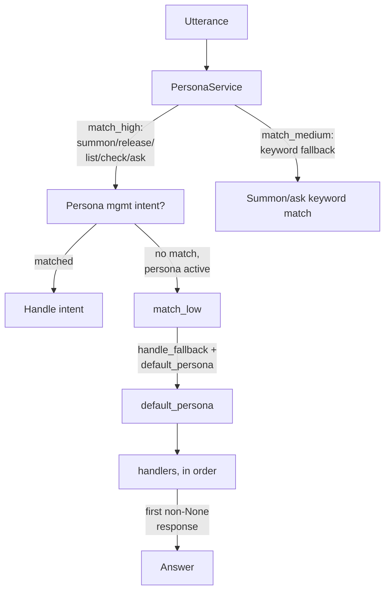

# AI Agents & Personas in OpenVoiceOS

!!! abstract "In a nutshell"
    A "persona" is a chosen personality and brain for your assistant. Think of it as deciding *who* answers you and how they sound, much like picking a character. Behind each persona are interchangeable "engines" (the actual AI pieces that do the thinking), and a routing layer decides which persona should handle each thing you say. This lets you swap or combine brains without rebuilding the whole assistant. To dig deeper see [Tool Plugins](tool-plugins.md) and [Persona Memory](persona-memory.md), or the [Glossary](glossary.md) for unfamiliar terms.

!!! tip "Just want an LLM (ChatGPT-style) answering your questions? 3 steps"
    1. **Install a chat backend**: a cloud [OpenAI-compatible](openai-plugin.md) model, or a
       fully-local [GGUF](gguf-plugin.md) model (no account, no internet).
    2. **Create a persona** that points at it: a small JSON file in `~/.config/ovos_persona/`
       (see [Defining a persona](#personas-named-agent-identities) below).
    3. **Send unanswered questions to it**: enable the [persona pipeline](persona-pipeline.md)
       with `handle_fallback: true`.

    Now anything no skill handles is answered by the LLM. The rest of this page is the full
    architecture. You don't need it to get started.

OpenVoiceOS (OVOS) provides a flexible, modular system for integrating AI agents into voice-first
environments. The architecture is built in layers: low-level **agent engine plugins** registered
through OPM, named **personas** that combine one or more engines into a conversational identity,
and the **PersonaService** pipeline plugin that routes live utterances to the right persona at
runtime.

---

## Agent Engine Plugins (OPM `opm.agents.*`)

Agent engines are the building blocks. Each engine type solves one well-defined sub-problem. They
are discovered and loaded by `ovos-plugin-manager` at runtime using Python entry points.

See [Agent Plugins](agent-plugins.md) for the full `opm.agents.*` entry-point table. The
engine types used on this page are:

| Entry point group | Base class | Purpose |
|---|---|---|
| `opm.agents.chat` | `ChatEngine` | Multi-turn conversational LLM |
| `opm.agents.memory` | `AgentContextManager` | Per-session conversation history management |
| `opm.agents.toolbox` | none | Tool/function-calling registry |

Each group has a parallel `*.config` group for plugin config metadata. All base classes live in
`ovos_plugin_manager.templates.agents`. The `AgentMessage` dataclass carries messages between
engines:

```python
from ovos_plugin_manager.templates.agents import AgentMessage, MessageRole

msg = AgentMessage(role=MessageRole.USER, content="What is the speed of light?")

```

`MessageRole` values: `SYSTEM`, `DEVELOPER`, `USER`, `ASSISTANT`, `TOOL`.

See [Agent Plugins](agent-plugins.md) for the full engine-type reference and configuration
examples for OpenAI-compatible and local GGUF models.

---

## Personas (Named Agent Identities)

A **persona** is a named conversational identity defined by a JSON file (or an OPM plugin entry
point). It lists one or more agent engine plugin IDs in priority order and carries per-plugin
configuration inline.

```json
{
  "name": "My Assistant",
  "handlers": ["ovos-chat-openai-plugin"],
  "ovos-chat-openai-plugin": {
    "api_url": "https://api.openai.com/v1",
    "key": "sk-...",
    "model": "gpt-4o-mini",
    "system_prompt": "You are a helpful voice assistant. Be concise."
  }
}

```

The `"solvers"` key is an alias for `"handlers"` (legacy compat). Plugins are tried in order.
The first non-`None` response wins.

### Available Personas

`opm.plugin.persona` plugins ship a ready-made persona as a static dict, which `ovos-persona`
loads directly instead of reading a hand-written JSON file. The dict is the same shape as the
JSON file: a `name`, a `solvers` list naming the plugins to try in order, and one config block
per named plugin.

```python
LLAMA_DEMO = {
    "name": "Remote LLama",
    "solvers": ["ovos-chat-openai-plugin"],
    "ovos-chat-openai-plugin": {
        "api_url": "https://llama.smartgic.io/v1",
        "key": "sk-xxxx",
        "model": "llama3.1:8b"
    }
}
```

`Persona.__init__` reads `handlers`, falling back to `solvers`, and raises `ValueError` if it
finds neither. There is no `chat_engine` key and no `system_prompt` key at this level — a
persona that names one is not loadable.

This manual only covers plugins backed by an OpenVoiceOS-org repository:

| Persona ID | Backend | Package |
|---|---|---|
| `Remote Llama` | `ovos-chat-openai-plugin` | `ovos-openai-plugin` |
| `WikiHow` | WikiHow solver | `ovos-skill-wikihow` |

### Persona with session memory

Pair any chat engine with an `opm.agents.memory` plugin to persist per-session conversation
history across turns:

```json
{
  "name": "Assistant with Memory",
  "memory_module": "ovos-memory-plugin-longterm",
  "handlers": ["ovos-chat-openai-plugin"],
  "ovos-chat-openai-plugin": {
    "api_url": "https://api.openai.com/v1",
    "key": "sk-...",
    "model": "gpt-4o-mini",
    "system_prompt": "You are a helpful assistant."
  },
  "ovos-memory-plugin-longterm": {
    "max_history": 30,
    "compress": true
  }
}

```

The `memory_module` key names an `opm.agents.memory` plugin. The default when omitted is
`"ovos-agents-short-term-memory-plugin"`, `BasicShortTermMemory` from `ovos-persona`.

??? example "Memory backend reference"

    | Plugin / entry point | Package | Backend |
    |---|---|---|
    | `ovos-agents-short-term-memory-plugin` (`BasicShortTermMemory`) | `ovos-persona` | In-RAM short-term history, no API key |
    | `ovos-memory-plugin-longterm` (`LongTermMemory`) | `ovos-memory-plugins` | Rolling LLM summary + recent window (JSON/SQLite) |
    | `ovos-memory-plugin-local-rag` (`LocalRAGMemory`) | `ovos-memory-plugins` | Semantic top-k recall via local embeddings + a vector DB (no external service) |
    | `ovos-memory-plugin-lexical` (`LexicalMemory`) | `ovos-memory-plugins` | BM25 keyword recall (SQLite, stdlib-only) |
    | `ovos-memory-plugin-recency` (`RecencyMemory`) | `ovos-memory-plugins` | Recent-window history |
    | `ovos-memory-plugin-entity` (`EntityMemory`) | `ovos-memory-plugins` | Durable facts about the user |
    | `ovos-memory-plugin-composite` (`CompositeMemory`) | `ovos-memory-plugins` | Ensemble that fuses several of the above |

    `ovos-memory-plugins` is **local-first**: most backends need no external service (only
    `longterm`/`entity` call an OpenAI-compatible chat endpoint, which can be your own local LLM).
    Server-/cloud-coupled RAG memory lives separately in [`ovos-openai-plugin`](openai-plugin.md)
    as `PersonaServerRAGMemory`. See [Persona Memory](persona-memory.md) for the full reference.

### Non-LLM personas

Personas do not require LLMs. Any installed OPM solver plugin can serve as a handler, enabling
fully local, privacy-preserving conversational agents:

```json
{
  "name": "OldSchoolBot",
  "handlers": [
    "ovos-wikipedia-plugin",
    "ovos-ddg-plugin",
    "ovos-wolfram-alpha-plugin",
    "ovos-wordnet-plugin",
    "ovos-solver-failure-plugin"
  ],
  "ovos-wolfram-alpha-plugin": {"appid": "Y7353-XXX"}
}

```

`ovos-solver-failure-plugin` is a terminal handler that always answers with an error dialog, so the persona never goes silent.

---

## PersonaService — Pipeline Plugin

`PersonaService` (`ovos_persona.PersonaService`) is the runtime component. It registers as an
`opm.pipeline` plugin and integrates directly with the OVOS intent pipeline.

Entry point: `opm.pipeline = ovos-persona-pipeline-plugin`



*Diagram:* The flow starts at the utterance and ends at the answer, branching between a matched persona-management intent, a keyword-matched summon/ask, and a fallback through default_persona's handlers.

### Pipeline placement

```json
{
  "intents": {
    "pipeline": [
      "ovos-stop-pipeline-plugin-high",
      "ovos-converse-pipeline-plugin",
      "ovos-padatious-pipeline-plugin-high",
      "ovos-adapt-pipeline-plugin-high",
      "ovos-persona-pipeline-plugin-high",
      "ovos-ocp-pipeline-plugin-medium",
      "ovos-fallback-pipeline-plugin-medium",
      "ovos-persona-pipeline-plugin-low",
      "ovos-fallback-pipeline-plugin-low"
    ]
  }
}

```

### Confidence levels

| Level | Method | Behavior |
|---|---|---|
| High | `match_high()` | Matches persona management intents (summon, release, list, check, ask). If a persona is active and no management intent matched, delegates to `match_low()`. |
| Medium | `match_medium()` | Keyword fallback for summon/ask when padatious confidence was too low. |
| Low | `match_low()` | If `handle_fallback: true` and a `default_persona` is set, routes every unhandled utterance to the default persona. |

### Configuration

All keys live under `"intents": { "persona": { ... } }` in `mycroft.conf`:

```json
{
  "intents": {
    "persona": {
      "handle_fallback": true,
      "default_persona": "My Assistant",
      "personas_path": "~/.config/ovos_persona",
      "memory_module": "ovos-agents-short-term-memory-plugin"
    }
  }
}

```

| Key | Default | Description |
|---|---|---|
| `personas_path` | `~/.config/ovos_persona` | Directory for user JSON persona files |
| `default_persona` | first loaded | Persona used when `handle_fallback` is active |
| `handle_fallback` | `false` | Route all unhandled utterances to `default_persona` |
| `persona_blacklist` | `[]` | Persona names to skip when loading |
| `ignore_plugin_personas` | `false` | Skip OPM-registered plugin personas |
| `min_intent_confidence` | `0.6` | Minimum padatious confidence for persona intents |

(`memory_module` is **not** a PersonaService key. It is a **per-persona** JSON key set inside each persona file. See above.)

### Voice intents

| Intent | Example utterances |
|---|---|
| Summon | "Connect me to Claude", "Let me chat with My Assistant" |
| Ask | "Ask Claude what the meaning of life is" |
| List | "What personas are available?" |
| Check | "Who am I talking to right now?" |
| Release | "Stop the interaction", "Go dormant" |

Summon, ask, list, check, and release are **ordinary intents**: locale `.intent` / `.entity` resources matched with the same intent machinery any other intent uses. A persona plugin earns no special matching layer of its own. What makes it a persona plugin is that it *also* catches everything else once a persona is active (the low-confidence catch-all above), not how it recognizes its own commands.

---

## Persona Loading

`PersonaService.load_personas()` loads from two sources:

1. **User JSON files** in `~/.config/ovos_persona/`: each `.json` file becomes a `Persona`. The
   `"name"` field inside the JSON overrides the filename.

2. **OPM plugin personas**: packages that register via the `opm.plugin.persona` entry point
   group (unless `ignore_plugin_personas: true`).

User-defined personas take precedence: a plugin persona with the same name as a loaded file is
silently skipped. Both sources respect `persona_blacklist`.

---

## ovos-core as a Chat Engine

`ovos-messagebus-chat-plugin` (entry point `ovos-messagebus`, class `OVOSMessagebusChatAgent`,
group `opm.agents.chat`) exposes a running `ovos-core` instance as a persona handler. This
enables OVOS to act as an agent inside another system, for example a Docker network or a
[HiveMind](hivemind-agents.md) satellite, without exposing the [messagebus](bus-service.md) directly.

```json
{
  "name": "Open Voice OS",
  "handlers": ["ovos-messagebus", "ovos-solver-failure-plugin"],
  "ovos-messagebus": {
    "autoconnect": true,
    "host": "127.0.0.1",
    "port": 8181,
    "timeout": 30,
    "source_name": "messagebus_chat_agent"
  }
}

```

`timeout` (default `30`) is how long the engine waits for a `speak` reply per utterance; it resets on every `speak` it receives, so a skill that emits several `speak` messages in a row does not time out early. `source_name` (default `messagebus_chat_agent`) is written to `context.source` on every bus message the engine sends, so routing rules on the target `ovos-core` can identify — and exclude — traffic that originated from this engine.

This plugin replaces the removed `OVOSMessagebusSolver` / `ovos-solver-bus-plugin`, which lived
under the deprecated `neon.plugin.solver` group; install
[`ovos-messagebus-chat-plugin`](https://github.com/OpenVoiceOS/ovos-messagebus-chat-plugin) and
migrate any persona that referenced the old solver to the `ovos-messagebus` chat engine.

**Note:** routing OVOS back through itself creates an infinite loop if this engine is used inside
a persona that is *already* loaded by the same running `ovos-core`. It is intended for
cross-instance bridging, not local routing. Use `source_name` to detect or filter such loops on
the receiving side. For secure remote access see [HiveMind Agents](hivemind-agents.md).

Multi-turn continuity on the OVOS side (`get_response`, common query follow-ups, context) comes
from the target core's own `SessionManager`, which every bus message carrying a `Session` keeps
current — this engine needs no history cache of its own for that. A [memory plugin](persona-memory.md)
layered on top of this engine only affects the LLM-facing `messages` list; it does not drive
OVOS-side skill or session continuity.

---

---
**Read next:** [Agent Engine Types](agent-plugins.md)
**Related:** [Persona Memory](persona-memory.md) · [Persona Server](persona-server.md) · [Choosing Plugins](choosing-plugins.md#ai-agents-llm-chat-backends) · [Persona Pipeline](persona-pipeline.md)
