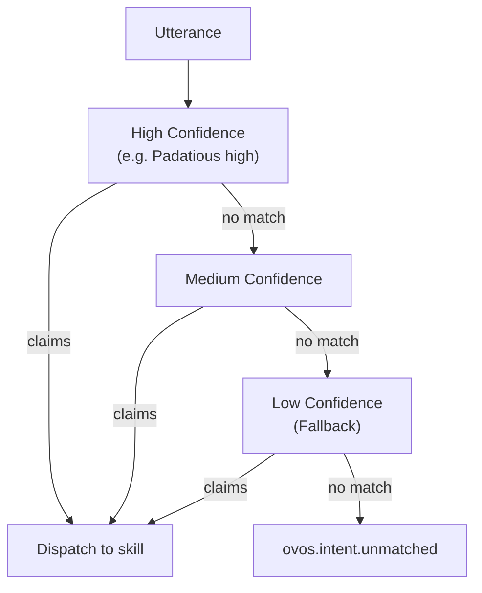

# OVOS Intent Pipeline

!!! abstract "In a nutshell"
    When you speak to your assistant, something has to figure out *what you actually want* and act on it. The intent pipeline is the part that does that: it passes your words through a series of checkpoints, each trying to understand the request, from confident exact matches down to best-guess fallbacks. The first checkpoint that recognizes your request handles it, much like a help desk that sends your question to the right department. See the [Glossary](glossary.md) and the [Fallback Pipeline](fallback-pipeline.md) for related terms.

??? info "📐 Formal specification"
    The utterance lifecycle and the pipeline-plugin contract are specified by **[OVOS-PIPELINE-1 — Utterance Lifecycle & Pipeline](https://github.com/OpenVoiceOS/architecture/blob/dev/pipeline-1.md)**. The intents these plugins consume are specified by **[OVOS-INTENT-3 — Intent Definition](https://github.com/OpenVoiceOS/architecture/blob/dev/intent-3.md)** (keyword and template intents) over the **[OVOS-INTENT-1 — Sentence Template Grammar](https://github.com/OpenVoiceOS/architecture/blob/dev/intent-1.md)**. See the [spec index](architecture-specs.md) for the full set.

The OpenVoiceOS (OVOS) Intent Pipeline is a modular, extensible system that interprets user utterances and maps them to actions or responses. It orchestrates pipeline plugins and fallback mechanisms to produce accurate, contextually relevant responses. This layered, rule-based approach tries plain keyword and template matchers before any statistical or LLM-backed stage. This is a deliberate design choice. See the [blog post](https://blog.openvoiceos.org/posts/2025-11-25-gofai) for why classic Adapt/Padatious matching still earns the first checkpoints.

When the entry utterance carries no authoritative language tag, the orchestrator resolves the language **once**, from session evidence. It passes that same resolved tag into every plugin's `match` call for the utterance. A plugin may refine it locally but must not silently re-derive its own answer. Otherwise different stages could match the same utterance in different languages depending on ordering.

---

## What is an Intent Pipeline?

An intent pipeline in OVOS is a sequence of processing stages that analyze user input to determine the user's intent. Each stage uses a different strategy, ranging from high-confidence pipeline plugins to fallback mechanisms.

This layered approach lets OVOS handle a wide range of user queries at varying levels of specificity and complexity.

---

## Matcher taxonomy

The manual groups pipeline plugins into four kinds. The first is always-on pipeline
furniture; the other three are matchers you pick between:

| Group | Members | What it answers | In the default pipeline? |
|---|---|---|---|
| Flow Stages | [Converse](converse-pipeline.md), [Stop](stop-pipeline.md), [Fallback](fallback-pipeline.md) | Not a matcher choice — session bookkeeping and the last-resort catch-all every deployment needs | Yes, all three |
| Keyword Matchers | [Adapt](adapt-pipeline.md) (default), [Palavreado](palavreado.md) (extra) | "Which registered keywords occur in this utterance?" | Adapt only |
| Utterance Matchers | [Padatious](padatious-pipeline.md) (default), [Model2Vec](m2v-pipeline.md) (default), [Padacioso](padacioso.md) (extra), [Nebulento](nebulento.md) (extra), [Hierarchical KNN](knn-pipeline.md) (extra) | "Which registered example sentence does this utterance resemble?" | Padatious and Model2Vec only |
| Specialized Matchers | [OCP media](ocp-pipeline.md) (default), [Common Query](cq-pipeline.md) (extra), [Persona](persona-pipeline.md) (extra) | Domain-specific requests: media playback, open questions, persona chat | OCP media only |

"Default" means the plugin's stage IDs appear in the bundled `intents.pipeline`
list (see below). "Extra" means you install the plugin and add its stage IDs
yourself.

---

!!! note "Spec vocabulary in one paragraph"
    In OVOS-PIPELINE-1 terms, every stage on this page is a **pipeline plugin** identified by an opaque `pipeline_id`. Each one exposes exactly one operation to the **orchestrator**: `match(utterances, lang, session) → Match | None`, where `session` is the session carrier the orchestrator extracts from the utterance's `context.session` (PIPELINE-1 §4). Note a known spec/implementation divergence: the shipped `ovos-plugin-manager` base classes currently pass the full `Message` as the third argument, and plugins read the session from `message.context["session"]` themselves.

    The orchestrator iterates the plugins in the order given by `session.pipeline` and stops at the **first** one that returns a `Match`. **First match wins.** There is *no* cross-plugin confidence comparison. The per-stage `conf_high/medium/low` thresholds below are each plugin's *own* internal accept/reject gate, not a score the orchestrator ranks between plugins.

    On a match the orchestrator dispatches the handler on the topic `<skill_id>:<intent_name>` (PIPELINE-1 §7) and emits the handler-lifecycle trio. If no plugin claims, it emits `ovos.intent.unmatched`.

    Several stages here (converse, stop, common-query, fallback) are pipeline plugins that claim via **reserved `intent_name` values** (`converse`, `response`, `stop`, `common_query`, `fallback`) leased in PIPELINE-1 §7.3. Skills may not register those names.

---

## Pipeline Structure

When an utterance arrives, OVOS walks the pipeline in order and hands the utterance to each stage until one claims it. Stages are tried from most to least confident:

*   **High Confidence**: Primary pipeline plugins that provide precise matches.
*   **Medium Confidence**: Secondary parsers that handle less specific queries.
*   **Low Confidence**: [Fallback](fallback-pipeline.md) mechanisms for ambiguous or unrecognized inputs.



*Diagram: an utterance is tried against High Confidence, then Medium Confidence, then Low Confidence (fallback) stages in order, dispatching to the skill as soon as one claims it, or ending as ovos.intent.unmatched if none do.*

The first stage that matches wins, so order matters. A high-confidence Padatious match is tried before any medium-confidence stage, and a medium-confidence stage is tried before any low-confidence stage. Each component is a plugin, so you can enable, disable, or reorder it in your config.

!!! note "`intents.pipeline` orders matchers: it does not gate loading"
    The config list controls which loaded matchers are *tried* and in what order. Every
    installed pipeline plugin is still discovered and initialized at startup (some load
    models when they do); to keep a plugin from initializing at all, uninstall its package.

Ordering is **the arbitration model, not a missing feature** (PIPELINE-1 §6.2). An earlier plugin gets to answer before any later plugin is asked.

This lets a stateful interceptor that depends on session state claim "yes" / "next" / "resume" / "stop" *before* a general pipeline plugin would match the bare words. Examples include converse with an open response window, an active persona, OCP holding paused media to *resume*, and stop.

Such selective plugins are deliberately conservative. They claim only when both the utterance and the session warrant it, and return `None` otherwise, trusting their position rather than competing on a score. Heterogeneous engines share no common score space to rank across anyway.

### Pipeline IDs vs. plugins

The IDs you list in your `pipeline` config (like `ovos-adapt-pipeline-plugin-high`) are not separate plugins. A confidence-aware plugin registers a single OPM entry point (e.g. `ovos-adapt-pipeline-plugin`), and OVOS derives the `-high`/`-medium`/`-low` matcher stages from it at runtime. Plugins that match at only one confidence level (such as `ovos-converse-pipeline-plugin` or `ovos-common-query-pipeline-plugin`) expose a single bare ID.

#### The pip package is a third name again

A pipeline ID is not a package name either, and `pip install <pipeline-id>` fails outright for
several of them. Install the distribution, not the ID:

| Pipeline ID | pip package |
|---|---|
| `ovos-padatious-pipeline-plugin` | `ovos-padatious` |
| `ovos-adapt-pipeline-plugin` | `ovos-adapt-parser` |
| `ovos-m2v-pipeline` | `ovos-m2v-pipeline` |
| `ovos-persona-pipeline-plugin` | `ovos-persona` |
| `ovos-ocp-pipeline-plugin` | `ovos-ocp-pipeline-plugin` |
| `ovos-common-query-pipeline-plugin` | `ovos-common-query-pipeline-plugin` |

The last two match, which is what makes the others easy to get wrong. To find the package
behind any installed pipeline ID, ask the entry point which distribution registered it:

```bash
python3 -c "
from importlib.metadata import distributions
print([d.metadata['Name'] for d in distributions()
       for e in d.entry_points if e.group == 'opm.pipeline'])"
```

The older short names (`adapt_high`, `common_qa`, …) are **deprecated aliases**. ovos-core still accepts them and rewrites them to the canonical plugin IDs via the `_PIPELINE_MIGRATION_MAP`, so existing configs keep working this way. The bundled default configuration and new configs alike should use the canonical names shown below.

---

## Available Pipeline Components

Below is a list of available pipeline components, grouped by confidence level. The **Pipeline ID** column shows the canonical name to put in your `pipeline` config. The **Legacy alias** column shows the older short name that some existing configs may still use. ovos-core rewrites it to the canonical ID at load time. New configs should use the canonical names.

!!! note "The bundled default pipeline"
    The default `pipeline` list shipped in `mycroft.conf` uses the canonical plugin IDs, in
    this order:

    --8<-- "snippets/default-pipeline.md"

    Note that Padatious/Adapt's low tier, Model2Vec's medium/low tiers, OCP's low tier,
    Common Query, Persona, and the `-low` tiers of stop/padatious are **not** in the default
    list; you add them yourself if you want them.

### High Confidence Components

| Pipeline ID | Legacy alias | Description |
|---|---|---|
| `ovos-stop-pipeline-plugin-high` | `stop_high` | Exact match for stop commands (replaces [skill-ovos-stop](https://github.com/OpenVoiceOS/skill-ovos-stop)) |
| `ovos-converse-pipeline-plugin` | `converse` | Continuous conversation interception for skills |
| `ovos-padatious-pipeline-plugin-high` | `padatious_high` | High-confidence matches using [Padatious](padatious-pipeline.md) |
| `ovos-adapt-pipeline-plugin-high` | `adapt_high` | High-confidence matches using [Adapt](adapt-pipeline.md) |
| `ovos-fallback-pipeline-plugin-high` | `fallback_high` | High-priority fallback skill matches |
| `ovos-ocp-pipeline-plugin-high` | `ocp_high` | High-confidence media-related queries |
| `ovos-persona-pipeline-plugin-high` | — | Active persona conversation (e.g., LLM integration) |
| `ovos-m2v-pipeline-high` | — | Multilingual intent classifier (only supports default skills) |

> **OCP vs. Common Query:** these are two unrelated pipeline plugins that both start with "Common."
> **OCP** (Common Play, the `ocp_*` stages above) matches media-*playback* requests like "play X."
> **Common Query** (the `common_qa` stage further below) sends a question to every skill that can
> answer it and picks the best response. Neither one calls into the other.

### Medium Confidence Components

| Pipeline ID | Legacy alias | Description |
|---|---|---|
| `ovos-stop-pipeline-plugin-medium` | `stop_medium` | Medium-confidence stop command matches |
| `ovos-padatious-pipeline-plugin-medium` | `padatious_medium` | Medium-confidence matches using Padatious |
| `ovos-adapt-pipeline-plugin-medium` | `adapt_medium` | Medium-confidence matches using Adapt |
| `ovos-ocp-pipeline-plugin-medium` | `ocp_medium` | Medium-confidence media-related queries |
| `ovos-fallback-pipeline-plugin-medium` | `fallback_medium` | Medium-priority fallback skill matches |
| `ovos-m2v-pipeline-medium` | — | Multilingual intent classifier (only supports default skills) |

### Low Confidence Components

| Pipeline ID | Legacy alias | Description |
|---|---|---|
| `ovos-stop-pipeline-plugin-low` | `stop_low` | Low-confidence stop command matches (disabled by default) |
| `ovos-padatious-pipeline-plugin-low` | `padatious_low` | Low-confidence matches using Padatious (disabled by default) |
| `ovos-adapt-pipeline-plugin-low` | `adapt_low` | Low-confidence matches using Adapt |
| `ovos-ocp-pipeline-plugin-low` | `ocp_low` | Low-confidence media-related queries |
| `ovos-fallback-pipeline-plugin-low` | `fallback_low` | Low-priority fallback skill matches |
| `ovos-common-query-pipeline-plugin` | `common_qa` | Sends utterance to common-query skills (best match among skills) |
| `ovos-persona-pipeline-plugin-low` | — | Persona catch-all fallback |
| `ovos-m2v-pipeline-low` | — | Multilingual intent classifier (only supports default skills) |

---

### Other available matchers (not enabled by default)

These are additional OVOS-org intent-matcher pipeline plugins you can install and add to the
pipeline. Most expose the same high/medium/low confidence tiers as Adapt/Padatious;
`ovos-hivemind-pipeline-plugin` is a single-tier catch-all instead (see the entry-point note
above):

| Plugin | Description |
|---|---|
| [Padacioso](padacioso.md) | Literal template matcher (simplematch), no training. A pure-Python sibling of [Padatious](padatious-pipeline.md). |
| [Nebulento](nebulento.md) | Fuzzy / typo-tolerant template matcher (rapidfuzz), no training step. Listens on the same `padatious:register_intent` bus events, plus a hierarchical variant. |
| [Palavreado](palavreado.md) | Dead-simple keyword matcher, an [Adapt](adapt-pipeline.md) drop-in that responds to the same `register_vocab`/`register_intent` events (zero-change skill swap). |
| [Hierarchical KNN](knn-pipeline.md) | Embedding-based two-stage k-NN matcher (Granite embeddings + FAISS), a heavier semantic alternative to [Model2Vec](m2v-pipeline.md) (~560 MB footprint, AVX2, 11 languages). |
| [`ovos-markov-pipeline-plugin`](https://github.com/OpenVoiceOS/ovos-markov-pipeline-plugin) | Markov-chain perplexity ensemble. Trains one word-level Markov chain per intent from example utterances and picks the intent whose model has the lowest perplexity for the utterance. Lightweight, GPU-free, and trains in milliseconds. A practical baseline for small skill sets. |
| [`ovos-hivemind-pipeline-plugin`](hivemind-agents.md#as-an-intent-pipeline-stage) | Delegates the utterance to a remote [HiveMind](hivemind-agents.md) agent, a catch-all "ask a smarter OVOS" stage. |

---

## Customizing the Pipeline

You can customize the intent pipeline through configuration files. You can enable or disable specific components, change their order, and set confidence thresholds.

```json
{
  "intents": {
    "ovos-adapt-pipeline-plugin": {
      "conf_high": 0.5,
      "conf_med": 0.3,
      "conf_low": 0.2
    },
    "pipeline": [
      "ovos-stop-pipeline-plugin-high",
      "ovos-converse-pipeline-plugin",
      "ovos-ocp-pipeline-plugin-high",
      "ovos-padatious-pipeline-plugin-high",
      "ovos-adapt-pipeline-plugin-high",
      "ovos-m2v-pipeline-high",
      "ovos-ocp-pipeline-plugin-medium",
      "ovos-fallback-pipeline-plugin-high",
      "ovos-stop-pipeline-plugin-medium",
      "ovos-padatious-pipeline-plugin-medium",
      "ovos-adapt-pipeline-plugin-medium",
      "ovos-fallback-pipeline-plugin-medium",
      "ovos-fallback-pipeline-plugin-low"
    ]
  }
}
```

---

## Writing a Pipeline Plugin

Want to build your own matcher stage instead of just configuring the bundled
ones? The full walkthrough — base classes, the `ConfidenceMatcherPipeline`
contract, a minimal worked example, packaging, and testing without a running
OVOS instance — is on [Writing a Pipeline Plugin](pipeline-plugin-authoring.md).

---

## Pipeline Plugins Reference

Each pipeline plugin has its own manual page with full configuration details, grouped
the same way as the [Matcher taxonomy](#matcher-taxonomy) above:

### Flow Stages

| Plugin | Description | Default? | Manual page |
|--------|-------------|----------|-------------|
| `ovos-converse-pipeline-plugin` | Give active skills first claim on follow-up utterances | Yes | [Converse Pipeline](converse-pipeline.md) |
| `ovos-stop-pipeline-plugin` | Match "stop" and interrupt commands | Yes | [Stop Pipeline](stop-pipeline.md) |
| `ovos-fallback-pipeline-plugin` | Last-resort handlers when nothing matched | Yes | [Fallback Pipeline](fallback-pipeline.md) |

### Keyword Matchers

| Plugin | Description | Default? | Manual page |
|--------|-------------|----------|-------------|
| `ovos-adapt-pipeline-plugin` | Adapt Intent Parser | Yes | [Adapt Pipeline](adapt-pipeline.md) |
| `palavreado` | Dead-simple keyword matcher, an Adapt drop-in | No | [Palavreado](palavreado.md) |

### Utterance Matchers

| Plugin | Description | Default? | Manual page |
|--------|-------------|----------|-------------|
| `ovos-padatious-pipeline-plugin` | Neural network intent-matching pipeline plugin | Yes | [Padatious Pipeline](padatious-pipeline.md) |
| `ovos-m2v-pipeline` | Intent matching powered by the Model2Vec model | Yes | [M2V Pipeline](m2v-pipeline.md) |
| `ovos-padacioso-pipeline-plugin` | Literal template matcher, no training | No | [Padacioso](padacioso.md) |
| `ovos-nebulento-pipeline-plugin` | Fuzzy / typo-tolerant template matcher | No | [Nebulento](nebulento.md) |
| `ovos-hierarchical-knn-pipeline` | Embedding-based two-stage k-NN matcher | No | [Hierarchical KNN Pipeline](knn-pipeline.md) |

### Specialized Matchers

| Plugin | Description | Default? | Manual page |
|--------|-------------|----------|-------------|
| `ovos-ocp-pipeline-plugin` | Specialized media handling | Yes | [OCP Pipeline](ocp-pipeline.md) |
| `ovos-common-query-pipeline-plugin` | Answer questions by gathering answers from several skills | No | [Common Query Pipeline](cq-pipeline.md) |
| `ovos-persona-pipeline-plugin` | Route conversation to a persona (LLM or other agent) | No | [Persona Pipeline](persona-pipeline.md) |

The [Common Query *skill* API](common-query.md) (how a skill answers queries) is a
different page from the pipeline plugin above.

Utterances and replies also pass through ordered transformer chains before and after
matching: [overview](transformer-plugins.md), with one page per chain type:
[utterance](utterance-transformers.md), [intent](intent-transformers.md),
[dialog](dialog-transformers.md), [audio](audio-transformers.md), and
[TTS](tts-transformers.md) transformers.

---
**Read next:** [Writing a Pipeline Plugin](pipeline-plugin-authoring.md)
**Related:** [Building Your Pipeline](building-your-pipeline.md) · [Adapt Pipeline](adapt-pipeline.md) · [Padatious Pipeline](padatious-pipeline.md) · [Transformers Overview](transformer-plugins.md) · [Debugging Intent Matching](debugging-intent-matching.md)
