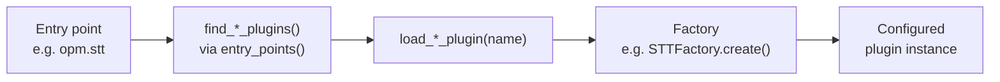

# OVOS Plugin Manager (OPM)

!!! success "Maturity — Mature ⬤⬤⬤⬤⬤"
    Long-lived and actively maintained. Depend on it freely. Rated by [repository health](maturity.md), not version.

!!! abstract "In a nutshell"
    A plugin is an add-on you can drop in to give OpenVoiceOS a new ability or swap how it
    does something. For example, a different way to turn speech into text. The Plugin
    Manager is the part that finds these add-ons once they're installed, and loads them
    when needed, so you don't have to wire anything up by hand.

    Think of it like the app store and launcher for OVOS's interchangeable pieces. Install
    one, and the system discovers it. See the [Glossary](glossary.md) for unfamiliar terms
    or the [Architecture Overview](architecture-overview.md) for how plugins fit into the
    wider system.

??? info "Formal specification"
    OPM is the *discovery and loading* mechanism. It is not itself a spec, but several plugin **roles** it loads are defined by the architecture specs and carry conformance obligations independent of OPM. In particular, **pipeline plugins** (entry point `opm.pipeline`) implement the `match(utterances, lang, message) → Match` contract and **first-match-wins** ordering of **[OVOS-PIPELINE-1](https://github.com/OpenVoiceOS/architecture/blob/dev/pipeline-1.md)**, and the six **transformer** plugin types (`opm.transformer.*`) implement the six ordered chains of **[OVOS-TRANSFORM-1](https://github.com/OpenVoiceOS/architecture/blob/dev/transformer.md)** (priority **ascending**, lower runs earlier). See the [spec index](architecture-specs.md) for the full set of plugin-role specs.


The OVOS Plugin Manager (OPM) is the plugin discovery and loading infrastructure for the
OVOS ecosystem. It standardizes the interface for plugins via Python package entry points,
making plugins portable, independently installable, and reusable across OVOS services and
other projects.

---

## How It Works

Plugins are Python packages that register a class under a specific entry point group in
`setup.py` or `pyproject.toml`. OPM uses `importlib.metadata.entry_points()` to discover
all installed plugins of a given type at runtime. No manual registration is required.



*Diagram:* The flow starts at the entry point declaration and ends at a configured plugin instance, passing through plugin discovery, loading, and the factory that builds it.

```python
from ovos_plugin_manager.stt import find_stt_plugins, load_stt_plugin

# List all installed STT plugins
print(find_stt_plugins())

# {'ovos-stt-plugin-whisper': <class ...>, 'ovos-stt-plugin-server': <class ...>}

# Load a specific plugin class
MySTT = load_stt_plugin("ovos-stt-plugin-whisper")

```

Factories handle the full lifecycle: discovery, instantiation, and configuration:

```python
from ovos_plugin_manager.stt import OVOSSTTFactory

stt = OVOSSTTFactory.create({
    "module": "ovos-stt-plugin-whisper",
    "ovos-stt-plugin-whisper": {"model": "base"}
})
transcript = stt.execute(audio_data)

```

---

## Plugin Types

All plugin types are defined in the `PluginTypes` enum (`ovos_plugin_manager.utils`),
grouped into core voice-pipeline, system/hardware, transformer, language-processing,
intent-pipeline, media, agent, embeddings/knowledge, and skill/persona plugins, plus a
table of deprecated entry-point groups. The full, exhaustive table of every plugin type,
its entry point group, and its template base class now lives on its own page:
**[Plugin Types Reference](plugin-types-reference.md)**.

---

## Writing a Plugin

### 1. Implement the base class

```python

# my_stt_plugin/__init__.py
from ovos_utils import classproperty
from ovos_plugin_manager.templates.stt import STT
from typing import Optional, Set

class MySTTPlugin(STT):
    """My custom speech-to-text engine."""

    # classproperty, not @property: OPM reads this off the class, before any
    # instance exists. See the note below.
    @classproperty
    def available_languages(cls) -> Set[str]:
        return {"en-US", "en-GB", "de-DE"}

    def execute(self, audio, language: Optional[str] = None) -> str:
        lang = language or self.lang
        # call your backend here and return transcript
        return "hello world"

```

```python

# my_tts_plugin/__init__.py
from ovos_utils import classproperty
from ovos_plugin_manager.templates.tts import TTS, TTSValidator
from typing import Set

class MyTTSPlugin(TTS):
    """My custom text-to-speech engine."""

    def __init__(self, config=None):
        super().__init__(config, audio_ext="wav")

    @classproperty
    def available_languages(cls) -> Set[str]:
        return {"en-US"}

    def get_tts(self, sentence: str, wav_file: str, lang=None, voice=None):
        # synthesize `sentence` to `wav_file`; return (wav_file, phonemes_or_None)
        return wav_file, None

class MyTTSValidator(TTSValidator):
    def validate_lang(self):
        assert self.tts.lang in MyTTSPlugin.available_languages

    def get_tts_class(self):
        return MyTTSPlugin

```

```python

# my_ww_plugin/__init__.py
from ovos_plugin_manager.templates.hotwords import HotWordEngine

class MyWakeWord(HotWordEngine):
    """My custom wake word detector."""

    def __init__(self, key_phrase="hey mycroft", config=None):
        super().__init__(key_phrase, config)

    def update(self, chunk: bytes) -> None:
        # feed audio chunk to the model
        pass

    def found_wake_word(self) -> bool:
        # return True when wake word is detected
        return False

```

### 2. Register the entry point

Use `pyproject.toml` (older plugins may still register the same groups through a legacy
`setup.py` `entry_points` dict, but new plugins should not):

```toml
[project.entry-points."opm.stt"]
my-engine-stt = "my_stt_plugin:MySTTPlugin"

[project.entry-points."opm.stt.config"]
my-engine-stt.config = "my_stt_plugin:MY_STT_CONFIGS"

```

!!! warning "`available_languages` is a `classproperty`"
    On both the `STT` and `TTS` base classes, `available_languages` is declared with
    `ovos_utils.classproperty`, because OVOS reads it off the class before instantiating
    the plugin — `get_plugin_supported_languages()` and `STT.detect_language()` both do.

    Override it with a plain `@property` and the class-level read returns the `property`
    object itself, not your set. The validator above shows the symptom:
    `self.tts.lang in MyTTSPlugin.available_languages` raises
    `TypeError: argument of type 'property' is not iterable`.

### 3. Install and verify

```bash
pip install -e .

python -c "
from ovos_plugin_manager.stt import find_stt_plugins
print('my-engine-stt' in find_stt_plugins())  # True
"

```

### 4. Expose language configurations (optional)

Plugins that support multiple voices/models should expose a `.config` entry point pointing at
a plain `{lang: [list_of_config_dicts]}` dict:

```python
MY_STT_CONFIGS = {
    "en-US": [
        {"lang": "en-US", "gender": "female", "priority": 50, "offline": True},
        {"lang": "en-US", "gender": "male",   "priority": 50, "offline": True},
    ],
    "de-DE": [
        {"lang": "de-DE", "gender": "female", "priority": 60, "offline": False},
    ],
}

```

!!! warning "Two things the config entry point is strict about"
    **The entry-point name needs the `.config` suffix.** `load_plugin_configs()` looks up
    `<plugin-name> + ".config"`, so an entry named `my-engine-stt` inside the
    `opm.stt.config` group is never found. The group alone is not enough.

    **The target must be the dict itself, not a class or a function that returns one.**
    `load_plugin_configs()` returns whatever the entry point loads, and every caller then
    treats it as a dict — `get_valid_plugin_configs()` iterates `.items()` on it. A class
    object survives loading and fails later, in code far from your plugin.

    Both mistakes fail silently: language and voice discovery just returns nothing, with no
    error to trace back.

| Config key | Type | Description |
|---|---|---|
| `lang` | `str` | BCP-47 language code |
| `priority` | `int` | Lower = higher priority (default 60) |
| `gender` | `str` | `"male"` or `"female"` |
| `offline` | `bool` | Whether this variant works without internet |
| `display_name` | `str` | Human-readable name for the voice/model |

### 5. Declare `RuntimeRequirements`

!!! note
    `RuntimeRequirements` is a deprecated mechanism. See [Runtime Requirements](skill-runtime-requirements.md) for current behavior.

Override `runtime_requirements` to declare connectivity needs. See
[Runtime Requirements](skill-runtime-requirements.md) for what OVOS actually does with this
declaration today.

```python
from ovos_utils.process_utils import RuntimeRequirements
from ovos_utils import classproperty

class MySTTPlugin(STT):

    @classproperty
    def runtime_requirements(cls):
        return RuntimeRequirements(
            internet_before_load=True,
            network_before_load=True,
            requires_internet=True,
            requires_network=True,
            no_internet_fallback=False,
            no_network_fallback=False,
        )

```

---

## Configuration Utilities

`ovos_plugin_manager.utils.config` provides helpers for resolving plugin configuration
from `mycroft.conf`: `get_plugin_config`, `load_plugin_configs`,
`load_configs_for_plugin_type`, `get_plugin_language_configs`,
`get_plugin_supported_languages`, and `sort_plugin_configs`. Full signatures and behavior
are documented on the **[Plugin Types Reference](plugin-types-reference.md#configuration-utilities)**
page.

---

## Configuration Priority

Within a config list, entries are sorted **ascending** by their `"priority"` key (default
`60`). `sort_plugin_configs()` puts the highest-numbered priority at the end of the list.
See `sort_plugin_configs` / `get_valid_plugin_configs` in `ovos_plugin_manager.utils.config`
for the exact ordering used when selecting a config.

---

## Voice Satellites ([HiveMind](hivemind-agents.md))

HiveMind setups allow distributing which plugins run server-side or satellite-side:

**Skills Server**: HiveMind server runs core services and skills. Satellites handle their
own STT/TTS locally:


**Audio Server**: HiveMind server runs a full OVOS core and handles STT/TTS for all
satellites:


---

## Projects Using OPM

- [ovos-core](https://github.com/OpenVoiceOS/ovos-core): intent pipeline, skill loading


- [ovos-audio](https://github.com/OpenVoiceOS/ovos-audio): TTS, audio backends


- [ovos-dinkum-listener](https://github.com/OpenVoiceOS/ovos-dinkum-listener): STT, wake word, VAD, microphone


- [ovos-tts-server](https://github.com/OpenVoiceOS/ovos-tts-server): HTTP TTS proxy


- [ovos-stt-http-server](https://github.com/OpenVoiceOS/ovos-stt-http-server): HTTP STT proxy


- [wyoming-ovos-stt / wyoming-ovos-tts / wyoming-ovos-wakeword](wyoming-bridges.md): Wyoming protocol bridges


- [neon-core](https://github.com/NeonGeckoCom/NeonCore): compatible fork


- [HiveMind voice satellite](https://github.com/JarbasHiveMind/HiveMind-voice-sat): distributed voice pipeline

STT, TTS, and Wake-word plugin types retain backward compatibility with Mycroft-Core via
legacy entry point aliases (`mycroft.plugin.*`).

---
**Read next:** [Plugin Types Reference](plugin-types-reference.md) · [Composable Deployments](composable-deployments.md)
**Related:** [Choosing Plugins](choosing-plugins.md) · [Plugin Arena](plugin-arena.md) · [Formal Specifications](architecture-specs.md) · [Transformers Overview](transformer-plugins.md)
