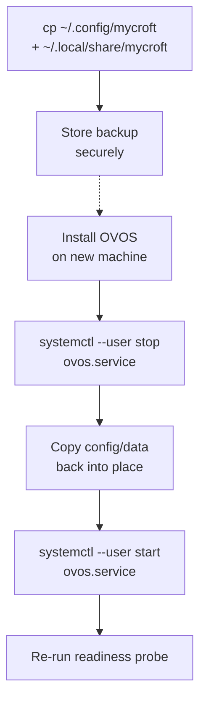
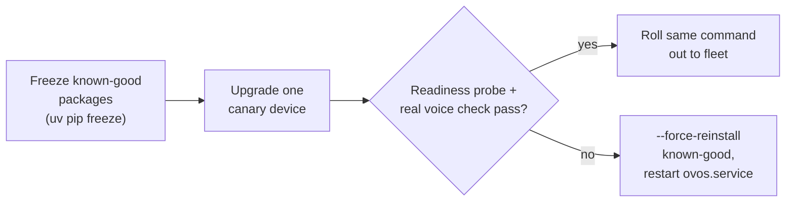

# Running OVOS in Production

!!! abstract "In a nutshell"
    A single OVOS assistant on your desk needs almost no care and feeding. Running many of
    them (a fleet of kiosks, a house full of satellite devices, a product built on top of
    OVOS) is a different job. You need services that restart themselves when they crash,
    a way to know the assistant is actually ready before you rely on it, logs you can ship
    somewhere central, and a safe way to upgrade a device (and undo the upgrade if it goes
    wrong) without physically touching it. This page collects the real, verified pieces for
    that job: systemd units, a readiness probe, log locations, staged upgrades with
    rollback, and how to run one shared speech backend for many thin clients. It assumes you
    are already comfortable with [installing OVOS](ovos-installer.md) and the
    [release channels](release-channels.md) page.

!!! tip "Is this page for you?"
    One assistant on your desk needs almost none of this. Read
    [Privacy & Security](privacy-security.md) instead. Several devices, a shared backend, or
    an assistant you don't sit next to: keep reading here.

---

## Keep services running: systemd units

OVOS itself does not manage process supervision. That is left to the OS. The
[`ovos-installer`](ovos-installer.md) and the [raspOVOS](install-raspovos.md) image both use
**systemd user units** for this. The examples below are adapted from the units raspOVOS
actually ships (`overlays/base_ovos/home/ovos/.config/systemd/user/` in the
[raspOVOS](https://github.com/OpenVoiceOS/raspOVOS) repository).

A top-level dummy target groups all the OVOS services so you can start/stop/enable the whole
stack as one unit:

```ini title="~/.config/systemd/user/ovos.service"
[Unit]
Description=OVOS A.I. Software stack.

[Service]
Type=oneshot
Group=ovos
ExecStart=/bin/true
RemainAfterExit=yes

[Install]
WantedBy=default.target
```

Each real service is `PartOf=ovos.service` and `WantedBy=ovos.service`, so `systemctl --user
restart ovos.service` cascades to all of them, but each can also be restarted individually
without disturbing its siblings:

```ini title="~/.config/systemd/user/ovos-messagebus.service"
[Unit]
Description=OVOS Messagebus (Rust)
PartOf=ovos.service
After=ovos.service

[Service]
Group=ovos
UMask=002
ExecStart=/usr/local/bin/ovos_rust_messagebus
Restart=on-failure

[Install]
WantedBy=ovos.service
```

```ini title="~/.config/systemd/user/ovos-skills.service"
[Unit]
Description=OVOS Skills
PartOf=ovos.service
After=ovos.service
After=ovos-messagebus.service

[Service]
Type=notify
Group=ovos
UMask=002
ExecStart=%h/.venvs/ovos/bin/python /usr/libexec/ovos-systemd-skills
TimeoutStartSec=10m
TimeoutStopSec=1m
Restart=on-failure
StartLimitInterval=5min
StartLimitBurst=4

[Install]
WantedBy=ovos.service
```

If you are writing your own unit for a custom service (a skill runner, a persona server, a
thin-client bridge), the pattern worth keeping is:

- `Restart=on-failure`: restart on crash, not on a clean stop.
- `StartLimitInterval=` / `StartLimitBurst=`: give up (rather than loop forever) after
  repeated failures in a short window, so a broken deploy doesn't spin your CPU.
- `PartOf=`/`After=` the messagebus unit for anything that needs a live bus connection at
  startup.

`After=` only orders unit *start*. It says nothing about whether the messagebus is actually
accepting connections yet, and it says nothing about what happens when the bus unit *restarts*
later. See [Bus restart / reconnect behavior](bus-service.md#bus-restart-reconnect-behavior) for
what a dependent service's existing bus connection does when that happens (short version: it
reconnects on its own with backoff, so `Restart=on-failure` on the messagebus unit is enough.
You do not need to also restart every dependent service).

```bash
systemctl --user daemon-reload
systemctl --user enable --now ovos.service
systemctl --user status ovos-skills.service
journalctl --user -u ovos-skills.service -f
```

!!! note "System vs user units"
    The units above are **user** units (`~/.config/systemd/user/`), matching how raspOVOS and
    the installer run OVOS as the `ovos` user. If you need OVOS to start before any user logs
    in (a headless kiosk), install the same unit files under `/etc/systemd/system/` instead and
    use `systemctl enable --now` (no `--user`). You will also need
    `loginctl enable-linger ovos` if you keep user units but want them running without an
    active login session.

!!! warning "`PIDLock` kills the previous process silently"
    Most OVOS services use `PIDLock` (from `ovos-utils`) to guard against two copies running
    under the same name. On construction, `PIDLock` kills any existing process holding that
    name's PID file, then writes its own PID. There is no warning or confirmation prompt.

    If you start a service by hand while a systemd-managed copy is already running under the
    same name, `PIDLock` kills the systemd-managed one. The PID file is deleted on exit via
    `SIGINT`/`SIGTERM` handlers, so a process killed harder than that (`SIGKILL`, power loss)
    can leave a stale PID file behind that the next start-up will happily reuse.

---

## Knowing when the assistant is actually ready

Services report a rolling status (`started` → `ready` → `error`/`stopping`) over the bus, and
the [`ovos-skill-boot-finished`](https://github.com/OpenVoiceOS/ovos-skill-boot-finished) skill
polls each one and emits a single `mycroft.ready` message once every service it is configured to
wait on has reported ready. This is the signal to use in health checks, readiness probes, or an
`ExecStartPost` step, not "is the process running," which says nothing about whether the
voice pipeline can actually hear and answer you yet.

!!! note "Requires the boot-finished skill to be installed"
    `mycroft.ready` is emitted by a skill, not by `ovos-core` itself. It is pulled in by the
    `skills-audio` [extra](release-channels.md#what-are-ovos-extras)
    (`ovos-core[skills-audio]`, which pins `ovos-skill-boot-finished>=0.5.5a2` in `ovos-core`'s
    own `pyproject.toml`) and is installed by default on most full setups, but a from-scratch,
    headless, or minimal install must include it explicitly for the readiness probe below to
    ever get a response.

A minimal readiness probe using [`ovos-bus-client`](bus-service.md):

```python
from ovos_bus_client import MessageBusClient
from ovos_bus_client.message import Message

bus = MessageBusClient()
bus.run_in_thread()
response = bus.wait_for_response(
    Message("mycroft.ready.check"), reply_type="mycroft.ready", timeout=30
)
bus.close()
if response is None:
    raise SystemExit("OVOS did not report ready within 30s")
print("OVOS is ready")
```

Save that as `/usr/local/bin/ovos-ready-probe` and wire it into a unit as a post-start check:

```ini
ExecStartPost=/usr/local/bin/ovos-ready-probe
```

!!! warning "Timeout, not certainty"
    `wait_for_response` returns `None` on timeout. It does not raise. Always check for `None`.
    A bare `response.data` on a timed-out call raises `AttributeError`, not a clean failure.

### Headless devices: choosing what "ready" means

[`ovos-skill-boot-finished`](https://github.com/OpenVoiceOS/ovos-skill-boot-finished) is the
skill that actually answers `mycroft.ready.check` and decides what to wait for, via its
`ready_settings` setting. By default it waits for `skills` plus every installed skill to
register. For a server or a device with no GUI/audio you usually want to name only the
services that actually apply:

```yaml title="settings.json for ovos-skill-boot-finished"
ready_settings:
  - skills     # ovos-core skill loader reported ready
  - voice      # ovos-dinkum-listener reported ready (omit on a text-only/server node)
  - audio      # ovos-audio reported ready (omit if there is no speaker)
speak_ready: false   # don't speak a "ready" dialog on a headless box
ready_sound: false   # don't play a ready chime either
```

`network`/`internet`/`gui_connected` are also accepted `ready_settings` entries, and any
service exposing an OVOS `ProcessStatus` (including `PHAL`) can be named by its status key.

!!! warning "`mycroft.ready` only covers what you list"
    `mycroft.ready` only tracks the components named in `ready_settings`: skills, voice, and
    audio by default. It does **not** track the GUI or the media daemon unless you add
    `gui_connected` (or a media status key) yourself. That means a fleet can report "ready"
    while the screen is stuck (see [GUI status](gui-status.md)) or the media daemon
    (see [ovos-media](ovos-media.md)) is non-functional. The health check simply never asked
    about them.

!!! note "Upcoming: a bundled health check script"
    A ready-to-use OVOS health check script for the `ovos-installer` is in progress
    ([ovos-installer#542](https://github.com/OpenVoiceOS/ovos-installer/pull/542)), covering
    the same "is the assistant actually ready" question as the readiness probe above without
    writing your own.

---

## Log locations and shipping them out

OVOS logs to stdout by default. Every real deployment (systemd, raspOVOS, the installer) sets
a `logging` section in `mycroft.conf` so each service writes its own rotating file instead:

```json
{
  "logging": {
    "path": "~/.local/state/mycroft/",
    "max_bytes": 50000000,
    "backup_count": 6
  }
}
```

Without that section, `ovos-utils`' logger still defaults to a file under
`$XDG_STATE_HOME/mycroft/<service>.log` (typically `~/.local/state/mycroft/`) rather than pure
stdout. Check that directory first if you can't find a log file. Each service gets its own
file named after it (`skills.log`, `bus.log`, `audio.log`, `voice.log`, `gui.log`, ...).

`ovos-utils` also ships a small CLI, `ovos-logs`, for navigating those files without hunting
through each one by hand:

```bash
ovos-logs show -l skills            # page through skills.log (uses $PAGER/less)
ovos-logs slice -l bus -l skills -f ~/incident.log   # extract bus+skills since service start
ovos-logs slice -s "01-12-2023" -u "01-12-2023 17:00" # slice a specific window
ovos-logs reduce -s 1000000         # trim every log down to ~1MB (keep the tail)
```

For centralized log shipping (many devices to one place), point a standard log-forwarding
agent (Vector, Fluent Bit, Promtail, `rsyslog`) at the log directory, or redirect the systemd
unit's stdout to the journal (the default) and ship `journalctl` output instead. OVOS itself
does not include a log-shipping client.

---

## Backup and restore



*Diagram:* The flow starts at backing up the config and data directories and ends at re-running the readiness probe, and the stored backup branches off to a new machine before the service is stopped, restored, and restarted.

Two kinds of state matter on an OVOS device: the packages that are installed, and everything
under a user's config/data directories. The staged-upgrade recipe below covers packages. This
section covers the directories.

| What | Path | Source |
|---|---|---|
| User config (`mycroft.conf`), may hold plaintext secrets | `~/.config/mycroft/mycroft.conf` | [Locations](locations-ref.md#path-constants) |
| System config (fleet-wide layer, if you use one) | `/etc/mycroft/mycroft.conf` | [Locations](locations-ref.md#path-constants), [one config for many devices](#one-config-for-many-devices-the-system-config-layer) |
| Per-skill settings | `~/.config/mycroft/skills/<skill_id>/settings.json` | [Skill Settings: Storage Location](skill-settings.md#storage-location) |
| Per-skill persistent files | `~/.local/share/mycroft/filesystem/skills/<skill_id>/` | [Filesystem Access: Storage Path](skill-filesystem.md#storage-path) |

`~/.config/mycroft` and `~/.local/share/mycroft` are the effective defaults under the standard
XDG layout. Both move together if `OVOS_CONFIG_BASE_FOLDER` renames the `mycroft` subdirectory
system-wide (see [Locations](locations-ref.md#environment-variable-influence)).

### Backup recipe

A copy is enough. Nothing here needs a database dump or a running service to stop first,
though restarting the service afterward picks up any config changes made in the meantime:

```bash
BACKUP_DIR=~/ovos-backup-$(date +%F)
mkdir -p "$BACKUP_DIR"
cp -a ~/.config/mycroft "$BACKUP_DIR/config"
cp -a ~/.local/share/mycroft "$BACKUP_DIR/data"
```

`mycroft.conf` can contain plaintext API keys and tokens (see
[Privacy & Security: mycroft.conf can contain plaintext secrets](privacy-security.md#mycroftconf-can-contain-plaintext-secrets)).
Store the backup with the same care you'd give the original file, and never commit it to a
public repository.

### Restore onto a fresh install

1. [Install OVOS](ovos-installer.md) normally on the new machine, and confirm the stock
   assistant works before restoring anything, so a restore problem is not confused with an
   install problem.
2. Stop the services: `systemctl --user stop ovos.service`.
3. Copy the backed-up directories back into place, overwriting the freshly-installed defaults:

   ```bash
   cp -a "$BACKUP_DIR/config/." ~/.config/mycroft/
   cp -a "$BACKUP_DIR/data/." ~/.local/share/mycroft/
   ```

4. Restart: `systemctl --user start ovos.service`, then re-run the readiness probe above
   before relying on the device.

Skills themselves are not part of this backup. They are Python packages, reinstalled the same
way they were installed originally (see [Skill Installer](skill-installer.md) or your own
provisioning step). Only their settings and persisted files travel with the config/data
backup above.

---

## Updating a single device

The [staged-upgrade recipe](#staged-upgrades-and-rollback) below is written for a fleet, but
the same steps apply to a single, standalone device with the fleet-specific parts dropped:
back up the config, freeze the current package set, upgrade, and verify.

```bash
# 1. Back up config and freeze the current package set, in case you need to go back
cp ~/.config/mycroft/mycroft.conf ~/.config/mycroft/mycroft.conf.bak-$(date +%F)
uv pip freeze > ~/ovos-known-good-$(date +%F).txt

# 2. Upgrade against a pinned constraints file (stays within one release channel)
uv pip install --upgrade ovos-core[mycroft] \
    -c https://raw.githubusercontent.com/OpenVoiceOS/ovos-releases/refs/heads/main/constraints-stable.txt

# 3. Restart and re-run the readiness probe above before declaring success
systemctl --user restart ovos.service
```

If it misbehaves, roll back the same way as in the fleet recipe:
`uv pip install --force-reinstall -r ~/ovos-known-good-<date>.txt`, then restart the service.
See [Staged upgrades and rollback](#staged-upgrades-and-rollback) for why `--force-reinstall`
is required on rollback, and [Release Channels: Pinning or rolling back a single
package](release-channels.md#pinning-or-rolling-back-a-single-package) if only one package
regressed rather than the whole stack.

---

!!! warning "Check the breaking-change reference before any version jump"
    An upgrade that crosses release eras can hit renamed config keys, changed skill
    APIs, and removed bus topics. Before upgrading, go straight to
    [For Device & Fleet Operators](updating-deployers.md), the deployer page of the
    [Updating from Older OVOS](updating-from-older-ovos.md) hub, and read forward from
    your current era. If you maintain custom skills or plugins, see
    [Version-Compatible Skills & Plugins](version-compat-guide.md).

## Staged upgrades and rollback



*Diagram:* The flow starts at freezing known-good packages and ends at either the fleet rollout or a rollback, and it branches on whether the canary device passes its readiness probe and real voice check.

[Release channels](release-channels.md) covers `stable`/`testing`/`alpha` constraints files.
For a fleet, the same mechanism gives you a controlled, reversible upgrade path:

If only a single package regressed, rolling back the whole stack is unnecessary. See
[Release Channels: Pinning or rolling back a single
package](release-channels.md#pinning-or-rolling-back-a-single-package) for pinning and
restarting just that one package across the fleet.

!!! tip "Back up your configuration too"
    Package freezing protects the code. It does not protect your settings. Before an
    upgrade, also copy `~/.config/mycroft/mycroft.conf` somewhere safe. It can contain
    plaintext tokens and API keys (see [privacy-security](privacy-security.md#mycroftconf-can-contain-plaintext-secrets)),
    so store the backup with the same care you'd give the original file.

```bash
# 1. Freeze exactly what's currently installed, in case you need to go back
uv pip freeze > /etc/ovos/known-good-$(date +%F).txt
cp ~/.config/mycroft/mycroft.conf ~/.config/mycroft/mycroft.conf.bak-$(date +%F)

# 2. Upgrade against a pinned constraints file (stays within one release channel)
uv pip install --upgrade ovos-core[mycroft] \
    -c https://raw.githubusercontent.com/OpenVoiceOS/ovos-releases/refs/heads/main/constraints-stable.txt

# 3. Restart and re-run the readiness probe above before declaring success
systemctl --user restart ovos.service
```

If the upgrade misbehaves, roll back to the frozen set:

```bash
uv pip install --force-reinstall -r /etc/ovos/known-good-2026-07-01.txt  # use the actual date from the freeze file you created in step 1
systemctl --user restart ovos.service
```

`--force-reinstall` is needed on rollback because a plain `pip install` treats "already
satisfies requirement" as nothing to do. It will not downgrade a package back to an older
pinned version on its own.

!!! tip "Stage it on one device first"
    Constraints files are a moving target upstream. Roll an upgrade out to one canary device,
    confirm the readiness probe and a couple of real voice interactions succeed, then repeat
    the same `uv pip install -c ...` command across the rest of the fleet.

!!! warning "Detecting a partially-failed rollback"
    `--force-reinstall` can itself be interrupted (network drop, disk full, `Ctrl-C`) partway
    through reinstalling the packages listed in the frozen file, leaving some packages back at
    the old pinned version and others still on the newer one. Compare the current environment
    against the frozen file to check:

    ```bash
    diff <(uv pip freeze | sort) <(sort /etc/ovos/known-good-2026-07-01.txt)
    ```

    Any line in the diff is a package whose installed version does not match the known-good
    snapshot. Re-run the `--force-reinstall` rollback command to finish the job before
    restarting the service. `uv pip check` is also worth running after either an upgrade or a
    rollback: it reports any dependency resolution left inconsistent (declared requirements no
    longer satisfied by what's installed), which a partial rollback commonly causes.

---

## One config for many devices: the system config layer

OVOS reads configuration from several layered files, [merged in order](config.md) so that a
more specific file overrides a more general one. The layer meant for fleet-wide, admin-managed
settings is the **system config**, at a fixed path:

```text
/etc/mycroft/mycroft.conf
```

This file sits below each user's own `~/.config/mycroft/mycroft.conf`, so per-device
overrides still win, but anything you don't override there comes from the system file. This
is the layer to drop settings into via configuration management (Ansible, a Debian package
postinst, a golden image) rather than hand-editing every device's user config. For example,
pinning the same wake word, STT/TTS servers, or `ready_settings` across an entire fleet.

---

## Thin clients + a shared speech backend

For a step-by-step build of a server-plus-satellites deployment, see [Satellites](satellites.md).

A common fleet topology is several low-power "thin" devices that only run the bus, listener
and audio services, all pointed at one shared, more capable machine that does the actual
speech-to-text and text-to-speech work over HTTP (see [STT server](stt-server.md) and
[TTS server](tts-server.md)). A sketch, based on the real container images published by
[`ovos-docker`](https://github.com/OpenVoiceOS/ovos-docker). For the client-side config keys
and a worked example on a single LAN IP, see
[privacy-security: point a device at your own LAN servers](privacy-security.md#point-a-device-at-your-own-lan-servers).

!!! danger "These ports are unauthenticated plain HTTP"
    `8080` and `9666` below serve unauthenticated plain HTTP by default. Never expose them
    to untrusted networks. Add API keys and/or put a reverse proxy in front of them before
    they leave localhost. See [tts-server: Tips & Caveats](tts-server.md#tips-caveats) for
    how.

```yaml title="docker-compose.yml — central speech backend"
services:
  ovos_stt_server:
    image: docker.io/smartgic/ovos-stt-server-onnx-asr:${VERSION}   # or your own build, see stt-server.md
    ports: ["8080:8080"]  # UNAUTHENTICATED — do not expose beyond localhost/VPN

  ovos_tts_server:
    image: docker.io/smartgic/ovos-tts-server-piper:${VERSION}      # or your own build, see tts-server.md
    ports: ["9666:9666"]  # UNAUTHENTICATED — do not expose beyond localhost/VPN
```

The speech-server image name encodes the engine baked into it: `ovos-stt-server-onnx-asr`,
`ovos-stt-server-onnx-asr-cuda`, `ovos-tts-server-piper`, `ovos-tts-server-kokoro`,
`ovos-tts-server-phoonnx` and so on. Pick the variant carrying the plugin you want. There is
no generic image that loads an arbitrary engine at runtime.

```yaml title="docker-compose.yml — thin client (per device)"
services:
  ovos_messagebus:
    image: docker.io/smartgic/ovos-messagebus:${VERSION}
    network_mode: host  # shares host loopback AND LAN interfaces with every container on this host

  ovos_listener:
    image: docker.io/smartgic/ovos-listener:${VERSION}
    network_mode: host
    depends_on: [ovos_messagebus]
    devices: ["/dev/snd"]                      # microphone passthrough
    volumes:
      - ${XDG_RUNTIME_DIR}/pulse:${XDG_RUNTIME_DIR}/pulse:ro
      - ~/.config/pulse/cookie:/home/${OVOS_USER}/.config/pulse/cookie:ro
      - ~/.config/mycroft:/home/${OVOS_USER}/.config/mycroft
    # set stt.module = ovos-stt-plugin-server and stt.ovos-stt-plugin-server.urls to the
    # central STT server above, in the mounted /home/${OVOS_USER}/.config/mycroft/mycroft.conf

  ovos_audio:
    image: docker.io/smartgic/ovos-audio:${VERSION}
    network_mode: host
    depends_on: [ovos_messagebus]
    devices: ["/dev/snd"]                      # speaker passthrough
    volumes:
      - ${XDG_RUNTIME_DIR}/pulse:${XDG_RUNTIME_DIR}/pulse:ro
      - ~/.config/pulse/cookie:/home/${OVOS_USER}/.config/pulse/cookie:ro
      - ~/.config/mycroft:/home/${OVOS_USER}/.config/mycroft
      - ovos_tts_cache:/home/${OVOS_USER}/.cache/mycroft/tts
    # set tts.module = ovos-tts-plugin-server and tts.ovos-tts-plugin-server.host to the
    # central TTS server above, in the mounted /home/${OVOS_USER}/.config/mycroft/mycroft.conf

  ovos_core:
    image: docker.io/smartgic/ovos-core:${VERSION}
    network_mode: host
    depends_on: [ovos_messagebus]
```

`depends_on` here only orders **container start**. It starts `ovos_messagebus` first, but does
not wait for it to actually accept WebSocket connections before starting the services listed
after it. Use the [readiness probe](#knowing-when-the-assistant-is-actually-ready) (or Compose's
own `depends_on: condition: service_healthy` against a healthcheck that runs it) as the real gate
if a dependent service needs the bus to be live, not just the container to exist.

Audio devices and sockets have to be handed to the containers that touch them: the listener
needs the microphone, the audio service needs the speaker, and both need the host's PulseAudio
or PipeWire socket. Anything you want to survive a container rebuild (downloaded models, the
TTS cache, listener recordings, local state) belongs in a named volume rather than the
container filesystem. The
[reference compose file](https://github.com/OpenVoiceOS/ovos-docker/blob/dev/compose/docker-compose.yml)
in `ovos-docker` is the fuller version of the sketch above, with every volume, device,
resource limit and healthcheck spelled out.

!!! danger "`network_mode: host` shares the loopback across every container on that host"
    With `network_mode: host`, `127.0.0.1` is the **host's** loopback, not a container-private
    one. Every container and process on that host shares it. A bus bound to `127.0.0.1` is
    reachable by any of them, not just `ovos_messagebus`.

    "Bound to localhost" no longer means "only reachable by this one process" once host
    networking is in play. Treat the whole host as the trust boundary, not the individual
    container.

    Host networking also exposes any service that binds `0.0.0.0` straight onto the LAN, not
    just the host's own loopback. `gui_websocket.host` defaults to `127.0.0.1` (loopback only);
    widening it to `0.0.0.0` (all interfaces) is the opt-in for remote display clients. Combined
    with `network_mode: host` here, that opt-in puts the GUI WebSocket on the LAN, not just the
    device. Leave `gui_websocket.host` at its `127.0.0.1` default unless a remote display client
    genuinely needs LAN access.

Each thin client still runs its own bus, listener, audio and core. Only the heavy STT/TTS
inference is centralized. This is the same pattern as
[Wyoming bridges](wyoming-bridges.md) and [HiveMind](hivemind-agents.md), just wired directly
through the companion server plugins instead of a satellite protocol. See
[Composable Deployments](composable-deployments.md) for the general principle of splitting
OVOS across machines.

---

## Observability: what exists and what doesn't

!!! warning "There is no built-in metrics endpoint"
    OVOS does not expose a Prometheus-style `/metrics` endpoint or any built-in dashboard. The
    closest thing is usage-metric uploads, and those are **explicitly opt-in**: disabled by
    default, with nothing sent anywhere unless you deliberately configure an endpoint (see the
    commented-out `opendataConfig`-style keys in the default `mycroft.conf`, and
    [`ovos-opendata-server`](ecosystem-index.md) if you want to run your own collector). That
    is a telemetry pipeline you opt into, not an operational metrics/monitoring system.

For day-to-day, per-device debugging, use:

- **`ovos-busmon`**: a browser-based web UI (FastAPI + WebSocket) that streams the live message traffic on a device's bus in
  real time. The fastest way to see whether wake word → STT → intent → TTS is actually firing.
- **`ovos-logs`** (above) for historical logs.
- The [readiness probe](#knowing-when-the-assistant-is-actually-ready) as a synthetic check you
  can run from outside the device (cron, a monitoring agent, a CI job) on a schedule.

There is no supported way to scrape per-request latency or error rates across a fleet today.
If you need that, you will need to build it on top of the bus messages yourself.

### Building fleet-wide alerting yourself

Since there is no push-based metrics endpoint, fleet alerting has to be built the other way
around. Something outside each device polls its
[readiness probe](#knowing-when-the-assistant-is-actually-ready) on a schedule and reports a
non-zero exit to whatever already pages you. A `systemd` timer wrapping the probe script from
above is enough to get started:

```ini title="~/.config/systemd/user/ovos-alert.service"
[Unit]
Description=Check OVOS readiness and alert on failure

[Service]
Type=oneshot
ExecStart=/bin/sh -c '/usr/local/bin/ovos-ready-probe || /usr/local/bin/notify-monitoring-agent "ovos not ready"'
```

```ini title="~/.config/systemd/user/ovos-alert.timer"
[Unit]
Description=Run the OVOS readiness check every 5 minutes

[Timer]
OnBootSec=5min
OnUnitActiveSec=5min

[Install]
WantedBy=timers.target
```

```bash
systemctl --user enable --now ovos-alert.timer
```

`notify-monitoring-agent` above is a stand-in for whatever already collects failures on your
fleet: a `curl` to a Healthchecks.io/Cronitor-style dead-man's-switch URL, a call into your
monitoring agent's CLI, an email, a webhook. The same pattern works as a plain `cron` entry
(`*/5 * * * * /usr/local/bin/ovos-ready-probe || /usr/local/bin/notify-monitoring-agent ...`) on a
system without `systemd --user` timers. This is something you build, not something OVOS ships.
But it is the whole shape of a working readiness alert: schedule the probe, act on its exit code.

---
**Read next:** [Privacy & Security](privacy-security.md)
**Related:** [STT Server](stt-server.md) · [Updating from Older OVOS](updating-from-older-ovos.md) · [HiveMind](hivemind-agents.md) · [Release Channels](release-channels.md)
