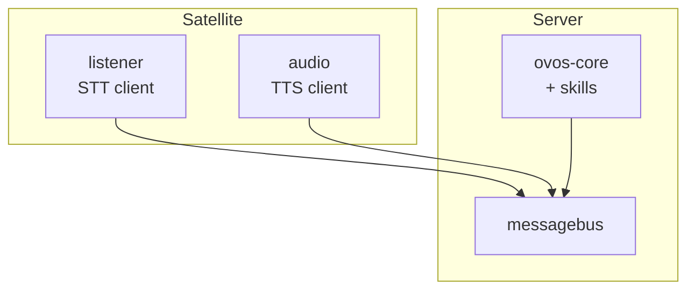

# Satellites: One Brain, Many Speakers

!!! abstract "In a nutshell"
    A satellite deployment puts one capable server in the middle and several small
    devices around the house. The server runs the messagebus, `ovos-core`, and skills.
    Each satellite only listens and speaks. This page is the build guide. It has two
    paths: a raw shared bus for a trusted LAN, and HiveMind for anything that needs
    auth or crosses an untrusted network.



*Diagram: the server runs the messagebus and ovos-core with skills. Each satellite runs a
listener and an audio service, and both connect back to the server's messagebus.*

---

## Raw shared bus or HiveMind: pick one

| | Raw shared bus | HiveMind |
|---|---|---|
| Security | None. No login, no encryption. Anyone who reaches the port controls the assistant. | Access-key auth plus an encrypted protocol. |
| Isolation between clients | None. Every satellite sees every message on the bus. | Per-client credentials and a `PolicyChain` that can allow or block message types per client. |
| Session handling | One shared `ovos-core`. All satellites drive the same session and conversation state. | Same shared agent by default, but HiveMind tracks each client's own connection and permissions. |
| Effort to set up | Low. Edit `websocket.host` in each service's config and start the services. | Higher. Provision a client, run `hivemind-core`, set up identity on each satellite. |

Keep the raw shared bus on a trusted LAN only. Never forward its port to the internet.
Use HiveMind for anything off your own network, or when you need to tell satellites apart.

Both paths on this page share one `ovos-core` brain across every satellite. If you instead
want each device to run its own independent `ovos-core` and only share the heavy STT/TTS
inference, see [Production Operations: thin clients + a shared speech backend](production-operations.md#thin-clients-a-shared-speech-backend).

---

## Build walkthrough A: raw shared bus

Run this only on a network you fully trust. Every service that joins this bus gets full
control of the assistant, with no login check.

### Services and placement

| Host | Services |
|---|---|
| Server | `ovos-messagebus`, `ovos-core` |
| Each satellite | `ovos-dinkum-listener`, `ovos-audio`, `ovos-PHAL` |

### Server config

On the server, bind the bus to all interfaces so satellites can reach it:

```jsonc
{
  "websocket": {
    "host": "0.0.0.0",
    "port": 8181,
    "route": "/core"
  }
}
```

### Satellite config

On each satellite, point `websocket.host` at the server's LAN address:

```jsonc
{
  "websocket": {
    "host": "192.168.1.10",
    "port": 8181,
    "route": "/core"
  }
}
```

Replace `192.168.1.10` with the server's real address. Set this in every satellite's
`mycroft.conf`, and in the server's own file if any service other than the bus itself
also needs to find it.

Running this over containers instead of bare metal? See
[Running OVOS in Containers: Server/satellite split](docker-deployment.md#serversatellite-split)
for matching server and satellite `docker-compose.yml` files.

!!! warning "One shared session, not one per satellite"
    `ovos-core`, `ovos-audio`, and `ovos-dinkum-listener` each assume they are the only
    instance of that service on the bus. Two listeners on two satellites share the same
    `ovos-core` and the same converse/session state. A conversation started in the kitchen
    can carry into the bedroom's next utterance. This is not a bug to patch around with
    `session_id` filtering in a skill. It is a property of the shared bus. See
    [Composable Deployments: services are implicit singletons per bus](composable-deployments.md#services-are-implicit-singletons-per-bus).

!!! warning "Defaults assume localhost"
    `websocket.host` defaults to `127.0.0.1` everywhere. A satellite left on the default
    will start and look healthy, then never reach the server. Set the host explicitly on
    every satellite and check it after any config reset. See
    [Composable Deployments: defaults assume localhost](composable-deployments.md#defaults-assume-localhost).

---

## Build walkthrough B: HiveMind

Use HiveMind when satellites need auth, need to cross an untrusted network, or need to
be told apart from one another. This manual covers only the OVOS side. HiveMind is a
separate project with its own protocol and docs.

1. Install and run the server: `pip install hivemind-core`, then `hivemind-core listen`.
   By default it bridges to a local `ovos-core` through `hivemind-ovos-agent-plugin`.
2. Provision each satellite with its own access key: `hivemind-core add-client`.
3. On each satellite, install `hivemind-websocket-client` and run
   `hivemind-client set-identity` to store that key.
4. Verify with `hivemind-client test-identity` before trusting the link.
5. For a mic-only satellite that leaves STT/TTS to the server, use
   `hivemind-mic-satellite` instead of running a full listener/audio pair locally.

By default `hivemind-core listen` binds `0.0.0.0` on port `5678` (the websocket protocol
plugin), so it is reachable on the LAN as soon as it starts. There is no `listen` flag to
change host or port. Edit the server config instead (`network_protocol` ->
`hivemind-websocket-plugin` -> `host`/`port`).
`hivemind-client set-identity` writes the access key, password, and server address to a
JSON identity file at `~/.config/hivemind/_identity.json` (XDG config dir, `hivemind`
subfolder). Point `--host`/`--port` at the server when running `set-identity` on the
satellite.

Full steps, permission model, and satellite/client packages: see
[Remote Agents with HiveMind](hivemind-agents.md). Wire-level protocol details live in the
upstream [HiveMind community docs](https://jarbashivemind.github.io/HiveMind-community-docs/),
not in this manual.

---

## Troubleshooting

**Satellite can't connect to the server.**

- Check the server's firewall allows inbound traffic on port `8181` (raw bus) or port
  `5678` (HiveMind listener, default bind `0.0.0.0`) from the satellite's address.
- Confirm `websocket.host` on the satellite points at the server's real LAN address, not
  `127.0.0.1`.
- For HiveMind, run `hivemind-client test-identity` on the satellite. A hang or error
  usually means the server is not running, the port is wrong, or the access key does not
  match one printed by `hivemind-core add-client`.

**Audio plays on the wrong box.**

- On the raw shared bus, every `ovos-audio` instance on the bus can react to the same
  `speak` message. Check that only one `ovos-audio` process is running per satellite, and
  that satellites are not accidentally sharing one `ovos-audio` instance across rooms.
- Confirm each satellite's own `websocket.host` points at the intended server, not at
  another satellite left on a stale config.

---
**Read next:** [HiveMind Agents](hivemind-agents.md)
**Related:** [Composable Deployments](composable-deployments.md) · [Production Operations](production-operations.md) · [messagebus Service](bus-service.md) · [Security Model](security-model.md)
