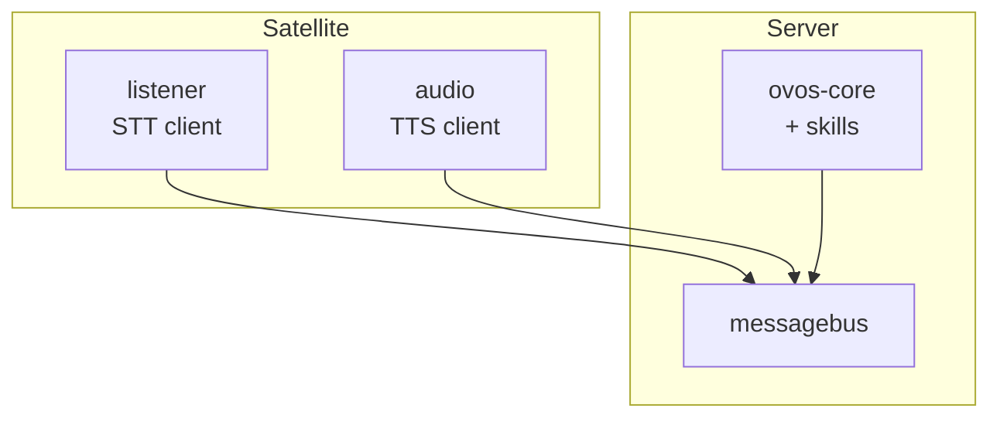

# Satellites: One Brain, Many Speakers

!!! abstract "In a nutshell"
    A satellite deployment puts one capable server in the middle and several small
    devices around the house. The server runs the messagebus, `ovos-core`, and skills.
    Each satellite only listens and speaks. This page is the build guide. It has two
    paths: a raw shared bus for a trusted LAN, and HiveMind for anything that needs
    auth or crosses an untrusted network.



*Diagram: the server runs the messagebus and ovos-core with skills. Each satellite runs a
listener and an audio service, and both connect back to the server's messagebus.*

---

## Raw shared bus or HiveMind: pick one

| | Raw shared bus | HiveMind |
|---|---|---|
| Security | None. No login, no encryption. Anyone who reaches the port controls the assistant. | Access-key auth plus an encrypted protocol. |
| Isolation between clients | None. Every satellite sees every message on the bus. | Per-client credentials and a `PolicyChain` that can allow or block message types per client. |
| Session handling | One shared `ovos-core`. All satellites drive the same session and conversation state. | Same shared agent by default, but HiveMind tracks each client's own connection and permissions. |
| Effort to set up | Low. Edit `websocket.host` in each service's config and start the services. | Higher. Provision a client, run `hivemind-core`, set up identity on each satellite. |

Keep the raw shared bus on a trusted LAN only. Never forward its port to the internet.
Use HiveMind for anything off your own network, or when you need to tell satellites apart.

Both paths on this page share one `ovos-core` brain across every satellite. If you instead
want each device to run its own independent `ovos-core` and only share the heavy STT/TTS
inference, see [Thin clients + a shared speech backend](#thin-clients-a-shared-speech-backend)
below.

---

## Build walkthrough A: raw shared bus

Run this only on a network you fully trust. Every service that joins this bus gets full
control of the assistant, with no login check.

### Services and placement

| Host | Services |
|---|---|
| Server | `ovos-messagebus`, `ovos-core` |
| Each satellite | `ovos-dinkum-listener`, `ovos-audio`, `ovos-PHAL` |

### Server config

On the server, bind the bus to all interfaces so satellites can reach it:

```jsonc
{
  "websocket": {
    "host": "0.0.0.0",
    "port": 8181,
    "route": "/core"
  }
}
```

### Satellite config

On each satellite, point `websocket.host` at the server's LAN address:

```jsonc
{
  "websocket": {
    "host": "192.168.1.10",
    "port": 8181,
    "route": "/core"
  }
}
```

Replace `192.168.1.10` with the server's real address. Set this in every satellite's
`mycroft.conf`, and in the server's own file if any service other than the bus itself
also needs to find it.

Running this over containers instead of bare metal? See
[Running OVOS in Containers: Server/satellite split](docker-deployment.md#serversatellite-split)
for matching server and satellite `docker-compose.yml` files.

!!! warning "One shared session, not one per satellite"
    `ovos-core`, `ovos-audio`, and `ovos-dinkum-listener` each assume they are the only
    instance of that service on the bus. Two listeners on two satellites share the same
    `ovos-core` and the same converse/session state. A conversation started in the kitchen
    can carry into the bedroom's next utterance. This is not a bug to patch around with
    `session_id` filtering in a skill. It is a property of the shared bus. See
    [Composable Deployments: services are implicit singletons per bus](composable-deployments.md#services-are-implicit-singletons-per-bus).

!!! warning "Defaults assume localhost"
    `websocket.host` defaults to `127.0.0.1` everywhere. A satellite left on the default
    will start and look healthy, then never reach the server. Set the host explicitly on
    every satellite and check it after any config reset. See
    [Composable Deployments: defaults assume localhost](composable-deployments.md#defaults-assume-localhost).

---

## Build walkthrough B: HiveMind

Use HiveMind when satellites need auth, need to cross an untrusted network, or need to
be told apart from one another. This manual covers only the OVOS side. HiveMind is a
separate project with its own protocol and docs.

1. Install and run the server: `pip install hivemind-core`, then `hivemind-core listen`.
   By default it bridges to a local `ovos-core` through `hivemind-ovos-agent-plugin`.
2. Provision each satellite with its own access key: `hivemind-core add-client`.
3. On each satellite, install the client — the distribution is `hivemind-bus-client`, the
   repository is `hivemind-websocket-client` — and store the key:

   ```bash
   pip install hivemind-bus-client
   hivemind-client set-identity --key <access_key> --password <password> --host <server>
   ```

   `set-identity` with no arguments raises: it needs at least one of `--key`, `--password` or
   `--siteid`.
4. Verify with `hivemind-client test-identity` before trusting the link.
5. For a mic-only satellite that leaves STT/TTS to the server, use
   `hivemind-mic-satellite` instead of running a full listener/audio pair locally.

By default `hivemind-core listen` starts **two** listeners, both on `0.0.0.0`: the websocket
protocol plugin on `5678` and the HTTP protocol plugin on `5679`. Both are in the default
`network_protocol` config and both start, so a firewall rule that only covers 5678 leaves the
second one open. Local-network presence is on by default too, so the node announces itself
over mDNS.

There is no `listen` flag to change host or port. Edit the server config instead
(`network_protocol` -> `hivemind-websocket-plugin` / `hivemind-http-plugin` -> `host`/`port`),
and set `presence.enabled` to `false` to stop the mDNS announcements.
`hivemind-client set-identity` writes the access key, password, and server address to a
JSON identity file at `~/.config/hivemind/_identity.json` (XDG config dir, `hivemind`
subfolder). Point `--host`/`--port` at the server when running `set-identity` on the
satellite.

Full steps, permission model, and satellite/client packages: see
[Remote Agents with HiveMind](hivemind-agents.md). Wire-level protocol details live in the
upstream [HiveMind community docs](https://jarbashivemind.github.io/HiveMind-community-docs/),
not in this manual.

---

## Thin clients + a shared speech backend

A common fleet topology is several low-power "thin" devices that each run a full
`ovos-core` (with the bus, listener and audio services), all pointed at one shared, more
capable machine that does the actual speech-to-text and text-to-speech work over HTTP (see
[STT server](stt-server.md) and [TTS server](tts-server.md)). Only the heavy STT/TTS
inference is centralized: each device keeps its own core, session, and skills. A sketch,
based on the real container images published by
[`ovos-docker`](https://github.com/OpenVoiceOS/ovos-docker). For the client-side config keys
and a worked example on a single LAN IP, see
[privacy-security: point a device at your own LAN servers](privacy-security.md#point-a-device-at-your-own-lan-servers).

!!! note "Not the shared-brain pattern"
    This is not the shared-brain pattern described above. Every device here keeps its own
    `ovos-core`, so each room is an independent assistant that shares only speech inference.
    For one shared brain and session, use the raw shared bus or HiveMind walkthroughs above
    instead.

!!! danger "These ports are unauthenticated plain HTTP"
    `8080` and `9666` below serve unauthenticated plain HTTP by default. Never expose them
    to untrusted networks. Add API keys and/or put a reverse proxy in front of them before
    they leave localhost. See [tts-server: Tips & Caveats](tts-server.md#tips-caveats) for
    how.

```yaml title="docker-compose.yml — central speech backend"
services:
  ovos_stt_server:
    image: docker.io/smartgic/ovos-stt-server-onnx-asr:${VERSION}   # or your own build, see stt-server.md
    ports: ["8080:8080"]  # UNAUTHENTICATED — do not expose beyond localhost/VPN

  ovos_tts_server:
    image: docker.io/smartgic/ovos-tts-server-piper:${VERSION}      # or your own build, see tts-server.md
    ports: ["9666:9666"]  # UNAUTHENTICATED — do not expose beyond localhost/VPN
```

The speech-server image name encodes the engine baked into it: `ovos-stt-server-onnx-asr`,
`ovos-stt-server-onnx-asr-cuda`, `ovos-tts-server-piper`, `ovos-tts-server-kokoro`,
`ovos-tts-server-phoonnx` and so on. Pick the variant carrying the plugin you want. There is
no generic image that loads an arbitrary engine at runtime.

```yaml title="docker-compose.yml — thin client (per device)"
services:
  ovos_messagebus:
    image: docker.io/smartgic/ovos-messagebus:${VERSION}
    network_mode: host  # shares host loopback AND LAN interfaces with every container on this host

  ovos_listener:
    image: docker.io/smartgic/ovos-listener:${VERSION}
    network_mode: host
    depends_on: [ovos_messagebus]
    devices: ["/dev/snd"]                      # microphone passthrough
    volumes:
      - ${XDG_RUNTIME_DIR}/pulse:${XDG_RUNTIME_DIR}/pulse:ro
      - ~/.config/pulse/cookie:/home/${OVOS_USER}/.config/pulse/cookie:ro
      - ~/.config/mycroft:/home/${OVOS_USER}/.config/mycroft
    # set stt.module = ovos-stt-plugin-server and stt.ovos-stt-plugin-server.urls to the
    # central STT server above, in the mounted /home/${OVOS_USER}/.config/mycroft/mycroft.conf

  ovos_audio:
    image: docker.io/smartgic/ovos-audio:${VERSION}
    network_mode: host
    depends_on: [ovos_messagebus]
    devices: ["/dev/snd"]                      # speaker passthrough
    volumes:
      - ${XDG_RUNTIME_DIR}/pulse:${XDG_RUNTIME_DIR}/pulse:ro
      - ~/.config/pulse/cookie:/home/${OVOS_USER}/.config/pulse/cookie:ro
      - ~/.config/mycroft:/home/${OVOS_USER}/.config/mycroft
      - ovos_tts_cache:/home/${OVOS_USER}/.cache/mycroft/tts
    # set tts.module = ovos-tts-plugin-server and tts.ovos-tts-plugin-server.host to the
    # central TTS server above, in the mounted /home/${OVOS_USER}/.config/mycroft/mycroft.conf

  ovos_core:
    image: docker.io/smartgic/ovos-core:${VERSION}
    network_mode: host
    depends_on: [ovos_messagebus]
```

`depends_on` here only orders **container start**. It starts `ovos_messagebus` first, but does
not wait for it to actually accept WebSocket connections before starting the services listed
after it. Use the [readiness probe](production-operations.md#knowing-when-the-assistant-is-actually-ready)
(or Compose's own `depends_on: condition: service_healthy` against a healthcheck that runs it)
as the real gate if a dependent service needs the bus to be live, not just the container to
exist.

Audio devices and sockets have to be handed to the containers that touch them: the listener
needs the microphone, the audio service needs the speaker, and both need the host's PulseAudio
or PipeWire socket. Anything you want to survive a container rebuild (downloaded models, the
TTS cache, listener recordings, local state) belongs in a named volume rather than the
container filesystem. The
[reference compose file](https://github.com/OpenVoiceOS/ovos-docker/blob/dev/compose/docker-compose.yml)
in `ovos-docker` is the fuller version of the sketch above, with every volume, device,
resource limit and healthcheck spelled out.

!!! danger "`network_mode: host` shares the loopback across every container on that host"
    With `network_mode: host`, `127.0.0.1` is the **host's** loopback, not a container-private
    one. Every container and process on that host shares it. A bus bound to `127.0.0.1` is
    reachable by any of them, not just `ovos_messagebus`.

    "Bound to localhost" no longer means "only reachable by this one process" once host
    networking is in play. Treat the whole host as the trust boundary, not the individual
    container.

    Host networking also exposes any service that binds `0.0.0.0` straight onto the LAN, not
    just the host's own loopback. `gui_websocket.host` ships as `127.0.0.1`, but if you widen
    it to `0.0.0.0` for a remote display — or an older config still carries that value — then
    with `network_mode: host` the GUI WebSocket lands on the LAN, not just the device. Keep
    the loopback default unless a remote display client genuinely needs LAN access.

Each thin client still runs its own bus, listener, audio and core. Only the heavy STT/TTS
inference is centralized. This is the same pattern as
[Wyoming bridges](wyoming-bridges.md) and [HiveMind](hivemind-agents.md), just wired directly
through the companion server plugins instead of a satellite protocol. See
[Composable Deployments](composable-deployments.md) for the general principle of splitting
OVOS across machines.

---

## Troubleshooting

**Satellite can't connect to the server.**

- Check the server's firewall allows inbound traffic on port `8181` (raw bus) or port
  `5678` (HiveMind listener, default bind `0.0.0.0`) from the satellite's address.
- Confirm `websocket.host` on the satellite points at the server's real LAN address, not
  `127.0.0.1`.
- For HiveMind, run `hivemind-client test-identity` on the satellite. A hang or error
  usually means the server is not running, the port is wrong, or the access key does not
  match one printed by `hivemind-core add-client`.

**Audio plays on the wrong box.**

- On the raw shared bus, every `ovos-audio` instance on the bus can react to the same
  `speak` message. Check that only one `ovos-audio` process is running per satellite, and
  that satellites are not accidentally sharing one `ovos-audio` instance across rooms.
- Confirm each satellite's own `websocket.host` points at the intended server, not at
  another satellite left on a stale config.

---
**Read next:** [HiveMind Agents](hivemind-agents.md)
**Related:** [Composable Deployments](composable-deployments.md) · [Production Operations](production-operations.md) · [messagebus Service](bus-service.md) · [Security Model](security-model.md)
