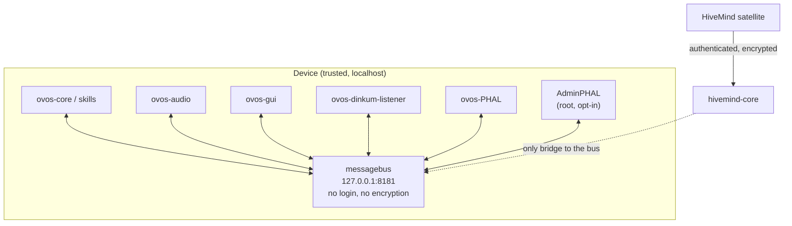

# Security & Trust Model

!!! abstract "In a nutshell"
    OVOS trusts everything running on the same device. The [messagebus](bus-service.md) has
    no login, skills run as plain Python code with no sandbox, and some hardware plugins run
    as root. None of this is a flaw to patch. It is the design: a local assistant that trusts
    its own machine the way any other local service does. The boundary you must not cross is
    the network. [HiveMind](hivemind-agents.md) is the supported way to reach OVOS from
    another device. This page tells the trust-boundary story once. For the operational
    checklist (what to lock down, what to check), see [Privacy & Security](privacy-security.md).

---

## The trust boundary is the device, not the process

OVOS is built from several separate processes (`ovos-core`, `ovos-audio`, `ovos-gui`,
`ovos-dinkum-listener`, `ovos-PHAL`) that all talk to each other over one shared
[messagebus](bus-service.md). Inside a single device, none of these processes distrust each
other, and none of them distrust the skills and plugins running inside `ovos-core`. That is a
deliberate simplification: a local assistant does not need internal authentication any more
than a shell script needs to authenticate itself to the next shell script in a pipeline. The
trust boundary is the device as a whole, not any one process on it.

That simplification has three consequences worth naming plainly.

## The bus has no authentication

*Diagram:* The flow starts at a HiveMind satellite and ends at the device messagebus, and hivemind-core branches as the only authenticated, encrypted bridge into the trusted device components.

The [messagebus](bus-service.md) is a pure fan-out WebSocket broker. Any client that opens a
connection to it, by default `127.0.0.1:8181`, can emit and receive every message on the bus,
with no login and no encryption. There is no per-client identity and no permission check.

A client that can reach the bus can trigger any skill, read everything crossing the bus, and
drive any plugin that exposes subprocess or file access. This is documented in full on
[Bus Service: Security](bus-service.md#configuration) and
[Privacy & Security: the messagebus is a trust boundary, not a security boundary](privacy-security.md#the-messagebus-is-a-trust-boundary-not-a-security-boundary).

Because of this, keeping the bus bound to `127.0.0.1` (the shipped default) is not one hardening
tip among many. It is the thing that makes every other assumption below hold.

## Skills are not sandboxed

There is no sandbox, permission model, or capability system for skills. Installing a skill
means running arbitrary Python code as the OVOS user, with the same filesystem and network
access as the rest of the assistant. This is exactly the same trust decision as
`pip install`ing a package from PyPI or GitHub, because that is literally the installation
mechanism (see [Skill Installer](skill-installer.md)). A skill is not a plugin sandboxed
behind a permission prompt the way a phone app is. It is code that runs with the same rights
as OVOS itself.

The [Skill Installer](skill-installer.md) can even do this at runtime, over the bus
(`ovos.skills.install`), but only when `skills.installer.allow_pip` is explicitly turned on.
Combining `allow_pip: true` with a bus reachable by anyone untrusted is a remote-code-execution
chain: whoever can speak to the bus can ask OVOS to `pip install` and load code they control.
See [Skill Installer: Configuration](skill-installer.md#configuration) for the guard and why it
defaults off.

## AdminPHAL runs as root

Most hardware access in OVOS goes through [PHAL](phal.md) plugins running as the ordinary
OVOS user. A separate class, **AdminPHAL** plugins, exists for hardware that genuinely needs
elevated privilege: I²C, SPI, GPIO, system power management, thermal control. AdminPHAL
plugins are disabled unless explicitly turned on with `"enabled": true` in
`PHAL.admin` config, which stops an installed-but-unconfigured admin plugin from running by
accident.

!!! warning "Opt-in, but once enabled, bus access is root access"
    AdminPHAL is opt-in (`"enabled": true`), but once enabled, an AdminPHAL plugin receives
    the same unauthenticated bus client as every other service, with no separate credential
    check. A plugin like `ovos-PHAL-plugin-system` exposes reboot, shutdown and factory-reset
    over the bus. If the bus is reachable, anyone who can emit bus messages can trigger those
    actions with root privilege. This is a stronger consequence of the bus's lack of
    authentication than "skills aren't sandboxed": it is root-equivalent remote control, not
    just assistant control.

See [PHAL: Security model](phal.md#security-model) for the full mechanism.

## HiveMind is the sanctioned way out

Everything above holds because OVOS assumes the device it runs on is itself trusted, and that
nothing untrusted can reach the bus. That assumption breaks the moment you want to reach the
assistant from somewhere else: a phone, another room, a satellite device, a remote client. The
supported way to do that is [HiveMind](hivemind-agents.md), not widening the bus itself.

A HiveMind satellite (for example `hivemind-mic-satellite`) talks to `hivemind-core` over
HiveMind's own authenticated, encrypted protocol, not the raw messagebus. `hivemind-core` is
the only thing that needs to sit on a network boundary; the bus behind it stays local. This is
what makes it safe to run a satellite from a network you don't otherwise fully control, and
it is why binding the bus itself to `0.0.0.0`, or port-forwarding it, is never the right way
to add remote access. See [Composable Deployments](composable-deployments.md) for how a
satellite fits into a wider OVOS topology, and [Remote Agents with HiveMind](hivemind-agents.md)
for the protocol itself.

---

## Where to go next

This page explains the shape of the trust boundary and why it exists. It intentionally does not
repeat the operational hardening steps. For those, including the network surface of a default
install, what gets written to disk, and a concrete checklist, see
[Privacy & Security](privacy-security.md).

For the operational checklist, ports, binds, and firewall rules, see
[Production Operations: Network hardening](production-operations.md#network-hardening).

---
**Read next:** [Plugin Manager](plugin-manager.md) · [Concepts Overview](concepts-overview.md)
**Related:** [Privacy & Security](privacy-security.md) · [PHAL](phal.md) · [Skill Installer](skill-installer.md) · [Remote Agents with HiveMind](hivemind-agents.md)
