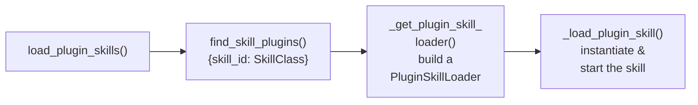

# Skill Manager

!!! success "Maturity — Mature ⬤⬤⬤⬤⬤"
    Long-lived and actively maintained. Depend on it freely. Rated by [repository health](maturity.md), not version.

!!! abstract "In a nutshell"
    The Skill Manager is the part of OVOS that finds all your installed [skills](skill-examples.md) and starts them when the assistant boots. It also decides when each skill is allowed to run. Some skills need the internet or a screen before they can work. The Skill Manager keeps re-checking, so a skill you install later appears without a restart. See [Skill Installer](skill-installer.md) for how skills get added, or the [Glossary](glossary.md) for terms.

**Module:** `ovos_core.skill_manager.SkillManager`: [`ovos_core/skill_manager.py`](https://github.com/OpenVoiceOS/ovos-core/blob/dev/ovos_core/skill_manager.py)

The `SkillManager` is a core component of `ovos-core`. It is a daemon `Thread` that owns the full lifecycle of skill plugins: discovery, loading, connectivity-gating, and graceful shutdown.

**In plain terms:** when OVOS starts, the SkillManager finds every installed skill. It decides which ones are allowed to load right now. Some skills need the network or a screen first. The SkillManager starts the ready skills and re-scans periodically, so newly installed skills show up without a restart.

---

??? abstract "Technical Reference"

    - `SkillManager.run()`: [`ovos_core/skill_manager.py:476`](https://github.com/OpenVoiceOS/ovos-core/blob/dev/ovos_core/skill_manager.py). This is the main loop. It re-scans for new skills every 30 s via `self._stop_event.wait(30)`.


    - `SkillManager.load_plugin_skills()`: [`ovos_core/skill_manager.py:347`](https://github.com/OpenVoiceOS/ovos-core/blob/dev/ovos_core/skill_manager.py). It loads discovered skills via `PluginSkillLoader` (from `ovos_workshop.skill_launcher`). It applies each skill's `RuntimeRequirements` (`network_before_load` / `internet_before_load`) as the connectivity gate.


    - `SkillManager._sync_skill_loading_state()`: [`ovos_core/skill_manager.py:181`](https://github.com/OpenVoiceOS/ovos-core/blob/dev/ovos_core/skill_manager.py). It queries connectivity (via `ovos.PHAL.internet_check` / GUI state) and emits `mycroft.network.connected` / `mycroft.internet.connected`. The actual gating happens in `load_plugin_skills()`, and only when `skills.use_deferred_loading` is enabled.
    

## Skill Discovery

Skills are Python packages. They register themselves via the `opm.skill` entry point group. The older `ovos.plugin.skill` group is still accepted as a deprecated alias. `ovos-plugin-manager` discovers them with `find_skill_plugins()`, which returns a `{skill_id: SkillClass}` dict.

```python
from ovos_plugin_manager.skills import find_skill_plugins
plugins = find_skill_plugins()

```

## Connectivity Gating

!!! note
    `RuntimeRequirements` (`network_before_load`, `internet_before_load`, `requires_gui`, …) is
    a deprecated mechanism. See [Runtime Requirements](skill-runtime-requirements.md) for the
    full picture. The gating described below is **opt-in**: it only applies when
    `skills.use_deferred_loading` is set to `true` in config. With the default configuration,
    every installed skill loads unconditionally at startup regardless of its declared
    requirements.

When `skills.use_deferred_loading` is enabled, skills declare their runtime requirements in
`RuntimeRequirements`, and the skill manager defers loading a skill until those requirements
are met:

| Event | Action |
|---|---|
| Startup (offline) | Load skills with no network/internet requirement |
| `mycroft.network.connected` | Load skills requiring network |
| `mycroft.internet.connected` | Load skills requiring internet |
| `mycroft.gui.available` | Load skills requiring GUI |

Network/internet state is queried from [PHAL](phal.md) at startup via `ovos.PHAL.internet_check`. It falls back to a direct HTTP check if PHAL is unavailable.

## Loading a Skill

The loading process follows this flow:



*Diagram: skill loading runs left to right from load_plugin_skills, through find_skill_plugins and building a PluginSkillLoader, to _load_plugin_skill instantiating and starting the skill.*

Each skill gets its own bus connection when `websocket.shared_connection` is `false` in config (see `_get_internal_skill_bus()`), providing isolation from "BusBricker" style attacks.

### What a load failure looks like

A skill whose class raises during instantiation is logged loudly in `skills.log` and skipped —
it registers no intents and can never match. The signatures to grep for:

```text
ERROR - Failed to load skill: <skill_id> (<exception>)   # skill_launcher, traceback follows
ERROR - Skill <skill_id> failed to load
ERROR - Load of skill <skill_id> failed!                 # skill_manager, traceback follows
```

On the bus, a failed load emits `mycroft.skills.loading_failure`; its true complement is
`mycroft.skills.loaded` (plural), fired on **every** successful load path — the singular
`mycroft.skill.loaded` below is an extra emission specific to the Skill Manager's
plugin-skill path, with no failure counterpart. "Installed but never matches" reports should check for these before
anything else — see the [Troubleshooting](troubleshooting.md#stage-4-which-pipeline-stage-matched-or-didnt)
funnel.

## Blacklisting

Skills listed in `skills.blacklisted_skills` in `mycroft.conf` are skipped at load time. The recommended approach is to uninstall unwanted skills rather than blacklist them.

## Intent Training

Each successfully loaded skill is announced on the bus as `mycroft.skill.loaded`
with `{"skill_id": ...}` — useful for tooling that waits for a specific skill to
become available. After new skills are loaded, the manager requests pipeline
re-training:

```text
mycroft.skills.train  →  (pipeline plugins that need it train, e.g. padatious)
```

The manager emits `mycroft.skills.train` and moves on — it waits for nothing. The
Padatious pipeline plugin does announce `mycroft.skills.trained` when its training round
completes (on both the trained and nothing-new-to-train paths), so tooling that needs a
deterministic "training done" signal can watch for that; the manager itself never does.

Do not implement a `mycroft.skills.trained` reply. Nothing listens for one. An earlier
version blocked on `wait_for_response(..., "mycroft.skills.trained", timeout=60)`, which
stalled boot for a full minute on every install without a deferred-training engine, since
no such engine was there to answer. A single responder could not speak for every loaded
pipeline anyway.

## Settings File Watcher

When enabled, a `FileWatcher` monitors `~/.config/ovos/skills/*/settings.json`. Any change emits:

```text
ovos.skills.settings_changed  {skill_id: "..."}

```

## Bus Events Handled

| Event | Handler |
|---|---|
| `skillmanager.list` | `send_skill_list` |
| `skillmanager.activate` | `activate_skill` |
| `skillmanager.deactivate` | `deactivate_skill` |
| `skillmanager.keep` | `deactivate_except` |
| `mycroft.network.connected` | `handle_network_connected` \* |
| `mycroft.internet.connected` | `handle_internet_connected` \* |
| `mycroft.gui.available` | `handle_gui_connected` \* |
| `mycroft.network.disconnected` | `handle_network_disconnected` \* |
| `mycroft.internet.disconnected` | `handle_internet_disconnected` \* |
| `mycroft.gui.unavailable` | `handle_gui_disconnected` \* |

\* The six connectivity events are subscribed **only** when deferred loading is on, which it
is not by default. On a stock install nothing is listening on them, so emitting one changes
nothing. The four `skillmanager.*` events above are always subscribed.

---
**Read next:** [Intent Service](intent-service.md) · [Skill Installer](skill-installer.md)
**Related:** [ovos-core Overview](core.md) · [Anatomy of a Skill](skill-structure.md) · [Runtime Requirements](skill-runtime-requirements.md)
