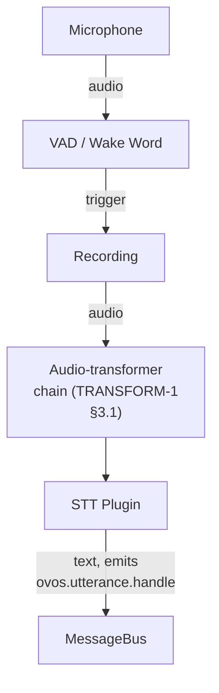

# Speech Service

!!! info "Maturity: Stable ⬤⬤⬤⬤◯"
    Established and production-ready, actively maintained. Rated by [repository health](maturity.md), not version.

!!! abstract "In a nutshell"
    The speech service is the "ears" of OpenVoiceOS. It listens through the microphone, waits for a wake word (like "Hey Mycroft"), and then turns whatever you say next into text so the rest of the system can act on it. Think of it as the part that hears you and writes down your request. From here that text is handed off to the [Intent Service](intent-service.md), which works out what to do. New to the terms? See the [Glossary](glossary.md).

??? info "📐 Formal specification"
    The capture → audio-transformer chain → STT → utterance flow and the listening-lifecycle signals are specified by **[OVOS-AUDIO-IN-1: Audio Input Service](https://github.com/OpenVoiceOS/architecture/blob/dev/audio-in.md)**. The audio-transformer chain that runs on the raw audio before STT is specified by **[OVOS-TRANSFORM-1: Transformer Plugins](https://github.com/OpenVoiceOS/architecture/blob/dev/transformer.md)** (§3.1). See also the [spec index](architecture-specs.md). `ovos-dinkum-listener` is the reference implementation. The spec topic names below are canonical, with the legacy name noted once.

`ovos-dinkum-listener` is the service responsible for audio capture, [Wake Word](wake-word-plugins.md) detection, and [Speech-to-Text](stt-plugins.md) ([STT](stt-plugins.md)). It is the default, full-featured listener. `ovos-simple-listener` is a lighter alternative that emits the same `recognizer_loop:*` bus events but without the full state machine.

A third, even more minimal option is `mycroft-classic-listener`, the original mycroft-core listener ported to the OVOS plugin ecosystem. It implements the same `recognizer_loop:*` contract but does **not** support `instant_listen`, multiple hotwords, VAD, listening modes, or fallback STT (fallback hotwords via OPM are supported).

---

??? abstract "Technical Reference"

    - `OVOSDinkumVoiceService`: [`ovos_dinkum_listener/service.py`](https://github.com/OpenVoiceOS/ovos-dinkum-listener/blob/dev/ovos_dinkum_listener/service.py). This is the service `Thread`. `run()` connects to the bus and drives the voice loop.


    - `DinkumVoiceLoop.run()`: [`ovos_dinkum_listener/voice_loop/voice_loop.py`](https://github.com/OpenVoiceOS/ovos-dinkum-listener/blob/dev/ovos_dinkum_listener/voice_loop/voice_loop.py). This is the per-chunk state machine that drives [VAD](vad-plugins.md), [Wake Word](wake-word-plugins.md) and [STT](stt-plugins.md) via per-state handlers.


    - `OVOSDinkumVoiceService._stt_text()`: [`ovos_dinkum_listener/service.py`](https://github.com/OpenVoiceOS/ovos-dinkum-listener/blob/dev/ovos_dinkum_listener/service.py). It emits the utterance message after [STT](stt-plugins.md) returns text. The listener emits the spec topic `ovos.utterance.handle` (`SpecMessage.UTTERANCE`) directly, and `ovos-bus-client`'s `NamespaceTranslator` (see [Bus Service](bus-service.md#namespace-migration)) also emits the legacy `recognizer_loop:utterance` alias for old consumers.
    
    ---
    

## Overview

The speech service is the "ears" of OpenVoiceOS. It continuously listens to the environment, waiting for a specific [Wake Word](wake-word-plugins.md). When the word is detected, it records the user's command and sends it to an [STT](stt-plugins.md) engine for transcription.

### Key Components

- **Microphone Plugin**: Captures raw audio from the hardware.


- **[Voice Activity Detection](vad-plugins.md) ([VAD](vad-plugins.md))**: Identifies when a user starts and stops speaking.


- **[Wake Word](wake-word-plugins.md) Plugin**: Monitors the audio stream for the trigger phrase.


- **[STT](stt-plugins.md) Plugin**: Transcribes the recorded command into text.

## Architecture



*Diagram:* The flow starts at the microphone and ends at the message bus, and it routes audio through the audio-transformer chain before the STT plugin converts it to text.

## Listening State Machine

`DinkumVoiceLoop` is a per-chunk state machine, not a single "listen" call. It has a
global **mode** (set in `listener.mode` / over the bus) and an internal **state** that
advances chunk by chunk:

- **Modes** (`ListeningMode`): `wakeword` (default, wait for the wake word),
  `continuous` (always transcribe), `hybrid` (continuous but only act after the wake
  word), `sleeping`.


- **States** (`ListeningState`): `wakeword` → `recording` → `in_cmd` → `after_cmd`,
  plus `sleeping` / `wake_up`, `confirmation`, `before_cmd`, `pre_wake_vad`, and
  `WAITING_CMD = "continuous"`, the state used while continuous/hybrid listening waits
  for an utterance without a wake word.

Source: `ovos_dinkum_listener/voice_loop/voice_loop.py:36` (`ListeningState`) and `:53`
(`ListeningMode`).

## Bus Events

The listener emits its activity on the OVOS [messagebus](bus-service.md). The most
useful events for downstream services:

Canonical (spec) names are shown first, with the legacy name in parentheses. The `ovos.listener.*` and `ovos.utterance.handle` names come from [OVOS-AUDIO-IN-1 §5-§6](https://github.com/OpenVoiceOS/architecture/blob/dev/audio-in.md). `ovos-dinkum-listener` emits the spec `ovos.*` topics directly for the record/awoken/utterance events (via `SpecMessage`).

For those, `ovos-bus-client`'s `NamespaceTranslator` runs on every client with both directions on by default (see [Bus Service](bus-service.md#namespace-migration)). Emitting a spec topic also emits its legacy alias, and vice versa, so subscribers can use either name.

The wake-word event (`recognizer_loop:wakeword`) is the exception: it has no spec counterpart in the rename map, so it travels under the legacy name only. See the [legacy ↔ spec migration table](bus-events.md#legacy-spec-migration) for the full mapping.

| Message | Payload | Meaning |
|---|---|---|
| `ovos.listener.record.started` (legacy: `recognizer_loop:record_begin`) | none | Command recording started (§6.1) |
| `ovos.listener.record.ended` (legacy: `recognizer_loop:record_end`) | none | Command recording ended (§6.2) |
| `recognizer_loop:wakeword` | `{"utterance": str, "key_phrase": str, …}` | Wake word detected. Capture is opening. Legacy-only: the wake-word event is not part of the spec rename (there is no `ovos.listener.wakeword`). `utterance` is the spoken key phrase (underscores/hyphens spaced out), `key_phrase` its raw form. `filename` is added when `listener.record_wake_words` is on. A per-wake-word `stt_lang` override, when configured, rides the message context (surfaced as `session.request_lang`) rather than the payload |
| `ovos.utterance.handle` (legacy: `recognizer_loop:utterance`) | `{"utterances": [str], "lang"}` | Transcribed command: the main result (§5, OVOS-PIPELINE-1 §9.1) |
| `recognizer_loop:speech.recognition.unknown` | none | STT returned nothing (silence / failure) |
| `ovos.listener.awoken` (legacy: `mycroft.awoken`) | none | Listener woke from sleep (§6.4) |

It also reacts to inbound commands:

- `ovos.listener.sleep` (legacy: `recognizer_loop:sleep`) suspends capture.
- `recognizer_loop:wake_up` resumes capture.
- `recognizer_loop:record_stop` stops the current recording.
- `recognizer_loop:state.get` reads the current mode/state.
- `recognizer_loop:state.set` changes the listening mode/state at runtime by sending `state` and/or `mode` in `message.data`. The handler replies with `recognizer_loop:state`, just like `state.get`.

The full table lives in the bus-message spec (`message_spec/dinkum.md`).

### Base64 audio STT over the bus

Remote clients without a local mic (e.g. HiveMind) can push audio to the listener for
transcription via two inbound commands. Both take `{"audio": <base64 str>}` in
`message.data`, with optional `lang`, `sample_rate`, and `sample_width` (defaulting to the
STT/loop values):

| Command | Behaviour |
| --- | --- |
| `recognizer_loop:b64_transcribe` | Transcribes the audio and returns the result on the message response as `{"transcriptions": [...], "lang"}`, a pure STT call that emits no utterance event |
| `recognizer_loop:b64_audio` | Transcribes and, if the result clears `min_stt_confidence`, emits the normal `ovos.utterance.handle` (`recognizer_loop:utterance`) event as if the audio had come from the mic. Otherwise it emits `recognizer_loop:speech.recognition.unknown` |

!!! note "Sleep is device-scoped, not session-scoped"

    `ovos.listener.sleep` rides a session like every other message, but sleep mode is a
    **physical device state**: a sleeping listener captures nothing, for any session
    (AUDIO-IN-1 §6.3). Entering or leaving sleep therefore affects the whole device, not
    only the session that carried the request. Sleep entry is unacknowledged by design.
    The only sleep-related emission is `ovos.listener.awoken` on the sleep→awake
    transition.

!!! note "Gotcha — utterance namespace"

    The listener publishes the transcribed command on the spec topic
    `ovos.utterance.handle`. `ovos-bus-client`'s namespace translator (on by default)
    also emits the legacy `recognizer_loop:utterance` alias, so subscribers can use
    either topic name. See [Bus Service: Namespace migration](bus-service.md#namespace-migration)
    for how to turn that aliasing off once every consumer speaks the spec namespace.

## Configuration

The speech service is configured in the `listener`, `hotwords`, and `stt` sections of `mycroft.conf`.

```json
{
  "listener": {
    "microphone": {
      "module": "ovos-microphone-plugin-alsa"
    },
    "VAD": {
      "module": "ovos-vad-plugin-silero"
    }
  },
  "stt": {
    "module": "ovos-stt-plugin-server"
  }
}

```

!!! tip "Saving wake-word audio locally"
    Set `listener.record_wake_words: true` and the listener writes each detected
    wake-word clip to disk (under its `wake_words` save directory) and adds the
    `filename` to the wake-word message. This is handy for gathering training data or
    debugging false triggers. The clips stay on the device. The listener itself does
    not upload anything.

---
**Read next:** [Audio Service](audio-service.md) · [Concepts Overview](concepts-overview.md)
**Related:** [Wake Word Plugins](wake-word-plugins.md) · [STT Plugins](stt-plugins.md) · [Intent Service](intent-service.md) · [VAD Plugins](vad-plugins.md)
