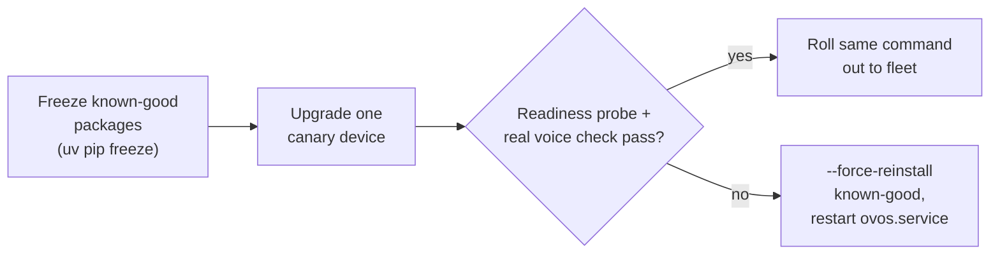

# Staged Upgrades and Rollback

!!! abstract "In a nutshell"
    Upgrading OVOS safely means freezing the current package set before you touch anything, so
    you can force-reinstall it if the upgrade misbehaves. This page covers that for a single
    device and for a fleet, plus the fleet-wide canary pattern.

## Updating a single device

The [staged-upgrade recipe](#staged-upgrades-and-rollback) below is written for a fleet, but
the same steps apply to a single, standalone device with the fleet-specific parts dropped:
back up the config, freeze the current package set, upgrade, and verify.

!!! warning "Installed with `ovos-installer`? Know your method first"
    Every `pip`/`uv pip` command on this page assumes the **`virtualenv`** install method,
    run **inside that venv** — activate it first (its path is shown on the installer's
    environment-summary screen; after the fact, `systemctl --user cat ovos-core.service`
    reveals it from that unit's `ExecStart` — the umbrella `ovos.service` is a no-op meta
    unit, so check a component unit). If you installed with the **`containers`** method
    (Docker/Podman), pip on the host changes nothing: update by pulling newer images
    (`docker compose pull && docker compose up -d`, run from the installer's compose
    directory so the right project is targeted) or by
    [re-running the installer](ovos-installer-scenarios.md), which detects an existing
    install and offers only your current method. To check what you currently have installed,
    see [Checking what you have installed](release-channels.md#checking-what-you-have-installed).

```bash
# 1. Back up config and freeze the current package set, in case you need to go back
sudo install -d -o "$USER" /etc/ovos          # once per device
cp ~/.config/mycroft/mycroft.conf ~/.config/mycroft/mycroft.conf.bak-$(date +%F)
uv pip freeze > /etc/ovos/known-good-$(date +%F).txt

# 2. Upgrade against a pinned constraints file (stays within one release channel)
uv pip install --upgrade ovos-core[mycroft] \
    -c https://raw.githubusercontent.com/OpenVoiceOS/ovos-releases/refs/heads/main/constraints-stable.txt

# 3. Restart and re-run the readiness probe above before declaring success
systemctl --user restart ovos.service
```

If it misbehaves, roll back the same way as in the fleet recipe:
`uv pip install --force-reinstall -r /etc/ovos/known-good-<date>.txt`, then restart the service.
See [Staged upgrades and rollback](#staged-upgrades-and-rollback) for why `--force-reinstall`
is required on rollback, and [Rolling Back an OVOS Upgrade: Pinning or rolling back a single
package](release-rollback.md#pinning-or-rolling-back-a-single-package) if only one package
regressed rather than the whole stack.

---

!!! warning "Check the breaking-change reference before any version jump"
    An upgrade that crosses release eras can hit renamed config keys, changed skill
    APIs, and removed bus topics. Before upgrading, go straight to
    [For Device & Fleet Operators](updating-deployers.md), the deployer page of the
    [Updating from Older OVOS](updating-from-older-ovos.md) hub, and read forward from
    your current era. If you maintain custom skills or plugins, see
    [Version-Compatible Skills & Plugins](version-compat-guide.md).

## Staged upgrades and rollback



*Diagram:* The flow starts at freezing known-good packages and ends at either the fleet rollout or a rollback, and it branches on whether the canary device passes its readiness probe and real voice check.

[Release channels](release-channels.md) covers `stable`/`testing`/`alpha` constraints files.
For a fleet, the same mechanism gives you a controlled, reversible upgrade path:

If only a single package regressed, rolling back the whole stack is unnecessary. See
[Rolling Back an OVOS Upgrade: Pinning or rolling back a single
package](release-rollback.md#pinning-or-rolling-back-a-single-package) for pinning and
restarting just that one package across the fleet.

!!! tip "Back up your configuration too"
    Package freezing protects the code. It does not protect your settings. Before an
    upgrade, also copy `~/.config/mycroft/mycroft.conf` somewhere safe. It can contain
    plaintext tokens and API keys (see [privacy-security](privacy-security.md#mycroftconf-can-contain-plaintext-secrets)),
    so store the backup with the same care you'd give the original file. See
    [Backup and Restore](backup-restore.md) for the full recipe.

```bash
# 1. Freeze exactly what's currently installed, in case you need to go back
sudo install -d -o "$USER" /etc/ovos          # once per device
uv pip freeze > /etc/ovos/known-good-$(date +%F).txt
cp ~/.config/mycroft/mycroft.conf ~/.config/mycroft/mycroft.conf.bak-$(date +%F)

# 2. Upgrade against a pinned constraints file (stays within one release channel)
uv pip install --upgrade ovos-core[mycroft] \
    -c https://raw.githubusercontent.com/OpenVoiceOS/ovos-releases/refs/heads/main/constraints-stable.txt

# 3. Restart and re-run the readiness probe above before declaring success
systemctl --user restart ovos.service
```

If the upgrade misbehaves, roll back to the frozen set:

```bash
uv pip install --force-reinstall -r /etc/ovos/known-good-2026-07-01.txt  # use the actual date from the freeze file you created in step 1
systemctl --user restart ovos.service
```

`--force-reinstall` is needed on rollback because a plain `pip install` treats "already
satisfies requirement" as nothing to do. It will not downgrade a package back to an older
pinned version on its own.

!!! tip "Stage it on one device first"
    Constraints files are a moving target upstream. Roll an upgrade out to one canary device,
    confirm the readiness probe and a couple of real voice interactions succeed, then repeat
    the same `uv pip install -c ...` command across the rest of the fleet.

!!! warning "Detecting a partially-failed rollback"
    `--force-reinstall` can itself be interrupted (network drop, disk full, `Ctrl-C`) partway
    through reinstalling the packages listed in the frozen file, leaving some packages back at
    the old pinned version and others still on the newer one. Compare the current environment
    against the frozen file to check:

    ```bash
    diff <(uv pip freeze | sort) <(sort /etc/ovos/known-good-2026-07-01.txt)
    ```

    Any line in the diff is a package whose installed version does not match the known-good
    snapshot. Re-run the `--force-reinstall` rollback command to finish the job before
    restarting the service. `uv pip check` is also worth running after either an upgrade or a
    rollback: it reports any dependency resolution left inconsistent (declared requirements no
    longer satisfied by what's installed), which a partial rollback commonly causes.

---
**Read next:** [Rolling Back an OVOS Upgrade](release-rollback.md)
**Related:** [Production Operations](production-operations.md) · [Backup and Restore](backup-restore.md) · [Release Channels](release-channels.md) · [Updating from Older OVOS](updating-from-older-ovos.md)
