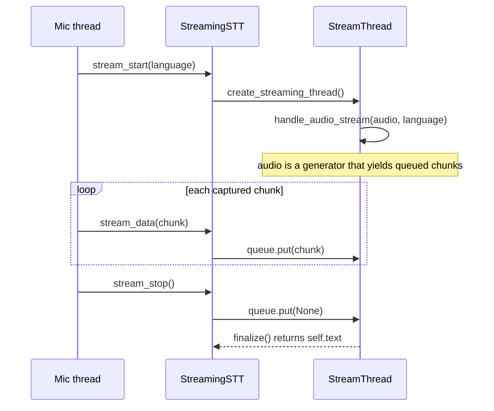

# Writing an STT Plugin

!!! abstract "In a nutshell"
    This page is the tutorial for building your own STT plugin: the `STT` and `StreamingSTT` base classes, the entry point that makes a plugin installable, and how to test it. Looking for a plugin to use instead of writing one? Go to [STT Plugins](stt-plugins.md).

## Writing your own STT plugin

### `STT`

The base STT, this handles the audio in "batch mode" taking a complete audio file, and returning the complete transcription.

Each STT plugin class needs to define the `execute()` method taking two arguments:

* `audio` \([AudioData](https://github.com/Uberi/speech_recognition/blob/master/reference/library-reference.rst#audiodataframe_data-bytes-sample_rate-int-sample_width-int---audiodata) object\) - the audio data to be transcribed.  


* `language` \(str\) - _optional_ - the BCP-47 language code. When omitted, the plugin uses its
  configured or detected language

The bare minimum STT class will look something like

```python
from ovos_plugin_manager.templates.stt import STT

class MySTT(STT):
    def execute(self, audio, language=None):
        # Handle audio data and return transcribed text
        [...]
        return text

```

#### N-best hypotheses: `transcribe()`

`execute()` returns a single best string. The richer method is `transcribe(audio, lang=None)`,
which returns a **list of `(transcript, confidence)` tuples**, confidence a float from `0.0` to `1.0`.
The template implements it for you as `[(self.execute(audio, lang), 1.0)]`, so a plugin that
only knows its single best answer needs to implement nothing extra.

If the wrapped engine can produce several hypotheses with scores, **override `transcribe()`**.
It is the preferred entry point, and consumers that rescore or disambiguate between
candidates read it. `execute()` then remains the single-best convenience wrapper.

```python
class MySTT(STT):
    def execute(self, audio, language=None):
        return self.transcribe(audio, language)[0][0]

    def transcribe(self, audio, lang=None):
        # return hypotheses best-first
        return [("turn on the lights", 0.91),
                ("turn on the light", 0.62)]
```

#### Language detection

An STT plugin can be paired with an audio language detector. The audio service calls
`bind(detector)` to hand the plugin an `AudioLanguageDetector`. The plugin then exposes:

* `detect_language(audio, valid_langs=None)` → `(lang, confidence)`. It delegates to the bound
  detector, defaulting `valid_langs` to the plugin's own `available_languages`. With no detector
  bound it raises `NotImplementedError`. Language detection is opt-in per deployment.

* `transcribe(audio, lang=None)` with `lang="auto"` passed explicitly. The `"auto"` sentinel runs `detect_language()` first and
  transcribes in whatever it returns. If detection fails, the plugin falls back to `self.lang`
  and transcribes anyway, so `"auto"` never turns a detector problem into a failed
  transcription.

### `StreamingSTT`

A more advanced STT class for streaming data to the STT. This will receive chunks of audio data as they become available and they are streamed to an STT engine.

The plugin author needs to implement the `create_streaming_thread()` method creating a thread for handling data sent through `self.queue`. 

The thread this method creates should be based on the `StreamThread` class. Its abstract `handle_audio_stream(audio, language)` method also needs to be implemented. It receives a generator of audio chunks and should set `self.text` to the transcript. `finalize()` returns that stored text once the stream ends.

#### Chunk semantics



*Diagram:* The sequence starts with the mic thread calling stream_start and ends with the stream thread returning finalize() text, The stream thread calls handle_audio_stream one time, and the loop between those two points feeds audio chunks to the generator it reads.

Audio arrives synchronously per chunk: `stream_data()` is called once per captured
chunk on the mic thread, so it must return well under the per-chunk time budget
(the same real-time cadence constraint a wake-word plugin's `update(chunk)` runs
under. See [Wake-word Plugins: Key Methods](wake-word-plugin-development.md#key-methods)). Do any
slow work (network calls, heavy inference) on the `StreamThread` this class
manages, not inline in `stream_data()`.

`StreamingSTT` runs the streaming work on a background thread, fed through a queue:

- `stream_start(language=None)` creates a fresh `Queue`, builds a `StreamThread` via `create_streaming_thread()`, and starts it.
- Each call to `stream_data(chunk)` puts one raw PCM `bytes` chunk (16 kHz/16-bit/mono, `chunk_size`-sized; see [the microphone interface](mic-plugin-development.md#the-microphone-interface) for the audio-format contract) onto that queue.
- The `StreamThread`'s `run()` calls your `handle_audio_stream(audio, language)` with `audio` as a **generator** that yields chunks off the queue until a `None` sentinel appears. Your implementation should loop over it (e.g. `for chunk in audio:`) and feed each chunk to the underlying engine, setting `self.text` as partial/final results arrive.
- `stream_stop()` pushes the `None` sentinel, joins the thread, and calls `finalize()` on it to retrieve the stored `self.text` as the final transcript. This is also what `execute()` returns for a `StreamingSTT` plugin.

A complete minimal streaming plugin:

```python
from queue import Queue
from threading import Thread
from ovos_utils import classproperty
from ovos_plugin_manager.templates.stt import StreamingSTT, StreamThread


class MyStreamThread(StreamThread):
    def __init__(self, queue: Queue, language: str, engine):
        super().__init__(queue, language)
        self.engine = engine

    def handle_audio_stream(self, audio, language):
        # `audio` is a generator of raw PCM byte chunks; `self.queue.get()`
        # returns None once the caller closes the stream.
        for chunk in audio:
            partial = self.engine.feed(chunk, language)
            if partial:
                self.text = partial
        return self.text


class MyStreamingSTT(StreamingSTT):
    def __init__(self, *args, **kwargs):
        super().__init__(*args, **kwargs)
        self.engine = MyStreamingEngine()

    def create_streaming_thread(self):
        return MyStreamThread(self.queue, self.lang, self.engine)

    @classproperty
    def available_languages(cls):
        return {"en-us"}
```

### Entry point and a minimal working plugin

Project layout:

```
ovos-stt-plugin-mymodel/
├── pyproject.toml
└── ovos_stt_plugin_mymodel/
    └── __init__.py
```

`ovos_stt_plugin_mymodel/__init__.py`. `available_languages` is a `classproperty` on the
base class, so a plugin overrides it the same way, not as a plain instance `@property`:

```python
from ovos_utils import classproperty
from ovos_plugin_manager.templates.stt import STT


class MySTTPlugin(STT):
    def __init__(self, *args, **kwargs):
        super().__init__(*args, **kwargs)
        # read config settings for your plugin
        self.lm = self.config.get("language-model")
        self.hmm = self.config.get("acoustic-model")

    def execute(self, audio, language=None):
        # Implement STT engine logic here
        transcript = "You said this"
        return transcript

    @classproperty
    def available_languages(cls):
        """Return languages supported by this STT implementation in this state.
        This property should be overridden by the derived class to advertise
        what languages that engine supports.
        Returns:
            set: supported BCP-47 language codes
        """
        return {"en-us", "es-es"}


# sample valid configurations per language

# "display_name" and "offline" provide metadata for UI

# "priority" is used to calculate position in selection dropdown

#       0 - top, 100-bottom

# all other keys represent an example valid config for the plugin
MySTTConfig = {
    lang: [{"lang": lang,
            "display_name": f"MySTT ({lang})",
            "priority": 70,
            "offline": True}]
    for lang in ["en-us", "es-es"]
}

```

The package needs an entry point under the `opm.stt` group to be detectable as a plugin,
plus the parallel `opm.stt.config` group to expose `MySTTConfig` for UI discovery. The
entry-point name (left of `=`) is the string users put in their `mycroft.conf`:

```toml
[project]
name = "ovos-stt-plugin-mymodel"
version = "0.1.0"
dependencies = ["ovos-plugin-manager"]

[project.entry-points."opm.stt"]
ovos-stt-plugin-mymodel = "ovos_stt_plugin_mymodel:MySTTPlugin"

[project.entry-points."opm.stt.config"]
ovos-stt-plugin-mymodel.config = "ovos_stt_plugin_mymodel:MySTTConfig"

```

> **Backward Compatibility**: `ovos-plugin-manager` still supports legacy `mycroft.plugin.stt` entry points, but new plugins should use the `opm.*` namespace.

### Test it without OVOS

`STT` is a plain class with no messagebus connection, so a unit test needs no running
OVOS stack:

```python
from ovos_stt_plugin_mymodel import MySTTPlugin

plug = MySTTPlugin()
assert "en-us" in plug.available_languages

transcript = plug.execute(audio=None, language="en-us")
assert isinstance(transcript, str)
```

STT plugins can equally be exercised against a real audio file, without a running OVOS
instance, by importing the plugin class directly. For example, with
`ovos-stt-plugin-vosk`:

```python
from ovos_stt_plugin_vosk import VoskKaldiSTT
from ovos_plugin_manager.utils.audio import AudioFile

plug = VoskKaldiSTT()

# verify lang is supported
lang = "en-us"
assert lang in plug.available_languages

# read the whole file into an AudioData object
with AudioFile("test.wav") as source:
    audio = source.read()

# transcribe
transcript = plug.execute(audio, lang)

```

### Verify discovery

After `pip install -e .`:

```python
from ovos_plugin_manager.stt import find_stt_plugins

print(find_stt_plugins())
# {'ovos-stt-plugin-mymodel': <class '...MySTTPlugin'>}
```

`load_stt_plugin(name)` returns the same uninstantiated class for one plugin name. You
construct it yourself with your config dict.

### Checklist before you publish

1. The class subclasses `STT` (or `StreamingSTT`) and implements `execute`
   (or `create_streaming_thread` and `StreamThread.handle_audio_stream`) plus
   `available_languages` as a `classproperty`.
2. The entry-point group in `pyproject.toml` is `opm.stt`, with a matching
   `opm.stt.config` entry once the plugin has settings worth advertising in UIs.
3. `__init__` accepts `config=None` and works with an empty config.
4. `language=None` falls back to the plugin's configured/detected language.
5. Unit tests exercise `execute`/`transcribe` directly, with no OVOS services running.
6. `find_stt_plugins()` discovers the installed plugin under the expected name.


---
**Read next:** [STT Plugins](stt-plugins.md)
**Related:** [STT Plugins Reference](stt-plugins-reference.md) · [Wake-word Plugin Development](wake-word-plugin-development.md) · [Plugin Manager](plugin-manager.md)
