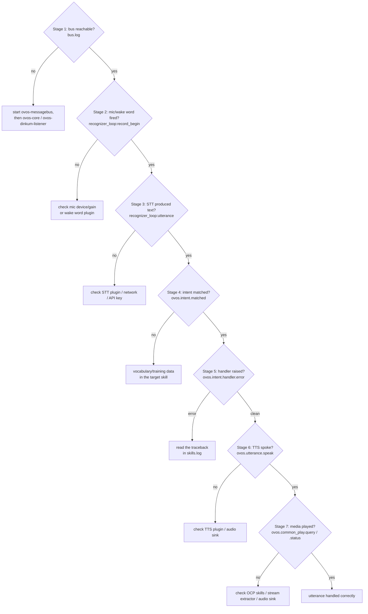

# Troubleshooting & Debugging

!!! abstract "In a nutshell"
    You said something to OVOS and nothing happened. This page is a decision tree for finding out
    why. It follows the same journey as [The Life of an Utterance](life-of-an-utterance.md): mic,
    wake word, speech-to-text, intent matching, skill, text-to-speech. At each stop it shows where
    the evidence lives (which log file, which bus message), what a healthy result looks like, and
    the exact command to check it yourself. The first stages need only copy-paste: no programming
    background is required there. Later stages read log files and run command-line tools, so they
    ask more of you as the page goes. New to the words here? See the [Glossary](glossary.md).

Every stage below can be checked two ways: **tail a log file** (works everywhere, including headless
boxes over SSH), or **watch the bus live** with `ovos-busmon` (works anywhere a browser can reach the
device, and shows every stage in one place instead of six log files). Start with the logs. They
need no extra install. Then reach for `ovos-busmon` when you want everything in one filterable view.

---

## The debugging funnel



*Diagram:* The flow starts at Stage 1, checking whether the bus is reachable, and ends at "utterance handled correctly," and it branches at each of the seven stages to a fix action whenever that stage's check fails. Stage 7 only applies to media/playback requests ("play some jazz"); a plain spoken answer ends at Stage 6.

Each stage below cites the exact log line and bus message shown in this diagram, plus the
command to check it directly.

!!! note "This is where it turns technical"
    From here on, the page reads log files and runs command-line tools. If that is more than
    you want to deal with, try [everyday-help.md](everyday-help.md) instead — it covers common
    problems with no terminal needed.

## Where the logs live

OVOS runs several independent services (listener, intent/skills, audio, messagebus, GUI), and each
one writes its **own** log file, named after the service. By default they land under the XDG state
directory. On a typical Linux install that is:

```text
~/.local/state/mycroft/
├── audio.log     # ovos-audio — TTS + playback
├── bus.log       # ovos-messagebus
├── skills.log    # ovos-core — intent matching + skill execution
├── voice.log     # ovos-dinkum-listener — mic, wake word, STT
└── ovos.log      # any process that never set its own service name (see note)
```

!!! note "Where `ovos.log` comes from"
    The shared logger (`ovos-utils`) names its log file after whatever service name was set.
    If a process never sets one, such as a one-off script, a plugin running standalone, or a
    service started before it calls its own name-setting step, it falls back to the logger's
    own default name, `OVOS`, lower-cased to `ovos.log`. Seeing this file usually just means
    some component is logging under the generic default rather than its own service log.

The directory can be overridden per-service via the `logs.path` config key (or `logging.<service>.
logs.path` for a per-service override). See [Turning up log detail](#turning-up-log-detail) below.
Each service also logs to `stdout`, so if it runs under systemd or Docker, `journalctl` /
`docker logs` shows the same lines.

`ovos-logs` (shipped by `ovos-utils`) is the quickest way to read them without hunting for the path:

```bash
ovos-logs show -l skills      # page through skills.log with `less`
ovos-logs list --error        # every ERROR line across all logs
ovos-logs slice --start "1-1-2024 09:00"   # a time-bounded slice
```

See the [Command-line Tools](cli-tools.md#reading-the-logs-ovos-logs) page for the full flag
reference.

---

## Watch the bus while you speak: `ovos-busmon`

All the stages in this guide talk to each other over the [messagebus](bus-service.md): the listener
emits an utterance message, the intent service emits a match, the skill emits a `speak`, and so on.
**[`ovos-busmon`](https://github.com/OpenVoiceOS/ovos-busmon)** is a small web app that connects to
the bus as a client and streams every one of those messages live to a browser tab, in one
filterable, searchable timeline.

!!! note "Bus messages, not logs"
    `ovos-busmon` shows **live bus messages only**. It does **not** parse the log files. It
    complements the log tooling ([`ovos-logs`](cli-tools.md#reading-the-logs-ovos-logs) and the
    per-service `*.log` files), it doesn't replace it. For a terminal-based **log** viewer, the
    community project [ovos-tui-client](https://github.com/andlo/ovos-tui-client) reads the OVOS
    logs directly.

!!! tip "Zero-install demo"
    A hosted static build is available at
    [openvoiceos.github.io/ovos-busmon](https://openvoiceos.github.io/ovos-busmon/). No `pip
    install` needed. Because it's the **static-page** build (not the FastAPI-backed server), the
    browser connects straight to the bus itself, so it only works when the **browser runs on the
    same machine as OVOS**. For remote or multi-device use, run the full `pip install ovos-busmon`
    server below.

Internally, it is a FastAPI + WebSocket/SSE service that opens an `ovos-bus-client` connection to
the messagebus and keeps an in-memory ring buffer of everything it sees. The browser UI lets you:

- filter the live stream by message type (glob patterns, e.g. `ovos.*` or `recognizer_loop:*`)
- full-text search across message type, data, context, and session
- filter by session ID, source, and destination
- pause/resume capture and sort newest/oldest first
- export the captured buffer as JSON/JSONL for later inspection
- inject an arbitrary message onto the bus from the UI (the same trick as `ovos-say-to`, but visual)
- group the live stream into a **timeline**: per-session, expandable traces with category badges, so
  you can follow a single utterance across Stages 2-5 as one interaction instead of scanning the raw feed
- type an utterance into the **chat panel** (`POST /api/chat`). It emits a `recognizer_loop:utterance`
  with a stable session ID (so multi-turn/converse works), letting you replay a failing interaction
  deterministically without speaking

There is also a zero-install mode: the UI is a single static page that can open a WebSocket straight
to `ws://<device>:8181/core` with no server component at all. This is useful for a one-off look
without installing anything.

### Installing and running it

```bash
pip install ovos-busmon
ovos-busmon
```

To hack on it (or track `dev`), install from a clone instead:

```bash
git clone https://github.com/OpenVoiceOS/ovos-busmon
cd ovos-busmon
pip install .
ovos-busmon
```

By default it binds to `http://127.0.0.1:8005` and connects outward to a messagebus at
`localhost:8181`. Both ends are configurable through environment variables (or a `.env` file next to
where you run it):

| Variable | Default | Meaning |
|---|---|---|
| `OVOS_BUS_HOST` / `OVOS_BUS_PORT` | `localhost` / `8181` | Where the *target* OVOS messagebus is. |
| `BUSMON_HOST` / `BUSMON_PORT` | `127.0.0.1` / `8005` | Where busmon's own web UI listens. |
| `BUSMON_USERNAME` / `BUSMON_PASSWORD` | `ovos` / `ovos` | HTTP Basic auth for the web UI. |
| `BUFFER_SIZE` | `2000` | How many messages the ring buffer keeps. |

A Docker route is also available (`docker compose up --build` from the repo), using the image
`jarbasai/ovos-busmon:latest`. Its bundled compose file binds the container to `127.0.0.1:8005` only
and sets `OVOS_BUS_HOST=host.docker.internal` so it can reach a bus running on the host.

!!! warning "Local debugging only: never expose this to the internet"
    `ovos-busmon` mirrors **every** message on the bus, including STT transcripts, intent matches,
    and skill responses. It ships with a default username/password (`ovos` / `ovos`) that most
    people never change. Its message-injection feature also lets anyone who can reach it emit
    arbitrary commands onto your assistant's bus. Keep it bound to `127.0.0.1` or your local LAN,
    change the default credentials before leaving it running, and never port-forward it to the
    public internet.

### A concrete walkthrough

1. Start `ovos-busmon`. It comes up even if the bus is unreachable, but does **not** auto-retry the
   connection, so start it once the OVOS device is up (or restart busmon after the bus is running).
2. Open `http://127.0.0.1:8005` in a browser and log in with the configured credentials.
3. Speak (or trigger) an utterance on the OVOS device.
4. Filter by `recognizer_loop:*`. The first hit is the raw utterance leaving the listener
   (Stage 2 below). If nothing appears here, the problem is upstream of the bus entirely (Stage 1).
5. Filter by `ovos.intent.matched` and `ovos.utterance.handled`. These tell you which pipeline
   stage claimed the utterance and confirm the lifecycle actually closed (Stage 4/5 below).
6. Filter by `ovos.utterance.speak`. Its absence, with everything else present, points at a silent
   skill handler. Its presence with no audio points at the TTS/playback stage (Stage 6).

Each stage further down cites the exact message type to filter on, so this same walkthrough can be
repeated stage-by-stage instead of glancing at the whole stream at once.

---

## Stage 1: Is the service even running, and is the bus reachable?

**Log:** `bus.log`. **Bus visual:** any message appearing at all in `ovos-busmon`

Before anything else, confirm the [messagebus](bus-service.md) server is up: everything else in
OVOS is a client of it, so if it is down nothing downstream can work.

```bash
ovos-listen
```

`ovos-listen` is the simplest possible probe. It just emits `mycroft.mic.listen` and exits. If the
bus isn't reachable, the client itself logs the failure to the terminal:

```text
WARNING - Connection Refused. Is Messagebus Service running?
WARNING - Message Bus Client will reconnect in 5.0 seconds.
```

If you see that, start (or restart) `ovos-messagebus`, then `ovos-core` and `ovos-dinkum-listener`,
and check `bus.log` for a clean startup (no repeated `Connection Refused` lines). Clients
reconnect on their own with a backing-off retry (5 s → 60 s cap), so a bus restart does **not**
require restarting every client by hand. See [Bus restart / reconnect
behavior](bus-service.md#bus-restart-reconnect-behavior) for exactly what to expect while they
recover.

In `ovos-busmon`, this stage is trivially visible: if the bus was down when busmon started, its
connection never came up (busmon does not auto-retry) and the stream stays empty. Restart busmon
once the bus is back.

!!! tip "Nothing wrong with the mic yet"
    This stage says nothing about audio hardware. It only confirms the messagebus itself accepts
    connections. Hardware problems show up in Stage 2.

---

## Prove the microphone and speaker work

Do these checks before you read wake-word or STT logs. They test the sound card itself, not
OVOS, and they work on any Linux install (Raspberry Pi image or otherwise). If you're on
raspOVOS, there is also a Pi-specific diagnostics script: see [RaspOVOS Troubleshooting →
Audio Issues](raspovos-troubleshooting.md#audio-issues).

### Does the OS see your microphone and speaker?

Run this command:

```bash
arecord -l
```

It lists every capture device the kernel found. Look for your microphone's card. If the list is
empty, the OS does not see the microphone. Fix the wiring, driver, or USB connection before you
go further.

List playback devices the same way:

```bash
aplay -l
```

If your speaker is missing from this list, OVOS cannot play audio, no matter how you configure
the software.

### Record and play back a test file

Run this command:

```bash
arecord -d 5 test.wav && aplay test.wav
```

It records 5 seconds of audio, then plays the recording back. Speak during the recording. If
you hear your own voice, the mic and speaker both work at the hardware level. If you hear
silence or noise only, the problem is the microphone, its gain, or its wiring, not OVOS.

### Check capture level and mute

Run this command:

```bash
alsamixer
```

Press `F4` to switch to the capture view. Check the capture level is not near zero and not
muted. An `MM` mark means muted; press `m` to toggle it. Press `Esc` to exit.

You can also read and set levels without the interactive UI:

```bash
amixer
```

### PulseAudio or PipeWire?

Most current Linux systems route audio through PipeWire. Some still use PulseAudio. Either one
sits between the raw ALSA device and OVOS, and either can mute or misroute a device that ALSA
itself sees fine.

- **PipeWire:** run `wpctl status` to list sinks (speakers) and sources (microphones). The
  default device is marked with `*`. Inspect one device with `wpctl inspect $ID`.
- **PulseAudio:** run `pactl list short sources` for microphones, and `pactl list short sinks`
  for speakers.

If a device works at the ALSA level (the `arecord`/`aplay` checks above) but OVOS still can't
use it, check here that it is not muted or set to the wrong default.

---

## Stage 2: Did the mic/wake word fire?

**Log:** `voice.log` (service `ovos-dinkum-listener`). **Bus filter:** `recognizer_loop:record_begin`
/ `record_end`, `ovos.listener.record.started` / `ovos.listener.record.ended`

Before reading `voice.log`, confirm the hardware itself works: see [Prove the microphone and
speaker work](#prove-the-microphone-and-speaker-work) above.

A healthy wake-word trigger and recording cycle looks like this in `voice.log`:

```text
DEBUG - Record begin
DEBUG - Hotword utterance: hey mycroft
DEBUG - Emitting hotword event: recognizer_loop:wakeword
...
DEBUG - Record end
```

Common failure signatures:

| Symptom in `voice.log` | Likely cause |
|---|---|
| No `Record begin` line at all when you speak | Wake word plugin isn't hearing you: check the [mic device/gain](#prove-the-microphone-and-speaker-work), or the [wake word](wake-word-plugins.md) model/sensitivity. |
| `Record begin` fires but never followed by `Record end` | VAD never detects silence: check the [VAD plugin](vad-plugins.md) config. |
| Repeated wake-word triggers with no speech after | False positives: the wake word threshold may be too low. |

To hear the recorded audio yourself, turn on the listener's own recording keys in
[configuration](config.md) (user config, under `"listener"`):

```json
{
  "listener": {
    "save_utterances": true,
    "record_wake_words": true,
    "save_path": "/tmp/ovos-audio-debug"
  }
}
```

`save_utterances` writes every STT-bound recording as a `.wav` file under
`<save_path>/utterances/`. `record_wake_words` does the same for wake-word triggers under
`<save_path>/wake_words/`. Set them with:

```bash
ovos-config set -k save_utterances -v true
```

These files are raw recordings of everything the microphone picked up, and they stay on disk
until you delete them. Nothing prunes the directory. Turn both keys back off and clear
`<save_path>` once you have finished debugging. See
[Privacy & Security](privacy-security.md#what-is-written-to-disk) for what the listener writes
to disk by default.

`ovos-listen` can also force a listening cycle without saying the wake word at all. This is
useful for isolating STT problems (Stage 3) from wake-word problems.

---

## Stage 3: Did STT produce text?

**Log:** `voice.log`. **Bus filter:** `recognizer_loop:utterance` (spec name `ovos.utterance.handle`)

Once recording stops, the audio is handed to the [STT plugin](stt-plugins.md). A healthy
transcription shows up as:

```text
DEBUG - STT: ['what time is it']
```

Common failure signatures:

| Symptom | Likely cause |
|---|---|
| `ERROR - Empty transcription, either recorded silence or STT failed!` | The STT engine returned nothing: check the STT plugin is installed/configured and (for online engines) that the network/API key is working. |
| `INFO - Ignoring low confidence STT transcriptions: [...]` | A confidence filter dropped the candidate: check `min_stt_confidence` in the listener config. |
| Transcription text is garbled/wrong words | STT engine or language mismatch, not a bug in the pipeline: try a different STT plugin or model size. |

To skip the microphone and STT entirely and test everything **downstream** of this point, inject the
text directly onto the bus as if STT had already produced it:

```bash
ovos-say-to "what time is it"
```

This runs `MessageBusClient().emit(Message("recognizer_loop:utterance", {"utterances": ["what time
is it"], "lang": "en-US"}))`, exactly the same message the listener would have emitted. It is the
single most useful command for isolating "is my problem in audio, or in matching/skills?" without
having to speak into a microphone at all.

In `ovos-busmon`, filter by `recognizer_loop:*` (or the spec name `ovos.utterance.handle`): seeing
the utterance land there with the right text confirms STT worked, regardless of what happens next.

---

## Stage 4: Which pipeline stage matched (or didn't)?

**Log:** `skills.log` (or `intents.log` if the intent service runs standalone). **Bus filter:**
`ovos.intent.matched`, `ovos.utterance.handled`

`ovos-core`'s `IntentService` logs every step of matching. A healthy match looks like:

```text
INFO - Parsing utterance: ['what time is it']
INFO - adapt_high match (en-us): IntentMatch(...)
DEBUG - final intent match: {...}
```

`adapt_high` here is one entry of the configurable `intents.pipeline` list. The bundled default
pipeline (see [Pipelines Overview](pipelines-overview.md)) uses the canonical plugin IDs, in this
order:

--8<-- "snippets/default-pipeline.md"

If nothing matches, every matcher in that list logs a
miss (as `no match from <bound method ...>`, naming the matcher's Python function) before the
utterance falls through to the next stage, and eventually to nothing:

```text
DEBUG - no match from <bound method ...StopService.match_high ...>
DEBUG - no match from <bound method ...ConverseService.match ...>
DEBUG - no match from <bound method ...OCPPipelineMatcher.match_high ...>
DEBUG - no match from <bound method ...PadatiousPipeline.match_high ...>
DEBUG - no match from <bound method ...AdaptPipeline.match_high ...>
...
```

Use `ovos-say-to` (Stage 3) to reproduce this deterministically without speaking, then grep
`skills.log` for the exact utterance text:

```bash
ovos-say-to "some phrase that does nothing" && ovos-logs show -l skills
```

Every request ends with exactly one `ovos.utterance.handled` event, whether an intent matched or
not. Its absence means the intent service itself crashed or hung. Its presence with no matched
intent means every pipeline plugin genuinely rejected the utterance (usually a vocabulary/training
data problem in the target skill, not a bug). See [Intent Layers](layers.md) and the
[Pipelines Overview](pipelines-overview.md) for how to add or reorder matchers.

In `ovos-busmon`, filter by `ovos.intent.matched` (see which skill/intent name claimed it) or by
`ovos.utterance.handled` (confirm the lifecycle closed at all). This reproduces the same
information as the log grep above but across the whole pipeline at a glance, and lets you inspect
the full JSON payload of the match.

---

## Stage 5: Did the skill handler raise?

**Log:** `skills.log`. **Bus filter:** `ovos.intent.handler.error` (legacy `mycroft.skill.handler.
error`). Part of the handler-lifecycle trio `...handler.start` → `...complete` / `...error`
described in [The Life of an Utterance](life-of-an-utterance.md#5-skill-execution)

Once a skill's intent handler is invoked, any unhandled exception inside it is caught by the skill
base class, logged, and (unless disabled) spoken back as a generic error dialog:

```text
ERROR - <full traceback of the exception>
```

and the corresponding `...error` bus message is emitted so the orchestrator knows the handler
failed rather than silently returning nothing. Common failure signatures to grep for in
`skills.log`:

| Symptom | Likely cause |
|---|---|
| A traceback right after `final intent match` | The skill's own handler code raised: read the traceback, it names the exact file/line. |
| `Failed to update settings.json` | Non-fatal. A settings write failed after a successful handler run. It doesn't explain a silent utterance. |
| No traceback, no `speak`, handler simply never runs | The bus dispatch itself failed to reach the skill process: check the skill actually loaded (see [Skill Manager](skill-manager.md)) and its `skill_id` matches the matched intent. |

In `ovos-busmon`, filter by `*handler.error` to catch any handler-lifecycle error message across
every skill in one view, or filter by the specific skill's ID to isolate its traffic.

---

## Stage 6: Did TTS speak?

**Log:** `audio.log` (service `ovos-audio`). **Bus filter:** `ovos.utterance.speak` (legacy
`speak`), `ovos.utterance.handled`

Once a skill calls `self.speak()`, `ovos-audio` picks up the message. A healthy synthesis + playback
cycle logs:

```text
INFO - Speak: what time is it, it's three o'clock
```

Common failure signatures:

| Symptom in `audio.log` | Likely cause |
|---|---|
| `EXCEPTION - TTS synth failed! ...` | The [TTS plugin](tts-plugins.md) itself errored (model missing, API failure for an online engine, bad voice config). |
| `ERROR - No fallback TTS available and main TTS failed!` | Both the primary and fallback TTS engines failed: check both are configured, or that the fallback exists at all. |
| No `Speak:` line at all, despite the skill having matched | The `ovos.utterance.speak` message never reached `ovos-audio`: check `ovos-audio` is actually running (Stage 1) and not crashed. |
| `Speak:` line present but no sound | Not a bug in the pipeline: check the audio sink: ALSA/PulseAudio device selection, system volume, or that the WAV file was actually written and playable. |

To test synthesis in isolation, without going through STT or intent matching at all:

```bash
ovos-speak "testing one two three"
```

This emits a bare `speak` message directly, exercising exactly the dialog-transformer → TTS plugin →
tts-transformer → playback path described in [The Life of an Utterance](life-of-an-utterance.md#6-text-to-speech-tts).
If this command produces sound but a real skill interaction doesn't, the problem is upstream (Stages
1-5), not in audio output.

In `ovos-busmon`, filter by `ovos.utterance.speak`. Present with no sound points at the audio sink.
Absent, with everything upstream present, points at a silent or failed skill handler (Stage 5).

---

## Stage 7: Media and playback

**Log:** `audio.log` (service `ovos-audio`, or `ovos-media` if enabled). **Bus filter:**
`ovos.common_play.query` / `ovos.common_play.query.response`, `ovos.common_play.status`

This stage only applies to media requests ("play some jazz", "next song"), not plain spoken
answers. It starts once [Stage 4](#stage-4-which-pipeline-stage-matched-or-didnt) has already
matched the utterance to the [OCP pipeline](ocp-pipeline.md) (`ovos-ocp-pipeline-plugin-high` /
`-medium` / `-low`). If OCP never claims the utterance at all, that is a Stage 4 problem, not a
Stage 7 one: check the pipeline miss log described there first.

### (a) Search found nothing

Once OCP classifies the utterance as a playback request, it emits `ovos.common_play.query` and
collects `ovos.common_play.query.response` results from every installed [OCP-enabled media
skill](ocp-skills.md). If no skill answers, or every answer is empty, OVOS reports it found
nothing to play.

Checks:

- Is an OCP-enabled media skill actually installed and loaded? Skills act purely as catalogs
  here, so with none installed there is nothing to search. See [Media Skills
  (OCP)](ocp-skills.md).
- Watch the query round-trip live in [`ovos-busmon`](#watch-the-bus-while-you-speak-ovos-busmon):
  filter by `ovos.common_play.query*` to confirm the query went out and see which skills (if any)
  answered, and with what results.
- Reproduce it without speaking: `ovos-say-to "play some jazz"` (see [Stage 3](#stage-3-did-stt-produce-text)),
  then check `skills.log` for the matching skill's search handler.

### (b) A result was found but the stream never starts

A search result is only a candidate URI. Before OCP can play it, a [stream
extractor](ocp-plugins.md) has to resolve that URI to the real, directly-playable stream (this is
what the `ovos-ocp-*-plugin` packages, e.g. `ovos-ocp-youtube-plugin` or
`ovos-ocp-bandcamp-plugin`, do). If the matching extractor is missing, misconfigured, or the
remote service it scrapes changes shape, extraction fails and playback never begins even though a
result was found.

Check `audio.log` (the [audio service](audio-service.md), which hosts the OCP audio plugin by
default, or `ovos-media`'s own log if that daemon is enabled instead) for an extractor exception
around the time of the request. See [OCP Plugins Reference](ocp-plugins.md) for which extractor
handles which source, and confirm the right one is installed for the kind of link the skill
returned.

### (c) Audio plays on the wrong output, or not at all

If a stream extracted fine but nothing (or the wrong device) makes sound, this is the same class
of problem as Stage 6's audio sink failure, not a media-specific bug:

- Run the hardware and mixer checks in [Prove the microphone and speaker
  work](#prove-the-microphone-and-speaker-work) (`aplay -l`, `alsamixer`, `wpctl status` /
  `pactl list short sinks`) to confirm the speaker is present, unmuted, and set as the default
  sink.
- Check the OCP backend's audio configuration: the `preferred_audio_services` order it uses to
  pick a lower-level backend (`mpv`, `vlc`, `simple`), described in [OCP Audio
  Plugin](ocp-audio-plugin.md#configuration). A missing or misconfigured backend in that list can
  leave OCP with nothing to hand the stream to.

In `ovos-busmon`, filter by `ovos.common_play.status` to see the player's own state (playing,
paused, stopped) regardless of whether sound is actually audible, useful for telling apart "OCP
thinks it's playing" (an audio sink problem) from "OCP never started playing" (extractor or
search problem, (a)/(b) above).

---

## Turning up log detail

By default every service logs at `INFO`. To see the `DEBUG` lines quoted throughout this page
(pipeline misses, hotword events, STT confidence filtering, etc.), raise the log level in the
[user configuration](config.md).

!!! note "`ovos-config set` only edits keys that already exist somewhere"
    `ovos-config set -k log_level -v DEBUG` looks for `log_level` in the *currently merged*
    configuration first, and on a fresh install nothing ships that key by default. So the
    command fails with `Error: No key that fits the query` before you've ever set a log level.
    The reliable first-time path is to add the key directly to your user config file
    (`~/.config/mycroft/mycroft.conf`, creating it if it doesn't exist yet):

    ```json
    {
      "log_level": "DEBUG"
    }
    ```

    Once the key exists anywhere in the merged configuration (including after you've added it
    this way once), `ovos-config set -k log_level -v DEBUG` will find and update it on later runs.

This applies to every service (they all watch the same configuration and pick up the change
without a restart). To raise the level for only one service, add the nested `"logging"` section
instead. The same first-time caveat applies, so add it directly to the user config file:

```json
{
  "logging": {
    "voice": { "log_level": "DEBUG" }
  }
}
```

!!! note "`log_level` only takes effect from user or system configuration"
    This key is deliberately not honored in the bundled defaults or the remote/backend
    configuration layer. It must be set locally (user or system config) to take effect. See
    [Configuration](config.md) for how the configuration layers are merged.

Two environment variables set the *starting* level and logger name before any configuration loads,
mostly useful when running a service by hand: `OVOS_DEFAULT_LOG_LEVEL` and `OVOS_DEFAULT_LOG_NAME`.
`OVOS_CONFIG_BASE_FOLDER` sets the XDG base folder name (default `mycroft`) that logging and
`PIDLock` use to find the config and PID directories.

---

## Reproducing an issue offline with `ovoscope`

If a bug reproduces reliably, don't keep re-triggering it on real hardware. Capture it once and
replay it. **[`ovoscope`](ovoscope-overview.md)** runs an in-process, mocked assistant (`MiniCroft`)
that loads real skills and the real intent-matching engines without any audio hardware, and its CLI
can turn a live bus session into a fixture file:

```bash
# capture a fixture; --live records from a running OVOS instance
ovoscope record --utterance "what time is it" --output fixture.json --live

# replay a fixture and exit non-zero on failure
ovoscope run fixture.json

# compare two fixture files
ovoscope diff expected.json actual.json
```

`record` also takes `--skill-id` to choose which skills load, `--lang` (default `en-US`),
`--pipeline` to restrict the stages, and `--bus-url` for a non-default bus address.

This turns "it happens sometimes on the device but I can't tell why" into a fixed, replayable test
case. See the [ovoscope guide](ovoscope-overview.md) for the full workflow, including
`End2EndTest` for writing an assertion once the fixture is captured.

---

## Where to ask for help

If the logs and bus traffic don't explain the problem, the OpenVoiceOS community is active on:

- **[OVOS Chat on Matrix](https://matrix.to/#/!XFpdtmgyCoPDxOMPpH:matrix.org?via=matrix.org)**,
  real-time chat with maintainers and other users. The
  [skills channel](https://matrix.to/#/#openvoiceos-skills:matrix.org) is specific to skill
  development questions.
- **[Open Conversational AI forum](https://community.openconversational.ai/)**. Longer-form
  questions, bug reports, and searchable past discussions.

When asking for help, include the relevant log excerpt (or an `ovos-busmon` JSON export) for the
stage where you stop seeing the expected messages. It is almost always faster to diagnose with the actual message
sequence than with a description of the symptom alone.

---

---

**Read next:** [The Life of an Utterance](life-of-an-utterance.md)
**Related:** [Command-line Tools](cli-tools.md) · [Configuration](config.md) · [ovoscope Overview](ovoscope-overview.md) · [Bus Service](bus-service.md) · [RaspOVOS Troubleshooting](raspovos-troubleshooting.md)
