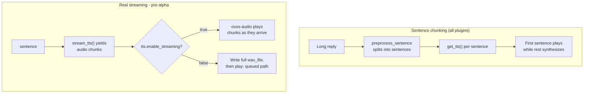

# Writing a TTS Plugin

!!! abstract "In a nutshell"
    This page is the tutorial for building your own TTS plugin: the `TTS` base class, the
    `StreamingTTS` variant, the entry point that makes a plugin installable, and how to test
    it. Looking for a plugin to use instead of writing one? Go to [TTS Plugins](tts-plugins.md).

## Writing your own TTS plugin

### TTS

All OVOS TTS plugins need to define a class based on the TTS base class from `ovos_plugin_manager`.
The base class marks two members abstract: `get_tts()` and `available_languages`. A plugin must
implement both, so the minimal example below includes `available_languages` from the start.

```python
from typing import Set
from ovos_utils import classproperty
from ovos_plugin_manager.templates.tts import TTS

class MyTTS(TTS):
    def get_tts(self, sentence: str, wav_file: str, lang: str = None,
                voice: str = None):
        # Synthesize `sentence` and write the audio to `wav_file`
        [...]
        # return the output path and optional per-phoneme visemes (or None)
        return wav_file, phonemes

    @classproperty
    def available_languages(cls) -> Set[str]:
        # Languages this plugin can synthesize, as a set of language codes
        return {"en-us"}

```

The base class declares `available_languages` as a `classproperty` (from `ovos_utils`), so it
can be read straight off the class, before anything is instantiated. That is how OVOS builds a
language-to-plugin map for a whole config without constructing every plugin first. It tells OVOS
which languages the plugin supports in its current state (for example, only the languages whose
voice files are already installed).

OVOS uses it to pick a TTS plugin for the configured language and to filter plugin choices in a
UI. Do not skip it. The base implementation has a docstring and no `return`, so it evaluates to
`None` — not to an empty set. Any caller doing `lang in tts.available_languages` then raises
`TypeError: argument of type 'NoneType' is not iterable`, rather than quietly treating the
plugin as supporting no language.

### Entry point

To make the class detectable as a TTS plugin, the package needs to provide an entry point under the `opm.tts` namespace. To expose your sample configurations (the `MyTTSConfig` dict below) for UI discovery, register them under `opm.tts.config`:

```toml
[project.entry-points."opm.tts"]
example_tts = "my_tts:MyTTS"

[project.entry-points."opm.tts.config"]
"example_tts.config" = "my_tts:MyTTSConfig"
```

> **Backward Compatibility**: `ovos-plugin-manager` still supports legacy `mycroft.plugin.tts` entry points, but new plugins should use the `opm.*` namespace.

### Standalone Usage

You can use TTS plugins independently of the full OVOS stack:

```python
from ovos_plugin_manager.tts import find_tts_plugins

# Find and load the plugin
plugins = find_tts_plugins()
tts_class = plugins["ovos-tts-plugin-mimic"]

# Initialize (config only — lang is passed inside the config dict)
tts = tts_class(config={"lang": "en-US"})

# Generate audio
wav_file = "hello.wav"
tts.get_tts("Hello world", wav_file)
print(f"Audio saved to {wav_file}")

```

### TTSValidator

`TTSValidator` is the class OVOS uses to check that a TTS engine is installed and usable before
it starts speaking. `TTS.__init__` creates a default `TTSValidator(self)` when a plugin does not
pass one in. `OVOSTTSFactory.create()` calls `tts.validator.validate()` right after building the
plugin instance, which runs, in order:

1. `validate_dependencies()`
2. `validate_instance()`
3. `validate_filename()`
4. `validate_lang()`
5. `validate_connection()`

In the base class every one of those methods is a no-op. A new plugin does not need to write a
`TTSValidator` at all. The default passes automatically. Write one only if the plugin needs a
real startup check, for example confirming a binary is on `PATH` or that a cloud endpoint
answers, and raise inside the relevant `validate_*` method to fail fast with a clear error
instead of failing later on the first `get_tts()` call.

```python
from ovos_plugin_manager.templates.tts import TTS, TTSValidator

class MyTTSValidator(TTSValidator):
    def validate_dependencies(self):
        # Raise if a required binary or library is missing
        pass

    def validate_connection(self):
        # Raise if the backend (local process or remote server) is unreachable
        pass

class MyTTSPlugin(TTS):
    def __init__(self, *args, **kwargs):
        super().__init__(*args, **kwargs, validator=MyTTSValidator(self))
```

See [OVOS Plugin Manager: Writing a Plugin](plugin-manager.md#writing-a-plugin) for how
registration and the `opm.tts` entry point fit together at load time: `find_tts_plugins()`
scans the `opm.tts` group and `load_tts_plugin(name)` returns one class from it.

`get_tts_class()` above is unrelated to that lookup. It is a method every `TTSValidator`
implements, and it exists so the validator can name the class it validates.

### Config plumbing

The `"tts": {"module": "...", "ovos-tts-plugin-x": {...}}` block in `mycroft.conf` reaches the
plugin instance through `OVOSTTSFactory.create()`:

1. `get_tts_config(config)` calls `get_plugin_config(config, "tts", module)`.
2. `get_plugin_config` reads `config["tts"]["ovos-tts-plugin-x"]` (the module-specific block) and
   fills in any top-level `tts` keys, such as `lang`, that the module block does not already set.
3. `OVOSTTSFactory.create()` passes the merged dict to the plugin class as `clazz(config=tts_config)`.
4. `TTS.__init__` stores it as `self.config`.

So a setting only reaches the plugin if it lives under `tts.<module-name>` (or as a shared
top-level key under `tts`), and the plugin reads it back with `self.config.get("my_setting")`.
See [OVOS Plugin Manager: Configuration Priority](plugin-manager.md#configuration-priority) for
the full precedence rules.

### Plugin Template

!!! note
    SSML: experimental, engine-dependent. See [SSML](ssml.md). Most plugins declare no
    `ssml_tags` and OVOS strips all SSML before synthesis.

```python
from ovos_utils import classproperty
from ovos_plugin_manager.templates.tts import TTS

class MyTTSPlugin(TTS):
    def __init__(self, *args, **kwargs):
        # Output format, and the SSML tags this engine GENUINELY handles.
        # Most engines support none — leave ssml_tags empty/omitted (the
        # default) and OVOS strips all SSML before get_tts() runs. Only list
        # a tag here if your engine actually understands it; listed tags are
        # passed through to get_tts() (optionally rewritten via modify_tag()).
        # Full SSML tag set an engine COULD support, for reference:
        #   ["speak", "s", "w", "voice", "prosody", "say-as", "break", "sub", "phoneme"]
        super().__init__(*args, **kwargs, audio_ext="wav")
        
        # Read plugin-specific settings from config
        self.voice = self.config.get("voice", "default")

    def get_tts(self, sentence, wav_file, lang=None, voice=None):
        """Generate audio data and save to wav_file."""
        # Implement your synthesis logic here
        # self.my_engine.synthesize(sentence, output_path=wav_file)
        
        # Return path to file and optional visemes for lip-sync
        return wav_file, None

    @classproperty
    def available_languages(cls):
        """Return languages supported by this TTS implementation."""
        return {"en-us", "es-es", "pt-pt"}

# Sample valid configurations for plugin discovery
MyTTSConfig = {
    lang: [{"lang": lang,
            "display_name": f"MyTTS ({lang})",
            "priority": 50,
            "offline": True}]
    for lang in ["en-us", "es-es", "pt-pt"]
}

```

### Reducing time to first audio

Two different mechanisms both get audio to the user faster. They are often both called
"streaming", so the manual names them apart:



*Diagram:* The chunking flow starts at a long reply and ends with the first sentence playing while the rest synthesizes, and the streaming flow starts at a sentence and branches on tts.enable_streaming between chunk playback in ovos-audio and the queued full-wav path.

**Sentence chunking ("fake streaming").** Long replies are split into sentences before
synthesis, so the first sentence plays while the rest still synthesizes. This works with
EVERY TTS plugin because the chunking happens before the engine runs. It is opt-in today:
set `"sentence_tokenize": true` in the plugin's config block (`TTS.preprocess_sentence`
splits with `quebra_frases`, with a newline-split fallback). This is the mechanism to
reach for in practice.

**Real streaming.** The engine itself emits audio chunks while it synthesizes, through the
`StreamingTTS` base class below.

!!! warning "Maturity: real streaming is pre-alpha"
    `StreamingTTS` is a proof-of-concept. Almost no TTS plugin implements it, and playback
    of streamed chunks is gated behind `tts.enable_streaming`. Use sentence chunking unless
    you are experimenting. See the [Maturity Scale](maturity.md).

Individual plugins may also expose their own latency settings (smaller models, lower
quality modes, caching). Check the plugin's own config table on the [TTS Plugins
Reference](tts-plugins-reference.md) page: anything that shortens synthesis shortens time
to first audio.

### Streaming support

Most engines synthesize the whole sentence before returning, which is what `get_tts()` above
does. A small number of backends can emit audio incrementally, and the template has a second
base class for that case: `StreamingTTS` (also in `ovos_plugin_manager.templates.tts`).

```python
from typing import AsyncIterable
from ovos_plugin_manager.templates.tts import StreamingTTS

class MyStreamingTTS(StreamingTTS):
    async def stream_tts(self, sentence: str, **kwargs) -> AsyncIterable[bytes]:
        """yield chunks of TTS audio as they become available"""
        async for chunk in self._backend_stream(sentence):
            yield chunk

    @classproperty
    def available_languages(cls):
        return {"en-us"}
```

`StreamingTTS` subclasses `TTS`, so it still needs `available_languages`, and it still answers
`get_tts(sentence, wav_file)` for callers that only want a finished file. The base class wraps
`stream_tts()` in an event loop and writes every chunk to `wav_file` before returning. The one
method a plugin must implement is `stream_tts()`, an `async` generator that yields raw audio
bytes as they come off the backend.

Two things only apply to streaming plugins:

- **No phonemes.** `StreamingTTS` does not support the `(wav_file, phonemes)` return shape from
  `get_tts()` for lip-sync; chunks are raw audio only.
- **Streaming playback is opt-in at the deployment level**, not the plugin level. Even when a
  plugin implements `stream_tts()`, `ovos-audio` only plays chunks as they arrive when the
  deployment config sets `"tts": {"enable_streaming": true}`. Without that flag `_execute()`
  falls back to the normal queued playback path (write the file, then play it), so a streaming
  plugin still works correctly on a deployment that has not opted in.

Do not implement `StreamingTTS` unless the backend genuinely streams. There is no benefit to
wrapping a synchronous, whole-file engine in an async generator that yields one chunk.

### Package and publish

1. **Pin the dependency version.** Put a floor and a ceiling on `ovos-plugin-manager` in
   `pyproject.toml`, for example `ovos-plugin-manager>=0.5.0,<1.0.0`. A floor alone lets a future
   breaking release slip in unnoticed. A ceiling alone lets an old install miss a needed feature.
2. **Install for local development.** Run `pip install -e .` from the plugin's own repository so
   changes to the source take effect without reinstalling. See
   [OVOS Plugin Manager: Install and verify](plugin-manager.md#3-install-and-verify) for the
   command that confirms OVOS can see the new plugin.
3. **Publish to PyPI.** OVOS deployments and the Plugin Arena's benchmark sweep both install
   plugins from PyPI, not from a git checkout, so a plugin needs a PyPI release before either can
   use it. See [Plugin Arena: Getting Your Plugin Ranked](plugin-arena.md#getting-your-plugin-ranked)
   for what a published plugin needs to be picked up by the sweep.

### Test your plugin locally

Instantiate the class directly and call `get_tts()` on it, the same way the [Standalone
Usage](#standalone-usage) example does, then check the file it wrote:

```python
from my_tts_package import MyTTSPlugin

tts = MyTTSPlugin(config={"lang": "en-US"})
wav_file, phonemes = tts.get_tts("Hello world", "hello.wav")
assert wav_file == "hello.wav"
```

Turn that into a pytest test that asserts a real audio file came out:

```python
import os
from my_tts_package import MyTTSPlugin

def test_get_tts_writes_wav_file(tmp_path):
    tts = MyTTSPlugin(config={"lang": "en-US"})
    out_file = str(tmp_path / "hello.wav")
    wav_file, phonemes = tts.get_tts("Hello world", out_file)
    assert os.path.isfile(wav_file)
    assert os.path.getsize(wav_file) > 0
```

To exercise the plugin inside a full OVOS install, `pip install -e .` it into the same virtual
environment or container `ovos-core`/`ovos-audio` run in, then set `"tts": {"module":
"<your-plugin-entry-point-name>"}` in `mycroft.conf` and restart OVOS, as described in [Change
your voice](tts-plugins.md#change-your-voice) above.

---
**Read next:** [G2P Plugins](g2p-plugins.md)
**Related:** [TTS Plugins](tts-plugins.md) · [TTS Plugins Reference](tts-plugins-reference.md) · [Plugin Manager](plugin-manager.md)
