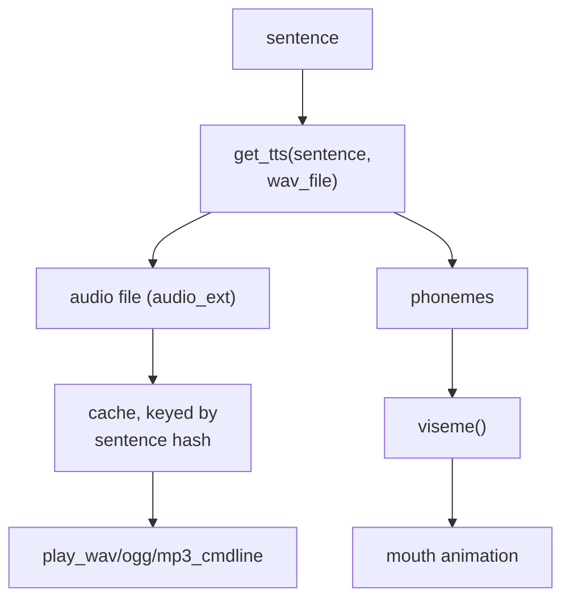

# TTS Plugins

!!! abstract "In a nutshell"
    TTS stands for *Text-to-Speech*: this is the part that gives your assistant its voice, turning written replies into spoken audio you can hear. It is the opposite of dictation. Instead of listening to you, it talks back. Different TTS plugins offer different voices and qualities, and some run on your own device while others use a cloud service. See the [Glossary](glossary.md) for related terms.

Writing a plugin instead of choosing one? See [Writing a TTS Plugin](tts-plugin-development.md).

??? info "Formal specification"
    TTS sits inside the audio output service, specified by **[OVOS-AUDIO-1: Audio Output Service](https://github.com/OpenVoiceOS/architecture/blob/dev/audio-out.md)**: an `ovos.utterance.speak` response runs through the dialog-transformer chain → TTS → tts-transformer chain → playback queue. See the [spec index](architecture-specs.md).

TTS plugins are responsible for converting text into audio for playback.



*Diagram:* The flow starts at the input sentence and ends at either playback or mouth animation, and get_tts() branches the output into an audio file for the playback commands and a phoneme list for the viseme mouth animation.

!!! note "Audio format contract"
    A TTS plugin is the **producer** end of the audio path, so it picks the format rather than
    receiving one. `get_tts()` writes a complete, self-describing audio file to the path it is
    handed and returns that path. The container format must match the plugin's `audio_ext`
    (default `"wav"`, set via the `TTS.__init__` argument), because `audio_ext` is what names
    the cache file and what playback dispatches on.

    Sample rate, bit depth and channel count
    are the plugin's own choice and travel inside the file's header. Nothing between
    `get_tts()` and the speakers resamples, remixes or re-encodes the audio, so whatever the
    engine emits is what is played. The one constraint is that the deployment must have a
    player for the extension: playback shells out to the command configured as
    `play_wav_cmdline`, `play_ogg_cmdline` or `play_mp3_cmdline` (falling back to a detected
    system player), so `wav`, `ogg` and `mp3` are the extensions a stock deployment can play.
    Plain 16-bit mono WAV is the safe default.

    `get_tts()` returns the tuple `(audio_path, phonemes)`. `phonemes` is optional. Return
    `None` when the engine exposes none. When present it is a space-separated string of
    `phoneme:duration` pairs, which the base class's `viseme()` converts into a list of
    `(viseme_code, duration_seconds)` tuples for mouth animation.

    A pair with no `:duration` is given `0.2` s. Both the audio and the phonemes are cached
    together, keyed by sentence hash.

!!! tip "Recommended: phoonnx"
    For fully offline, on-device synthesis, `ovos-tts-plugin-phoonnx` is the recommended
    starting point: it's OVOS's own ONNX-based multilingual neural TTS engine, installed with
    a single `pip install phoonnx`, and it fetches its model automatically the first time a
    voice is used. No separate download step. Cloud plugins like `ovos-tts-plugin-polly`,
    `ovos-tts-plugin-azure`, `ovos-tts-plugin-edge-tts` or `ovos-tts-plugin-google-tx` are a
    fair choice when you need a specific commercial voice or don't want to spend local compute
    on synthesis.

    **Footprint:** phoonnx voices are small, single-purpose ONNX models. The class of model
    ONNX Runtime is built to run efficiently on-device, unlike the heavier general-purpose
    engines further down this page (Coqui, Whisper-class transformers, etc.). Exact size varies
    per voice, since each one is a separate model fetched on first use.

## Change your voice

1. Browse [voices_demo](https://github.com/OpenVoiceOS/voices_demo) for audio samples of the
    available TTS voices, or check a plugin's own catalog entry below for what it offers.
2. Open `~/.config/mycroft/mycroft.conf` (create it if it doesn't exist) and set the `tts`
    section's `module` to the plugin you want, plus any plugin-specific settings (voice name,
    speaker id, etc.):
    ```json
    {
     "tts": {
       "module": "ovos-tts-plugin-phoonnx"
     }
    }
    ```
    Leaving out a `"voice"` key like this is a valid, minimal config. The plugin picks the
    first bundled model that supports the configured language. See the
    [ovos-tts-plugin-phoonnx](tts-plugins-reference.md#ovos-tts-plugin-phoonnx) entry for how to pin a
    specific voice.

    Installing a plugin's package (like `pip install phoonnx`) only makes it available to
    OVOS if it lands in the same Python environment OVOS itself runs in. Activate that venv
    or container first, the same way [Your First Skill](first-skill.md) does before installing
    a skill.

3. Save the file. It's JSONC (comments allowed). Restart OVOS for the change to take effect.

!!! tip
    Don't want to hand-pick a plugin and voice yourself? `ovos-config autoconfigure -l <lang> ...`
    picks a recommended offline/online voice for your language automatically. See
    [Language Support](lang-support.md#auto-configuration).

## TTS Plugins Reference

Code license is the SPDX license of the plugin's own repository. Where the plugin wraps a
separately-licensed model or a paid cloud service, that is called out under "model".

| Plugin | Description | License | Maturity |
|--------|-------------|---------|----------|
| [ovos-tts-server](tts-plugins-reference.md#ovos-tts-server) | Turn any OVOS TTS plugin into a micro service! | Apache-2.0 | Stable |
| [ovos-tts-plugin-polly](tts-plugins-reference.md#ovos-tts-plugin-polly) | Amazon Polly cloud text-to-speech. | Apache-2.0 (cloud service, separate Amazon terms) | Mature |
| [ovos-tts-plugin-google-tx](tts-plugins-reference.md#ovos-tts-plugin-google-tx) | OVOS TTS plugin for [gTTS](https://github.com/pndurette/gTTS) | Apache-2.0 (cloud service, unofficial Google endpoint, separate Google terms) | Mature |
| [ovos-tts-plugin-edge-tts](tts-plugins-reference.md#ovos-tts-plugin-edge-tts) | TTS plugin for [OVOS](https://openvoiceos.org) based on [Edge-TTS](https://github.com/rany2/edge-tts) | Apache-2.0 | Stable |
| [ovos-tts-plugin-matxa-multispeaker-cat](tts-plugins-reference.md#ovos-tts-plugin-matxa-multispeaker-cat) | [Matxa-TTS](https://huggingface.co/projecte-aina/matxa-tts-cat-multiaccent), the multispeaker, multidialectal neural TTS model. It works together with the vocoder model [alVoCat](https://huggingface.co/projecte-aina/alvocat-vocos-22khz) to generate speech in four Catalan dialects. Warning: archived, deprecated. | Apache-2.0 (model: see model card) | Deprecated |
| [ovos-tts-plugin-marytts](tts-plugins-reference.md#ovos-tts-plugin-marytts) | TTS Plugin for [MaryTTS](https://github.com/marytts/marytts) | Apache-2.0 | Stable |
| [ovos-tts-plugin-piper](tts-plugins-reference.md#ovos-tts-plugin-piper) | Offline neural TTS with the [Piper](https://github.com/rhasspy/piper) engine. Warning: archived, deprecated — [phoonnx](https://github.com/TigreGotico/phoonnx) is the maintained successor. | Apache-2.0 | Deprecated |
| [ovos-tts-plugin-espeakNG](tts-plugins-reference.md#ovos-tts-plugin-espeakng) | eSpeak NG offline text-to-speech (robotic, supports many languages). | GPL-3.0 | Mature |
| [ovos-tts-plugin-beepspeak](tts-plugins-reference.md#ovos-tts-plugin-beepspeak) | Novelty R2-D2-style beep text-to-speech. | see repo (no license file) | Stable |
| [ovos-tts-plugin-cotovia](tts-plugins-reference.md#ovos-tts-plugin-cotovia) | OVOS TTS plugin for [Cotovia TTS](http://gtm.uvigo.es/cotovia) | Apache-2.0 | Mature |
| [ovos-tts-plugin-mimic](tts-plugins-reference.md#ovos-tts-plugin-mimic) | OVOS TTS plugin for [Mimic](https://github.com/MycroftAI/mimic1) | Apache-2.0 | Mature |
| [ovos-tts-plugin-SAM](tts-plugins-reference.md#ovos-tts-plugin-sam) | S.A.M., Software Automatic Mouth, the classic retro speech synthesizer. | see repo (no license file) | Mature |
| [ovos-tts-plugin-azure](tts-plugins-reference.md#ovos-tts-plugin-azure) | This TTS service for OpenVoiceOS requires a subscription to Microsoft Azure and the creation of a Speech resource (https://docs.microsoft.com/en-us/azure/cognitive-services/speech-service/overview#create-the-azure-resource) | Apache-2.0 (cloud service, separate Microsoft terms) | Stable |
| [ovos-tts-plugin-ahotts](tts-plugins-reference.md#ovos-tts-plugin-ahotts) | OVOS TTS plugin for [AhoTTS](https://github.com/aholab/AhoTTS) | Apache-2.0 | Stable |
| [ovos-tts-plugin-server](tts-plugins-reference.md#ovos-tts-server-plugin) | Companion plugin for an [OVOS TTS Server](https://github.com/OpenVoiceOS/ovos-tts-server). Install name is `ovos-tts-plugin-server`; the repo is `ovos-tts-server-plugin` (words swapped). **Uses public community servers unless you set `host`** | Apache-2.0 | Mature |
| [ovos-tts-plugin-coqui](tts-plugins-reference.md#ovos-tts-plugin-coqui) | OVOS TTS plugin for [Coqui TTS](https://coqui-tts.readthedocs.io/en/latest) | Apache-2.0 | Stable |
| [ovos-tts-plugin-pico](tts-plugins-reference.md#ovos-tts-plugin-pico) | SVOX Pico lightweight offline text-to-speech. | Apache-2.0 | Mature |
| [ovos-tts-plugin-lux](https://github.com/OpenVoiceOS/ovos-tts-plugin-lux) | LuxTTS: zipvoice-based voice-cloning TTS (48 kHz, en-US). *(not yet packaged, no dedicated section, see repo)* | Apache-2.0 | Beta |
| [ovos-tts-plugin-phoonnx](tts-plugins-reference.md#ovos-tts-plugin-phoonnx) | Built into [phoonnx](https://pypi.org/project/phoonnx), OVOS's own ONNX-based multilingual neural TTS engine. It is the default choice for fully offline synthesis, with automatic model fetching. | see repo (no license file, models: see model card) | Stable |
| [ovos-tts-plugin-omnivoice](https://github.com/OpenVoiceOS/ovos-tts-plugin-omnivoice) | Wraps [OmniVoice](https://github.com/k2-fsa/OmniVoice), a massively multilingual (600+ languages) zero-shot TTS model with `auto`, voice-design (`instruct`), and voice-cloning (`ref_audio`) modes. Warning: no packaged release yet, install from source. *(not yet packaged, no dedicated section, see repo)* | Apache-2.0 (model: see model card) | Alpha |

--8<-- "snippets/maturity-disclaimer.md"

!!! note "License and Maturity are independent axes"
    The **License** column reports what the repository itself declares. "No
    license file" just means no SPDX license was found, not that the code is unmature.
    The **Maturity** column reports repository health (age, activity, issues/PRs, docs).
    A plugin can be **Mature** and still ship no license file. A plugin can be **Stable**
    with a permissive license but thin docs. Don't read one column as implying the other.

## Learn more

Full technical detail per plugin (repository link, license notes, default configuration) lives on the [TTS Plugins Reference](tts-plugins-reference.md) page linked from the table above. Writing a plugin instead of choosing one? See [Writing a TTS Plugin](tts-plugin-development.md).

---
**Read next:** [G2P Plugins](g2p-plugins.md)
**Related:** [TTS Plugins Reference](tts-plugins-reference.md) · [Writing a TTS Plugin](tts-plugin-development.md) · [STT Plugins](stt-plugins.md) · [TTS Server](tts-server.md) · [TTS Transformers](tts-transformers.md) · [Introducing phoonnx: OVOS's next-gen TTS engine](https://blog.openvoiceos.org/posts/2025-10-06-phoonnx)
