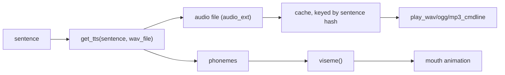
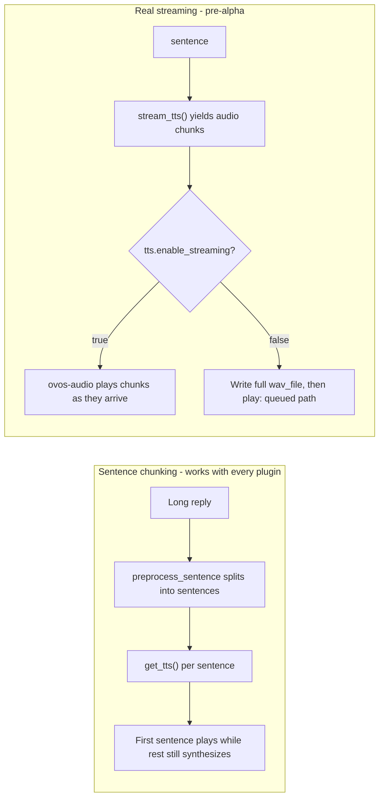

# TTS Plugins

!!! abstract "In a nutshell"
    TTS stands for *Text-to-Speech*: this is the part that gives your assistant its voice, turning written replies into spoken audio you can hear. It is the opposite of dictation. Instead of listening to you, it talks back. Different TTS plugins offer different voices and qualities, and some run on your own device while others use a cloud service. See the [Glossary](glossary.md) for related terms.

Writing a plugin instead of choosing one? Jump to [Writing your own](#writing-your-own-tts-plugin).

??? info "Formal specification"
    TTS sits inside the audio output service, specified by **[OVOS-AUDIO-1: Audio Output Service](https://github.com/OpenVoiceOS/architecture/blob/dev/audio-out.md)**: an `ovos.utterance.speak` response runs through the dialog-transformer chain → TTS → tts-transformer chain → playback queue. See the [spec index](architecture-specs.md).

TTS plugins are responsible for converting text into audio for playback.



*Diagram:* The flow starts at the input sentence and ends at either playback or mouth animation, and get_tts() branches the output into an audio file for the playback commands and a phoneme list for the viseme mouth animation.

!!! note "Audio format contract"
    A TTS plugin is the **producer** end of the audio path, so it picks the format rather than
    receiving one. `get_tts()` writes a complete, self-describing audio file to the path it is
    handed and returns that path. The container format must match the plugin's `audio_ext`
    (default `"wav"`, set via the `TTS.__init__` argument), because `audio_ext` is what names
    the cache file and what playback dispatches on.

    Sample rate, bit depth and channel count
    are the plugin's own choice and travel inside the file's header. Nothing between
    `get_tts()` and the speakers resamples, remixes or re-encodes the audio, so whatever the
    engine emits is what is played. The one constraint is that the deployment must have a
    player for the extension: playback shells out to the command configured as
    `play_wav_cmdline`, `play_ogg_cmdline` or `play_mp3_cmdline` (falling back to a detected
    system player), so `wav`, `ogg` and `mp3` are the extensions a stock deployment can play.
    Plain 16-bit mono WAV is the safe default.

    `get_tts()` returns the tuple `(audio_path, phonemes)`. `phonemes` is optional. Return
    `None` when the engine exposes none. When present it is a space-separated string of
    `phoneme:duration` pairs, which the base class's `viseme()` converts into a list of
    `(viseme_code, duration_seconds)` tuples for mouth animation.

    A pair with no `:duration` is given `0.2` s. Both the audio and the phonemes are cached
    together, keyed by sentence hash.

!!! tip "Recommended: phoonnx"
    For fully offline, on-device synthesis, `ovos-tts-plugin-phoonnx` is the recommended
    starting point: it's OVOS's own ONNX-based multilingual neural TTS engine, installed with
    a single `pip install phoonnx`, and it fetches its model automatically the first time a
    voice is used. No separate download step. Cloud plugins like `ovos-tts-plugin-polly`,
    `ovos-tts-plugin-azure`, `ovos-tts-plugin-edge-tts` or `ovos-tts-plugin-google-tx` are a
    fair choice when you need a specific commercial voice or don't want to spend local compute
    on synthesis.

    **Footprint:** phoonnx voices are small, single-purpose ONNX models. The class of model
    ONNX Runtime is built to run efficiently on-device, unlike the heavier general-purpose
    engines further down this page (Coqui, Whisper-class transformers, etc.). Exact size varies
    per voice, since each one is a separate model fetched on first use.

## Change your voice

1. Browse [voices_demo](https://github.com/OpenVoiceOS/voices_demo) for audio samples of the
   available TTS voices, or check a plugin's own catalog entry below for what it offers.
2. Open `~/.config/mycroft/mycroft.conf` (create it if it doesn't exist) and set the `tts`
   section's `module` to the plugin you want, plus any plugin-specific settings (voice name,
   speaker id, etc.):
   ```json
   {
     "tts": {
       "module": "ovos-tts-plugin-phoonnx"
     }
   }
   ```
   Leaving out a `"voice"` key like this is a valid, minimal config. The plugin picks the
   first bundled model that supports the configured language. See the
   [ovos-tts-plugin-phoonnx](#ovos-tts-plugin-phoonnx) section below for how to pin a
   specific voice.

   Installing a plugin's package (like `pip install phoonnx`) only makes it available to
   OVOS if it lands in the same Python environment OVOS itself runs in. Activate that venv
   or container first, the same way [Your First Skill](first-skill.md) does before installing
   a skill.
3. Save the file. It's JSONC (comments allowed). Restart OVOS for the change to take effect.

!!! tip
    Don't want to hand-pick a plugin and voice yourself? `ovos-config autoconfigure -l <lang> ...`
    picks a recommended offline/online voice for your language automatically. See
    [Language Support](lang-support.md#auto-configuration).

# TTS Plugins Reference

Code license is the SPDX license of the plugin's own repository. Where the plugin wraps a
separately-licensed model or a paid cloud service, that is called out under "model".

| Plugin | Description | License | Maturity |
|--------|-------------|---------|----------|
| [ovos-tts-server](#ovos-tts-server) | Turn any OVOS TTS plugin into a micro service! | Apache-2.0 | Stable |
| [ovos-tts-plugin-polly](#ovos-tts-plugin-polly) | Amazon Polly cloud text-to-speech. | Apache-2.0 (cloud service, separate Amazon terms) | Mature |
| [ovos-tts-plugin-google-tx](#ovos-tts-plugin-google-tx) | OVOS TTS plugin for [gTTS](https://github.com/pndurette/gTTS) | Apache-2.0 (cloud service, unofficial Google endpoint, separate Google terms) | Mature |
| [ovos-tts-plugin-edge-tts](#ovos-tts-plugin-edge-tts) | TTS plugin for [OVOS](https://openvoiceos.org) based on [Edge-TTS](https://github.com/rany2/edge-tts) | Apache-2.0 | Stable |
| [ovos-tts-plugin-matxa-multispeaker-cat](#ovos-tts-plugin-matxa-multispeaker-cat) | [Matxa-TTS](https://huggingface.co/projecte-aina/matxa-tts-cat-multiaccent), the multispeaker, multidialectal neural TTS model. It works together with the vocoder model [alVoCat](https://huggingface.co/projecte-aina/alvocat-vocos-22khz) to generate speech in four Catalan dialects. Warning: archived, deprecated. | Apache-2.0 (model: see model card) | Deprecated |
| [ovos-tts-plugin-marytts](#ovos-tts-plugin-marytts) | TTS Plugin for [MaryTTS](https://github.com/marytts/marytts) | Apache-2.0 | Stable |
| [ovos-tts-plugin-piper](#ovos-tts-plugin-piper) | Offline neural TTS with the [Piper](https://github.com/rhasspy/piper) engine. Default TTS on the raspOVOS hybrid/offline images. | Apache-2.0 | Stable |
| [ovos-tts-plugin-espeakNG](#ovos-tts-plugin-espeakng) | eSpeak NG offline text-to-speech (robotic, supports many languages). | GPL-3.0 | Mature |
| [ovos-tts-plugin-beepspeak](#ovos-tts-plugin-beepspeak) | Novelty R2-D2-style beep text-to-speech. | see repo (no license file) | Stable |
| [ovos-tts-plugin-cotovia](#ovos-tts-plugin-cotovia) | OVOS TTS plugin for [Cotovia TTS](http://gtm.uvigo.es/cotovia) | Apache-2.0 | Mature |
| [ovos-tts-plugin-mimic](#ovos-tts-plugin-mimic) | OVOS TTS plugin for [Mimic](https://github.com/MycroftAI/mimic1) | Apache-2.0 | Mature |
| [ovos-tts-plugin-SAM](#ovos-tts-plugin-sam) | S.A.M., Software Automatic Mouth, the classic retro speech synthesizer. | see repo (no license file) | Mature |
| [ovos-tts-plugin-azure](#ovos-tts-plugin-azure) | This TTS service for OpenVoiceOS requires a subscription to Microsoft Azure and the creation of a Speech resource (https://docs.microsoft.com/en-us/azure/cognitive-services/speech-service/overview#create-the-azure-resource) | Apache-2.0 (cloud service, separate Microsoft terms) | Stable |
| [ovos-tts-plugin-ahotts](#ovos-tts-plugin-ahotts) | OVOS TTS plugin for [AhoTTS](https://github.com/aholab/AhoTTS) | Apache-2.0 | Stable |
| [ovos-tts-server-plugin](#ovos-tts-server-plugin) | OpenVoiceOS companion plugin for [OpenVoiceOS TTS Server](https://github.com/OpenVoiceOS/ovos-tts-server) | Apache-2.0 | Mature |
| [ovos-tts-plugin-coqui](#ovos-tts-plugin-coqui) | OVOS TTS plugin for [Coqui TTS](https://coqui-tts.readthedocs.io/en/latest) | Apache-2.0 | Stable |
| [ovos-tts-plugin-pico](#ovos-tts-plugin-pico) | SVOX Pico lightweight offline text-to-speech. | Apache-2.0 | Mature |
| [ovos-tts-plugin-lux](https://github.com/OpenVoiceOS/ovos-tts-plugin-lux) | LuxTTS: zipvoice-based voice-cloning TTS (48 kHz, en-US). *(not yet packaged, no dedicated section, see repo)* | Apache-2.0 | Beta |
| [ovos-tts-plugin-phoonnx](#ovos-tts-plugin-phoonnx) | Built into [phoonnx](https://pypi.org/project/phoonnx), OVOS's own ONNX-based multilingual neural TTS engine. It is the default choice for fully offline synthesis, with automatic model fetching. | see repo (no license file, models: see model card) | Stable |
| [ovos-tts-plugin-omnivoice](https://github.com/OpenVoiceOS/ovos-tts-plugin-omnivoice) | Wraps [OmniVoice](https://github.com/k2-fsa/OmniVoice), a massively multilingual (600+ languages) zero-shot TTS model with `auto`, voice-design (`instruct`), and voice-cloning (`ref_audio`) modes. Warning: no packaged release yet, install from source. *(not yet packaged, no dedicated section, see repo)* | Apache-2.0 (model: see model card) | Alpha |

Maturity reflects repository health (age, activity, open issues/PRs, in-repo docs), not version. See the [Maturity Scale](maturity.md).

!!! note "License and Maturity are independent axes"
    The **License** column reports what the repository itself declares. "No
    license file" just means no SPDX license was found, not that the code is unmature.
    The **Maturity** column reports repository health (age, activity, issues/PRs, docs).
    A plugin can be **Mature** and still ship no license file. A plugin can be **Stable**
    with a permissive license but thin docs. Don't read one column as implying the other.

## ovos-tts-server

- **GitHub**: [OpenVoiceOS/ovos-tts-server](https://github.com/OpenVoiceOS/ovos-tts-server)


- **Description**: Turn any OVOS TTS plugin into a micro service!

---

## ovos-tts-plugin-polly

- **GitHub**: [OpenVoiceOS/ovos-tts-plugin-polly](https://github.com/OpenVoiceOS/ovos-tts-plugin-polly)


- **Description**: Amazon Polly cloud text-to-speech.

---

## ovos-tts-plugin-google-tx

- **GitHub**: [OpenVoiceOS/ovos-tts-plugin-google-tx](https://github.com/OpenVoiceOS/ovos-tts-plugin-google-tx)


- **Description**: OVOS TTS plugin for [gTTS](https://github.com/pndurette/gTTS)

!!! note
    gTTS works by calling the same unofficial, undocumented endpoint used by the Google
    Translate web UI's "listen" feature. It is not a published, API-keyed Google Cloud
    Text-to-Speech API. Google can change or revoke access to this endpoint at any time.

### Default Configuration

```jsonc
  "tts": {
    "module": "ovos-tts-plugin-google-tx"
  }
 

```

---

## ovos-tts-plugin-edge-tts

- **GitHub**: [OpenVoiceOS/ovos-tts-plugin-edge-tts](https://github.com/OpenVoiceOS/ovos-tts-plugin-edge-tts)


- **Description**: TTS plugin for [OVOS](https://openvoiceos.org) based on [Edge-TTS](https://github.com/rany2/edge-tts)

---

## ovos-tts-plugin-matxa-multispeaker-cat

- **GitHub**: [OpenVoiceOS/ovos-tts-plugin-matxa-multispeaker-cat](https://github.com/OpenVoiceOS/ovos-tts-plugin-matxa-multispeaker-cat)


- **Description**: [Matxa-TTS](https://huggingface.co/projecte-aina/matxa-tts-cat-multiaccent), the multispeaker, multidialectal neural TTS model. It works together with the vocoder model [alVoCat](https://huggingface.co/projecte-aina/alvocat-vocos-22khz) to generate speech in four Catalan dialects.

### Default Configuration

```jsonc
  "tts": {
    "module": "ovos-tts-plugin-matxa-multispeaker-cat",
    "ovos-tts-plugin-matxa-multispeaker-cat": {
      "voice": "valencia/gina"
    }
  }

```

---

## ovos-tts-plugin-piper

- **GitHub**: [https://github.com/OpenVoiceOS/ovos-tts-plugin-piper](https://github.com/OpenVoiceOS/ovos-tts-plugin-piper)

- **Description**: Offline neural TTS using the [Piper](https://github.com/rhasspy/piper) engine (ONNX voices). This is the default TTS on the raspOVOS `hybrid` and `offline` images.

- **Config**: set `"module": "ovos-tts-plugin-piper"` in the `tts` block. A `"voice"` key selects a specific Piper voice model; without it the plugin picks a voice for the configured language.

## ovos-tts-plugin-marytts

- **GitHub**: [OpenVoiceOS/ovos-tts-plugin-marytts](https://github.com/OpenVoiceOS/ovos-tts-plugin-marytts)


- **Description**: TTS Plugin for [MaryTTS](https://github.com/marytts/marytts)

### Default Configuration

```jsonc
"tts": {
    "module": "ovos-tts-plugin-marytts",
    "ovos-tts-plugin-marytts": {
      "url": "http://0.0.0.0:59125",
      "voice": "cmu-slt-hsmm"
    }
}

```

---

## ovos-tts-plugin-espeakNG

- **GitHub**: [OpenVoiceOS/ovos-tts-plugin-espeakNG](https://github.com/OpenVoiceOS/ovos-tts-plugin-espeakNG)


- **Description**: eSpeak NG offline text-to-speech (robotic, supports many languages).

---

## ovos-tts-plugin-beepspeak

- **GitHub**: [OpenVoiceOS/ovos-tts-plugin-beepspeak](https://github.com/OpenVoiceOS/ovos-tts-plugin-beepspeak)


- **Description**: Novelty R2-D2-style beep text-to-speech.

---

## ovos-tts-plugin-cotovia

- **GitHub**: [OpenVoiceOS/ovos-tts-plugin-cotovia](https://github.com/OpenVoiceOS/ovos-tts-plugin-cotovia)


- **Description**: OVOS TTS plugin for [Cotovia TTS](http://gtm.uvigo.es/cotovia)

### Default Configuration

```jsonc
  "tts": {
    "module": "ovos-tts-plugin-cotovia",
    "ovos-tts-plugin-cotovia": {
      "voice": "iago"
    }
  }
 

```

---

## ovos-tts-plugin-mimic

- **GitHub**: [OpenVoiceOS/ovos-tts-plugin-mimic](https://github.com/OpenVoiceOS/ovos-tts-plugin-mimic)


- **Description**: OVOS TTS plugin for [Mimic](https://github.com/MycroftAI/mimic1)

### Default Configuration

```jsonc
  "tts": {
    "module": "ovos-tts-plugin-mimic",
    "ovos-tts-plugin-mimic": {
      "voice": "ap"
    }
  }

```

---

## ovos-tts-plugin-SAM

- **GitHub**: [OpenVoiceOS/ovos-tts-plugin-SAM](https://github.com/OpenVoiceOS/ovos-tts-plugin-SAM)


- **Description**: S.A.M., Software Automatic Mouth, the classic retro speech synthesizer.

---

## ovos-tts-plugin-azure

- **GitHub**: [OpenVoiceOS/ovos-tts-plugin-azure](https://github.com/OpenVoiceOS/ovos-tts-plugin-azure)


- **Description**: This TTS service for OpenVoiceOS requires a subscription to Microsoft Azure and the creation of a Speech resource (https://docs.microsoft.com/en-us/azure/cognitive-services/speech-service/overview#create-the-azure-resource)

### Default Configuration

!!! warning "Never commit a real `api_key`"
    Treat this like any other credential: keep the real value out of version control and
    shared config files. Use a local, untracked config or an environment-backed secret
    store instead of hard-coding it in `mycroft.conf`.

```jsonc
"tts": {
    "module": "ovos-tts-plugin-azure",
    "ovos-tts-plugin-azure": {
        "api_key": "insert_your_key_here",
        "voice": "en-US-JennyNeural",  // optional, default "en-US-Guy24kRUS"
        "region": "westus" // optional, if your region is westus
    }
}

```

---

## ovos-tts-plugin-ahotts

- **GitHub**: [OpenVoiceOS/ovos-tts-plugin-ahotts](https://github.com/OpenVoiceOS/ovos-tts-plugin-ahotts)


- **Description**: OVOS TTS plugin for [AhoTTS](https://github.com/aholab/AhoTTS)

### Default Configuration

```jsonc
  "tts": {
    "module": "ovos-tts-plugin-ahotts",
    "ovos-tts-plugin-ahotts": {
        "lang": "eu"
    }
  }

```

---

## ovos-tts-server-plugin

- **GitHub**: [OpenVoiceOS/ovos-tts-server-plugin](https://github.com/OpenVoiceOS/ovos-tts-server-plugin)


- **Description**: OpenVoiceOS companion plugin for [OpenVoiceOS TTS Server](https://github.com/OpenVoiceOS/ovos-tts-server)

!!! warning "Talks to a public community server by default"
    The `host` below points at a best-effort, publicly-run community server, not a private
    or guaranteed-available endpoint. Point it at your own self-hosted server (see
    [tts-server](tts-server.md#companion-plugin)) if you need privacy or reliability.

### Default Configuration

```jsonc
  "tts": {
    "module": "ovos-tts-plugin-server",
    "ovos-tts-plugin-server": {
        "host": "https://tts.smartgic.io/piper",
        "v2": true,
        "verify_ssl": true,
        "tts_timeout": 5
     }
 } 

```

That default `host` is a public community-run Piper server, not an address on your network. See
[tts-server](tts-server.md#companion-plugin) to self-host, or pick a fully offline voice from the
table above.

--8<-- "snippets/community-servers.md"

---

## ovos-tts-plugin-coqui

- **GitHub**: [OpenVoiceOS/ovos-tts-plugin-coqui](https://github.com/OpenVoiceOS/ovos-tts-plugin-coqui)


- **Description**: OVOS TTS plugin for [Coqui TTS](https://coqui-tts.readthedocs.io/en/latest)

### Default Configuration

```jsonc
  "tts": {
    "module": "ovos-tts-plugin-coqui",
    "ovos-tts-plugin-coqui": {}
  }
 

```

---

## ovos-tts-plugin-pico

- **GitHub**: [OpenVoiceOS/ovos-tts-plugin-pico](https://github.com/OpenVoiceOS/ovos-tts-plugin-pico)


- **Description**: SVOX Pico lightweight offline text-to-speech.

---

## ovos-tts-plugin-phoonnx

- **GitHub**: [TigreGotico/phoonnx](https://github.com/TigreGotico/phoonnx)


- **Description**: OVOS's own multilingual, ONNX-based neural TTS engine, distributed as part of the `phoonnx` package. Registering the plugin only requires `pip install phoonnx`. Model files are fetched and cached automatically the first time a voice is used.

### Default Configuration

```jsonc
  "tts": {
    "module": "ovos-tts-plugin-phoonnx",
    "ovos-tts-plugin-phoonnx": {
      "voice": "OpenVoiceOS/phoonnx_pt-PT_miro_tugaphone"
    }
  }

```

> If `"voice"` is omitted, the plugin picks the first bundled model that supports the configured language.

---

## Writing your own TTS plugin

### TTS

All OVOS TTS plugins need to define a class based on the TTS base class from `ovos_plugin_manager`.
The base class marks two members abstract: `get_tts()` and `available_languages`. A plugin must
implement both, so the minimal example below includes `available_languages` from the start.

```python
from typing import Set
from ovos_utils import classproperty
from ovos_plugin_manager.templates.tts import TTS

class MyTTS(TTS):
    def get_tts(self, sentence: str, wav_file: str, lang: str = None,
                voice: str = None):
        # Synthesize `sentence` and write the audio to `wav_file`
        [...]
        # return the output path and optional per-phoneme visemes (or None)
        return wav_file, phonemes

    @classproperty
    def available_languages(cls) -> Set[str]:
        # Languages this plugin can synthesize, as a set of language codes
        return {"en-us"}

```

The base class declares `available_languages` as a `classproperty` (from `ovos_utils`), so it
can be read straight off the class, before anything is instantiated. That is how OVOS builds a
language-to-plugin map for a whole config without constructing every plugin first. It tells OVOS
which languages the plugin supports in its current state (for example, only the languages whose
voice files are already installed).

OVOS uses it to pick a TTS plugin for the configured language and to filter plugin choices in a
UI. A plugin that skips it still loads, but any code that inspects `available_languages` sees an
empty set and treats the plugin as supporting no language.

### Entry point

To make the class detectable as a TTS plugin, the package needs to provide an entry point under the `opm.tts` namespace. To expose your sample configurations (the `MyTTSConfig` dict below) for UI discovery, register them under `opm.tts.config`:

```toml
[project.entry-points."opm.tts"]
example_tts = "my_tts:myTTS"

[project.entry-points."opm.tts.config"]
"example_tts.config" = "my_tts:MyTTSConfig"
```

> **Backward Compatibility**: `ovos-plugin-manager` still supports legacy `mycroft.plugin.tts` entry points, but new plugins should use the `opm.*` namespace.

### Standalone Usage

You can use TTS plugins independently of the full OVOS stack:

```python
from ovos_plugin_manager.tts import find_tts_plugins

# Find and load the plugin
plugins = find_tts_plugins()
tts_class = plugins["ovos-tts-plugin-mimic"]

# Initialize (config only — lang is passed inside the config dict)
tts = tts_class(config={"lang": "en-US"})

# Generate audio
wav_file = "hello.wav"
tts.get_tts("Hello world", wav_file)
print(f"Audio saved to {wav_file}")

```

### TTSValidator

`TTSValidator` is the class OVOS uses to check that a TTS engine is installed and usable before
it starts speaking. `TTS.__init__` creates a default `TTSValidator(self)` when a plugin does not
pass one in. `OVOSTTSFactory.create()` calls `tts.validator.validate()` right after building the
plugin instance, which runs, in order:

1. `validate_dependencies()`
2. `validate_instance()`
3. `validate_filename()`
4. `validate_lang()`
5. `validate_connection()`

In the base class every one of those methods is a no-op. A new plugin does not need to write a
`TTSValidator` at all. The default passes automatically. Write one only if the plugin needs a
real startup check, for example confirming a binary is on `PATH` or that a cloud endpoint
answers, and raise inside the relevant `validate_*` method to fail fast with a clear error
instead of failing later on the first `get_tts()` call.

```python
from ovos_plugin_manager.templates.tts import TTS, TTSValidator

class MyTTSValidator(TTSValidator):
    def validate_dependencies(self):
        # Raise if a required binary or library is missing
        pass

    def validate_connection(self):
        # Raise if the backend (local process or remote server) is unreachable
        pass

class MyTTSPlugin(TTS):
    def __init__(self, *args, **kwargs):
        super().__init__(*args, **kwargs, validator=MyTTSValidator(self))
```

See [OVOS Plugin Manager: Writing a Plugin](plugin-manager.md#writing-a-plugin) for how
`get_tts_class()`/registration and the `opm.tts` entry point fit together at load time.

### Config plumbing

The `"tts": {"module": "...", "ovos-tts-plugin-x": {...}}` block in `mycroft.conf` reaches the
plugin instance through `OVOSTTSFactory.create()`:

1. `get_tts_config(config)` calls `get_plugin_config(config, "tts", module)`.
2. `get_plugin_config` reads `config["tts"]["ovos-tts-plugin-x"]` (the module-specific block) and
   fills in any top-level `tts` keys, such as `lang`, that the module block does not already set.
3. `OVOSTTSFactory.create()` passes the merged dict to the plugin class as `clazz(config=tts_config)`.
4. `TTS.__init__` stores it as `self.config`.

So a setting only reaches the plugin if it lives under `tts.<module-name>` (or as a shared
top-level key under `tts`), and the plugin reads it back with `self.config.get("my_setting")`.
See [OVOS Plugin Manager: Configuration Priority](plugin-manager.md#configuration-priority) for
the full precedence rules.

### Plugin Template

!!! note
    SSML: experimental, engine-dependent. See [SSML](ssml.md). Most plugins declare no
    `ssml_tags` and OVOS strips all SSML before synthesis.

```python
from ovos_utils import classproperty
from ovos_plugin_manager.templates.tts import TTS

class MyTTSPlugin(TTS):
    def __init__(self, *args, **kwargs):
        # Output format, and the SSML tags this engine GENUINELY handles.
        # Most engines support none — leave ssml_tags empty/omitted (the
        # default) and OVOS strips all SSML before get_tts() runs. Only list
        # a tag here if your engine actually understands it; listed tags are
        # passed through to get_tts() (optionally rewritten via modify_tag()).
        # Full SSML tag set an engine COULD support, for reference:
        #   ["speak", "s", "w", "voice", "prosody", "say-as", "break", "sub", "phoneme"]
        super().__init__(*args, **kwargs, audio_ext="wav")
        
        # Read plugin-specific settings from config
        self.voice = self.config.get("voice", "default")

    def get_tts(self, sentence, wav_file, lang=None, voice=None):
        """Generate audio data and save to wav_file."""
        # Implement your synthesis logic here
        # self.my_engine.synthesize(sentence, output_path=wav_file)
        
        # Return path to file and optional visemes for lip-sync
        return wav_file, None

    @classproperty
    def available_languages(cls):
        """Return languages supported by this TTS implementation."""
        return {"en-us", "es-es", "pt-pt"}

# Sample valid configurations for plugin discovery
MyTTSConfig = {
    lang: [{"lang": lang,
            "display_name": f"MyTTS ({lang})",
            "priority": 50,
            "offline": True}]
    for lang in ["en-us", "es-es", "pt-pt"]
}

```

### Reducing time to first audio

Two different mechanisms both get audio to the user faster. They are often both called
"streaming", so the manual names them apart:



*Diagram:* The chunking flow starts at a long reply and ends with the first sentence playing while the rest synthesizes, and the streaming flow starts at a sentence and branches on tts.enable_streaming between chunk playback in ovos-audio and the queued full-wav path.

**Sentence chunking ("fake streaming").** Long replies are split into sentences before
synthesis, so the first sentence plays while the rest still synthesizes. This works with
EVERY TTS plugin because the chunking happens before the engine runs. It is opt-in today:
set `"sentence_tokenize": true` in the plugin's config block (`TTS.preprocess_sentence`
splits with `quebra_frases`, with a newline-split fallback). This is the mechanism to
reach for in practice.

**Real streaming.** The engine itself emits audio chunks while it synthesizes, through the
`StreamingTTS` base class below.

!!! warning "Maturity: real streaming is pre-alpha"
    `StreamingTTS` is a proof-of-concept. Almost no TTS plugin implements it, and playback
    of streamed chunks is gated behind `tts.enable_streaming`. Use sentence chunking unless
    you are experimenting. See the [Maturity Scale](maturity.md).

Individual plugins may also expose their own latency settings (smaller models, lower
quality modes, caching). Check the plugin's own config table above: anything that shortens
synthesis shortens time to first audio.

### Streaming support

Most engines synthesize the whole sentence before returning, which is what `get_tts()` above
does. A small number of backends can emit audio incrementally, and the template has a second
base class for that case: `StreamingTTS` (also in `ovos_plugin_manager.templates.tts`).

```python
from typing import AsyncIterable
from ovos_plugin_manager.templates.tts import StreamingTTS

class MyStreamingTTS(StreamingTTS):
    async def stream_tts(self, sentence: str, **kwargs) -> AsyncIterable[bytes]:
        """yield chunks of TTS audio as they become available"""
        async for chunk in self._backend_stream(sentence):
            yield chunk

    @classproperty
    def available_languages(cls):
        return {"en-us"}
```

`StreamingTTS` subclasses `TTS`, so it still needs `available_languages`, and it still answers
`get_tts(sentence, wav_file)` for callers that only want a finished file. The base class wraps
`stream_tts()` in an event loop and writes every chunk to `wav_file` before returning. The one
method a plugin must implement is `stream_tts()`, an `async` generator that yields raw audio
bytes as they come off the backend.

Two things only apply to streaming plugins:

- **No phonemes.** `StreamingTTS` does not support the `(wav_file, phonemes)` return shape from
  `get_tts()` for lip-sync; chunks are raw audio only.
- **Streaming playback is opt-in at the deployment level**, not the plugin level. Even when a
  plugin implements `stream_tts()`, `ovos-audio` only plays chunks as they arrive when the
  deployment config sets `"tts": {"enable_streaming": true}`. Without that flag `_execute()`
  falls back to the normal queued playback path (write the file, then play it), so a streaming
  plugin still works correctly on a deployment that has not opted in.

Do not implement `StreamingTTS` unless the backend genuinely streams. There is no benefit to
wrapping a synchronous, whole-file engine in an async generator that yields one chunk.

### Package and publish

1. **Pin the dependency version.** Put a floor and a ceiling on `ovos-plugin-manager` in
   `pyproject.toml`, for example `ovos-plugin-manager>=0.5.0,<1.0.0`. A floor alone lets a future
   breaking release slip in unnoticed. A ceiling alone lets an old install miss a needed feature.
2. **Install for local development.** Run `pip install -e .` from the plugin's own repository so
   changes to the source take effect without reinstalling. See
   [OVOS Plugin Manager: Install and verify](plugin-manager.md#3-install-and-verify) for the
   command that confirms OVOS can see the new plugin.
3. **Publish to PyPI.** OVOS deployments and the Plugin Arena's benchmark sweep both install
   plugins from PyPI, not from a git checkout, so a plugin needs a PyPI release before either can
   use it. See [Plugin Arena: Getting Your Plugin Ranked](plugin-arena.md#getting-your-plugin-ranked)
   for what a published plugin needs to be picked up by the sweep.

### Test your plugin locally

Instantiate the class directly and call `get_tts()` on it, the same way the [Standalone
Usage](#standalone-usage) example does, then check the file it wrote:

```python
from my_tts_package import MyTTSPlugin

tts = MyTTSPlugin(config={"lang": "en-US"})
wav_file, phonemes = tts.get_tts("Hello world", "hello.wav")
assert wav_file == "hello.wav"
```

Turn that into a pytest test that asserts a real audio file came out:

```python
import os
from my_tts_package import MyTTSPlugin

def test_get_tts_writes_wav_file(tmp_path):
    tts = MyTTSPlugin(config={"lang": "en-US"})
    out_file = str(tmp_path / "hello.wav")
    wav_file, phonemes = tts.get_tts("Hello world", out_file)
    assert os.path.isfile(wav_file)
    assert os.path.getsize(wav_file) > 0
```

To exercise the plugin inside a full OVOS install, `pip install -e .` it into the same virtual
environment or container `ovos-core`/`ovos-audio` run in, then set `"tts": {"module":
"<your-plugin-entry-point-name>"}` in `mycroft.conf` and restart OVOS, as described in [Change
your voice](#change-your-voice) above.

---
**Read next:** [G2P Plugins](g2p-plugins.md)
**Related:** [STT Plugins](stt-plugins.md) · [TTS Server](tts-server.md) · [TTS Transformers](tts-transformers.md) · [Introducing phoonnx: OVOS's next-gen TTS engine](https://blog.openvoiceos.org/posts/2025-10-06-phoonnx)
