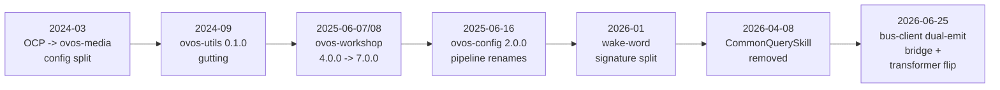

# Updating From Older OVOS

## In a nutshell

This page is the upgrade companion for people who already run OVOS and need
to move to a newer version. It is not for people new to OVOS
(see [Coming From Mycroft](coming-from-mycroft.md)) and it is not for
porting Mycroft skill code (see [Migrating From Mycroft](migrating-from-mycroft.md)).
It is for a deployer or developer who has an OVOS stack from some past date
and wants to know exactly what changed between then and now.

Use it like this:

1. Find your role in the table below: skill maintainer, plugin maintainer,
   device or fleet operator, or remote bus client (HiveMind and similar),
   and open that audience page.
2. On that page, read from the top. Entries are in date order. Start at
   the version you are currently running — not sure what that is? See
   [Checking what you have installed](release-channels.md#checking-what-you-have-installed) —
   and read forward to your target version.
3. For the largest breaks, open the linked migration page in the
   [Big-ticket migrations](#big-ticket-migrations) table below. Each page
   is a standalone deep dive: symbol/config/bus-message tables, code
   before-and-after, and the full compat lifecycle.
4. Each entry names the exact symbol, config key, or bus message that
   changed, the fix, and the commit that landed it. Use the commit sha to
   confirm the change against the source repository if you need more detail.
5. Every entry also states the compat lifecycle: when the old behavior was
   active, when it was deprecated but still worked, and when it was
   dropped. If you see "unverified" in a lifecycle column, that phase was
   not confirmed against the commit history. Check the
   [Verification gaps](#verification-gaps) list at the end before relying
   on it.

| Audience page | Covers | Start here for |
|---|---|---|
| [Updating Skills](updating-skills.md) | `OVOSSkill`/`ovos-workshop` API breaks, settings storage, locale resources | The [ovos-workshop 7.0.0 train](migration-workshop-7.md) |
| [Updating Plugins](updating-plugins.md) | STT/TTS/wake word/audio-backend/media/GUI-adapter/PHAL/solver plugin contract breaks | The [wake-word signature split](migration-opm-2.md) |
| [Updating Deployers](updating-deployers.md) | `mycroft.conf`/`ovos.conf` key renames, removed blocks, changed defaults | The [ovos-config 2.0.0](migration-config-2-0.md) and [OCP→media](migration-ocp-to-media.md) breaks |
| [Updating Remote Clients](updating-remote-clients.md) | Bus package/wire changes for HiveMind satellites and other remote bus consumers | The [bus-client dual-emit bridge](migration-bus-dual-emit.md) |

!!! tip "What is coming, not what shipped"
    This page covers released changes only. Open pull requests and the expected next
    breaking changes live on [Upcoming Changes](upcoming-changes.md).

!!! tip "Supporting several versions from one codebase"
    This page tells you what changed. If you maintain a skill or plugin that must run on
    both sides of a break, see [Version-Compatible Skills & Plugins](version-compat-guide.md)
    for the sanctioned shim patterns.

## How OVOS versions break

OVOS is not one project with one version number. It is about a dozen
independently released repositories (`ovos-core`, `ovos-workshop`,
`ovos-utils`, `ovos-config`, `ovos-bus-client`, `ovos-plugin-manager`,
`ovos-audio`, `ovos-media`, `ovos-messagebus`, the listener services, and
more), each on its own semantic-version line. A device upgrade usually
bumps several of these packages together, so a single "OVOS version" does
not exist. When something breaks after an upgrade, check the changelog of
the specific repository that owns the symbol or config key, not just
`ovos-core`.

The project follows a deprecate-then-drop pattern almost everywhere:

1. **Active**: the old behavior is the only behavior.
2. **Deprecated but functional**: a new replacement exists, the old path
   still works, and calling it logs a deprecation warning (`log_deprecation`
   or `@deprecated(...)`) or is gated behind a compatibility flag (for
   example `modernize`, `emit_legacy`, `wire_legacy_twins`).
3. **Dropped**: the old path is deleted. Calling it raises `ImportError`,
   `AttributeError`, `TypeError`, or the bus message is simply never sent
   or received again.

Each repository publishes its own changelog and tag history on GitHub
(`OpenVoiceOS/<repo>/releases` and `CHANGELOG.md` where present). When an
entry below says "nearest release," it means the change could not be
tied to an exact tag, so the closest
release date after the commit is given instead.

---

## Upgrade in place, or start fresh?

Before working through anything below, decide which path you are on. As a rule of thumb:

- **Upgrade in place** when your install is within roughly the current stable window — none
  or one of the big-ticket migrations below happened after your install date. Read your
  audience page forward from your version and you are done.
- **Back up and reinstall** when two or more big-ticket migrations have landed since your
  install (in practice: anything older than about a year, e.g. a `0.0.x`-era install —
  `0.0.8`, the last pre-SemVer release, dates to September 2024). Working through years of
  stacked per-repo breaks in place is slower and more error-prone than a clean
  [ovos-installer](ovos-installer.md) run. Back up first ([Backup & Restore](backup-restore.md)),
  reinstall, then restore your `mycroft.conf` **selectively** — re-add your customizations to
  the fresh file rather than copying the old file wholesale, since several old keys are
  silently ignored now (see [Updating Deployers](updating-deployers.md)) — and reinstall your
  skills from PyPI rather than restoring old checkouts.

## Big-ticket migrations

These changes affect the largest number of installs. Each row links a
standalone deep-dive page: symbol/config/bus-message tables, code
before-and-after, and the full compat lifecycle.

*Diagram: the OCP-to-ovos-media split, the ovos-utils gutting, the ovos-workshop
release train, the ovos-config pipeline renames, the wake-word signature change,
the CommonQuerySkill removal, and the bus-client dual-emit bridge, in that order.*

| When | What broke | Repo & versions | Who is affected | Details |
|---|---|---|---|---|
| 2024-03-29 | `OCP` config key renamed to `media`, MPRIS toggle polarity flipped | `ovos-media` `89a50c0` | Deployers with an `OCP` config block | [OCP → ovos-media config split](migration-ocp-to-media.md) |
| 2024-09-10 | Almost every `ovos_utils.*` helper deleted | `ovos-utils` `0.1.0` | Anyone importing `ovos_utils` before late 2024 | [Migrating off ovos-utils 0.1.0](migration-ovos-utils-0-1.md) |
| 2025-06-07/08 | Four `OVOSSkill` API breaks landed in about a day | `ovos-workshop` `4.0.0` → `7.0.0` | Skill maintainers | [The ovos-workshop 7.0.0 release train](migration-workshop-7.md) |
| 2025-06-16 | `core.pipeline` stage IDs renamed, `lang` default casing changed | `ovos-config` `2.0.0` | Deployers with a customized `core.pipeline` | [ovos-config 2.0.0](migration-config-2-0.md) |
| 2026-01-09/23 | `found_wake_word()` split into `update()` + zero-arg poll (contract shipped in opm `1.0.0`; listeners adopted it on the `2.0.0` bump) | `ovos-plugin-manager` `1.0.0` | Wake-word plugin maintainers | [Wake-word signature split](migration-opm-2.md) |
| 2026-04-08 | `CommonQuerySkill` deleted, no direct successor | `ovos-workshop` `6382d0a`, first in `8.0.4a3` | Skill maintainers using common-query matching | [The ovos-workshop 7.0.0 release train](migration-workshop-7.md) |
| 2026-06-25/07-03 | Legacy `mycroft.*`/`recognizer_loop:*` topics bridged to `ovos.*`, dual-emit bugs fixed | `ovos-bus-client` `2.x` | Remote/HiveMind operators, any bus producer/consumer | [The bus-client dual-emit bridge](migration-bus-dual-emit.md) |
| 2026-06-28 | Audio-transformer chain order flipped from descending to ascending `priority` | `ovos-dinkum-listener` `1fd909f` | Deployers with more than one audio-transformer plugin | [Audio-transformer chain-order flip](migration-audio-transformer-order.md) |

---

## Recently shipped conformance work

OVOS-PIPELINE-1 / STOP-1 conformance is released, not pending: the orchestrator owns
`ovos.intent.handler.{start,complete,error}` around every skill dispatch and
`ovos.intent.matched` before it (ovos-core `2178788d`, #788, first tag `2.3.0a1`), with
STOP-1 landing in `3.0.0a1` (#802). These emits are unconditional; the once-proposed
`legacy_namespace` gating never shipped (its branch was superseded), and legacy interop
rides the bus-client bridge instead.

## Coming next

The following work is visible on unmerged branches only and is **not
released**. It is included so you know it is coming, not because it is
safe to build against yet.

- **AssistantConfig** (`ovos-config`, branches `feat/assistant_config`,
  `pr194`): introduces a new `runtime.conf` config layer for
  OVOS-internal runtime writes, so plugins/components stop corrupting the
  user's `mycroft.conf`. Deprecates `RemoteConfig`. Explicit back-compat
  commits on the branch promise `Configuration().remote` and
  `load_config_stack(...)` keep working once this lands. Do not target
  `AssistantConfig` yet. Watch the `ovos-config` release notes.
- Unmerged `ovos-workshop` branches `feat/deprecate-ocp-skills`,
  `feat/remove-skill-homescreens`, `feat/gameskill-and-ocp-deprecation`:
  OCP-skill-base-class and skill-homescreen removal has not landed as of
  this page's sources. Do not treat as shipped.

---

## Verification gaps

`ovos-core` is a fork of `mycroft-core` and carries that project's full
history (6119 commits on `origin/dev`, back to the initial commit). The
items below were pinned against that combined history and against the
named sibling repositories directly.

| Gap | Status | Where the answer lives |
|---|---|---|
| ovos-media production-readiness policy | pinned | `ovos-media` is alpha and not officially released. `ovos-audio` remains the production audio service, and stock installs keep `enable_old_audioservice: true` (the default). See [Media Service (ovos-media)](ovos-media.md) for its maturity status. |
| mycroft.\* → ovos_\* rename | pinned | `ovos-core` `5f36bc31b5` ("refactor/ovos-core!! (#313)", 2023-05-02) is where core logic began moving out of `mycroft/` into the new `ovos_core` package. The `mycroft/` compatibility package itself was fully deleted in `2a10fa9c1c` ("remove mycroft (#439)", 2025-03-04). |
| ovos-utils GUITracker/GUIPlaybackStatus | pinned | Removed without replacement. `ovos-utils` `3a77617` ("0.1.0 alpha 3 (#204)", 2023-12-29) deletes both `GUITracker` and `GUIPlaybackStatus` from `ovos_utils/gui.py`. No successor symbol exists anywhere in `ovos-core` or `ovos-gui` history. |
| ovos-config `ede6243` lang key | pinned | The `autoconfigure` command writes the standardized language tag to the top-level `lang` config key (`config["lang"] = stdlang`), not nested under `stt`. |
| ovos-media `d249e89` symbol diff | pinned | `OCPMediaPlayer` stopped subclassing `OVOSAbstractApplication` and became a plain class; `bind()` was removed; `_update_gui`, `_merged_queue`, `_queue_index`, `_resolve_preferred_service`, `handle_record_end`, `handle_utterance_handled`, and `handle_mycroft_stop` were added; `handle_player_state_update` was removed in favor of the new handlers. The commit also adds a large adversarial unit-test suite (queue navigation, duck/uncork, player-state transitions). |
| ovos-audio extraction point | pinned | `ovos-audio` `047a0a1` ("Feat/audio from core (#1)", 2023-03-03) is the extraction commit. `ovos-core` `7f0c0ab22a` ("refactor/ovos_audio (#304)", 2023-04-28) is the corresponding commit on the `ovos-core` side: it guts `mycroft/audio/*` down to thin re-exports of the new `ovos_audio` package. |

---
**Read next:** [For Skill Maintainers](updating-skills.md) · [For Device & Fleet Operators](updating-deployers.md)
**Related:** [Upcoming Changes](upcoming-changes.md) · [Version-Compatible Skills & Plugins](version-compat-guide.md) · [Production Operations](production-operations.md)
