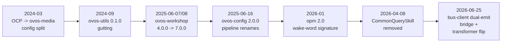

# Updating From Older OVOS

## In a nutshell

This page is the upgrade companion for people who already run OVOS and need
to move to a newer version. It is not for people new to OVOS
(see [Coming From Mycroft](coming-from-mycroft.md)) and it is not for
porting Mycroft skill code (see [Migrating From Mycroft](migrating-from-mycroft.md)).
It is for a deployer or developer who has an OVOS stack from some past date
and wants to know exactly what changed between then and now.

Use it like this:

1. Find your role in the table below: skill maintainer, plugin maintainer,
   device or fleet operator, or remote bus client (HiveMind and similar),
   and open that audience page.
2. On that page, read from the top. Entries are in date order. Start at
   the version you are currently running and read forward to your target
   version.
   The Big-ticket migrations section below is grouped by theme, not by
   date: read it as a set of standalone deep dives, not a chronological
   sequence.
3. Each entry names the exact symbol, config key, or bus message that
   changed, the fix, and the commit that landed it. Use the commit sha to
   confirm the change against the source repository if you need more detail.
4. Every entry also states the compat lifecycle: when the old behavior was
   active, when it was deprecated but still worked, and when it was
   dropped. If you see "unverified" in a lifecycle column, that phase was
   not confirmed against the commit history. Check the
   [Verification gaps](#verification-gaps) list at the end before relying
   on it.

| Audience page | Covers |
|---|---|
| [Updating Skills](updating-skills.md) | `OVOSSkill`/`ovos-workshop` API breaks, settings storage, locale resources |
| [Updating Plugins](updating-plugins.md) | STT/TTS/wake-word/audio-backend/media/GUI-adapter/PHAL/solver plugin contract breaks |
| [Updating Deployers](updating-deployers.md) | `mycroft.conf`/`ovos.conf` key renames, removed blocks, changed defaults |
| [Updating Remote Clients](updating-remote-clients.md) | Bus package/wire changes for HiveMind satellites and other remote bus consumers |

!!! tip "What is coming, not what shipped"
    This page covers released changes only. Open pull requests and the expected next
    breaking changes live on [Upcoming Changes](upcoming-changes.md).

!!! tip "Supporting several versions from one codebase"
    This page tells you what changed. If you maintain a skill or plugin that must run on
    both sides of a break, see [Version-Compatible Skills & Plugins](version-compat-guide.md)
    for the sanctioned shim patterns.

## How OVOS versions break

OVOS is not one project with one version number. It is about a dozen
independently released repositories (`ovos-core`, `ovos-workshop`,
`ovos-utils`, `ovos-config`, `ovos-bus-client`, `ovos-plugin-manager`,
`ovos-audio`, `ovos-media`, `ovos-messagebus`, the listener services, and
more), each on its own semantic-version line. A device upgrade usually
bumps several of these packages together, so a single "OVOS version" does
not exist. When something breaks after an upgrade, check the changelog of
the specific repository that owns the symbol or config key, not just
`ovos-core`.

The project follows a deprecate-then-drop pattern almost everywhere:

1. **Active**: the old behavior is the only behavior.
2. **Deprecated but functional**: a new replacement exists, the old path
   still works, and calling it logs a deprecation warning (`log_deprecation`
   or `@deprecated(...)`) or is gated behind a compatibility flag (for
   example `legacy_namespace`, `modernize`, `emit_legacy`).
3. **Dropped**: the old path is deleted. Calling it raises `ImportError`,
   `AttributeError`, `TypeError`, or the bus message is simply never sent
   or received again.

Each repository publishes its own changelog and tag history on GitHub
(`OpenVoiceOS/<repo>/releases` and `CHANGELOG.md` where present). When an
entry below says "nearest release," it means the change could not be
tied to an exact tag, so the closest
release date after the commit is given instead.

---

## Big-ticket migrations

These changes affect the largest number of installs and are worth their
own walkthrough before the chronological per-audience lists below.



*Diagram: the OCP-to-ovos-media split, the ovos-utils gutting, the ovos-workshop
release train, the ovos-config pipeline renames, the wake-word signature change,
the CommonQuerySkill removal, and the bus-client dual-emit bridge, in that order.*

Each milestone above is its own subsection below, chronological order left to right (the
subsections themselves are grouped by theme, not by date).

### The ovos-utils 0.1.0 gutting (2024-09)

A decade of accumulated helpers, inherited all the way back from the
Mycroft era, disappeared in a single release: `ovos-utils` 0.1.0 cut the
bulk of the package under the stated goal of removing "ALL dead code." From the
outside this meant imports breaking across the ecosystem the moment a
project bumped past the alpha stream, with no single traceback pointing at
the cause since the deleted symbols were scattered across messagebus,
configuration, intents, skills, and sound helpers alike. A cycle of
`@deprecated`/`log_deprecation` shims had named each symbol's new home
before the cut landed, and a couple of straggler shims survived the mass
deletion only to be swept away later.

`ovos-utils` 0.1.0 deleted almost everything that had accumulated in the
package since the Mycroft era (10,709 deleted lines, PR body: "remove ALL
dead code"). If you have any code importing from `ovos_utils` written
before late 2024, check it against this table.

| Old symbol (`ovos_utils.*`) | New home |
|---|---|
| `messagebus.get_message_lang`, `.get_websocket`, `.get_mycroft_bus`, `.send_message`, `.wait_for_reply`, `.decode_binary_message` | `ovos_bus_client.util.*` |
| `messagebus.dig_for_message`, `.FakeMessage`, `.Message`, `.FakeBus` | `ovos_utils.fakebus` |
| `messagebus.EventContainer` | `ovos_utils.events.EventContainer` |
| `messagebus.BusService`, `.BusFeedProvider`, `.BusQuery`, `.BusFeedConsumer` | removed, no replacement |
| `enclosure.api.EnclosureApi` | `ovos_bus_client.apis.enclosure.EnclosureApi` |
| `enclosure.mark1.*` (Mark1 eyes/faceplate/animations) | removed, no replacement in this repo. `ovos-PHAL-plugin-mk1` carries the eyes/faceplate/mouth handling instead |
| `configuration.*` (`get_default_lang`, `find_user_config`, `read_mycroft_config`, ...) | `ovos_config.config.*` / `ovos_config.locations` / `ovos_config.locale` |
| `fingerprinting.*` (`detect_platform`, `is_mycroft_core`, ...) | removed, no direct successor |
| `intents.*` (`IntentQueryApi`, `IntentServiceInterface`) | `ovos_workshop.intents` |
| `intents.converse.ConverseTracker` | removed, no replacement |
| `intents.layers.IntentLayers` | `ovos_workshop.decorators.layers.IntentLayers` |
| `ovos_service_api.OVOSApiService` | `ovos_backend_client.api.BaseApi` |
| `skills.blacklist_skill`, `.whitelist_skill` | `ovos_workshop.permissions.*` |
| `skills.get_skills_folder` | `ovos_plugin_manager.skills.get_default_skill_dir` |
| `skills.get_installed_skills` | `ovos_plugin_manager.skills.get_installed_skill_ids` |
| `skills.api.SkillApi` | `ovos_workshop.skills.api.SkillApi` |
| `skills.audioservice.AudioServiceInterface` | OCP (`OCPInterface`) |
| `skills.locations.*` | `ovos_plugin_manager.skills` |
| `skills.settings.*` (backend upload, folder-local settings) | removed, no replacement |
| `sound.play_acknowledge_sound` and friends | emit the bus message `mycroft.audio.play_sound` instead |
| `sound.record` | use `ovos-dinkum-listener` in recording mode |
| `sound.alsa.AlsaControl` | `ovos_phal_plugin_alsa.AlsaVolumeControlPlugin` |
| `gui.GUITracker`, `.GUIPlaybackStatus` | removed without replacement (`ovos-utils` `3a77617`, 2023-12-29) |

Migration action:

```python
# old (pre-0.1.0)
from ovos_utils.messagebus import get_mycroft_bus, wait_for_reply
from ovos_utils.configuration import read_mycroft_config
from ovos_utils.skills import blacklist_skill

# new (0.1.0+)
from ovos_bus_client.util import get_mycroft_bus, wait_for_reply
from ovos_config.config import read_mycroft_config
from ovos_workshop.permissions import blacklist_skill
```

Lifecycle:

| Phase | Version | Notes |
|---|---|---|
| Active | any tag before `V0.1.0` | mycroft-core-derived helpers, no shims |
| Deprecated but functional | `80a2f7c` (2023-12-29) through the `0.1.0` alpha stream (`0.1.0a1`..`0.1.0a16`) | `@deprecated`/`log_deprecation` shims naming the replacement |
| Dropped | `V0.1.0` (2024-09-10; the mass deletion landed earlier in `3a77617`, 2023-12-29) | (ovos-utils `3a77617`) |

A follow-up removed the last messagebus shim module entirely: `ovos_utils.messagebus`
(a 1-line re-export left behind after 0.1.0) was deleted in `9c1fd55` (#304,
2024-11-21, between `0.5.0` and `0.6.0`), along with `mycroft_bus_client`
isinstance/constructor compatibility inside `ovos_utils.fakebus`
(ovos-utils `9c1fd55`).

### The ovos-workshop 2025-06 release train (4.0.0 → 7.0.0)

`ovos-workshop` went through four major-version breaks on the `OVOSSkill`
family in the space of about a day, each one landing on top of the last
before the previous change had even settled. A skill author jumping the
gap felt it as a moving target: `can_answer` went abstract, converse moved
into a mixin, `can_stop` briefly went hard-abstract then was loosened
hours later, and the mixin's own method name turned out to be wrong for
about a day before being renamed. Anyone upgrading past a pre-2025-06
workshop version in one hop needs to treat all four changes as landing at
once, not as separable steps.

Four major versions of `ovos-workshop` shipped on the same day
(2025-06-07/08). Each is a separate breaking change to the `OVOSSkill`
family. If you are jumping from a pre-2025-06 workshop version to anything
after `7.0.0`, expect all four of these to apply at once.

**v4.0.0: `FallbackSkill.can_answer` becomes abstract.**

```python
# old: default True if any handler registered, no override needed
class MySkill(FallbackSkill):
    def handle_fallback(self, message):
        ...

# new: must implement can_answer explicitly
class MySkill(FallbackSkill):
    def can_answer(self, utterances: list[str], lang: str) -> bool:
        return True  # or real logic
    def handle_fallback(self, message):
        ...
```

`FallbackSkill.make_intent_failure_handler(cls, bus)` (the old mycroft-style
bus-driven fallback dispatcher) is removed with it (ovos-workshop `c066bc3`, #336).

**v5.0.0: converse moves out of `OVOSSkill` into a mixin.**

```python
# old: converse lived directly on OVOSSkill
class MySkill(OVOSSkill):
    def converse(self, message=None):
        ...

# new: subclass the mixin too
from ovos_workshop.skills.converse import ConversationalSkill

class MySkill(OVOSSkill, ConversationalSkill):
    def can_converse(self, message) -> bool:
        return True
    def converse(self, message=None):
        ...
```

An `OVOSSkill` subclass that overrides `converse()` without also inheriting
`ConversationalSkill` compiles fine but is silently never called by the
pipeline (ovos-workshop `f725f5e`, #339).

**v6.0.0 / v6.0.1: `can_stop` conditional abstract method.**
`can_stop(self, message)` briefly became a hard `@abc.abstractmethod`
(`10f9781`, #344) then was loosened the same day to only require
overriding if the skill also overrides `stop`/`stop_session`
(`813f7b5`, #346, released as `6.0.1`). If you implement `stop()` or
`stop_session()`, also implement `can_stop()`.

**v7.0.0: `can_answer` on `ConversationalSkill` renamed to `can_converse`.**
The v5.0.0 mixin shipped with the wrong method name for about a day. Rename
`can_answer` → `can_converse` in any `ConversationalSkill` subclass
(ovos-workshop `1fdd532`, #348).

Lifecycle:

| Change | Active | Deprecated but functional | Dropped |
|---|---|---|---|
| `FallbackSkill.can_answer` concrete/optional | before `4.0.0` (2025-06-07) | unverified | `4.0.0` |
| `converse()` on `OVOSSkill` directly | before `5.0.0` (2025-06-07) | unverified | `5.0.0` |
| `stop_is_implemented` property / concrete `can_stop` | before `6.0.0` | `6.0.1` (conditional requirement) | `6.0.0` (briefly hard), loosened in `6.0.1` |
| `ConversationalSkill.can_answer` | `5.0.0` to `6.0.1` (about one day) | none | `7.0.0` |

### CommonQuerySkill removal

`CommonQuerySkill` sat deprecation-flagged for the better part of two
years before it was finally cut in one commit, with no
direct successor class left in `ovos-workshop`. The removal only
completed a migration that had already happened underneath it: the
matching hardcoded common-query wiring inside `ovos-core` itself had been
pulled out earlier, when the whole intent-service module turned into a
config-driven OPM pipeline factory, so by the time the skill class was
deleted, common-query matching already lived in whichever pipeline plugin
happened to own it.

`CommonQuerySkill` had been deprecation-flagged since ovos-workshop
`4.0.0` and was deleted entirely (259 lines, including the `CQSMatchLevel`
enum and `CQS_match_query_phrase`/`CQS_action` abstract methods) in
`6382d0a` (#400, 2026-04-08), ahead of the `8.0.0` release. There is no
direct successor class in `ovos-workshop`. Common-query matching now lives
in whatever pipeline plugin currently owns it (check `ovos-core`'s
common-query pipeline plugin). On `ovos-core` itself, the equivalent
hardcoded common-query wiring was removed from `ovos_core.intent_services`
in `62024dbf98` (#690, 2025-06-10, first stable release `1.3.0`) when the
whole intent-service module became a config-driven OPM pipeline factory.

Lifecycle:

| Change | Active | Deprecated but functional | Dropped |
|---|---|---|---|
| `ovos_workshop.skills.common_query_skill.CommonQuerySkill` | before `4.0.0` | `4.0.0` to pre-`8.0.0` | `6382d0a` (2026-04-08, pre-`8.0.0`) |
| `ovos-core` hardcoded common-query wiring | before `62024dbf98` | unverified | `62024dbf98` (`1.3.0`, 2025-06-10) |

### ovos-config 2.0.0: pipeline renames and `en-US` casing

This is the single largest deployer-facing config break the ecosystem
shipped: every short pipeline stage ID a deployer might have hand-listed
in `core.pipeline` was replaced by a plugin-id form in one commit, and the
old spellings were not rejected, just silently ignored. A customized
pipeline written against the old IDs did not error after upgrading; it
just quietly stopped registering some of its stages, with `adapt_low` and
`common_qa` dropped from the default list entirely. The same commit also
flipped the default `lang` casing from `"en-us"` to `"en-US"`, breaking
any code doing an exact string comparison against the old default.

`ovos-config` `2.0.0` (`e24e9ce`, #228, 2025-06-16) is the single largest
deployer-facing config break in the ecosystem. If you have a customized
`core.pipeline` list in your `mycroft.conf`, every stage ID in it is now
unregistered and will be silently skipped rather than erroring.

```json
// old core.pipeline (pre-2.0.0)
["stop_high", "converse", "ocp_high", "padatious_high", "adapt_high",
 "ocp_medium", "fallback_high", "stop_medium", "adapt_medium",
 "fallback_medium", "adapt_low", "common_qa", "fallback_low"]

// new core.pipeline (2.0.0+)
["ovos-stop-pipeline-plugin-high", "ovos-converse-pipeline-plugin",
 "ovos-ocp-pipeline-plugin-high", "ovos-padatious-pipeline-plugin-high",
 "ovos-adapt-pipeline-plugin-high", "ovos-ocp-pipeline-plugin-medium",
 "ovos-fallback-pipeline-plugin-high", "ovos-stop-pipeline-plugin-medium",
 "ovos-adapt-pipeline-plugin-medium", "ovos-fallback-pipeline-plugin-medium",
 "ovos-m2v-pipeline-high", "ovos-fallback-pipeline-plugin-low"]
// note: adapt_low and common_qa are dropped from the default list entirely
// (now standalone opt-in plugins); add "ovos-adapt-pipeline-plugin-low" and
// the common-query plugin id back explicitly if you still want them.
```

The same commit changed the default `"lang"` value in `mycroft.conf` from
`"en-us"` to `"en-US"`. Any code doing an exact string comparison against
the lowercase default breaks. Compare case-insensitively or update the
literal.

Also in this commit: `skills.directory` dropped from shipped defaults,
`gui.idle_display_skill` renamed `skill-ovos-homescreen.openvoiceos` →
`ovos-skill-homescreen.openvoiceos`, and the entire NLP-plugin config block
(`tokenization`, `segmentation`, `keyword_extract`, `coref`, `postag`) was
removed from `mycroft.conf` (no longer core-config-driven).

Lifecycle:

| Change | Active | Deprecated but functional | Dropped |
|---|---|---|---|
| Short pipeline stage IDs (`stop_high`, `converse`, ...) | before `2.0.0` (2025-06-16) | unverified | `2.0.0` |
| `lang` default `"en-us"` | before `2.0.0` | n/a | `2.0.0` (now `"en-US"`) |
| `skills.directory` default key | before `2.0.0` | unverified | `2.0.0` |
| NLP plugin config block | before `2.0.0` | unverified | `2.0.0` |

### The bus-client legacy-topic dual-emit and its removal

This is the change every remote/HiveMind operator needs to plan for, and
it is still mid-flight: the project built a transitional bridge so a
fleet with some satellites upgraded and some not could keep working while
topics migrated from legacy `mycroft.*`/`recognizer_loop:*` spellings to
the `ovos.*` spec namespace, then spent several follow-up commits fixing
bugs in that bridge itself, including one that doubled every message on
the raw firehose for about a week. The bridge is on by default in current
releases; its planned removal sits on an unmerged pull request gated on
the fleet already being upgraded, so operators are meant to move onto
`ovos.*` topics now, while both spellings still work, rather than wait for
the kill switch to force the issue.

This is the change every remote/HiveMind operator needs to plan for.
`ovos-bus-client` `2.x` introduced a transitional bridge so a mixed fleet
(core upgraded, satellites not yet upgraded) keeps working while topics
migrate from legacy `mycroft.*`/`recognizer_loop:*` spellings to the
`ovos.*` spec namespace:

1. `679f120` (#228, 2026-06-25): opt-in (default OFF) dual-emit + dedup bridge.
2. `e25ab12` (#230, 2026-06-25): split into two flags, **both default ON**
   during the migration window: `modernize` (env `OVOS_BUS_MODERNIZE`,
   config `websocket.modernize`) and `emit_legacy` (env
   `OVOS_BUS_EMIT_LEGACY`, config `websocket.emit_legacy`).
3. `4a08946` (#232, 2026-06-25): dedup logic delegated to
   `ovos_spec_tools.NamespaceTranslator` (shared with `FakeBus`).
4. `0f0a241` (#258, 2026-07-03): fixes a bug where the dual-emit doubled
   every message on the raw `on_message` firehose between #230 and this fix.
5. Planned removal: the open kill-switch pull request
   [ovos-bus-client#272](https://github.com/OpenVoiceOS/ovos-bus-client/pull/272)
   (commit `f1a481d` on its branch, not merged to `dev`) deletes the bridge
   entirely: `MessageBusClient` then speaks OVOS-MSG-1 spec topics only, the
   `emit_legacy`/`modernize`/`intent_reemit_blanket` flags are deleted, and
   passing them raises `RuntimeError`. Its stated merge condition is a fleet
   already upgraded. See [Upcoming Changes](upcoming-changes.md).

Migration: move every producer and consumer to `ovos.*` spec topics now,
while the bridge still covers both spellings. Remove explicit
`emit_legacy`/`modernize`/`intent_reemit_blanket` arguments from your
`MessageBusClient` construction so the eventual flag deletion cannot break
you. The mapping tables (`ovos_spec_tools.MIGRATION_MAP`, `SPEC_TO_LEGACY`)
remain available for migration tooling.

Lifecycle:

| Change | Active | Deprecated but functional | Dropped |
|---|---|---|---|
| Legacy-only `mycroft.*`/`recognizer_loop:*` topics, no bridge | before `679f120` (2026-06-25) | n/a | superseded by dual-emit |
| Dual-emit bridge (`modernize`/`emit_legacy`, both default ON) | `e25ab12` (2026-06-25) | current releases (bridge on by default) | pending: [ovos-bus-client#272](https://github.com/OpenVoiceOS/ovos-bus-client/pull/272), unmerged |

### OCP → ovos-media config split

Splitting audio-service responsibility out of `ovos-audio` into a
dedicated `ovos-media` daemon meant its config moved with it, and the
config root key changed name in the process: anything a deployer still
had under the old `"OCP"` key was silently ignored by the new service
rather than flagged as invalid. The MPRIS toggle was renamed and its
polarity flipped in the same commit, so a deployment that had never
touched the key at all still felt the change, MPRIS integration turning
itself off after the upgrade with no explicit setting to blame.

Audio-service responsibility split out of `ovos-audio` into a dedicated
`ovos-media` daemon starting January 2024. Two config changes to track:

```jsonc
// old (mycroft.conf, read by ovos-media before 89a50c0)
{"OCP": {"disable_mpris": false}}

// new (mycroft.conf, 89a50c0 onward)
{"media": {"enable_mpris": true}}
```

The config root key `OCP` was renamed to `media`: anything still under
`"OCP"` is silently ignored by `ovos-media`. The MPRIS toggle was also
polarity-flipped: `disable_mpris` (default off, meaning MPRIS was **on** by
default) became `enable_mpris` (default `False`, meaning MPRIS is **off**
by default). A deployment that never touched this key gets a behavior
change: MPRIS integration silently turns off after upgrading past
`89a50c0` (ovos-media `89a50c0`, #19, 2024-03-29), unless `media.enable_mpris: true`
is set explicitly.

On the `ovos-audio` side, `AudioService.find_ocp()` stopped
auto-discovering OCP from the generic plugin list and instead instantiates
it directly, reading its config from the legacy `Audio.backends.OCP`
location as a documented transitional shim (ovos-audio `3983816`, #80,
2024-07-18).

Lifecycle:

| Change | Active | Deprecated but functional | Dropped |
|---|---|---|---|
| Config root `OCP` (ovos-media) | before `89a50c0` (2024-03-29) | n/a | `89a50c0` (now `media`) |
| `disable_mpris` (MPRIS on by default) | before `89a50c0` | n/a | `89a50c0` (now `enable_mpris`, off by default) |

### Wake-word plugin `found_wake_word()` signature change (opm 2.0)

opm 2.0 pulled apart what had been a single call into two steps: audio is
fed to the plugin separately now, and detection is polled with no
arguments at all. A wake-word plugin written for the one-argument form
still loads and still gets called after the caller-side change lands in a
listener service, but the call itself throws, since `found_wake_word()`
now runs with zero arguments where it used to expect the audio chunk.

`ovos-plugin-manager` 2.0 changed the `HotWordEngine` contract: audio is
fed separately, then detection is polled with no arguments.

```python
# old (pre-opm-2.0)
class MyWakeWordPlugin(HotWordEngine):
    def found_wake_word(self, audio_data) -> bool:
        ...

# new (opm 2.0+)
class MyWakeWordPlugin(HotWordEngine):
    def update(self, chunk: bytes) -> None:
        ...  # feed audio incrementally
    def found_wake_word(self) -> bool:
        ...  # poll with no arguments
```

Both listener services in the org landed the caller-side half of this
change on the same underlying opm bump: `mycroft-classic-listener`
`19d9961` (#12, 2026-01-09) and `ovos-simple-listener` `34e2219` (#20,
2026-01-23, commit message: "opm 2.0.0 introduced breaking change"). If
your wake-word plugin still implements the one-argument form, it will be
called with zero arguments and raise a `TypeError` on any listener service
updated past these commits.

Lifecycle:

| Change | Active | Deprecated but functional | Dropped |
|---|---|---|---|
| `found_wake_word(audio_data)` one-arg form | before opm `2.0.0` | unverified | opm `2.0.0` · caller-side landed in `19d9961` / `34e2219` |

### Audio-transformer chain-order flip

The transformer chain had been running in the opposite order from what
its own docstring claimed for some time: plugins sorted by `priority`
descending, highest number first, while the OVOS-TRANSFORM-1 spec and
`ovos-core`'s own transformer chains expected ascending order. Fixing it
meant a deployment with more than one active audio transformer plugin
could see its processing order silently invert after the upgrade, with no
error to signal the change, only a chain now running its stages in the
reverse sequence from before.

`ovos-dinkum-listener`'s `AudioTransformersService` sorted plugins by
`priority` **descending** (highest number ran first) with a docstring that
said the opposite of what the OVOS-TRANSFORM-1 spec expects. `1fd909f`
(#236, 2026-06-28) dropped `reverse=True`: the chain now runs in
**ascending** priority order (lowest number first, highest last), matching
`OVOS-TRANSFORM-1 §4` and the ordering `ovos-core` already used for its own
transformer chains.

```python
# old: priority=1 ran LAST (reverse=True)
# new: priority=1 runs FIRST (ascending)
```

If you assigned `priority` values assuming the old descending order,
invert them: old `priority=P` behaved like new `priority=(100-P)` in
relative terms. Any deployment with more than one active
`listener.audio_transformers` plugin where order matters can see a silent
behavior change after upgrading past this commit (ovos-dinkum-listener `1fd909f`, #236).

Lifecycle:

| Change | Active | Deprecated but functional | Dropped |
|---|---|---|---|
| Descending `priority` sort (`reverse=True`) | before `1fd909f` (2026-06-28) | n/a | `1fd909f` |

---


## Coming next

The following work is visible on unmerged branches only and is **not
released**. It is included so you know it is coming, not because it is
safe to build against yet.

- **AssistantConfig** (`ovos-config`, branches `feat/assistant_config`,
  `pr194`): introduces a new `runtime.conf` config layer for
  OVOS-internal runtime writes, so plugins/components stop corrupting the
  user's `mycroft.conf`. Deprecates `RemoteConfig`. Explicit back-compat
  commits on the branch promise `Configuration().remote` and
  `load_config_stack(...)` keep working once this lands. Do not target
  `AssistantConfig` yet. Watch the `ovos-config` release notes.
- **OVOS-PIPELINE-1 / STOP-1 / INTENT-4 conformance** (`ovos-core`,
  active on `dev` through at least 2026-08-01): the orchestrator is
  taking over emitting `ovos.intent.handler.{start,complete,error}` around
  every skill dispatch, and `ovos.intent.matched` before every dispatch.
  Still landing incrementally under `legacy_namespace` gating. Not yet in
  a numbered stable release.
- Unmerged `ovos-workshop` branches `feat/deprecate-ocp-skills`,
  `feat/remove-skill-homescreens`, `feat/gameskill-and-ocp-deprecation`:
  OCP-skill-base-class and skill-homescreen removal has not landed as of
  this page's sources. Do not treat as shipped.

---

## Verification gaps

`ovos-core` is a fork of `mycroft-core` and carries that project's full
history (6119 commits on `origin/dev`, back to the initial commit). The
items below were pinned against that combined history and against the
named sibling repositories directly.

| Gap | Status | Where the answer lives |
|---|---|---|
| ovos-media production-readiness policy | pinned | `ovos-media` is alpha and not officially released. `ovos-audio` remains the production audio service, and stock installs keep `enable_old_audioservice: true` (the default). See [Media Service (ovos-media)](ovos-media.md) for its maturity status. |
| mycroft.\* → ovos_\* rename | pinned | `ovos-core` `5f36bc31b5` ("refactor/ovos-core!! (#313)", 2023-05-02) is where core logic began moving out of `mycroft/` into the new `ovos_core` package. The `mycroft/` compatibility package itself was fully deleted in `2a10fa9c1c` ("remove mycroft (#439)", 2025-03-04). |
| ovos-utils GUITracker/GUIPlaybackStatus | pinned | Removed without replacement. `ovos-utils` `3a77617` ("0.1.0 alpha 3 (#204)", 2023-12-29) deletes both `GUITracker` and `GUIPlaybackStatus` from `ovos_utils/gui.py`. No successor symbol exists anywhere in `ovos-core` or `ovos-gui` history. |
| ovos-config `ede6243` lang key | pinned | The `autoconfigure` command writes the standardized language tag to the top-level `lang` config key (`config["lang"] = stdlang`), not nested under `stt`. |
| ovos-media `d249e89` symbol diff | pinned | `OCPMediaPlayer` stopped subclassing `OVOSAbstractApplication` and became a plain class; `bind()` was removed; `_update_gui`, `_merged_queue`, `_queue_index`, `_resolve_preferred_service`, `handle_record_end`, `handle_utterance_handled`, and `handle_mycroft_stop` were added; `handle_player_state_update` was removed in favor of the new handlers. The commit also adds a large adversarial unit-test suite (queue navigation, duck/uncork, player-state transitions). |
| ovos-audio extraction point | pinned | `ovos-audio` `047a0a1` ("Feat/audio from core (#1)", 2023-03-03) is the extraction commit. `ovos-core` `7f0c0ab22a` ("refactor/ovos_audio (#304)", 2023-04-28) is the corresponding commit on the `ovos-core` side: it guts `mycroft/audio/*` down to thin re-exports of the new `ovos_audio` package. |

---
**Read next:** [For Skill Maintainers](updating-skills.md) · [For Device & Fleet Operators](updating-deployers.md)
**Related:** [Upcoming Changes](upcoming-changes.md) · [Version-Compatible Skills & Plugins](version-compat-guide.md) · [Production Operations](production-operations.md)
