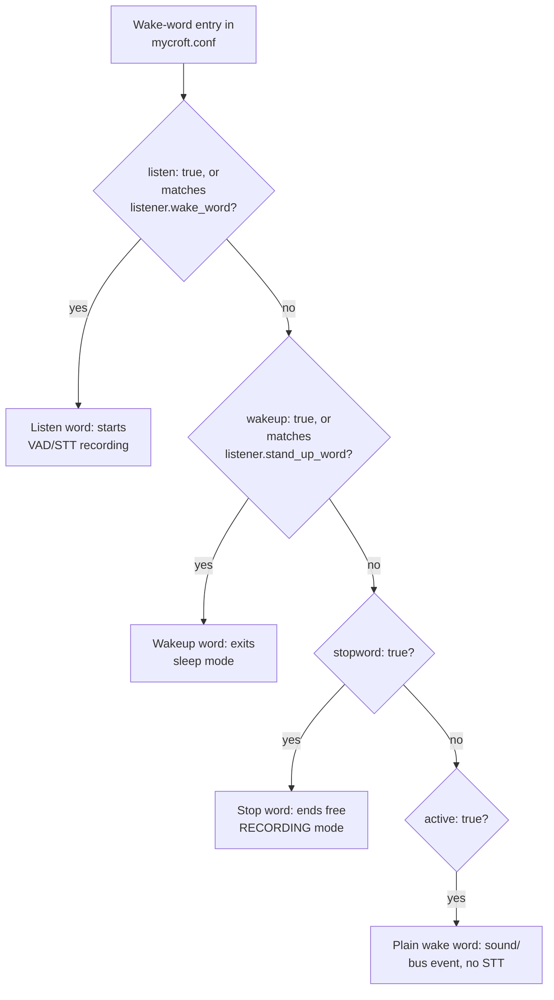
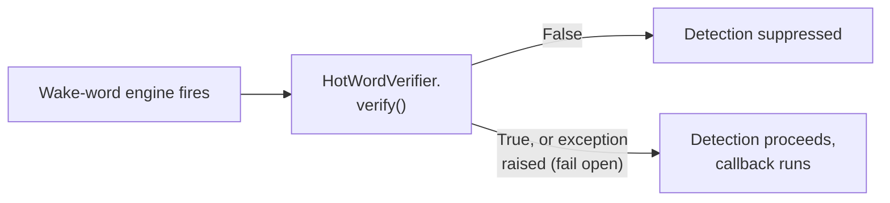

# Wake-word Plugins

!!! abstract "In a nutshell"
    A *wake word* is the special phrase that gets your assistant's attention, like "Hey Mycroft". It only starts paying attention when you mean to talk to it, instead of listening all the time. Wake-word plugins are the different tools that listen for that phrase. Some are more accurate for a fixed phrase. Others let you pick your own wake word with less setup. See the [Glossary](glossary.md) and the [listener service](speech-service.md) for related details.

Wake-word plugins let Open Voice OS detect specific words or sounds, typically the assistant's name (for example "Hey Mycroft"). You can customize them for other use cases. These plugins let the system listen for and react to activation commands or phrases.

!!! note "Audio format contract"
    Wake-word plugins receive raw PCM from the [microphone plugin](mic-plugin-development.md#the-microphone-interface): **16 kHz sample rate, 16-bit samples, mono, little-endian**, delivered in **4096-byte chunks** by default.

## Change your wake word

1. Open `~/.config/mycroft/mycroft.conf` (create it if it doesn't exist).
2. Add or edit the `listener.wake_word` key and a matching entry under `hotwords`:
   ```json
   {
     "listener": { "wake_word": "hey_computer" },
     "hotwords": {
       "hey_computer": { "module": "ovos-ww-plugin-vosk", "listen": true }
     }
   }
   ```
3. Save the file. It is JSON (comments are allowed, `mycroft.conf` is parsed as JSONC).
4. Restart OVOS for the change to take effect:

--8<-- "snippets/restart-ovos.md"

5. Say the new phrase. The assistant now wakes on it instead of "hey mycroft".

## Available Plugins

OVOS supports different wake-word detection plugins, each with its own strengths and use cases.
The full roster with descriptions and licenses lives in one place: the
[WW Plugins Reference](#ww-plugins-reference) table below. The default OVOS plugin for
`hey_mycroft` is `ovos-ww-plugin-precise-onnx`, falling back down this chain if a plugin further
up is not installed:

1. `ovos-ww-plugin-precise-onnx` (default)
2. `ovos-ww-plugin-precise-lite` (TFLite)
3. `ovos-ww-plugin-precise` (classic Precise)
4. `ovos-ww-plugin-vosk`
5. `ovos-ww-plugin-pocketsphinx`

Vosk offers the fastest setup for an arbitrary wake phrase without model training.

The default `hey_mycroft` engine `ovos-ww-plugin-precise-onnx` is rated **Beta**. Its
fallback `ovos-ww-plugin-vosk` is Stable, and `ovos-ww-plugin-precise-lite` is Deprecated.
The default is chosen for accuracy. Per the [Maturity Scale](maturity.md), maturity is
separate from the recommendation.

!!! note "Relative footprint"
    The default `ovos-ww-plugin-precise-onnx` models are small, purpose-built for a single
    wake phrase, and meant to run continuously on-device. They are much lighter than a general
    STT or TTS model. This is why wake-word detection is the one always-on inference step in
    the listener pipeline.

> Specification: wake-word detection is one of the deployer-defined capture mechanisms that trigger the audio-input service (referenced in [OVOS-AUDIO-IN-1 §5.1](https://github.com/OpenVoiceOS/architecture/blob/dev/audio-in.md) as the source of a `request_lang` hint).

!!! tip "Alternative: openWakeWord"
    `ovos-ww-plugin-openWakeWord` runs open, pre-trained neural wake-word models and is a
    strong alternative when you want better accuracy than Vosk without training your own
    Precise model.

## Wake-word Configuration

!!! tip "Too many false alarms, or not hearing you at all? (Precise-family engines)"
    These two knobs apply to the **Precise-family** plugins (`precise-onnx`,
    `precise-lite`, classic `precise`) — the default setup. Other engines tune
    differently: Vosk ignores `sensitivity`/`trigger_level` entirely (it matches
    words, not model scores), so check your plugin's own entry in the
    [reference table](#ww-plugins-reference) if you switched engines.

    - **It wakes up on its own too often (false alarms)?** Raise `trigger_level`. This gives
      fewer false positives, but needs a longer, more sustained match. Or lower `sensitivity`.
    - **It doesn't hear you when you say the wake word?** Raise `sensitivity`, so each chunk of
      audio is easier to trigger. Or lower `trigger_level`.

    Both live under `hotwords.<name>` in `mycroft.conf`, next to each other. Nudge one at a
    time and test before changing the other. The full technical breakdown of what each number
    actually does is below.

The `hotwords` section in your `mycroft.conf` allows you to configure the wake-word detection parameters for each plugin. For instance:

```jsonc
"hotwords": {
  "hey_mycroft": {
    "module": "ovos-ww-plugin-precise-onnx",
    "model": "https://github.com/OpenVoiceOS/precise-lite-models/raw/master/wakewords/en/hey_mycroft.onnx",
    "trigger_level": 3,
    "sensitivity": 0.5,
    "listen": true
  }
}

```

> See the full docs for the [listener service](speech-service.md)

### Wake-word entry types and keys

Each entry under `hotwords` is one of four types, set by a boolean key. `active: null` (the
default) auto-enables the main wake word (`listener.wake_word`) and the stand-up word
(`listener.stand_up_word`); every other entry stays disabled until you set `active: true`.



*Diagram:* The flow starts at the wake-word entry in mycroft.conf and ends at one of four outcomes, and it branches in sequence through the listen, wakeup, stopword, and active checks to pick the matching wake-word type.

| Type | Config key | Effect when detected |
|---|---|---|
| Listen word | `listen: true`, or matches `listener.wake_word` | Starts the VAD/STT recording pipeline |
| Wakeup word | `wakeup: true`, or matches `listener.stand_up_word` | Exits sleep mode |
| Stop word | `stopword: true` | Ends free `RECORDING` mode |
| Plain wake word | none of the above, `active: true` | Plays a sound and/or emits a bus event, without starting STT |

Beyond `module`, `active`, `listen`, `wakeup`, `stopword`, and `sensitivity`/`trigger_level`,
each entry accepts:

| Key | Type | Description |
|---|---|---|
| `sound` | `str` \| `list` | Sound file played on detection. |
| `bus_event` | `str` | Bus message type emitted on detection. |
| `utterance` | `str` | Hard-coded utterance text, bypassing STT entirely for this entry. |
| `stt_lang` | `str` | Overrides the STT language for the command that follows this hotword. |

```jsonc
"hotwords": {
  "hey_mycroft": {
    "module": "ovos-ww-plugin-precise-lite",
    "listen": true,
    "sound": "snd/start_listening.wav",
    "active": null
  },
  "wake_up": {
    "module": "ovos-ww-plugin-vosk",
    "wakeup": true,
    "active": null
  },
  "stop_recording": {
    "module": "ovos-ww-plugin-vosk",
    "stopword": true,
    "active": true
  },
  "hey_computer": {
    "module": "ovos-ww-plugin-precise-lite",
    "bus_event": "my.custom.event",
    "sound": "snd/ding.wav",
    "active": true
  },
  "hola_mycroft": {
    "module": "ovos-ww-plugin-precise-lite",
    "listen": true,
    "stt_lang": "es-es",
    "active": true
  }
}
```

### Wake-word verifiers

After a wake-word engine fires, optional *verifier* plugins can inspect the raw wake word
audio and suppress false detections before any callback runs. Verifiers implement the
`HotWordVerifier` interface (from `ovos-plugin-manager`) and are configured under
`listener.ww_verifiers`:



*Diagram:* The flow starts when the wake-word engine fires and ends with the detection either suppressed or proceeding to run the callback, and it branches on the HotWordVerifier.verify() result, failing open on exception.

```jsonc
"listener": {
  "ww_verifiers": {
    "ovos-ww-verifier-speaker": {"threshold": 0.1}
  }
}
```

Verifiers fail open: if a verifier plugin raises an unexpected exception, the exception is
logged and the detection is **not** suppressed. Only an explicit `False` return from
`HotWordVerifier.verify()` discards the wake. Disable a verifier without removing it from
config with `"enabled": false`.

!!! warning "Double VAD if you use a Silero-based verifier"
    If your verifier plugin runs Silero VAD internally, enabling it together with
    `"vad_pre_wake_enabled": true` applies Silero VAD twice on the same audio. Use one or
    the other.

## Choosing a wake-word engine

Where the authoritative detail lives, and the honest trade-offs:

- **Precise family** ([MycroftAI/mycroft-precise](https://github.com/MycroftAI/mycroft-precise)):
  a per-phrase GRU network from a now-defunct upstream. **Legacy: do not train new Precise
  models.** The ONNX exports of the existing community models live on, and one of them is
  still the shipped `hey_mycroft` default, but the training tooling is deprecated and
  unmaintained. For a new phrase, train openWakeWord or microWakeWord instead.
  `sensitivity`/`trigger_level` tuning of the existing models remains real work.
- **openWakeWord** ([dscripka/openWakeWord](https://github.com/dscripka/openWakeWord)):
  a frozen speech-embedding backbone plus a small per-phrase classifier, trained entirely
  on synthetic TTS speech. Its self-reported targets are under 0.5 false accepts per hour
  and under 5% false rejects, with many models running concurrently on a Pi 3 core.
- **microWakeWord** ([kahrendt/microWakeWord](https://github.com/kahrendt/microWakeWord)):
  synthetic-sample training aimed at microcontrollers; the smallest-footprint neural
  option.
- **Vosk** ([project page](https://alphacephei.com/vosk/)): general ASR repurposed for
  keyword matching. Zero training for an arbitrary phrase, but heavier and worse at
  false-accept suppression than the dedicated nets; it ignores `sensitivity` entirely.
- **pocketsphinx** ([cmusphinx/pocketsphinx](https://github.com/cmusphinx/pocketsphinx)):
  decades-old HMM technology; upstream itself warns results "may not be wonderful". Last
  resort by design.

## Tips and Caveats

- **Vosk Plugin**: The Vosk plugin is useful when you need a simple setup that doesn't require training a wake-word model. It's great for quickly gathering data during the development stage.


- **Precision and Sensitivity**: Adjust the `sensitivity` and `trigger_level` settings carefully. Too high a sensitivity can lead to false positives, while too low may miss detection.

### `sensitivity` vs `trigger_level`: the technical breakdown

These two settings work together in the model-based Precise plugins (`ovos-ww-plugin-precise-lite`, `ovos-ww-plugin-precise-onnx`):

- **`sensitivity`** (float, 0.0-1.0, default `0.5`) sets how close a single audio chunk's model output has to be to "yes" before it counts as a match. A chunk counts as activated when its probability exceeds `1.0 - sensitivity`. Raising `sensitivity` makes each individual chunk easier to trigger: more false positives, more sensitive to the word.
- **`trigger_level`** (int, default `3`) is a debounce counter. It is the number of consecutive activated chunks required before the wake word actually fires, so a single lucky chunk isn't enough. Raising `trigger_level` requires a longer sustained match: fewer false positives, but slower and stricter detection.

In short, `sensitivity` controls how easily *one* chunk counts as a hit. `trigger_level` controls how many hits in a row are needed to confirm the wake word.


!!! tip "Writing your own wake-word plugin"
    Building a wake-word engine instead of picking one from the roster? The `HotWordEngine`
    interface, its key methods, and a full step-by-step walkthrough live on the
    [Wake-word Plugin Development](wake-word-plugin-development.md) page.


## WW Plugins Reference

Code license is the SPDX license of the plugin's own repository. Where the plugin wraps a
separately-licensed model, that is called out under "model".

| Plugin | Description | License | Maturity |
|--------|-------------|---------|----------|
| [ovos-ww-plugin-precise-lite](#ovos-ww-plugin-precise-lite) | First fallback below the default: a trained Precise wake-word model exported to TFLite. Warning: archived, kept working as installed. `ovos-ww-plugin-precise-onnx` is the maintained successor. | Apache-2.0 | Deprecated |
| [ovos-ww-plugin-openWakeWord](#ovos-ww-plugin-openwakeword) | Wake-word detection using the open-source openWakeWord neural models. | Apache-2.0 (model: see model card) | Stable |
| [ovos-ww-plugin-vosk](#ovos-ww-plugin-vosk) | Mycroft wake-word plugin for [Vosk](https://alphacephei.com/vosk/) | Apache-2.0 (model: see model card) | Stable |
| [ovos-ww-plugin-precise-onnx](#ovos-ww-plugin-precise-onnx) | Default plugin for `hey_mycroft`: a Precise wake-word model exported to ONNX. | Apache-2.0 | Beta |
| [ovos-ww-plugin-wakewordlab](https://github.com/OpenVoiceOS/ovos-ww-plugin-wakewordlab) | Compact (~240 KB) neural wake-word models with a Silero VAD pre-filter (`.wkw`/`.onnx`). **Not yet on PyPI**, install from source. | Apache-2.0 | Alpha |
| [ovos-ww-plugin-wakeforge](https://github.com/OpenVoiceOS/ovos-ww-plugin-wakeforge) | Runs custom wake-word models trained with [wakeforge](https://github.com/TigreGotico/wakeforge): train a detector from a single phrase, export a two-file model. | Apache-2.0 | Alpha |
| ovos-ww-plugin-server | Remote wake-word detection: streams audio to an `ovos-ww-server` instance (offload detection from a thin satellite). **Not available yet** — not on PyPI, and both repositories are still private. | Apache-2.0 | Alpha |

Maturity reflects repository health (age, activity, open issues/PRs, in-repo docs), not version. See the [Maturity Scale](maturity.md).

## ovos-ww-plugin-precise-lite

- **GitHub**: [OpenVoiceOS/ovos-ww-plugin-precise-lite](https://github.com/OpenVoiceOS/ovos-ww-plugin-precise-lite). Warning: archived.


- **Description**: Trained Precise wake-word model exported to TFLite. The bundled default `mycroft.conf` ships it as `hey_mycroft_tflite`, the first fallback below the ONNX default.

### Default Configuration

```jsonc
"hotwords": {
  "hey_mycroft_tflite": {
    "module": "ovos-ww-plugin-precise-lite",
    "model": "https://github.com/OpenVoiceOS/precise-lite-models/raw/master/wakewords/en/hey_mycroft.tflite",
    "trigger_level": 3,
    "sensitivity": 0.5,
    "listen": true
  }
}

```

---

## ovos-ww-plugin-openWakeWord

- **GitHub**: [OpenVoiceOS/ovos-ww-plugin-openWakeWord](https://github.com/OpenVoiceOS/ovos-ww-plugin-openWakeWord)


- **Description**: Wake-word detection using the open-source openWakeWord neural models.

---

## ovos-ww-plugin-vosk

- **GitHub**: [OpenVoiceOS/ovos-ww-plugin-vosk](https://github.com/OpenVoiceOS/ovos-ww-plugin-vosk)


- **Description**: Mycroft wake-word plugin for [Vosk](https://alphacephei.com/vosk/)

### Default Configuration

```jsonc
  "listener": {
    "wake_word": "hey_computer"
  },
  "hotwords": {
    "hey_computer": {
        "module": "ovos-ww-plugin-vosk",
        "listen": true
    }
  }

```

---

## ovos-ww-plugin-precise-onnx

- **GitHub**: [OpenVoiceOS/ovos-ww-plugin-precise-onnx](https://github.com/OpenVoiceOS/ovos-ww-plugin-precise-onnx)


- **Description**: Runs Precise wake-word models exported to ONNX. It is the plugin the bundled default `mycroft.conf` ships for `hey_mycroft`.

### Default Configuration

```jsonc
"listener": {
  "wake_word": "hey_mycroft"
},
"hotwords": {
  "hey_mycroft": {
    "module": "ovos-ww-plugin-precise-onnx",
    "model": "https://github.com/OpenVoiceOS/precise-lite-models/raw/master/wakewords/en/hey_mycroft.onnx",
    "trigger_level": 3,
    "sensitivity": 0.5
   }
}

```

!!! tip "Donating wake word samples"
    The listener can save wake-word audio samples to local disk (`listener.record_wake_words`, off by default); an opt-in upload mechanism to an open-data server is proposed but not yet merged. See [Privacy & Security](privacy-security.md#wake-word-and-stt-sample-capture).

---

---
**Read next:** [STT Plugins](stt-plugins.md)
**Related:** [Wake-word Plugin Development](wake-word-plugin-development.md) · [Wake-word Verifiers](ww-verifier.md) · [VAD Plugins](vad-plugins.md) · [Choosing Plugins](choosing-plugins.md) · [Precise Wake-word Engine Goes ONNX!](https://blog.openvoiceos.org/posts/2025-11-03-precise-onnx)
